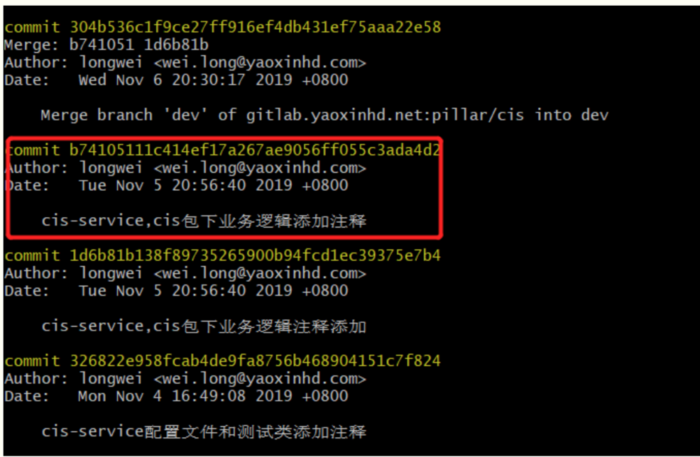
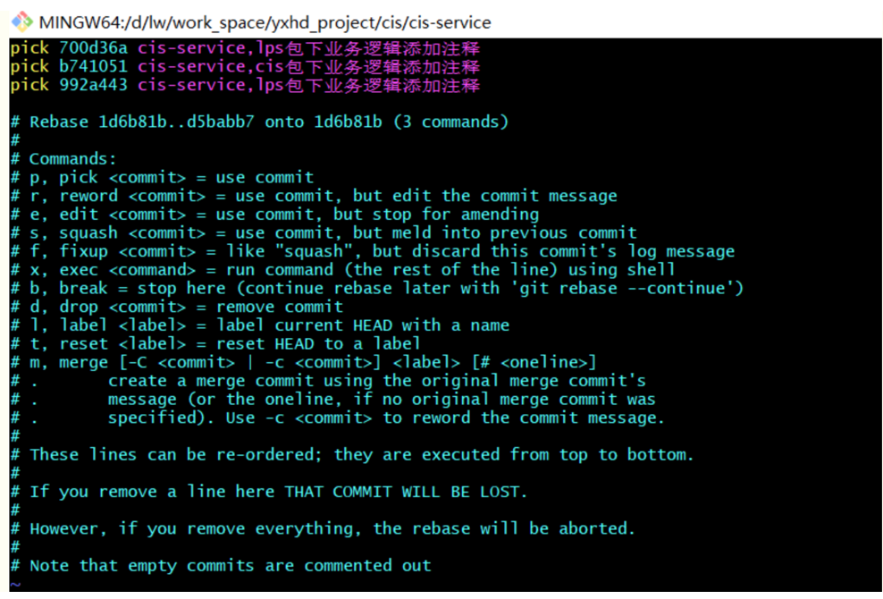
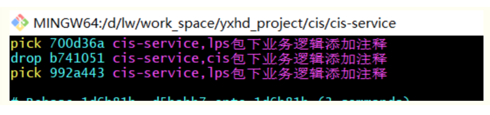
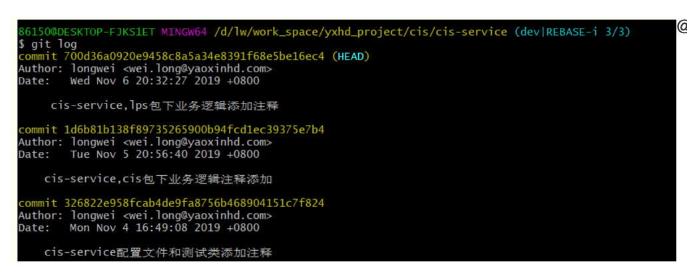

[toc]

## 基础命令
#### 初始化

```git
# 在当前目录新建一个Git代码库
$ git init
​
# 新建一个目录，将其初始化为Git代码库
$ git init git_test
​
# 下载一个项目和它的整个代码历史
$ git clone http://git.code.oa.com/jaelintu/git_test

```

#### 增加/删除文件
```git
# 添加指定文件到暂存区
$ git add file1 file2...
​
# 添加指定目录到暂存区，包括子目录
$ git add dir
​
# 添加当前目录的所有文件到暂存区
$ git add .
​
# 添加每个变化前，都会要求确认
# 对于同一个文件的多处变化，可以实现分次提交
$ git add -p
​
# 删除工作区文件，并且将这次删除放入暂存区
$ git rm file1 file2 ...
```

#### 代码提交
```git
# 提交暂存区到仓库区
$ git commit -m "message"
​
# 提交暂存区的指定文件到仓库区
$ git commit file1 file2 ... -m "message"
​
# 提交工作区自上次commit之后的变化，直接到仓库区
$ git commit -a
​
# 提交时显示所有diff信息
$ git commit -v
​
# 使用一次新的commit，替代上一次提交
# 如果代码没有任何新变化，则用来改写上一次commit的提交信息
$ git commit --amend -m "message"
​
# 重做上一次commit，并包括指定文件的新变化
$ git commit --amend file1 file2 ...

```

#### 分支
```git
作者：腾讯云技术社区
链接：https://zhuanlan.zhihu.com/p/50662531
来源：知乎
著作权归作者所有。商业转载请联系作者获得授权，非商业转载请注明出处。

# 列出所有本地分支
$ git branch
​
# 列出所有远程分支
$ git branch -r
​
# 列出所有本地分支和远程分支
$ git branch -a
​
# 新建一个分支，但依然停留在当前分支
$ git branch name
​
# 新建一个分支，并切换到该分支
$ git checkout -b branch
​
# 新建一个分支，指向指定commit
$ git branch name commit_SHA
​
# 新建一个分支，与指定的远程分支建立追踪关系
$ git branch --track name orgin/name
​
# 切换到指定分支，并更新工作区
$ git checkout name
​
# 切换到上一个分支
$ git checkout -
​
# 建立追踪关系，在现有分支与指定的远程分支之间
$ git branch --set-upstream name origin/name
​
# 合并指定分支到当前分支
$ git merge branch-name
​
# 选择一个commit，合并进当前分支
$ git cherry-pick commit_SHA

#多个commit 只需要
$ git cherry-pick  commitid1..commitid100

注意，不包含第一个commitid ， 即  git cherry-pick (commitid1..commitid100]
​
# 删除分支
$ git branch -d branch-name
​
# 删除远程分支
$ git push origin --delete branch-name
$ git branch -dr remote/branch

# 根据 tag 创建分支
$ git checkout -b branch_name tag_name

# 删除远端失败
最近用 git push origin  :remotebranchname 删除远端分支 会显示删除失败  报 remote refs do not exist的错误

先使用 git fetch -p origin 再删除
```


#### tags
```git
# 列出所有tag
$ git tag
​
# 新建一个tag在当前commit
$ git tag tag-name
​
# 新建一个tag在指定commit
$ git tag tag-name commit-SHA
​
# 删除本地tag
$ git tag -d tag-name
​
# 删除远程tag
$ git push origin :refs/tags/tag-Name
​
# 查看tag信息
$ git show tag-name
​
# 提交指定tag
$ git push origin tag-name
​
# 提交所有tag
$ git push origin --tags
​
# 新建一个分支，指向某个tag
$ git checkout -b branch-name tag-name

# 创建一个 tag
$ git tag -a v1.0.4 -m 'release 1.0.4'

# 同步远端 tag
git tag -l | xargs git tag -d (删除本地所有 tag)
git fetch origin --prune (从远端拉取所有信息)
```

#### 查看信息
```git
作者：腾讯云技术社区
链接：https://zhuanlan.zhihu.com/p/50662531
来源：知乎
著作权归作者所有。商业转载请联系作者获得授权，非商业转载请注明出处。

# 显示有变更的文件
$ git status
​
# 显示当前分支的版本历史
$ git log
​
# 显示commit历史，以及每次commit发生变更的文件
$ git log --stat
​
# 搜索提交历史，根据关键词
$ git log -S [keyword]
​
# 显示某个commit之后的所有变动
$ git log (tag-name||commit-SHA) HEAD
​
# 显示某个文件的版本历史，包括文件改名
$ git log --follow file
$ git whatchanged file
​
# 显示指定文件相关的每一次diff
$ git log -p file
​
# 显示过去5次提交
$ git log -5 --pretty --oneline
​
# 显示所有提交过的用户，按提交次数排序
$ git shortlog -sn
​
# 显示指定文件是什么人在什么时间修改过
$ git blame file
​
# 显示暂存区和工作区的代码差异
$ git diff
​
# 显示暂存区和上一个commit的差异
$ git diff --cached file
​
# 显示工作区与当前分支最新commit之间的差异
$ git diff HEAD
​
# 显示两次提交之间的差异
$ git diff [first-branch]...[second-branch]
​
# 显示今天你写了多少行代码
$ git diff --shortstat "@{0 day ago}"
​
# 显示某次提交的元数据和内容变化
$ git show commit-SHA
​
# 显示某次提交发生变化的文件
$ git show --name-only commit-SHA
​
# 显示某次提交时，某个文件的内容
$ git show commit-SHA:filename
​
# 显示当前分支的最近几次提交
$ git reflog
​
# 从本地master拉取代码更新当前分支：branch 一般为master
$ git rebase branch-name
```
#### 远程同步

```git
# 下载远程仓库的所有变动
$ git fetch origin
​
# 显示所有远程仓库
$ git remote -v
​
# 显示某个远程仓库的信息
$ git remote show origin
​
# 增加一个新的远程仓库，并命名
$ git remote add shortname url
​
# 取回远程仓库的变化，并与本地分支合并
$ git pull origin branch-name
​
# 上传本地指定分支到远程仓库
$ git push origin branch-name
​
# 强行推送当前分支到远程仓库，即使有冲突
$ git push origin --force
​
# 推送所有分支到远程仓库
$ git push origin --all
```
#### 撤销

```git
作者：腾讯云技术社区
链接：https://zhuanlan.zhihu.com/p/50662531
来源：知乎
著作权归作者所有。商业转载请联系作者获得授权，非商业转载请注明出处。

# 恢复暂存区的指定文件到工作区
$ git checkout file
​
# 恢复某个commit的指定文件到暂存区和工作区
$ git checkout commit-SHA file
​
# 恢复暂存区的所有文件到工作区
$ git checkout .
​
# 重置暂存区的指定文件，与上一次commit保持一致，但工作区不变
$ git reset file
​
# 重置暂存区与工作区，与上一次commit保持一致
$ git reset --hard
​
# 重置当前分支的指针为指定commit，同时重置暂存区，但工作区不变
$ git reset commit-SHA
​
# 重置当前分支的HEAD为指定commit，同时重置暂存区和工作区，与指定commit一致
$ git reset --hard commit-SHA
​
# 重置当前HEAD为指定commit，但保持暂存区和工作区不变
$ git reset --keep commit-SHA
​
# 新建一个commit，用来撤销指定commit
# 后者的所有变化都将被前者抵消，并且应用到当前分支
$ git revert commit-SHA
​
# 暂时将未提交的变化移除，稍后再移入
$ git stash
$ git stash pop

--------------------------------
# 取消已经 push 的行为（强制 PUSH）
# 本地仓库回退到某一版本
$ git reset -hard xxxx

# 强制 PUSH，此时远程分支已经恢复成指定的 commit 了
$ git push origin master --force
----------------------------------
```

#### 代码更新之Fetch vs Pull

二者都是从远程拉取代码到本地

- fetch：只是拉取到本地
- 不仅拉取到本地，还merge到本地分支中

#### 代码合流之Merge vs Rebase

- rebase：用于把一个分支的修改合并到当前分支
- merge: 

#### 代码暂存之Stash

git stash会把所有未提交的修改（包括暂存和未暂存的）都保存起来，用于日后恢复当前工作目录
- 保存一个不必要但日后又想查看的提交
- 切换分支前先暂存，处理分支的其他事情

```git
$ git status
On branch develop
Changes to be committed:
​
new file:   README.md
​
Changes not staged for commit:
​
modified:   index.html
​
$ git stash
Saved working directory and index state WIP on master: 5002d47 ...
​
$ git status
On branch master
nothing to commit, working tree clean
```
> stage是本地的，不会上传到git server

实际应用中，推荐给每个stash加一个message，使用git stash save 取代 git stash

```git
$ git stash save "test stash"
Saved working directory and index state On autoswitch: test stash
HEAD 现在位于 296e8d4 remove unnecessary postion reset in onResume function
$ git stash list
stash@{0}: On autoswitch: test stash
```

1. 可以使用 **git stash list** 命令，查看stash列表

```git
$ git stash list
stash@{0}: WIP on master: 049d078 stash_0
stash@{1}: WIP on master: c264051 stash_1
stash@{2}: WIP on master: 21d80a5 stash_2
```
2. 使用 **git stash apply** 命令可以通过名字指定那个stash，默认指定最近的（stash@{0}）
3. 使用 **git stash pop** 将stash中第一个stash删除，并将对应修改应用到当前的工作目录中
4. 使用 **git stash drop**，后面加上stash名，可以移除相应的stash；或者使用git stash clear清空所有stash

默认情况下，git stash会缓存：

- 添加到暂存区的修改（staged changes ）
- Git跟踪但并未添加到暂存区的修改（unstaged changes）

但不会缓存:

- 在工作目录中新的文件（untracked files）
- 被忽略的文件（ignored files）

此时，使用 -u 或者 --include-untracked 可以 stash untracked 文件；使用 -a 或者 --all 可以 stash 当前目录下的所有修改 **（慎用）**

#### 冲突解决
rebase过程中，也许会出现冲突（conflict）

- git会停止rebase，需要解决冲突
- 解决完，使用git add添加冲突的文件，更新暂存区
- git rebase --continue 继续剩下的 rebase
- git rebase --abort终止rebase行为，并且feature会回到rebase开始之前的状态


## 问题解决

### submodule 问题
问题：fatal: no submodule mapping found in .gitmodules for path 解决
解决：

- 先移除缓存 git rm --cached 目录
- git submodule init
- git submodule update 
即可

问题：

```
fatal: Could not chdir to '../../../../../framework/component/dyfloat': No such file or directory
fatal: 'git status --porcelain' failed in submodule framework/components/dyfloat
Cannot save the current worktree state
```
解决：这是因为 submodule 移了目录，通过修改 .git 里面对应文件解决
mac 显示 .git 文件
在终端内
显示文件夹
> defaults write com.apple.finder AppleShowAllFiles TRUE
 
最后重启finder
> killall Finder

隐藏文件夹
> defaults write com.apple.finder AppleShowAllFiles FALSE
 
最后重启finder

> killall Finder


问题：
fatal: Unable to create '/Users/yxhuang/work/dinyun/yungame/onegame/chikii_android/.git/index.lock': File exists.

## 撤销某个提交

- 1.使用git log 命令，查看已提交的记录。例如红色圈出的commit是本次要删除的commit。





- 2.先找到此次提交之前的一次提交的commit 1d6b81b138f89735265900b94fcd1ec39375e7b4

 

- 3.执行git rebase -i 1d6b81b138f89735265900b94fcd1ec39375e7b4，弹出如下页面（不包含当前commit）：



按字母I键进入编辑模式，将需要删除的commit的pick改为drop，然后按esc退出编辑，：wq保存


 
 - 4.再次执行git log命令，查看已提交记录，之前红色圈出的commit记录已被删除。
 

 
 强推 
 git push origin --force
 

