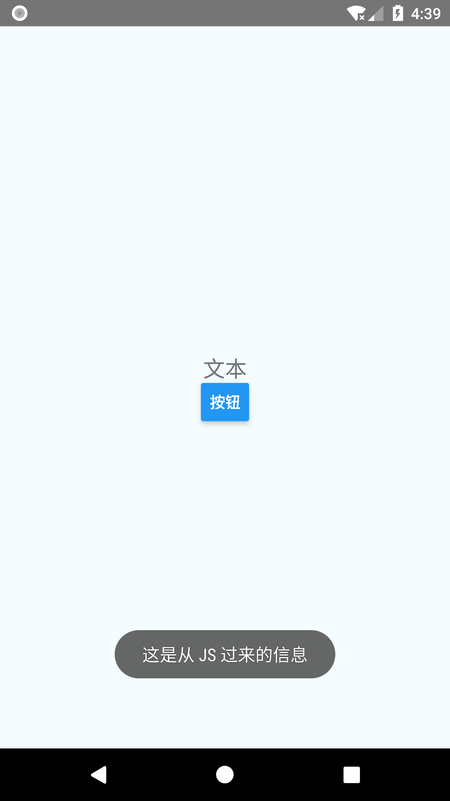
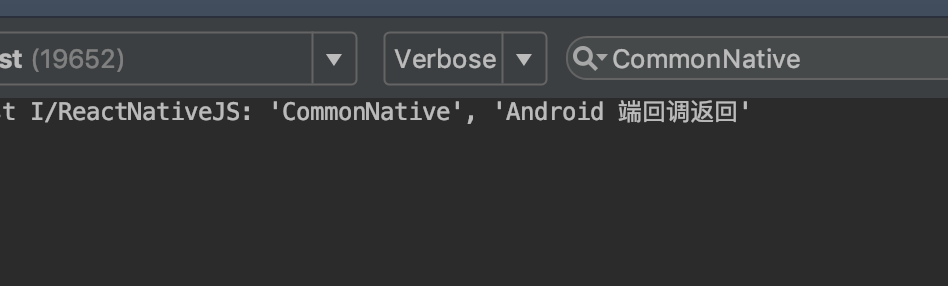
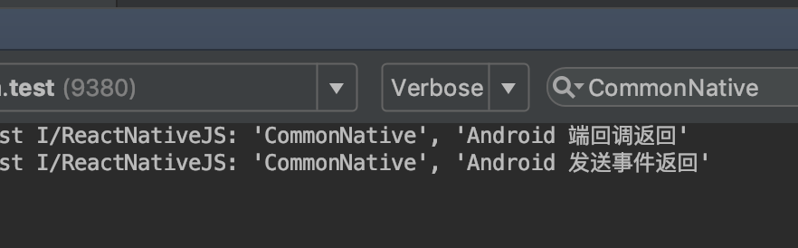

## ReactNative 与 Android 之间的通信

按照官方文档的步骤搭建好环境之后，使用命令 **react-native init xxxx(工程名)** 创建一个新的工程。


## 一、RN 向 Android 通信
### 在 Android 端
#### 1. 创建 Module
继承 ReactContextBaseJavaModule，重写 getName() 方法，里面命名，这个名称会在 RN 那边调用的.

```java
    // CommonModule.java
    public class CommonModule extends ReactContextBaseJavaModule{
        private ReactApplicationContext mContext;
    
        public CommonModule(ReactApplicationContext reactContext) {
            super(reactContext);
            mContext = reactContext;
        }
    
        @Override
        public String getName() {
            return "CommonModule";
        }
    
        @ReactMethod
        public void show(String message, Promise promise){
            Toast.makeText(mContext, message, Toast.LENGTH_LONG).show();
            promise.resolve("Android 端回调返回");
        }
    }
```
- 继承 ReactContextBaseJavaModule
- 在 getName() 方法里命名名称，用于 RN 中 NativeModule 的调用；
- 给 RN 调用的方法，加 @ReactMethod 注解；
- Promise 用于 JS 的回调，这个是可选的，如果不需要回调，可以不用 Promise 参数

#### 2. 创建 Package

```java
    // CommonPackage.java
    public class CommonPackage implements ReactPackage {
        @Override
        public List<NativeModule> createNativeModules(ReactApplicationContext reactContext) {
            List<NativeModule> modules = new ArrayList<>();
            modules.add(new CommonModule(reactContext));
            return modules;
        }
    
        @Override
        public List<ViewManager> createViewManagers(ReactApplicationContext reactContext) {
            return Collections.emptyList();
        }
    }
```
- 实现 ReactPackage 接口
- 在 createNativeModules 中将刚刚创建的 Module 放到 list， 返回 list;
- createViewManagers 方法不需要用到，返回一个空的 list 即可

#### 3. 将 Package 放入到 ReactNativeHost 中

```java
    // MainApplication.java
    
     private final ReactNativeHost mReactNativeHost = new ReactNativeHost(this) {
        @Override
        public boolean getUseDeveloperSupport() {
          return BuildConfig.DEBUG;
        }
    
        @Override
        protected List<ReactPackage> getPackages() {
          return Arrays.<ReactPackage>asList(
                  new MainReactPackage(),
                  new CommonPackage()   // 添加这里
          );
        }
    
        @Override
        protected String getJSMainModuleName() {
          return "index";
       }
    };
```
- 在 ReactNativeHost#getPackage 中，将 刚刚创建的 Package 放入到 list 中

### 在 RN 端

#### 1. 从NativeModules中获取对应模块

```js
    //  CommonNativeModule.js
    import {NativeModules} from 'react-native';
    
    const CommonNative = {
        showToast: async function (message) {
            return await NativeModules.CommonModule.show(message);
        }
        
        // 没有用 Promise 回调的时候
        //showToast: function (message) {
        //    NativeModules.CommonModule.show(message);
        // }  
    }
    
    module.exports = CommonNative;
```
- 从 NativeModules 中获取 module, module 名称就是 getName() 中命名的 module 名称， 调用的方法就是加 @ReactMethod 的方法；
- 这里用到了 async await 是因为上面加了 Promise，如果没有 Promise 则普通的调用即可


#### 2. 调用

```js
    // App.js
    import CommonNative from './src/nativemodule/CommonNativeModule';
    
    ...
    
     render() {
        return (
          <View style={styles.container}>
            <Text style={styles.title_text}>文本</Text>
            <Button
              title='按钮'
              onPress={this.onClicked}>
            </Button>
          </View>
        );
  }

   async onClicked(){
     let msg = await CommonNative.showToast('这是从 JS 过来的信息');
     console.log('CommonNative', msg);
  }

```
- 将 nativeModule 引入
- 对其进行调用

#### 调用结果
toast 的弹出



Android 段发送回调到 RN 的结果



<br>

## Android 向 RN 通信

### Android 端
通过 RCTDeviceEventEmitter#emit(String eventName, Object data) 向 RN 发信息

```java
    private void sendEvent(){
        new Handler().postDelayed(new Runnable() {
            @Override
            public void run() {
                mContext.getJSModule(DeviceEventManagerModule.RCTDeviceEventEmitter.class)
                        .emit("SendEvent", "Android 发送事件返回");
            }
        }, 3 * 1000);

    }

```
- emit 的参数， eventName 是事件名称，用于在 RN 端注册监听，data 是传的参数

### RN 端
通过 DeviceEventEmitter 监听

```js
    // App.js
  componentDidMount = () => {
    DeviceEventEmitter.addListener('SendEvent', event => {
      console.log('CommonNative', event);
    })
  };

  componentWillUnmount = () => {
    DeviceEventEmitter.removeAllListeners();
  };

```
- 通过 DeviceEventEmitter.addListener 注册监听，事件类型是 Android 端发送的类型 eventName
- 一般在 componentDidMount 方法中注册，在 componentWillUnmount 中移除监听


#### 调用的结果


