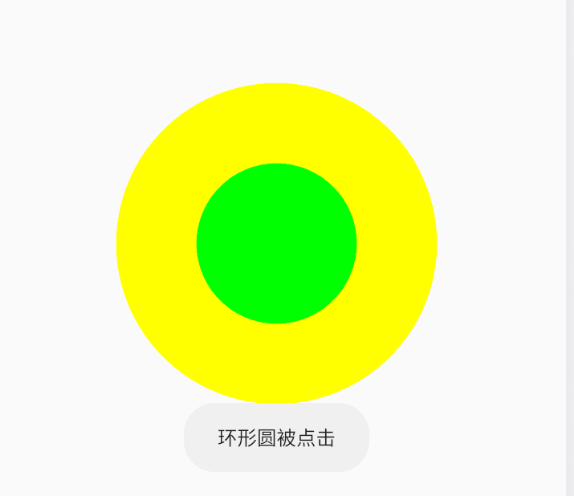

# Android Region
在 Android 中 Region 表示 Canvas 图层上的某个封闭区域。

Region 的使用一般要 Path 类配合。

### 1. Region 的内部类
- DIFFERENCE: 在第一个 Region 的基础上减去和第二个 Region 重合的区域
- INTERSECT： 两个 Region 的交集部分
- UNION： 两个 Region 的并集部分
- XOR: 两个 Region 的补集
- REVERSE_DIFFERENCE： Region2 - (Region1 和 Region2 的交集)
- REPLACE：就是 Region2 的区域


```java
   public enum Op {
        DIFFERENCE(0),
        INTERSECT(1),
        UNION(2),
        XOR(3),
        REVERSE_DIFFERENCE(4),
        REPLACE(5);
    }
```

### 2.Region 的 API
- **设置 Region**

```java

    /** 
    * Set the region to the specified region.
    * 设置指定的区域
    */
    public boolean set(Region region) {
        nativeSetRegion(mNativeRegion, region.mNativeRegion);
        return true;
    }

    /** Set the region to the specified rectangle
    * 在矩形上设置相应的区域
    */
    public boolean set(Rect r) {
        return nativeSetRect(mNativeRegion, r.left, r.top, r.right, r.bottom);
    }
    
    /** Set the region to the specified rectangle
    * 在矩形上设置相应的区域
    */
    public boolean set(int left, int top, int right, int bottom) {
        return nativeSetRect(mNativeRegion, left, top, right, bottom);
    }

    /** 结合 Path 和 clip 设置相应的区域
     * Set the region to the area described by the path and clip.
     * Return true if the resulting region is non-empty. This produces a region
     * that is identical to the pixels that would be drawn by the path
     * (with no antialiasing).
     */
    public boolean setPath(Path path, Region clip) {
        return nativeSetPath(mNativeRegion, path.readOnlyNI(), clip.mNativeRegion);
    }

```

- **两个 Region 的 Op 操作**

```java
    /** 
     * 对 Region 进行指定的区域进行 Op
     * Perform the specified Op on this region and the specified rect. Return
     * true if the result of the op is not empty.
     */
    public boolean op(Rect r, Op op) {
        return nativeOp(mNativeRegion, r.left, r.top, r.right, r.bottom,
                        op.nativeInt);
    }

    /**
     * 对 Region 进行指定的区域进行 Op
     * Perform the specified Op on this region and the specified rect. Return
     * true if the result of the op is not empty.
     */
    public boolean op(int left, int top, int right, int bottom, Op op) {
        return nativeOp(mNativeRegion, left, top, right, bottom,
                        op.nativeInt);
    }

    /**
     *  对 Region 和另外一个 Region 进行 Op
     * Perform the specified Op on this region and the specified region. Return
     * true if the result of the op is not empty.
     */
    public boolean op(Region region, Op op) {
        return op(this, region, op);
    }

    /**
     * Set this region to the result of performing the Op on the specified rect
     * and region. Return true if the result is not empty.
     */
    public boolean op(Rect rect, Region region, Op op) {
        return nativeOp(mNativeRegion, rect, region.mNativeRegion,
                        op.nativeInt);
    }

    /**
     * 对两个 Region 进行操作
     * Set this region to the result of performing the Op on the specified
     * regions. Return true if the result is not empty.
     */
    public boolean op(Region region1, Region region2, Op op) {
        return nativeOp(mNativeRegion, region1.mNativeRegion,
                        region2.mNativeRegion, op.nativeInt);
    }
```

- **contains(int x, int y) 当前 Regin 是否包含指定的点（x, y）**

```java
    /**
     * Return true if the region contains the specified point
     */
    public native boolean contains(int x, int y);
```

### 3. 实例
Region 在我们对一些不同 View 进行点击事件范围的处理是比较有用的。

例如，对下图中的环形部分进行点击判断




在 OnSizeChanged 方法中

- 1. 添加内圆

```java
   // 添加内间的圆
    int innerRadius= 200;
    int centerX = w / 2;
    int centerY = h / 2;
    mInnerPath.addCircle(centerX, centerY, innerRadius, Path.Direction.CW);
    Region tempInnerRegion = new Region(centerX - innerRadius, centerY - innerRadius,
            centerX + innerRadius, centerY + innerRadius);
    mInnerRegion.setPath(mInnerPath, tempInnerRegion);
```

- 2. 添加外圆

```java
 // 添加外部圆
    int outsideRadius = 400;
    mOutsidePath.addCircle(centerX, centerY, outsideRadius, Path.Direction.CW);
    Region tempOutsideRegion = new Region(centerX - outsideRadius, centerY - outsideRadius,
            centerX + outsideRadius, centerY + outsideRadius);
    mOutsideRegion.setPath(mOutsidePath, tempOutsideRegion);
```

- 3. 对两个圆的 Region 继续 Op 操作
这里是进行 Region.Op.DIFFERENCE 操作, 形成一个环形

```java
// 环形区域
mValidRegion.op(mOutsideRegion, mInnerRegion, Region.Op.DIFFERENCE);a

```


完整的实例代码：

```java

/**
 * Created by yxhuang
 * Date: 2019/3/18
 * Description:
 */
public class RegionView extends View {

    private Region mInnerRegion;
    private Region mOutsideRegion;
    private Region mValidRegion;

    private Path mInnerPath;
    private Path mOutsidePath;

    private Paint mInnerPaint;
    private Paint mOutsidePaint;

    public RegionView(Context context) {
        super(context);
        initView(context);
    }

    public RegionView(Context context, @Nullable AttributeSet attrs) {
        super(context, attrs);
        initView(context);
    }

    public RegionView(Context context, @Nullable AttributeSet attrs, int defStyleAttr) {
        super(context, attrs, defStyleAttr);
        initView(context);
    }

    private void initView(Context context){
        mInnerPath = new Path();
        mInnerRegion = new Region();
        mInnerPaint = new Paint();
        mInnerPaint.setColor(Color.GREEN);

        mOutsidePath = new Path();
        mOutsideRegion = new Region();
        mOutsidePaint = new Paint();
        mOutsidePaint.setColor(Color.YELLOW);

        mValidRegion = new Region();
    }

    @Override
    protected void onSizeChanged(int w, int h, int oldw, int oldh) {
        super.onSizeChanged(w, h, oldw, oldh);

        // 添加中间的圆
        int innerRadius= 200;
        int centerX = w / 2;
        int centerY = h / 2;
        mInnerPath.addCircle(centerX, centerY, innerRadius, Path.Direction.CW);
        Region tempInnerRegion = new Region(centerX - innerRadius, centerY - innerRadius,
                centerX + innerRadius, centerY + innerRadius);
        mInnerRegion.setPath(mInnerPath, tempInnerRegion);

        // 添加外部圆
        int outsideRadius = 400;
        mOutsidePath.addCircle(centerX, centerY, outsideRadius, Path.Direction.CW);
        Region tempOutsideRegion = new Region(centerX - outsideRadius, centerY - outsideRadius,
                centerX + outsideRadius, centerY + outsideRadius);
        mOutsideRegion.setPath(mOutsidePath, tempOutsideRegion);

        // 环形区域
        mValidRegion.op(mOutsideRegion, mInnerRegion, Region.Op.DIFFERENCE);

    }

    @Override
    public boolean onTouchEvent(MotionEvent event) {
        switch (event.getAction()){
            case MotionEvent.ACTION_DOWN:
                int x = (int) event.getX();
                int y = (int) event.getY();

                if (mInnerRegion.contains(x,y)){
                    Toast.makeText(this.getContext(),"内圆被点击",Toast.LENGTH_SHORT).show();
                }

                if (mValidRegion.contains(x,y)){
                    Toast.makeText(this.getContext(),"环形圆被点击",Toast.LENGTH_SHORT).show();
                }
                break;
        }
        return true;
    }

    @Override
    protected void onDraw(Canvas canvas) {
        // 绘制外圆
        Path outsideCircle = mOutsidePath;
        canvas.drawPath(outsideCircle, mOutsidePaint);
        // 绘制内圆
        Path innerCircle = mInnerPath;
        canvas.drawPath(innerCircle, mInnerPaint);
    }
}
```

### 4. 参考
1. [安卓自定义View进阶-特殊控件的事件处理方案](http://www.gcssloop.com/customview/touch-matrix-region)
2. [Android Path, Region, Paint, Canvas API篇](https://blog.csdn.net/wuyuxing24/article/details/51762619)

