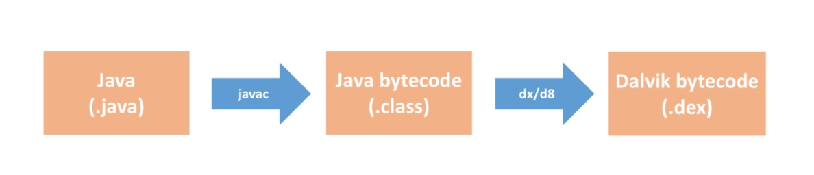
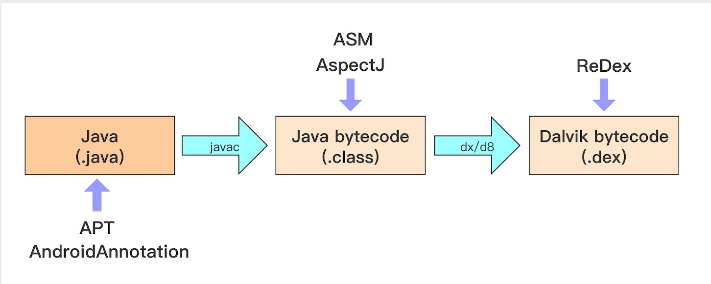
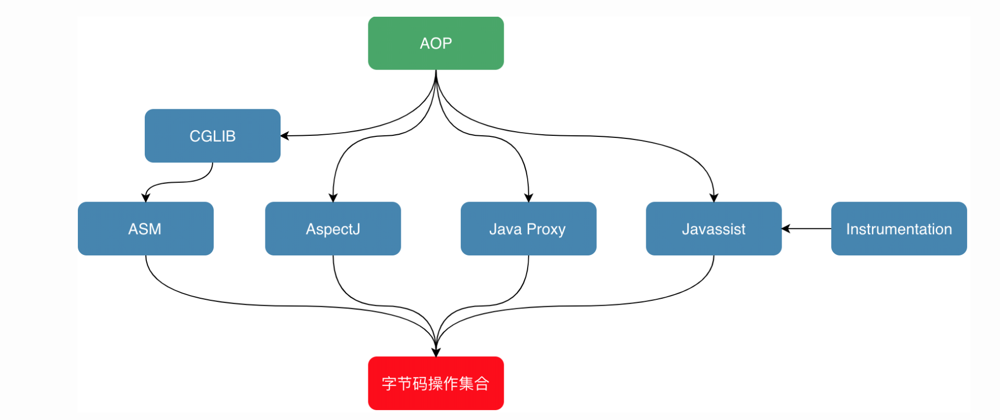
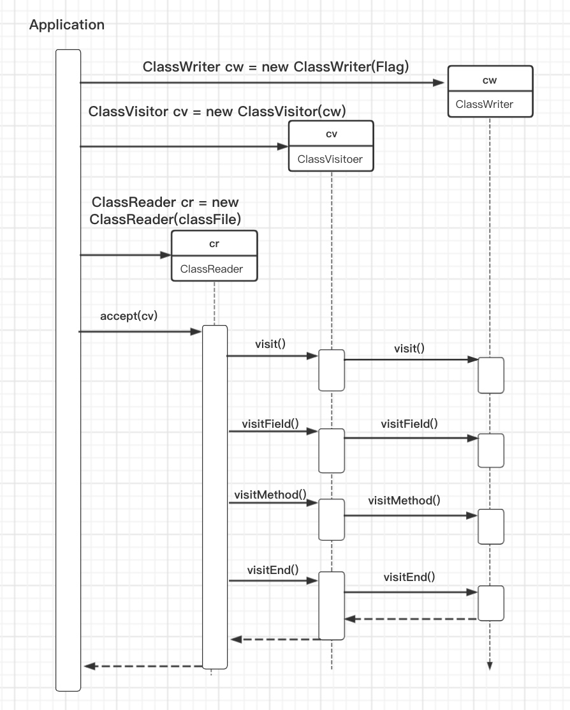
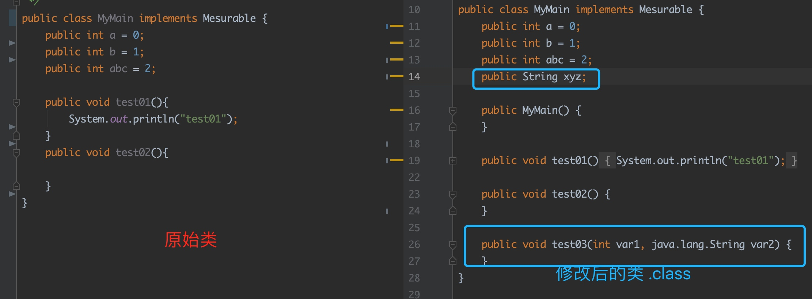
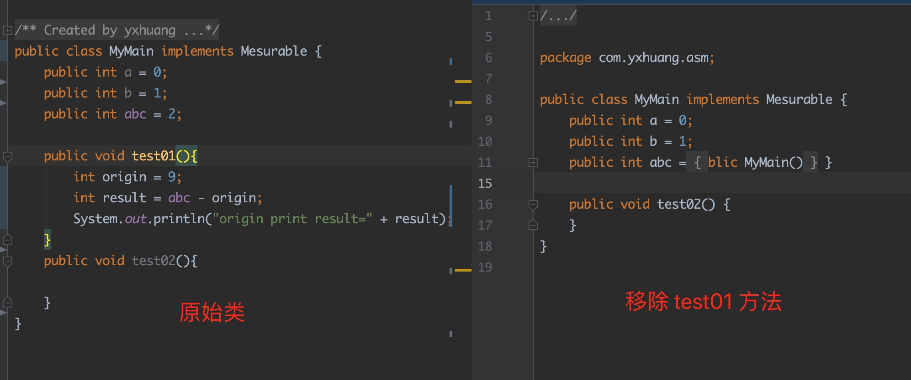
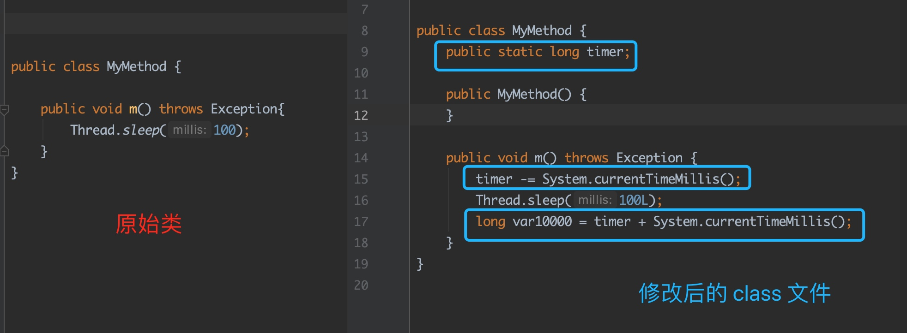
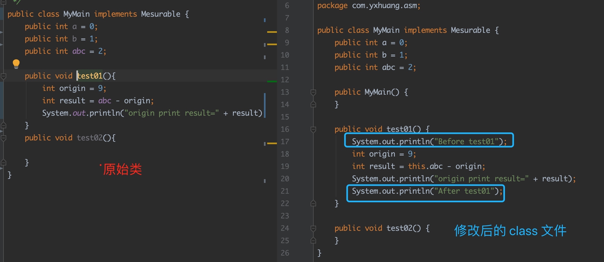
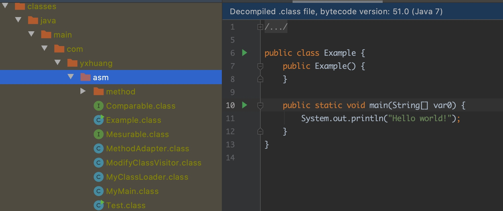
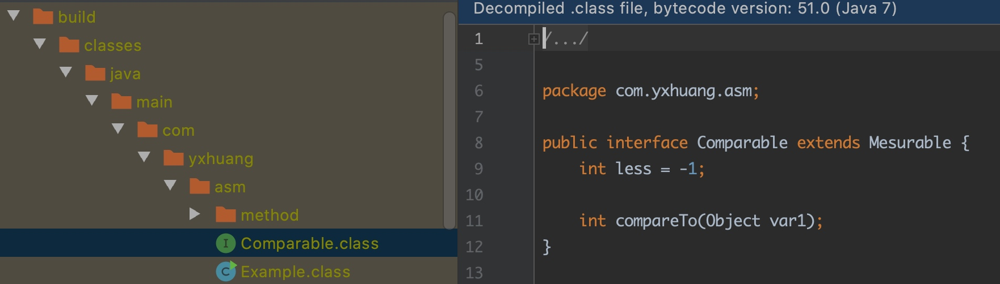

# Android 编译插桩（一）： ASM

Java 代码编译的流程


**编译插桩，就是在代码编译期间修改已有的代码或者生产新代码**

## 编译插桩基础

### 1.编译插桩的应用场景

- **代码生成**，减少手工重复，降低出错的可能性

- **代码监控**，利用编译插桩技术实现性能监控

- **代码修改**，修改第三方 SDK 源码，实现无痕埋点

- **代码分析**，自定义代码检查

### 2.插桩编译介入的分类



- **Java 文件**
生成的是 Java 文件，例如 APT, AndroidAnnotation 

- **字节码（Bytecode）**
操作 ”.class" 的 Java 字节码, 或者是操作 “.dex” 的 Dalvik 字节码。
ASM, AspectJ 是操作 Java 字节码， ReDex 是操作 Dalvik 字节码


### 3.编译插桩的三种方法

编译插桩的主要方法图

#### 1.AspectJ
AspectJ 内部是用 [BCEL](https://github.com/apache/commons-bcel) 框架完成的。

**优点**

- 成熟稳定
- 使用简单

**缺点**

- 切入点固定
- 需要匹配相应的正则表达式
- 性能较低，实现的时候会生成一些包装类，对原函数的性能有影响


#### 2. ASM

- 操作灵活
- 上手比较难，需要对 Java 字节码有比较深入的了解

#### 3. ReDex
 直接修改 Dex 文件
 
## ASM
  
ASM 是一个可以的 Java 字节码操作与分析框架，它可以直接生成二进制的 .class 文件。
在 IDEA 上可以使用 ASM Bytecode Outline 插件，方便查看 ASM 的操作符。也可以先在代码写成自己想要的结果，用 ASM Bytecode Outline 查看 ASM 操作符，再把相应吃操作符复制到代码中。

### 1.核心类
#### ClassReader
主要解析编译过的 .class 字节码文件

#### ClassWriter
主要是重新构建编译后的类，例如修改类名、属性以及方法，甚至可以生成新的类字节码文件

#### ClassVisitor
主要负责 visit 类成员信息。其中包括标记在类上的注解、类的构造方法、类的字段、类的方法、静态代码块等

#### AdviceAdapter
实现了 MethodVisitor 接口，主要负责 visit method 的主要信息，用来具体的方法字节码操作


时序图




### 2. ClassVisitor
ClassVisitor 的主要方法

```java
    /**
     * 源文件的信息
     * @param source
     * @param debug
     */
    @Override
    public void visitSource(String source, String debug) {
        super.visitSource(source, debug);
    }

    @Override
    public AnnotationVisitor visitAnnotation(String descriptor, boolean visible) {
        return super.visitAnnotation(descriptor, visible);
    }

    @Override
    public void visitAttribute(Attribute attribute) {
        super.visitAttribute(attribute);
    }

    /**
     *  拿到类的信息， 然后对满足条件的类进行过滤
     */
    @Override
    public void visit(int version, int access, String name, String signature, String superName, String[] interfaces) {
        super.visit(version, access, name, signature, superName, interfaces);
 
    }

    // 内部类信息
    @Override
    public void visitInnerClass(String name, String outerName, String innerName, int access) {
        super.visitInnerClass(name, outerName, innerName, access);
    }

    // 遍历类的成员变量信息
    @Override
    public FieldVisitor visitField(int access, String name, String descriptor, String signature, Object value) {
        return super.visitField(access, name, descriptor, signature, value);
    }

    // 类的方法信息, 拿到需要修改的方法，然后进行修改操作
    @Override
    public MethodVisitor visitMethod(int access, String name, String descriptor, String signature, String[] exceptions) {
        return super.visitMethod(access, name, descriptor, signature, exceptions);
    }

    // 遍历类中的成员信息结束
    @Override
    public void visitEnd() {
        super.visitEnd();
    }
    
```
上面是 ClassVisitor 的主要方法，它们的执行顺序是

```
visit visitSource? visitOuterClass?(visitAnntation | visitAttribut)
(visitInnerClass | visitField | visitMethod)
visitEnd
```


### 3.ClassReader
主要解析编译过的 .class 字节码文件

这要方法是  `accept` 

```java
public void accept(final ClassVisitor classVisitor, final int parsingOptions)

 public void accept(
                final ClassVisitor classVisitor, 
                final Attribute[] attributePrototypes,
                final int parsingOptions)
```
接收一个 `ClassVisitor` 和 `parsingOptions` 

parsingOptions 一共有四个值，分别是

- ClassReader.SKIP_CODE = 1
跳过 Code 属性

- ClassReader.SKIP_DEBUG = 2
跳过 debug 的一些信息，例如行号表，局部变量表

- ClassReader.SKIP_FRAMES = 4
跳过栈帧计算

- ClassReader.EXPAND_FRAMES = 8
自动计算栈帧

### 4.具体的用法

#### 4.1 访问方法
ClassWriter 的构造函数是 

``` java
public ClassWriter(final int flags) 

// 或者
public ClassWriter(final ClassReader classReader, final int flags)

```
flags 是标记着是否计算栈帧

new ClassWriter(0)，不做任何事情，需要自己计算栈帧里面的局部变量表和操作栈
new ClassWriter(ClassWriter.COMPUTE_MAXS)，自动计算栈帧里面的局部变量表和操作栈大小，但是还是需要计算栈帧
new ClassWriterClassWriter.COMPUTE_FRAMES)，自动计算栈帧里面的局部变量表和操作栈大小,但是速度会慢 2 倍

下面的代码只是遍历类，不做任何操作

```java
/**
 * 打印
 * @param path
 */
private static void print(String path) {
    byte[] bytes = getBytes(path, "com.yxhuang.asm.MyMain");
    ClassReader classReader = new ClassReader(bytes);
    // ClassWriter 的 flag 是 0
    ClassWriter classWriter = new ClassWriter(0);
    ClassVisitor classVisitor = new ClassVisitor(Opcodes.ASM7, classWriter) {

        /**
         * 源文件的信息
         * @param source
         * @param debug
         */
        @Override
        public void visitSource(String source, String debug) {
            super.visitSource(source, debug);
            System.out.println("visitSource source " + source + " debug"  + debug );
        }

        @Override
        public void visitOuterClass(String owner, String name, String descriptor) {
            super.visitOuterClass(owner, name, descriptor);
            System.out.println("visitOuterClass owner " + owner + " name"  + name + " descriptor "  + descriptor);
        }

        @Override
        public AnnotationVisitor visitAnnotation(String descriptor, boolean visible) {
            System.out.println("visitAnnotation descriptor " + descriptor + " visible " +  visible);
            return super.visitAnnotation(descriptor, visible);
        }

        @Override
        public void visitAttribute(Attribute attribute) {
            super.visitAttribute(attribute);
            System.out.println("Attribute attribute " + attribute.toString() );
        }

        /**
         *  拿到类的信息， 然后对满足条件的类进行过滤
         */
        @Override
        public void visit(int version, int access, String name, String signature, String superName, String[] interfaces) {
            super.visit(version, access, name, signature, superName, interfaces);
            System.out.println("visit version=" + version + " access=" + access + " name=" + name
                                + "\nsignature=" + signature + "  superName=" + superName);
            for (String interfaceStr : interfaces){
                System.out.println("visit interfaces=" + interfaceStr);
            }
        }

        // 内部类信息
        @Override
        public void visitInnerClass(String name, String outerName, String innerName, int access) {
            super.visitInnerClass(name, outerName, innerName, access);
            System.out.println("visitInnerClass name " + name + " outerName"  + outerName
                    + " innerName " + innerName +  " access " + access);
        }

        // 遍历类的成员变量信息
        @Override
        public FieldVisitor visitField(int access, String name, String descriptor, String signature, Object value) {
            System.out.println("visitField name " + name + " descriptor " + descriptor + " signature " + signature);
            return super.visitField(access, name, descriptor, signature, value);
        }

        // 类的方法信息, 拿到需要修改的方法，然后进行修改操作
        @Override
        public MethodVisitor visitMethod(int access, String name, String descriptor, String signature, String[] exceptions) {
            System.out.println("visitMethod name " + name + " descriptor " + descriptor + " signature " + signature);
            return super.visitMethod(access, name, descriptor, signature, exceptions);
        }

        // 遍历类中的成员信息结束
        @Override
        public void visitEnd() {
            super.visitEnd();
            System.out.println("visitEnd");
        }
    };
    classReader.accept(classVisitor, ClassReader.SKIP_CODE | ClassReader.SKIP_DEBUG);
}
```

#### 4.2 添加类的成员变量和方法
FieldVisitor 是修改类的成员变量
MethodVisitor 是用来修改类的方法

他们都在 ClassVisitor#visitEnd 方法里面修改

```java
   @Override
    public void visitEnd() {
        super.visitEnd();
        System.out.println("addFile visitEnd");

        // 增加一个字段
        FieldVisitor fieldVisitor = this.visitField(
                Opcodes.ACC_PUBLIC,
                "xyz",  // 成员变量的名称
                "Ljava/lang/String", // 成员变量的描述符
                null,
                null);
        if (fieldVisitor != null) {
            fieldVisitor.visitEnd();
        }

        // 增加一个方法
        MethodVisitor methodVisitor = this.visitMethod(
                Opcodes.ACC_PUBLIC,
                "test03",
                "(ILjava/lang/String;)V",
                null,
                null
        );
        if (methodVisitor != null) {
            methodVisitor.visitEnd();
        }
    }
```




#### 4.3 移除类的成员变量和方法
移除类的成员变量和方法比较简单，只要匹配到相应的名称，返回 null 即可

```java
@Override
public MethodVisitor visitMethod(int access, String name, String descriptor, String signature, String[] exceptions) {
    if ("test01".equals(name)) {
        return null;
    }
    return super.visitMethod(access, name, descriptor, signature, exceptions);
}
```


#### 4.4 在方法调用前和调用后增加内容
在方法调用前和调用后增加内容，有两种方式

- 1. 第一种方式是直接继承 `MethodVisitor` 在 `visitCode` 和 `visitInsn(int opcode)` 中增加内容
- 2. 第二种方式是继承已有的公共类 `AdviceAdapter`, 在 `onMethodEnter` 和 `onMethodExit` 中增加内容

**第一种方式直接继承 MethodVisitor**
例如,要在 m() 方法中增加时间

```java
// MyMethod.java
public class MyMethod {

    public void m() throws Exception{
        Thread.sleep(100);
    }
}
```
这是想要的结果

```java
public class MyMethod {
    public static long timer; 
    public void m() throws Exception{
        timer -= System.currentTimeMillis();
        Thread.sleep(100);
        timer += System.currentTimeMillis();
    }
}
```

首先自定义 ClassVisitor, 

```java
// AddTimerAdapter.java
public class AddTimerAdapter extends ClassVisitor {

    private String owner;
    private boolean isInterface;

    public AddTimerAdapter(ClassVisitor classVisitor) {
        super(Opcodes.ASM7, classVisitor);
    }

    @Override
    public void visit(int version, int access, String name, String signature, String superName, String[] interfaces) {
        super.visit(version, access, name, signature, superName, interfaces);
        owner = name;
        // 判断是否为接口
        isInterface = (access & Opcodes.ACC_INTERFACE) != 0; 
    }

    @Override
    public MethodVisitor visitMethod(int access, String name, String descriptor, String signature, String[] exceptions) {
        MethodVisitor methodVisitor = super.visitMethod(access, name, descriptor, signature, exceptions);
        if (!isInterface && methodVisitor != null && name.equals("m")) { // 如果是 m() 方法，则使用自定义的 MethodVisitor
            methodVisitor = new AddTimerMethodAdapter(methodVisitor, owner);
        }
        return methodVisitor;
    }

    @Override
    public void visitEnd() {
        // 插入成员变量 timer
        if (!isInterface){
            FieldVisitor visitor = cv.visitField(ACC_PUBLIC + ACC_STATIC , "timer",
                    "J", null, null);
            if (visitor != null){
                visitor.visitEnd();
            }
        }
        super.visitEnd();
    }
}
```
在 visitEnd 中插入类的成员变量 timer, 在 visitMethod 中，如果是 m() 方法，则使用自定义的 MethodVisitor

```java
// AddTimerMethodAdapter.java
public class AddTimerMethodAdapter extends MethodVisitor {

    private String owner;

    public AddTimerMethodAdapter(MethodVisitor methodVisitor, String owner) {
        super(Opcodes.ASM7, methodVisitor);
        this.owner = owner;
    }

    @Override
    public void visitCode() {
        // 这是方法调用前增加的内容
        mv.visitCode();
        mv.visitFieldInsn(Opcodes.GETSTATIC, owner, "timer", "J");
        mv.visitMethodInsn(Opcodes.INVOKESTATIC, "java/lang/System", "currentTimeMillis", "()J", false);
        mv.visitInsn(Opcodes.LSUB);
        mv.visitFieldInsn(Opcodes.PUTSTATIC, owner, "timer", "J");
    }

    @Override
    public void visitInsn(int opcode) {
        System.out.println("AddTimerMethodAdapter visitInsn opcode= " + opcode);
        // Opcodes.IRETURN 或者 Opcodes.ATHROW 代表着方法调用结束
        if ((opcode >= Opcodes.IRETURN && opcode <= Opcodes.RETURN) || opcode == Opcodes.ATHROW){
            mv.visitFieldInsn(Opcodes.GETSTATIC, owner, "timer", "J");
            mv.visitMethodInsn(Opcodes.INVOKESTATIC, "java/lang/System", "currentTimeMillis", "()J", false);
            mv.visitInsn(Opcodes.LADD);
        }
        mv.visitInsn(opcode);
    }
}
```
在 AddTimerMethodAdapter#visitCode 方法中增加调用前的内容 `timer -= System.currentTimeMillis()`
在 visitInsn 中通过判断 opcode，如果是 IRETURN 或者 ATHROW 代表着方法的调用结束，在这里插入内容 `timer += System.currentTimeMillis()`


然后对比原始类和修改后的 class 文件内容



**第二种方式继承 AdviceAdapter**
要在 `test01` 方法里面增加内容，则需要当访问到该方法时，需要返回自定义的 `MethodAdapter` 类

```java
// ModifyClassVisitor.java
public class ModifyClassVisitor extends ClassVisitor{

    public ModifyClassVisitor(ClassVisitor classVisitor) {
        super(Opcodes.ASM7, classVisitor);
    }

    @Override
    public MethodVisitor visitMethod(int access, String name, String descriptor, String signature, String[] exceptions) {
        System.out.println("ModifyClassVisitor visitField name " + name + " descriptor " + descriptor + " signature " + signature);
        MethodVisitor methodVisitor = super.visitMethod(access, name, descriptor, signature, exceptions);
        if ("test01".equals(name)) {
            methodVisitor = new MethodAdapter(methodVisitor, access, name, descriptor);
        }
        return methodVisitor;
    }
}
```

MethodAdapter 是继承 AdviceAdapter， AdviceAdapter 是 ASM 框架里面提供的一个方便在方法或在构造函数前后插入内容的类，它的主要方法是 `onMethodEnter`， 在方法调用前插入， `onMethodExit` 方法调用后插入

```java
public class MethodAdapter extends AdviceAdapter {

    private String name;

    protected MethodAdapter(MethodVisitor methodVisitor, int access, String name, String descriptor) {
        super(Opcodes.ASM7, methodVisitor, access, name, descriptor);
        this.name = name;
    }

    @Override
    protected void onMethodEnter() {
        super.onMethodEnter();
        System.out.println("ModifyMethodVisitor onMethodEnter=");
        mv.visitFieldInsn(Opcodes.GETSTATIC, "java/lang/System", "out", "Ljava/io/PrintStream;");
        mv.visitLdcInsn("Before " + this.name);
        mv.visitMethodInsn(Opcodes.INVOKEVIRTUAL, "java/io/PrintStream", "println", "(Ljava/lang/String;)V", false);
    }


    @Override
    protected void onMethodExit(int opcode) {
        super.onMethodExit(opcode);
        System.out.println("ModifyMethodVisitor onMethodExit=");
        mv.visitFieldInsn(Opcodes.GETSTATIC, "java/lang/System", "out", "Ljava/io/PrintStream;");
        mv.visitLdcInsn("After " + this.name);
        mv.visitMethodInsn(Opcodes.INVOKEVIRTUAL, "java/io/PrintStream", "println", "(Ljava/lang/String;)V", false);
    }
}
```

调用注意点，ClassWriter 的 flags 是 ClassWriter.COMPUTE_FRAMES， 因为修改了方面里面的内容，栈帧的深度发生了变化，需要重新计算。

```java
  private static void modifyMethod2(String path) throws IOException {
        byte[] bytes = getBytes(path, "com.yxhuang.asm.MyMain");
        ClassReader classReader = new ClassReader(bytes);
        ClassWriter classWriter = new ClassWriter(ClassWriter.COMPUTE_FRAMES);
        ClassVisitor modifyClassVisitor = new ModifyClassVisitor(classWriter);
        classReader.accept(modifyClassVisitor, 0);
        byte[] bytesModified = classWriter.toByteArray();
        FileUtils.writeByteArrayToFile(new File(path + "com/yxhuang/asm/MyMain.class"), bytesModified);
    }
```

修改前后的对比


从上图可以看到，修改后的 class 文件中， test01 方法中已经插入 Before 和 After 的内容 


**上面的两种方式都可以达到要求，在方法调用前后插入内容。第二种方式明显比较方便，如果仅仅是想在方法调用前后插入内容，推荐使用第二种方式。如果是在方法中间插入内容，则选择第一种方式**

#### 4.5 生成类
利用 ASM 生成类也有两种方式，一种是利用已有的 GeneratorAdapter， 另外一种是直接使用拼接 ClassWriter

生成类都会使用到  Opcodes 的一些操作符，这些操作符需要 class 文件的相关知识与之对应

**第一种，使用 GeneratorAdapter**
使用 GeneratorAdapter 分为几个步骤

- 1. 生成类
- 2. 生成构造方法
- 3. 生成相应的方法，包括 main 方法

```java
private static void generaClass2(String path) throws IOException {
    ClassWriter classWriter = new ClassWriter(0);
    // 生成类
    classWriter.visit(Opcodes.V1_7, Opcodes.ACC_PUBLIC, "Example", null, "java/lang/Object", null);

    // 生成构造方法
    Method method = Method.getMethod("void <init> ()");
    GeneratorAdapter mg = new GeneratorAdapter(Opcodes.ACC_PUBLIC, method, null, null, classWriter);
    mg.loadThis();
    mg.invokeConstructor(Type.getType(Object.class), method);
    mg.returnValue();
    mg.endMethod();

    // 生成 main 方法
    method = Method.getMethod("void main (String[])");
    mg = new GeneratorAdapter(Opcodes.ACC_PUBLIC + Opcodes.ACC_STATIC, method, null, null, classWriter);
    mg.getStatic(Type.getType(System.class), "out", Type.getType(PrintStream.class));
    mg.push("Hello world!");
    mg.invokeVirtual(Type.getType(PrintStream.class),
            Method.getMethod("void println (String)"));
    mg.returnValue();
    mg.endMethod();

    classWriter.visitEnd();

    // 写入本地磁盘
    byte[] bytesModified = classWriter.toByteArray();
    FileUtils.writeByteArrayToFile(new File(path + "com/yxhuang/asm/Example.class"), bytesModified);
}
```
生成的 Example 类



**第二种方式直接使用 ClassWriter**
利用 ClassWriter 生成相应的类，主要利用到它的几个方法， visit 生成类，visitField 生成成员变量，visitMethod 生成方法

```java
 private static void generaClass(String path) throws IOException {
        ClassWriter classWriter = new ClassWriter(0);

        // 生成类
        classWriter.visit(Opcodes.V1_7, Opcodes.ACC_PUBLIC + Opcodes.ACC_ABSTRACT + Opcodes.ACC_INTERFACE,
                "com/yxhuang/asm/Comparable", null, "java/lang/Object",
                new String[]{"com/yxhuang/asm/Mesurable"});

        // 生成 less 成员变量
        classWriter.visitField(Opcodes.ACC_PUBLIC + Opcodes.ACC_FINAL + Opcodes.ACC_STATIC,
                "less",
                "I",
                null,
                new Integer(-1))
                .visitEnd();

        // 生成 compareTo 方法
        classWriter.visitMethod(Opcodes.ACC_PUBLIC + Opcodes.ACC_ABSTRACT,
                "compareTo",
                "(Ljava/lang/Object;)I",
                null,
                null)
                .visitEnd();
        classWriter.visitEnd();
        byte[] b = classWriter.toByteArray();

        // 生成 class 文件
        FileUtils.writeByteArrayToFile(new File(path + "com/yxhuang/asm/Comparable.class"), b);
        //　使用　类加载器加载
        MyClassLoader myClassLoader = new MyClassLoader();
        Class clazz = myClassLoader.defineClass("com.yxhuang.asm.Comparable", b);
        System.out.println("clazz name: " + clazz.getSimpleName());
    }
```
生成的 Comparable 类


源码上传到 github, https://github.com/yxhuangCH/JavaAsm

## 参考
- [AOP 的利器：ASM 3.0 介绍](https://developer.ibm.com/zh/articles/j-lo-asm30/)
- [一起玩转Android项目中的字节码](http://quinnchen.cn/2018/09/13/2018-09-13-asm-transform/)
- [编译插桩的三种方法：AspectJ、ASM、ReDex](https://time.geekbang.org/column/article/82761)
- [王灼洲 ·《Android 全埋点解决方案》](https://book.douban.com/subject/33400077/)
- [字节码增强技术探索](https://tech.meituan.com/2019/09/05/java-bytecode-enhancement.html)

