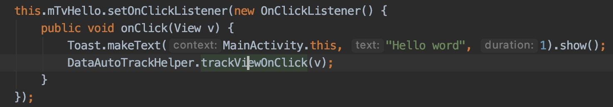
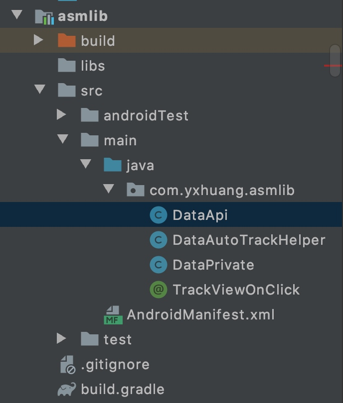
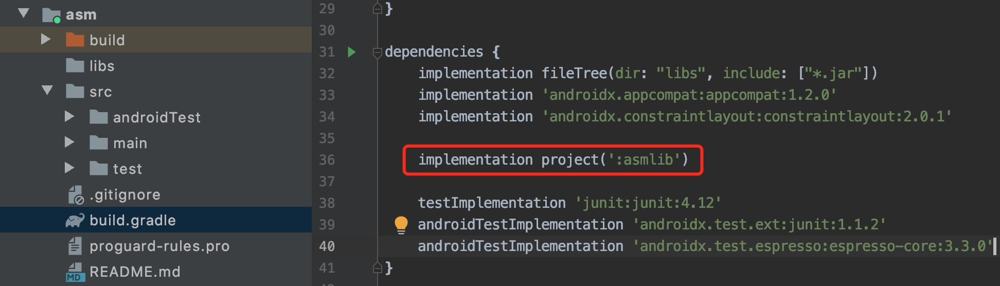
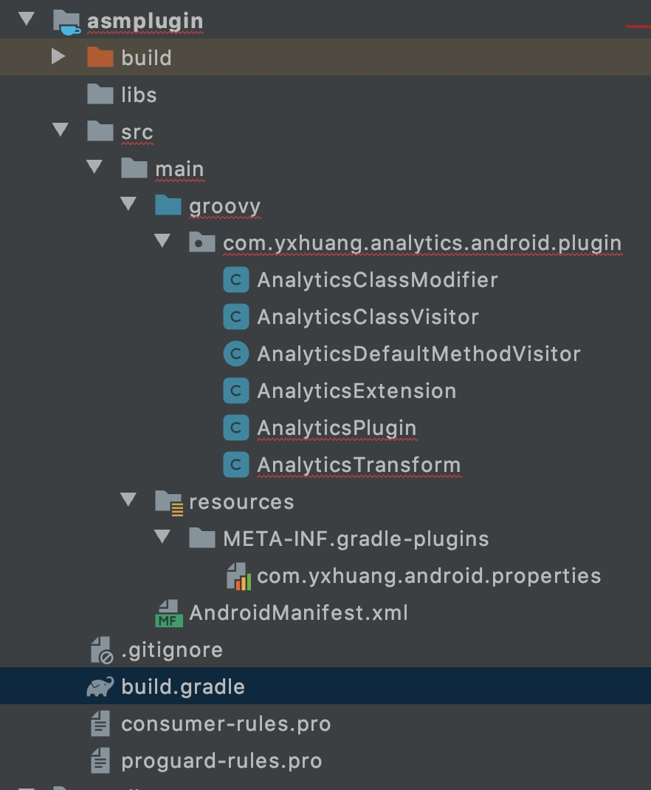
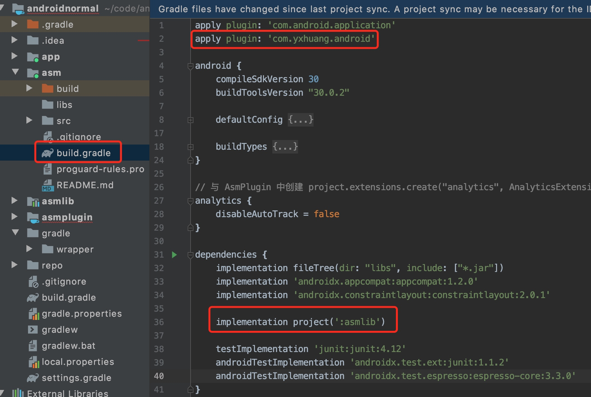
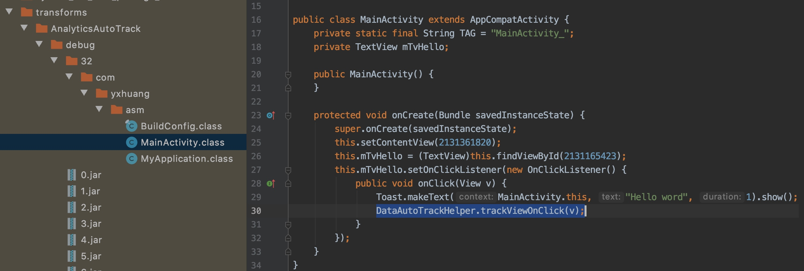

# Android 编译插桩（三）：Transform + ASM
前面两篇分别介绍 ASM 和 Transform，现在是将它们结合一起使用,用来监控 View 的点击事件，用来埋点上报

需要做的就是在 View 的 Click 方法 增加 DataAutoTrackHelper.trackViewOnClick(view); 用来点击上报



代码来至 《Android 全埋点解决方案》

## 1.创建 SDK, asmlib 库项目
创建库 asmlib 项目，在里面实现数据上报的逻辑，具体的代码逻辑参考 github 上的代码



## 2. 添加依赖关系，初始化 SDK

项目 asm 添加对 asmlib 库项目的依赖


初始化 SDK

```java
public class MyApplication extends Application {
    @Override
    public void onCreate() {
        super.onCreate();
        DataApi.init(this); // 舒适化
    }
}
```


## 3.创建插桩的 asmplugin

创建 asmplugin，实现插桩功能，至于如何创建 plugin， 参见 上篇 《Android 编译插桩（二）： Gradle Transform》
具体的项目结构如下


在 build.gradle 中添加 asm 库

```
dependencies {
    implementation gradleApi()
    implementation localGroovy()

    // 添加 asm 
    implementation 'org.ow2.asm:asm:7.2'
    implementation 'org.ow2.asm:asm-commons:7.2'
    implementation 'org.ow2.asm:asm-analysis:7.2'
    implementation 'org.ow2.asm:asm-util:7.1'
    implementation 'org.ow2.asm:asm-tree:7.2'

    compileOnly 'com.android.tools.build:gradle:3.4.1', {
        exclude group:'org.ow2.asm'
    }
}
```

主要的类

**AnalyticsTransform**
AnalyticsTransform 继承 Transform， 实现遍历功能

```groovy
// AnalyticsTransform.groovy
@Override
void transform(TransformInvocation transformInvocation) throws TransformException, InterruptedException, IOException {
    customTransform(transformInvocation.getContext(), transformInvocation.getInputs(),
            transformInvocation.getOutputProvider(), transformInvocation.incremental)
}

void customTransform(Context context, Collection<TransformInput> inputs, TransformOutputProvider outputProvider,
                     boolean isIncremental) {

    if (!isIncremental) {
        outputProvider.deleteAll()
    }
    // 遍历
    inputs.forEach { TransformInput input ->
        // 遍历目录
        input.directoryInputs.each { DirectoryInput directoryInput ->
            handleDirectoryInputs(context, directoryInput, outputProvider)
        }
        // 遍历 jar
        input.jarInputs.each { JarInput jarInput ->
            handleJarInputs(context, jarInput, outputProvider)
        }
    }
}

private void handleDirectoryInputs(Context context, DirectoryInput directoryInput, TransformOutputProvider outputProvider) {
    println("== AnalyticsTransform directoryInputs = " + directoryInput.file.listFiles().toArrayString())

    File dest = outputProvider.getContentLocation(directoryInput.name,
            directoryInput.contentTypes, directoryInput.scopes, Format.DIRECTORY)
    File dir = directoryInput.file

    if (dir) {
        Map<String, File> modifyMap = new HashMap<>()
        // 遍历以某一拓展名结尾的文件
        dir.traverse(type: FileType.FILES, nameFilter: ~/.*\.class/) { File classFile ->
            if (AnalyticsClassModifier.isShouldModify(classFile.name)) {
                println("-----AnalyticsTransform modifyClassFile dir =" + dir.absolutePath
                        + "\nclassFile= " + classFile.name + "\ngetTemporaryDir " + context.getTemporaryDir()
                        + "\nmAnalyticsExtension.disableAutoTrack=" + mAnalyticsExtension.disableAutoTrack)
                File modified = null
                if (!mAnalyticsExtension.disableAutoTrack) {
                    modified = AnalyticsClassModifier.modifyClassFile(dir, classFile, context.getTemporaryDir())
                }
                if (modified != null) {
                    // 包名 + 类名  /com/yxhuang/autotrack/android/app/MainActivity.class*/
                    String key = classFile.absolutePath.replace(dir.absolutePath, "")
                    modifyMap.put(key, modified)
                }
            }
        }
        // 复制到文件
        FileUtils.copyDirectory(directoryInput.file, dest)
        modifyMap.entrySet().each { Map.Entry<String, File> en ->
            File target = new File(dest.absolutePath + en.getKey())
            if (target.exists()) {
                target.delete()
            }
            FileUtils.copyFile(en.getValue(), target)
            en.getValue().delete()
        }
    }
}

private void handleJarInputs(Context context, JarInput jarInput, TransformOutputProvider outputProvider) {
    println("\n\n== AnalyticsTransform jarInput = " + jarInput.file.name)

    String destName = jarInput.file.name
    // 截取文件路径的 md5 值重命名输出路文件
    def hexName = DigestUtils.md5Hex(jarInput.file.absolutePath.substring(0, 8))
    // 获取 jar 的名字
    if (destName.endsWith(".jar")) {
        destName = destName.substring(0, destName.length() - 4)
    }
    // 获取输出文件
    File dest = outputProvider.getContentLocation(destName + "_" + hexName,
            jarInput.contentTypes, jarInput.scopes, Format.JAR)
    def modifiedJar = null
    if (!mAnalyticsExtension.disableAutoTrack) {
        modifiedJar = AnalyticsClassModifier.modifyJar(jarInput.file, context.getTemporaryDir(), true)
    }
    if (modifiedJar == null) {
        modifiedJar = jarInput.file
    }

    println("== AnalyticsTransform jarInput = modifiedJar " + modifiedJar.name + "\ndest=" + dest)
    FileUtils.copyFile(modifiedJar, dest)
}
}
```
遍历的内容分为两类，一个是 directoryInputs 目录，另一个 jarInputs 的 jar

然后在里面做拦截的相应处理。

通过 TransformOutputProvider 获取内容输出文件

如果 AnalyticsExtension.disableAutoTrack 是 false, 没有禁止插桩，则对 class 文件调用
AnalyticsClassModifier.modifyClassFile 修改； 对 jar 文件调用 AnalyticsClassModifier.modifyJar 修改

**AnalyticsClassModifier**
在 AnalyticsClassModifier.modifyClassFile 和 AnalyticsClassModifier.modifyJar 方法里面都调用了 modifyClass 方法，在这个方法里面设置 ASM 的 ClassWriter， ClassVisitor 和 ClassReader。

自定义了 AnalyticsClassVisitor， 在里面对方法进行拦截

```java
private static byte[] modifyClass(byte[] sourceClass){
    ClassWriter classWriter = new ClassWriter(ClassWriter.COMPUTE_MAXS)
    ClassVisitor classVisitor = new AnalyticsClassVisitor(classWriter)
    ClassReader classReader = new ClassReader(sourceClass)
    classReader.accept(classVisitor, ClassReader.SKIP_FRAMES)
    return classWriter.toByteArray()
}
```

**AnalyticsClassVisitor**
AnalyticsClassVisitor 继承 AdviceAdapter。在 《Android 编译插桩（一）： ASM》中讲到，通过继承 AdviceAdapter，可以在它的 onMethodEnter 和 onMethodExit 函数，在方法调用前后进行插入。
根据要求，需要 View 的 Click 方法调用完插入上报，所以可以在 onMethodExit 里面插入相应的埋点。

自定义的 AnalyticsDefaultMethodVisitor 

```java
// AnalyticsDefaultMethodVisitor.java
public class AnalyticsDefaultMethodVisitor extends AdviceAdapter {

    protected AnalyticsDefaultMethodVisitor(MethodVisitor methodVisitor, int access, String name,
                                            String descriptor) {
        super(Opcodes.ASM6, methodVisitor, access, name, descriptor);
    }
}
```

AnalyticsClassVisitor 类

```java
// AnalyticsClassVisitor.groovy
class AnalyticsClassVisitor extends ClassVisitor {

    private static final String TAG = "AnalyticsClassVisitor"

    private static final String SDK_API_CLASS = "com/yxhuang/asmlib/DataAutoTrackHelper"

    private ClassVisitor mClassVisitor
    private String[] mInterface

    AnalyticsClassVisitor(ClassVisitor classVisitor) {
        super(Opcodes.ASM6, classVisitor)
        mClassVisitor = classVisitor
    }

    @Override
    void visit(int version, int access, String name, String signature, String superName, String[] interfaces){
        super.visit(version, access, name, signature, superName, interfaces)
        mInterface = interfaces
    }

    @Override
    MethodVisitor visitMethod(int access, String name, String descriptor, String signature, String[] exceptions) {
        MethodVisitor  methodVisitor = super.visitMethod(access, name, descriptor, signature, exceptions)
        String nameDesc = name + descriptor

        println("------------AnalyticsClassVisitor name=" + name + " descriptor=" + descriptor + " nameDesc=" + nameDesc)
        
        methodVisitor = new AnalyticsDefaultMethodVisitor(methodVisitor, access, name, descriptor){
           
            // 这里插入指令
            @Override
            protected void onMethodExit(int opcode) {
                super.onMethodExit(opcode)
                if (mInterface != null && mInterface.length > 0){
                    if (mInterface.contains('android/view/view$OnClickListener') && nameDesc == 'onClick(Landroid/view/View;)V' ||
                            descriptor == '(Landroid/view/View;)V'){
                        methodVisitor.visitVarInsn(Opcodes.ALOAD, 1)
                        methodVisitor.visitMethodInsn(Opcodes.INVOKESTATIC, SDK_API_CLASS,
                                'trackViewOnClick', '(Landroid/view/View;)V', false)
                    }
                }
            }
        }
        return methodVisitor
    }
}

```

## 4. 使用插件 plugin 
在根目录下的 build.gradle 文件，添加对插件的依赖


在应用中使用插件



在应用的 build.gradle 中添加了 

```
analytics {
    disableAutoTrack = false
}
```
可以控制是否开启自动埋点。

编译之后，在应用的 build/intermediates/transforms/ 可以看到自定义的 transform 任务名称


在反编译的 class 文件，可以看到通过编译插入的 DataAutoTrackHelper.trackViewOnClick(v) 方法。

至此，整个 Transform 结合 ASM 在 Android 内的使用介绍完成。

完成代码已上传到 github, https://github.com/yxhuangCH/AndroidNormal

## 参考
- [王灼洲 ·《Android 全埋点解决方案》](https://book.douban.com/subject/33400077/)


