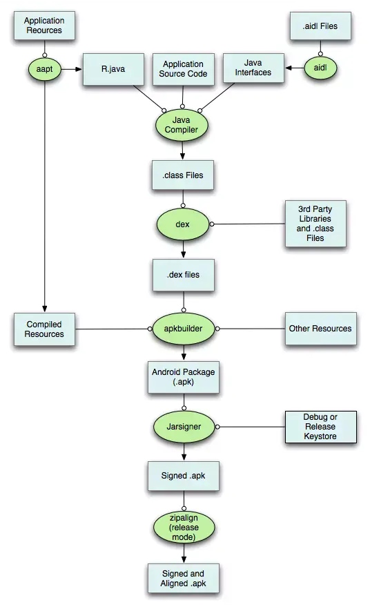
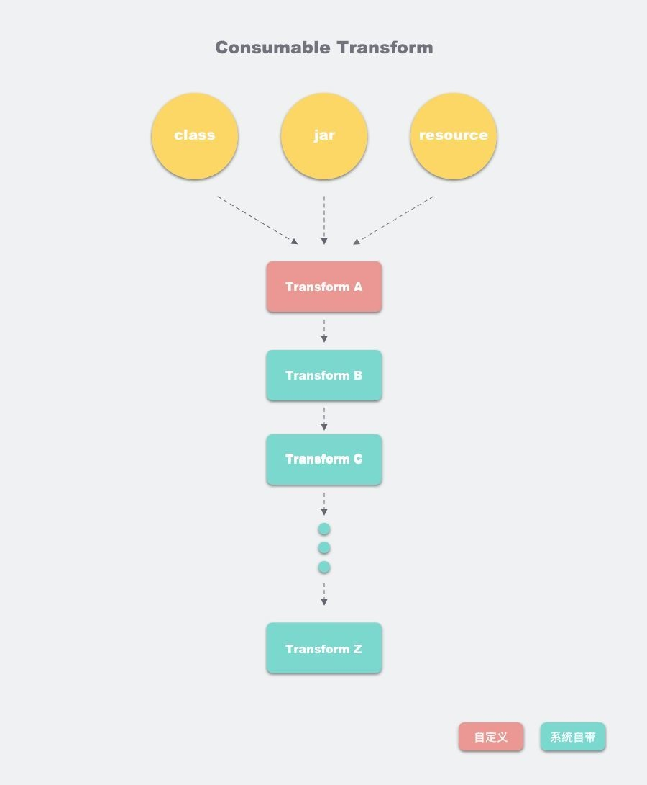
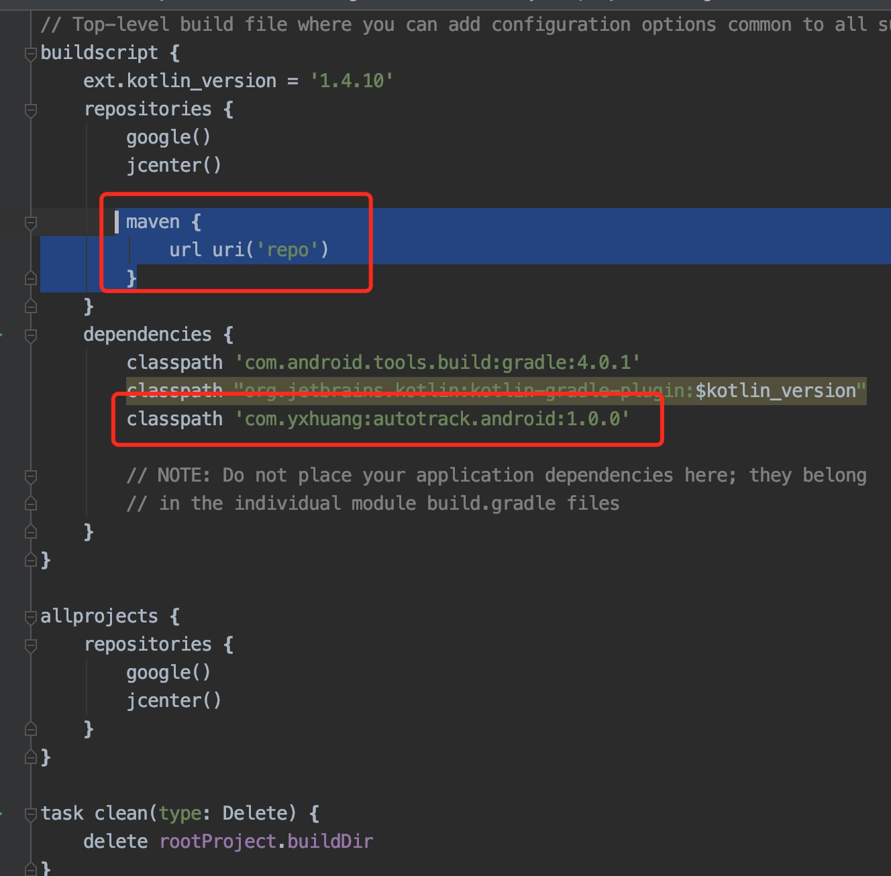
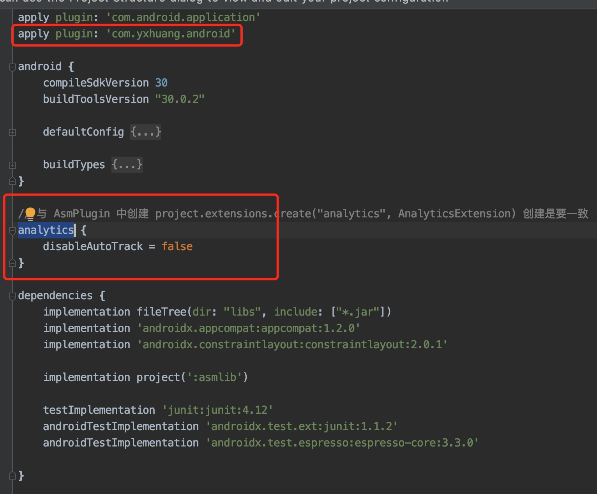

# Android 编译插桩（二）： Gradle Transform

Android 的打包流程



上图是 apk 打包的流程，可以看启用有一步是 .class 文件到 .dex 发文件的转换。而 Gradle Transform 是 Android 官方提供的在这一阶段用来修改 .class 文件的一套标准 API。 这一应用现在主要集中在字节码查找、代码注入等

## 1. Transform 原理


图片出自 https://cloud.tencent.com/developer/article/1378925

每个 Transform 都是一个 gradle task, 将 class 文件、本地依赖的 jar, aar 和 resource 资源统一处理。

每个 Transform 在处理完之后交给下一个 Transform。如果是用户自定义的 Transform 会插在队列的最前面。

### 1.1 Transform 主要方法
Transform 是一个抽象类

```java
public abstract class Transform {

    // 代表 Transform 对于的 task 名称
    public abstract String getName();
    
    // 指定 Transform 处理的数据， CONTENT_CLASS 表示处理 java class 文件，
    //  CONTENT_RESOURCES, 表示处理 java 的资源
    public Set<ContentType> getOutputTypes() {
        return getInputTypes();
    }
    
    // Transform 要操作的内容范围
    // 1.PROJECT 只有项目内容
    // 2.SUB_PROJECTS 只有子项目内容
    // 3.EXTERNAL_LIBRARIES 只有外部库
    // 4.TESTED_CODE 当前变量（包括依赖项）测试的代码
    // 5.PROVIDED_ONLY 本地或者员村依赖项
    public abstract Set<? super Scope> getScopes();
    
    // 是否增量编译
    public abstract boolean isIncremental();
    
    
    // 输出的内容
    public void transform(@NonNull TransformInvocation transformInvocation)
            throws TransformException, InterruptedException, IOException {
        // Just delegate to old method, for code that uses the old API.
        //noinspection deprecation
        transform(transformInvocation.getContext(), transformInvocation.getInputs(),
                transformInvocation.getReferencedInputs(),
                transformInvocation.getOutputProvider(),
                transformInvocation.isIncremental());
    }
     
}
```

### 1.2 TransformInput 输出
TransformInput 是指这些输入文件的一个抽象，包含两个部分

- DirectoryInput 集合
是指以源代码方式参与项目编译的所有目录结构及其目录下的源代码

- JarInput 集合
是指以 jar 包方式参与项目编译的本地 jar 包和远程 jar 包，包含 aar

输出是在 transform 方法里面处理

```java
void customTransform(Context context, Collection<TransformInput> inputs,    
        TransformOutputProvider outputProvider,boolean isIncremental) {
    // 遍历
    inputs.forEach { TransformInput input ->

        // 遍历目录
        input.directoryInputs.each { DirectoryInput directoryInput ->
            handleDirectoryInputs(directoryInput)
        }

        // 遍历 jar
        input.jarInputs.each { JarInput jarInput ->
            handleJarInputs(jarInput)
        }
    }
}
```

### 1.3 Transform 的使用
创建的目录结构


**第一步，创建 Android Library module, 修改 gradle 的内容**

```
apply plugin: 'groovy'
apply plugin: 'maven'

dependencies {
    implementation gradleApi()
    implementation localGroovy()

    compileOnly 'com.android.tools.build:gradle:3.4.1'
}

repositories {
    jcenter()
}

// 上传到本地的代码仓
uploadArchives{
    repositories.mavenDeployer{
        // 本地仓库路径
        repository(url: uri('../repo'))

        // 设置 groupId 
        pom.groupId = 'com.yxhuang'

        // 设置 artifactId
        pom.artifactId = 'autotrack.android'

        // 设置 插件版本号
        pom.version = '1.0.0'
    }
}
```

**第二步，新进 groovy 目录，创建 Transform 类**

```
class AnalyticsTransform extends Transform {

    @Override
    String getName() {
        return "AnalyticsAutoTrack"
    }

    /**
     * 需要处理的数据
     * @return
     */
    @Override
    Set<QualifiedContent.ContentType> getInputTypes() {
        return TransformManager.CONTENT_CLASS
    }

    /**
     *  Transform 要操作的内容范围
     * @return
     */
    @Override
    Set<? super QualifiedContent.Scope> getScopes() {
        return TransformManager.SCOPE_FULL_PROJECT
    }

    @Override
    boolean isIncremental() {
        return false
    }

    @Override
    void transform(TransformInvocation transformInvocation) throws TransformException, InterruptedException, IOException {
        customTransform(transformInvocation.getContext(), transformInvocation.getInputs(),
                transformInvocation.getOutputProvider(), transformInvocation.incremental)
    }

    void customTransform(Context context, Collection<TransformInput> inputs, TransformOutputProvider outputProvider,
                         boolean isIncremental) {

        if (!isIncremental) {
            outputProvider.deleteAll()
        }
        // 遍历
        inputs.forEach { TransformInput input ->

            // 遍历目录
            input.directoryInputs.each { DirectoryInput directoryInput ->
                handleDirectoryInputs(directoryInput)
            }

            // 遍历 jar
            input.jarInputs.each { JarInput jarInput ->
                handleJarInputs(jarInput)
            }
        }
    }
```
**第三步创建 plugin, 注册 transform**

```
// AnalyticsPlugin.groovy
class AnalyticsPlugin implements Plugin<Project>{

    @Override
    void apply(Project project) {
        // ‘analytics’ 在 build.gradle 中传值使用
        AnalyticsExtension extension = project.extensions.create("analytics", AnalyticsExtension)
        println("------------AnalyticsPlugin apply  extension disableAutoTrack --------------" +  extension.disableAutoTrack)

        AppExtension appExtension = project.extensions.findByType(AppExtension.class)
        appExtension.registerTransform(new AnalyticsTransform(extension))
    }
}
```
其中 AnalyticsExtension 是自定义属性类，可以通过主项目的 build.gradle 文件传值

```
/**
 * 定义额外的属性
 */
class AnalyticsExtension {

    /**
     * 是否禁止自动插桩
     */
    boolean disableAutoTrack = false
}
```

主项目的 build.gradle 
命名的 scope 要与注册时的一致，例如下的 analytics

```
// 与 AsmPlugin 中创建 project.extensions.create("analytics", AnalyticsExtension) 创建是要一致
analytics {
    disableAutoTrack = false
}
```

**第四步 创建 properties 文件**
在 plugin/src/main 目录下创建新目录 resources/META-INFO/gradle-plguins,
然后创建文件,内容指定为上一步创建的 plugin 

```
implementation-class=com.yxhuang.analytics.android.plugin.AnalyticsPlugin

```

**第五步，修改相关的 build.gradle 文件，添加依赖**
在根项目的 build.gradle 中添加

在 asm/build.gradle 中添加




**最后是构建**
在 gradle task 里面,运行 uploadArchives 任务即可


## 参考
- [一起玩转Android项目中的字节码（Transform篇）](https://cloud.tencent.com/developer/article/1378925)
- [王灼洲 ·《Android 全埋点解决方案》](https://book.douban.com/subject/33400077/)


