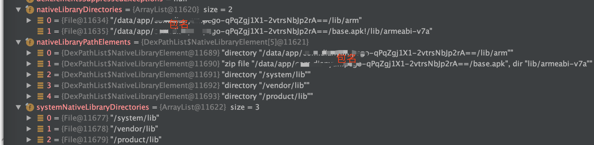
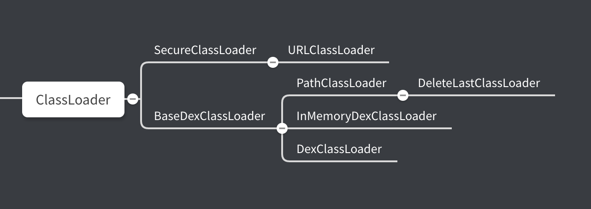

# Android 动态链接库 So 的加载
本文通过讲述 Android 动态链接库 so 的加载过来，已经 so 的加载原理，可以对加载的整个流程有个清晰的认识，有助于对后续学习热修复有比较好的帮助。

下面代码分析的源码都是以 Android 9.0 版。

## 1 Android  So 的加载过程
在 Android 添加 SO 有两种方式，一种是调用 `load(String filename)` 方法，传递进去的是路径；另一种是调用 `loadLibrary(String libname)` 方式，传递进去的是 so 的名称

>System.load("/storage/emulated/0/libnative-lib.so") 全路径
>System.loadLibrary("native-lib"); so 的名字


### 1.1 System#loadLibrary
[> java/lang/System.java]

```java
public static void loadLibrary(String libname) {
    Runtime.getRuntime().loadLibrary0(VMStack.getCallingClassLoader(), libname);
}
```


### 1.2 Runtime#loadLibrary0
[>java/lang/Runtime.java]

```java
  private synchronized void loadLibrary0(ClassLoader loader, Class<?> callerClass, String libname) {
    
    ...
    String libraryName = libname;
 
    if (loader != null && !(loader instanceof BootClassLoader)) {
         //① ClassLoader#findLibrary 查找 so 的文件名称，见 1.4节
        String filename = loader.findLibrary(libraryName);
            if (filename == null &&
                    (loader.getClass() == PathClassLoader.class ||
                     loader.getClass() == DelegateLastClassLoader.class)) {
            // ② 如果通过 ClassLoader 找不到，则会通过 System 默认路径去找
                filename = System.mapLibraryName(libraryName);
            }
            if (filename == null) {
                throw new UnsatisfiedLinkError(loader + " couldn't find \"" +
                                               System.mapLibraryName(libraryName) + "\"");
            }
            // ③ Native 加载
            String error = nativeLoad(filename, loader);
            if (error != null) {
                throw new UnsatisfiedLinkError(error);
            }
            return;
     }

    // ClassLoader 为空的时候
    getLibPaths();
    String filename = System.mapLibraryName(libraryName);
    String error = nativeLoad(filename, loader, callerClass);
    if (error != null) {
        throw new UnsatisfiedLinkError(error);
    }
}
   // 最终通过 Native 来加载
    private static native String nativeLoad(String filename, ClassLoader loader, Class<?> caller)
```

- 当 loader 不为空是，通过 ClassLoader#findLibrary() 查看 so  是否存在
- 当 loader 为空是，则从默认目录 mLibPaths 中查找


### 1.3 Runtime#getLibPaths
[>java/lang/Runtime.java]

```
// 获取 Lib 默认路径
private String[] getLibPaths() {
    if (mLibPaths == null) {
        synchronized(this) {
            if (mLibPaths == null) {
                mLibPaths = initLibPaths();
            }
        }
    }
    return mLibPaths;
} 

private static String[] initLibPaths() {
    String javaLibraryPath = System.getProperty("java.library.path");
    if (javaLibraryPath == null) {
        return EmptyArray.STRING;
    }
    String[] paths = javaLibraryPath.split(":");
    for (int i = 0; i < paths.length; ++i) {
        if (!paths[i].endsWith("/")) {
            paths[i] += "/";
        }
    }
    return paths;
}  
```
`initLibPaths` 路径是默认的 lib 路径 返回的路径是

>  /system/lib/
> /vendor/lib/
> /product/lib/


### 1.4 BaseDexClassLoader.findLibrary
通过 ClassLoader 查找 so

[> libcore/dalvik/src/main/java/dalvik/system/BaseDexClassLoader.java]

```java
@Override
public String findLibrary(String name) {
    return pathList.findLibrary(name);
}
```
pathList 是 DexPathList

### 1.5 DexPathList#findLibrary

[>libcore/dalvik/src/main/java/dalvik/system/DexPathList.java]

```java
public String findLibrary(String libraryName) {
    // 通过 so 的名称拼接成文件路径
    String fileName = System.mapLibraryName(libraryName);

    for (NativeLibraryElement element : nativeLibraryPathElements) {
        String path = element.findNativeLibrary(fileName);

        if (path != null) {
            return path;
        }
    }

    return null;
}
```
例如
`System.mapLibraryName(native-lib)` 返回的是 `libnative-lib.so`

`nativeLibraryPathElements` 是 native library 路径的集合， 它的是 `DexPathList` 初始化的时候赋值，详见 1.7节

### 1.6 DexPathList$NativeLibraryElement#findNativeLibrary

[>libcore/dalvik/src/main/java/dalvik/system/DexPathList.java]

```
public String findNativeLibrary(String name) {
    maybeInit();

    if (zipDir == null) {
        String entryPath = new File(path, name).getPath();
        // 能打开并且只读的 so
        if (IoUtils.canOpenReadOnly(entryPath)) {
            return entryPath;
        }
    } else if (urlHandler != null) {
        String entryName = zipDir + '/' + name;
        if (urlHandler.isEntryStored(entryName)) {
          return path.getPath() + zipSeparator + entryName;
        }
    }

    return null;
}
```

### 1.7 DexPathList#DexPathList
[>libcore/dalvik/src/main/java/dalvik/system/DexPathList.java]

```
DexPathList(ClassLoader definingContext, String dexPath,
    String librarySearchPath, File optimizedDirectory, boolean isTrusted) {
  
    ...

    this.definingContext = definingContext;

    ArrayList<IOException> suppressedExceptions = new ArrayList<IOException>();
    // save dexPath for BaseDexClassLoader
   //  dex 的路径
    this.dexElements = makeDexElements(splitDexPath(dexPath), optimizedDirectory,
                                           suppressedExceptions, definingContext, isTrusted);

    
    // Native 库的路径
    this.nativeLibraryDirectories = splitPaths(librarySearchPath, false);
    //  系统 Native 库的路径
    this.systemNativeLibraryDirectories =
            splitPaths(System.getProperty("java.library.path"), true);
    // 所有的 Natvie
    this.nativeLibraryPathElements = makePathElements(getAllNativeLibraryDirectories());

    ...
}
```

在 `DexPathList` 的构造函数中，我们可以知道 `nativeLibraryPathElements` 是所有 Native Library 的集合。

`DexPathList` 是在 ActivityThread 中创建，ActivityThread 是在 App 启动时候创建的。关于 App 启动的启动流程，可以去找这方面的资料，自行查看。

总结一些 Native Library 的路径来源：

- 一个是 Native 库的原始路径 `System.getProperty("java.library.path****")`,
    /system/lib/; /vendor/lib/; /product/lib/
    
- 另外一个是App启动时的 Lib 库路径




### 1.8 Runtime#doLoad
在上面我们解决 Native Library 的路径问题，下面分析一下加载的过程

```java
private String doLoad(String name, ClassLoader loader) {
    String librarySearchPath = null;
    if (loader != null && loader instanceof BaseDexClassLoader) {
        BaseDexClassLoader dexClassLoader = (BaseDexClassLoader) loader;
        librarySearchPath = dexClassLoader.getLdLibraryPath();
    }

    synchronized (this) {
        // 调用 native 方法加载 so, librarySearchPath 就是前面分析的路径的路径
        return nativeLoad(name, loader, librarySearchPath);
    }
}

private static native String nativeLoad(String filename, ClassLoader loader,
                                            String librarySearchPath);
```

### 1.9 Runtime.c#Runtime_nativeLoad

[> libcore/ojluni/src/main/native/Runtime.c]

```
JNIEXPORT jstring JNICALL
Runtime_nativeLoad(JNIEnv* env, jclass ignored, jstring javaFilename,
                   jobject javaLoader, jclass caller)
{
    return JVM_NativeLoad(env, javaFilename, javaLoader, caller);
}
```
Runtime.c 中 `Runtime_nativeLoad` 方法会调用 `JVM_NativeLoad`

### 1.10 OpenjdkJvm.cc#JVM_NativeLoad
[>art/openjdkjvm/OpenjdkJvm.cc]

```
JNIEXPORT jstring JVM_NativeLoad(JNIEnv* env,
                                 jstring javaFilename,
                                 jobject javaLoader,
                                 jclass caller) {
  ScopedUtfChars filename(env, javaFilename);
  if (filename.c_str() == nullptr) {
    return nullptr;
  }

  std::string error_msg;
  {
    // 获取 java 虚拟机
    art::JavaVMExt* vm = art::Runtime::Current()->GetJavaVM();
    // 加载 调用java 虚拟机中 NativieLibrary 方法去加载 so
    bool success = vm->LoadNativeLibrary(env,
                                         filename.c_str(),
                                         javaLoader,
                                         caller,
                                         &error_msg);
    if (success) {
      return nullptr;
    }
  }

  ...
```
### 1.11 java_vm_ext.cc#JVM_NativeLoad
[>art/runtime/java_vm_ext.cc]

```
bool JavaVMExt::LoadNativeLibrary(JNIEnv* env,
                                  const std::string& path,
                                  jobject class_loader,
                                  std::string* error_msg) {
  error_msg->clear();

  SharedLibrary* library;
  Thread* self = Thread::Current();
  // ① 先判断 so 是否已经被加载过
  {
    MutexLock mu(self, *Locks::jni_libraries_lock_);
    library = libraries_->Get(path);
    
    ...
  
    }
    VLOG(jni) << "[Shared library \"" << path << "\" already loaded in "
              << " ClassLoader " << class_loader << "]";
    if (!library->CheckOnLoadResult()) {
      StringAppendF(error_msg, "JNI_OnLoad failed on a previous attempt "
          "to load \"%s\"", path.c_str());
      return false;
    }
    return true;
  }

  // ② 打开 so 
  ScopedLocalRef<jstring> library_path(env, GetLibrarySearchPath(env, class_loader));
  Locks::mutator_lock_->AssertNotHeld(self);
  const char* path_str = path.empty() ? nullptr : path.c_str();
  bool needs_native_bridge = false;
  void* handle = android::OpenNativeLibrary(env,
                                            runtime_->GetTargetSdkVersion(),
                                            path_str,
                                            class_loader,
                                            library_path.get(),
                                            &needs_native_bridge,
                                            error_msg);

  VLOG(jni) << "[Call to dlopen(\"" << path << "\", RTLD_NOW) returned " << handle << "]";

  // 打开失败返回
  if (handle == nullptr) {
    VLOG(jni) << "dlopen(\"" << path << "\", RTLD_NOW) failed: " << *error_msg;
    return false;
  }
  
  // 检测异常
  if (env->ExceptionCheck() == JNI_TRUE) {
    LOG(ERROR) << "Unexpected exception:";
    env->ExceptionDescribe();
    env->ExceptionClear();
  }
  
  // ③ 创建一个新的 SharedLibrary 结构体放到 libraries 中
  bool created_library = false;
  {
    // Create SharedLibrary ahead of taking the libraries lock to maintain lock ordering.
    std::unique_ptr<SharedLibrary> new_library(
        new SharedLibrary(env,
                          self,
                          path,
                          handle,
                          needs_native_bridge,
                          class_loader,
                          class_loader_allocator));

    MutexLock mu(self, *Locks::jni_libraries_lock_);
    library = libraries_->Get(path);
    if (library == nullptr) {  // We won race to get libraries_lock.
      library = new_library.release();
      libraries_->Put(path, library);
      created_library = true;
    }
  }
  if (!created_library) {
    LOG(INFO) << "WOW: we lost a race to add shared library: "
        << "\"" << path << "\" ClassLoader=" << class_loader;
    return library->CheckOnLoadResult();
  }
  VLOG(jni) << "[Added shared library \"" << path << "\" for ClassLoader " << class_loader << "]";

  // ④ 查找 ”JNI_OnLoad“ 符号
  bool was_successful = false;
  void* sym = library->FindSymbol("JNI_OnLoad", nullptr);
  // 没有查找到， 标记为加载成功
  if (sym == nullptr) {
    VLOG(jni) << "[No JNI_OnLoad found in \"" << path << "\"]";
    was_successful = true;
  } else {
    // 如果我们在 JNI 中已经复写了 JNI_OnLoad 方法，则需要重写 ClassLoader
    ScopedLocalRef<jobject> old_class_loader(env, env->NewLocalRef(self->GetClassLoaderOverride()));
    self->SetClassLoaderOverride(class_loader);

    VLOG(jni) << "[Calling JNI_OnLoad in \"" << path << "\"]";
    typedef int (*JNI_OnLoadFn)(JavaVM*, void*);
    JNI_OnLoadFn jni_on_load = reinterpret_cast<JNI_OnLoadFn>(sym);
    int version = (*jni_on_load)(this, nullptr);
    
    ...

    self->SetClassLoaderOverride(old_class_loader.get());

    // 判断 JNI 版本
    if (version == JNI_ERR) {
      StringAppendF(error_msg, "JNI_ERR returned from JNI_OnLoad in \"%s\"", path.c_str());
    } else if (JavaVMExt::IsBadJniVersion(version)) {
      StringAppendF(error_msg, "Bad JNI version returned from JNI_OnLoad in \"%s\": %d",
                    path.c_str(), version);

    } else {
      was_successful = true;
    }
    ...
  }

  // 返回加载结果
  library->SetResult(was_successful);
  return was_successful;
}

```
上面的内容比较多，需要一步步分析

- 第一步是判断 so 是否已经被加载过，如果已经加载过了，则直接返回加载成功
- 第二步是打开 so, 返回 `handle`句柄，如果返回的句柄为空，这份表示加载失败
- 第三步是创建一个 `SharedLibrary` 结构体，放到 `libraries` 中缓存
- 第四步是查找 `JNI_OnLoad` 符号，这里分两种情况
    - 如果在 JNI 中没有写 `JNI_OnLoad` 方法，找不到符号，返回加成功
    - 另一种情况是，如果 JNI 中有 `JNI_OnLoad` 方法，则会重写当前的 ClassLoader, 并且判断 JNI 版本

从上面的第四步，**我们可以知道加载 so 中 JNI 的入口是 `JNI_OnLoad` 方法，所以在写 JNI 的时候，会在 `JNI_OnLoad`方法中做一些初始化的工作。另外一个就是，如果写了 `JNI_OnLoad` 方法，就要指定 JNI 版本。**


判断 JNI 的版本

[>art/runtime/java_vm_ext.cc]

```
bool JavaVMExt::IsBadJniVersion(int version) {
  // We don't support JNI_VERSION_1_1. These are the only other valid versions.
  return version != JNI_VERSION_1_2 && version != JNI_VERSION_1_4 && version != JNI_VERSION_1_6;
}
```
上面是判断 JNI 版本，可以看到只能是 `JNI_VERSION_1_2,JNI_VERSION_1_4,JNI_VERSION_1_6` 三个版本

下来是我们平时在写 JNI 的时候, `JNI_OnLoad` 方法中需要给定 jni 的版本， 同时做一些初始化的工作。

```
int JNI_OnLoad(JavaVM *vm, void *reserved) {
    JNIEnv *env;
    jVM = vm;

    // 设定 jni 版本为 1_4
    if ((*vm)->GetEnv(vm, (void **) &env, JNI_VERSION_1_4) != JNI_OK) { 
        return -1;
    }
    
    // 初始化的工作
     android_dumpVideo = (*env)->GetStaticMethodID(env, cEmulator, "bitblt",
                                                  "(Ljava/nio/ByteBuffer;)V");

    if (android_dumpVideo == NULL) {
        __android_log_print(ANDROID_LOG_ERROR, "mame4droid-jni", "Failed to find method bitblt");
        return -1;
    }

    android_changeVideo = (*env)->GetStaticMethodID(env, cEmulator, "changeVideo", "(IIII)V");

    if (android_changeVideo == NULL) {
        __android_log_print(ANDROID_LOG_ERROR, "mame4droid-jni",
                            "Failed to find method changeVideo");
        return -1;
    }
}

```

## 2. So 的加载原理
在前面的部分，我们梳理了 so 加载的整个流程，但这个过程还有一些以为，包括：

- ClassLoader 从哪里来
- Native 库是怎样来的
- so 是怎样到 Native 库里面的

下面将一个个来查找这些疑问的答案

### 2.1 ClassLoader 是怎样来的

### 2.1.1 System#loadLibrary
[> java/lang/System.java]

```java
public static void loadLibrary(String libname) {
      Runtime.getRuntime().loadLibrary0(VMStack.getCallingClassLoader(), libname);
}
```
加载的 ClassLoader 从 VMStack 中获取， VMStack 再去从 Native 中获取

[>/libcore/libart/src/main/java/dalvik/system/VMStack.java]

```
@FastNative
native public static ClassLoader getCallingClassLoader();
```

### 2.1.2 ActivityThread#handleBindApplication

[>/frameworks/base/core/java/android/app/ActivityThread.java]


在 ActivityThread 是 Android App 启动的入口，关于 App 的启动可参考其他资料。 
App 启动过程，会调到 ActivityThread#handleBindApplication 方法。
在这个方法中，会创建 `LoadedApk`  并且传入进去 Context 中的 ClassLoader.  
Context 的实现是 ContextImpl，Context#getClassLoader() 方法，去看 ContextImpl#getClassLoader()， 详见 2.1.3


```java
private void handleBindApplication(AppBindData data) {
    
    ...
    
    // 创建 LoadedApk，使用是 Context 的 ClassLoader
    LoadedApk pi = getPackageInfo(instrApp, data.compatInfo, appContext.getClassLoader(), false, true, false);
    // 将 ActivityThread 和 LoadedApk 作为创建 ContextImpl 的参数
    ContextImpl instrContext = ContextImpl.createAppContext(this, pi);

    try {
        java.lang.ClassLoader cl = instrContext.getClassLoader();
        mInstrumentation = (Instrumentation) cl.loadClass(data.instrumentationName.getClassName())
                .newInstance();
    } catch (Exception e) {
        throw new RuntimeException(
                "Unable to instantiate instrumentation " + data.instrumentationName + ": " + e.toString(), e);
    }
    ...
}
```

### 2.1.3 ContextImpl#getClassLoader

[>/frameworks/base/core/java/android/app/ContextImpl.java]

```java

@Override
public ClassLoader getClassLoader() {
    return mClassLoader != null ? mClassLoader : (mPackageInfo != null ? mPackageInfo.getClassLoader() : ClassLoader.getSystemClassLoader());
}

```
这里的逻辑有点绕，将代码整理改成下面，会更加容易看懂

```java
@Override
public ClassLoader getClassLoader() {
    if (mClassLoader != null){
        return mClassLoader;
    }
    if (mPackageInfo != null){
      return mPackageInfo.getClassLoader();
    } else {
      return ClassLoader.getSystemClassLoader();
    }
}
```
经过整理的代码逻辑就很清晰了，第一次进来的时候 mClassLoader 是空的，只要看后面的逻辑。
mPackageInfo是 LoadApk, mPackageInfo 不会为空，在 2.1.2 节知道它是 ContextImpl 创建的时候传进来的mP。所以，ackageInfo.getClassLoader()  是调用了  LoadApk#getClassLoader() 方法，关于这个方法详见 2.1.4


### 2.1.4 LoadApk#getClassLoader

[>/frameworks/base/core/java/android/app/LoadApk.java]

```java
  public ClassLoader getClassLoader() {
    synchronized (this) {
        if (mClassLoader == null) {
            createOrUpdateClassLoaderLocked(null /*addedPaths*/);
        }
        return mClassLoader;
    }
}


private void createOrUpdateClassLoaderLocked(List<String> addedPaths)

    ···
    // 创建 LoadApk 的时候，传进 mIncludeCode 的值是 false
    if (!mIncludeCode) {
            if (mClassLoader == null) {
                StrictMode.ThreadPolicy oldPolicy = StrictMode.allowThreadDiskReads();
                mClassLoader = ApplicationLoaders.getDefault().getClassLoader(
                        "" /* codePath */, mApplicationInfo.targetSdkVersion, isBundledApp,
                        librarySearchPath, libraryPermittedPath, mBaseClassLoader,
                        null /* classLoaderName */);
                StrictMode.setThreadPolicy(oldPolicy);
                mAppComponentFactory = AppComponentFactory.DEFAULT;
            }

            return;
    }
        
    // 调用  ApplicationLoaders.getDefault() 创建 ClassLoader, 
     if (mClassLoader == null) {
        ..
        mClassLoader = ApplicationLoaders.getDefault().getClassLoader(zip,
                mApplicationInfo.targetSdkVersion, isBundledApp, librarySearchPath,
                libraryPermittedPath, mBaseClassLoader,
                mApplicationInfo.classLoaderName);
        mAppComponentFactory = createAppFactory(mApplicationInfo, mClassLoader);
    
       ...
    }
        
    ···
}
```

### 2.1.5 ApplicationLoaders#getClassLoader

[>/frameworks/base/core/java/android/app/ApplicationLoaders.java]

```java
ClassLoader getClassLoader(String zip, int targetSdkVersion, boolean isBundled,
                           String librarySearchPath, String libraryPermittedPath,
                           ClassLoader parent, String classLoaderName) {
    // For normal usage the cache key used is the same as the zip path.
    return getClassLoader(zip, targetSdkVersion, isBundled, librarySearchPath,
                          libraryPermittedPath, parent, zip, classLoaderName);
}


 private ClassLoader getClassLoader(String zip, int targetSdkVersion, boolean isBundled,
                                       String librarySearchPath, String libraryPermittedPath,
                                       ClassLoader parent, String cacheKey,
                                       String classLoaderName) {
 
    ClassLoader baseParent = ClassLoader.getSystemClassLoader().getParent();
        
      synchronized (mLoaders) {
            if (parent == null) {
                parent = baseParent;
            }
            // 试图从缓存总去取 ClassLoader
            if (parent == baseParent) {
                ClassLoader loader = mLoaders.get(cacheKey);
                if (loader != null) {
                    return loader;
                }
            }
            
            // 创建 ClassLoader
            ClassLoader classloader = ClassLoaderFactory.createClassLoader(
                    zip,  librarySearchPath, libraryPermittedPath, parent,
                    targetSdkVersion, isBundled, classLoaderName);
                mLoaders.put(cacheKey, classloader);
                return classloader;
            }

        ...
        }
    }
```

### 2.1.6 ClassLoaderFactory#createClassLoader
    
[>/frameworks/base/core/java/com/android/internal/os/ClassLoaderFactory.java]

```java
public static ClassLoader createClassLoader(String dexPath,
    String librarySearchPath, ClassLoader parent, String classloaderName) {
    if (isPathClassLoaderName(classloaderName)) {
        return new PathClassLoader(dexPath, librarySearchPath, parent);
    } else if (isDelegateLastClassLoaderName(classloaderName)) {
        return new DelegateLastClassLoader(dexPath, librarySearchPath, parent);
    }

    throw new AssertionError("Invalid classLoaderName: " + classloaderName);
}
```

经过上面这么多步，终于看到了创建创建 ClassLoader 的地方.
根据参数的 classloaderName 的不同，会创建  PathClassLoader 或者 DelegateLastClassLoader。 

classloaderName 参数是 app 启动的时候传下来的，见 2.1.4 节

总的来说，**ClassLoader 是 app 启动的时候， ActivityThread 中经过一步步的调用，最后在 ApplicationLoaders 中用 ClassLoaderFactory 创建。**

ClassLoader 的分类



关于不同的 ClassLoader 有不同的作用，可以去查相关的资料

到此，我们的第一个问题解决了，ClassLoader 是 app 启动的时候在 ActivityThread 中创建。 


## 2.2 Native 库是怎样来的
通过对 DexPathList 的分析，可以知道 Native Library 来自来自两个地方

- 一个是 DexPathList 创建的时候，构造函数传进来的 librarySearchPath。

- 另外一个是 addNativePath(Collection<String> libPaths)
例如 :
> /data/app/com.test.baidu/base.apk!/lib/armeabi-v7a

### 2.2.1 DexPathList#findLibrary
在第一章的时候，加载 so 会调用到 DexPathList#findLibrary 方法，在这个方法里面会遍历 nativeLibraryPathElements。 nativeLibraryPathElements 是 NativeLibrary 路径的集合。

```java
public String findLibrary(String libraryName) {
    
    String fileName = System.mapLibraryName(libraryName);

    for (NativeLibraryElement element : nativeLibraryPathElements) {
        String path = element.findNativeLibrary(fileName);
        if (path != null) {
            return path;
        }
    }
    return null;
}

```
System.mapLibraryName 的实现是在 System.c 里面，返回 so 的文件名，例如 
> libraryName 是 test_baidu, 
> System.mapLibraryName('test_baidu') 返回的是  libtest_baidu.so


下面要看看 `nativeLibraryPathElements`是怎么来的
NativeLibraryElement 类是 Native Library 的路径元素

```
 static class NativeLibraryElement {
        
    private final File path;
    private final String zipDir;

    public NativeLibraryElement(File dir) {
        this.path = dir;
        this.zipDir = null;
    }

    public NativeLibraryElement(File zip, String zipDir) {
        this.path = zip;
        this.zipDir = zipDir;

        if (zipDir == null) {
          throw new IllegalArgumentException();
        }
    }
    ...
}
```
### 2.2.1 DexPathList#DexPathList 构造函数

```
DexPathList(ClassLoader definingContext, String dexPath,
            String librarySearchPath, File optimizedDirectory, boolean isTrusted) {
            
    ...

    this.dexElements = makeDexElements(splitDexPath(dexPath), optimizedDirectory,
                                           suppressedExceptions, definingContext, isTrusted);

    //  ① 创建是传入进来的 librarySearchPath
    this.nativeLibraryDirectories = splitPaths(librarySearchPath, false);
        
   //  ② 系统的 "java.library.path" 路径  
    this.systemNativeLibraryDirectories = splitPaths(System.getProperty("java.library.path"), true);
    List<File> allNativeLibraryDirectories = new ArrayList<>(nativeLibraryDirectories);
    allNativeLibraryDirectories.addAll(systemNativeLibraryDirectories);
    this.nativeLibraryPathElements = makePathElements(allNativeLibraryDirectories);

   ...
}
```
在 DexPathList 的构造函数中，我们可以看到 Native library 存在两个方面

- 一个是传入进来的 librarySearchPath
- 另外一个是通过虚拟机属性 `java.library.path` 获取的系统 Native 库


### 2.2.2 DexPathList#addNativePath

外部添加的 libPaths 路径
例如 
> /data/app/com.test.baidu/base.apk!/lib/armeabi-v7a

DexPathList#addNativePath 是在 ApplicationLoaders#addNative 中调用，见 2.2.3

```
public void addNativePath(Collection<String> libPaths) {
    if (libPaths.isEmpty()) {
        return;
    }
    List<File> libFiles = new ArrayList<>(libPaths.size());
    for (String path : libPaths) {
        libFiles.add(new File(path));
    }
    ArrayList<NativeLibraryElement> newPaths =
            new ArrayList<>(nativeLibraryPathElements.length + libPaths.size());
    newPaths.addAll(Arrays.asList(nativeLibraryPathElements));
    for (NativeLibraryElement element : makePathElements(libFiles)) {
        if (!newPaths.contains(element)) {
            newPaths.add(element);
        }
    }
    nativeLibraryPathElements = newPaths.toArray(new NativeLibraryElement[newPaths.size()]);
}
```
### 2.2.3 ApplicationLoaders#addNative

[>/frameworks/base/core/java/android/app/ApplicationLoaders.java]

```
void addNative(ClassLoader classLoader, Collection<String> libPaths) {
        if (!(classLoader instanceof PathClassLoader)) {
            throw new IllegalStateException("class loader is not a PathClassLoader");
        }
        final PathClassLoader baseDexClassLoader = (PathClassLoader) classLoader;
        baseDexClassLoader.addNativePath(libPaths);
    }
```

### 2.2.4 LoadedApk#createOrUpdateClassLoaderLocked

[> /frameworks/base/core/java/android/app/LoadedApk.java]

```
private void createOrUpdateClassLoaderLocked(List<String> addedPaths) {
        
    ...
       
    // ① 默认 library 的路径
   final String defaultSearchPaths = System.getProperty("java.library.path");
    final boolean treatVendorApkAsUnbundled = !defaultSearchPaths.contains("/vendor/lib");
    if (mApplicationInfo.getCodePath() != null
            && mApplicationInfo.isVendor() && treatVendorApkAsUnbundled) {
        isBundledApp = false;
    }

    // ②
    makePaths(mActivityThread, isBundledApp, mApplicationInfo, zipPaths, libPaths);
    String libraryPermittedPath = mDataDir;
    
    ...
    
  // ③ 创建 ClassLoader
   if (mClassLoader == null) {
        ...
        mClassLoader = ApplicationLoaders.getDefault().getClassLoader(zip,
                mApplicationInfo.targetSdkVersion, isBundledApp, librarySearchPath,
                libraryPermittedPath, mBaseClassLoader,
                mApplicationInfo.classLoaderName);
        mAppComponentFactory = createAppFactory(mApplicationInfo, mClassLoader);

        ...
    }

    if (!libPaths.isEmpty() && SystemProperties.getBoolean(PROPERTY_NAME_APPEND_NATIVE, true)) {
        ...
        try {
            // ④ 添加 libPaths 路径
        ApplicationLoaders.getDefault().addNative(mClassLoader, libPaths);
        } finally {
            StrictMode.setThreadPolicy(oldPolicy);
        }
    }
    
    ...
    
    // ⑤ 其他的 lib 路径 到 defaultSearchPaths
  List<String> extraLibPaths = new ArrayList<>(3);
    String abiSuffix = VMRuntime.getRuntime().is64Bit() ? "64" : "";
    if (!defaultSearchPaths.contains("/vendor/lib")) {
        extraLibPaths.add("/vendor/lib" + abiSuffix);
    }
    if (!defaultSearchPaths.contains("/odm/lib")) {
        extraLibPaths.add("/odm/lib" + abiSuffix);
    }
    if (!defaultSearchPaths.contains("/product/lib")) {
        extraLibPaths.add("/product/lib" + abiSuffix);
    }
    if (!extraLibPaths.isEmpty()) {
        ...
        try {
            // ⑥ 将 其他 lib 路径也添加到 DexPathList 中
            ApplicationLoaders.getDefault().addNative(mClassLoader, extraLibPaths);
        } finally {
            StrictMode.setThreadPolicy(oldPolicy);
        }
    }
}
```
createOrUpdateClassLoaderLocked 方法里面创建 ClassLoader 并且设置 lib 路径

- 首先 defaultSearchPaths 默认路径，在 ①⑤中获取并放置进去，包含

>  /system/lib/
> /vendor/lib/
> /product/lib/

- 其次，在 ② 中 makePaths
- 在 ④⑥中将 libs 路径添加到 DexPathList 中

### 2.2.5 LoadedApk#makePaths

```
public static void makePaths(ActivityThread activityThread,
                                 boolean isBundledApp,
                                 ApplicationInfo aInfo,
                                 List<String> outZipPaths,
                                 List<String> outLibPaths) {
    final String appDir = aInfo.sourceDir;
    // aInfo.nativeLibraryDir 的来源在 ActivityThread#getInstrumentationLibrary 中
    final String libDir = aInfo.nativeLibraryDir;
    final String[] sharedLibraries = aInfo.sharedLibraryFiles;
        
    ...
    
    String instrumentationLibDir = activityThread.mInstrumentationLibDir;
    String instrumentedLibDir = activityThread.mInstrumentedLibDir;
    
    ...
    
    if (outLibPaths != null) {
        outLibPaths.add(instrumentationLibDir);
        if (!instrumentationLibDir.equals(instrumentedLibDir)) {
            outLibPaths.add(instrumentedLibDir);
        }
     }
    
        if (outLibPaths != null) {
        outLibPaths.add(instrumentationLibDir);
        if (!instrumentationLibDir.equals(instrumentedLibDir)) {
            outLibPaths.add(instrumentedLibDir);
        }
        
        ...
         
        if (outLibPaths.isEmpty()) {
            outLibPaths.add(libDir);
        }

        ① 根据 cpu 的不同添加不同路径
        if (aInfo.primaryCpuAbi != null) {
            if (aInfo.targetSdkVersion < Build.VERSION_CODES.N) {
                outLibPaths.add("/system/fake-libs" +
                    (VMRuntime.is64BitAbi(aInfo.primaryCpuAbi) ? "64" : ""));
            }
            for (String apk : outZipPaths) {
                outLibPaths.add(apk + "!/lib/" + aInfo.primaryCpuAbi);
            }
        }

        if (isBundledApp) {
outLibPaths.add(System.getProperty("java.library.path"));
        }      
}                              
                                 
```
在 ① 中，会根据 cpu 架构的不同，而添加不同路径，例如，如果手机 cpu 的架构 是 armeabi-v7a, 那 `apk + "!/lib/" + aInfo.primaryCpuAbi` 就是

> data/app/包名==/base.apk!/lib/armeabli-v7a


### 2.2.6 ActivityThread#getInstrumentationLibrary 

[>/frameworks/base/core/java/android/app/ActivityThread.java]

```
private String getInstrumentationLibrary(ApplicationInfo appInfo, InstrumentationInfo insInfo) {
    if (appInfo.primaryCpuAbi != null && appInfo.secondaryCpuAbi != null
            && appInfo.secondaryCpuAbi.equals(insInfo.secondaryCpuAbi)) {
       
        String secondaryIsa =
                VMRuntime.getInstructionSet(appInfo.secondaryCpuAbi);
        final String secondaryDexCodeIsa =
                SystemProperties.get("ro.dalvik.vm.isa." + secondaryIsa);
        secondaryIsa = secondaryDexCodeIsa.isEmpty() ? secondaryIsa : secondaryDexCodeIsa;

        final String runtimeIsa = VMRuntime.getRuntime().vmInstructionSet();
        if (runtimeIsa.equals(secondaryIsa)) {
            return insInfo.secondaryNativeLibraryDir;
        }
    }
    return insInfo.nativeLibraryDir;
}
```
在 ActivityThread 中的 nativeLibraryDir 通过 getInstrumentationLibrary 方法获取，也是通过 `SystemProperties.get("ro.dalvik.vm.isa." + secondaryIsa);` 系统属性获取


总的来说 NativeLibraryPath 主要是来至于几个方面

- 一个是系统的 `java.library.path` 属性，是
 
 >/system/lib
 /vendor/lib
 /product/lib

- 一个是 `apk + "!/lib/" + aInfo.primaryCpuAbi` 
> /data/app/包名==/base.apk!/lib/armeabli-v7a


- 一个是 `"ro.dalvik.vm.isa." + secondaryIsa` 属性
> /data/app/包名==/lib/arm

如下图中的 nativeLiraryPathsElements中的路径


