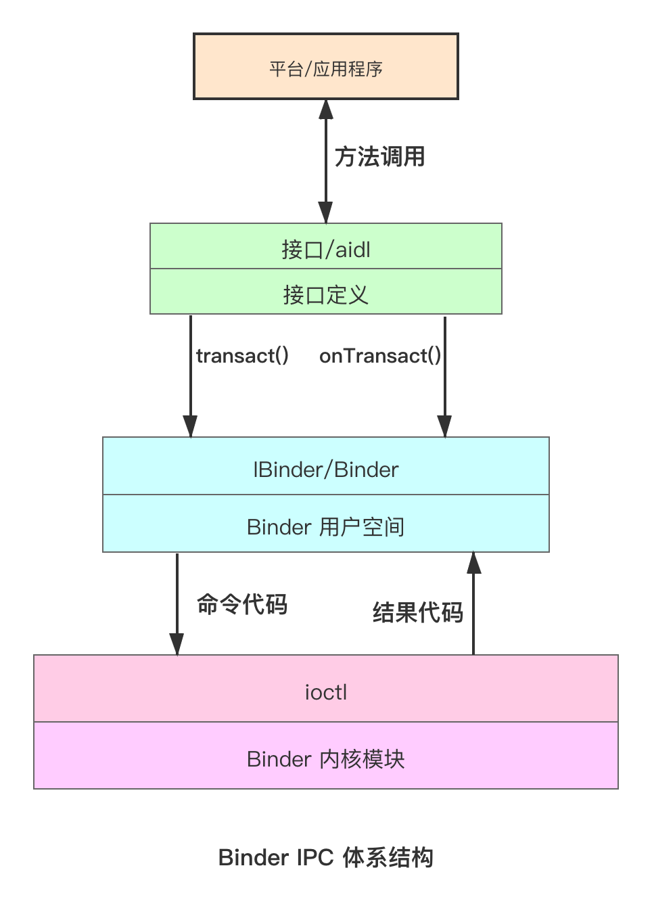
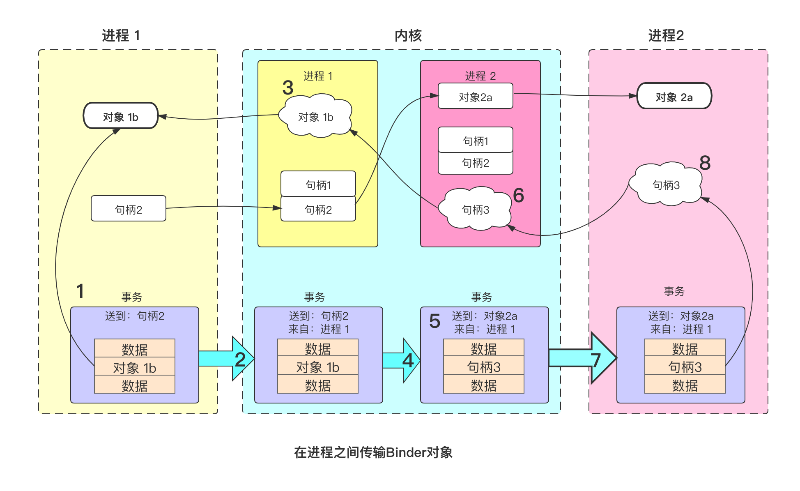

Binder

## 基础
从高层的角度讲， Binder 是一个特殊的文件描述符

Binder 是一种远程过程调用（Remote Procedure Call）机制。它允许应用间能够以程序调用的方式进行通信，而不须关心消息到底是如何发送和接收的。

Binder　需要处理的工作包括：

- **找到服务端进程**

    在大多数情况下，客户端和服务端分别是两个不同的进程。Binder 需要为客户端找出服务端进程，然后才能向它投递消息。通过”端点映射“（endpoint mapping） 来这个服务端，这个工作由 serviceManager 完成。
    
    ServiceManager 只负责维护一个服务目录，把一个接口名（interface name） 映射成一个 Binder 句柄（handle）。句柄是由 Binder 交给 ServiceManager 的

- **传递消息**

    生成获取被调用的方法参数，并将其序列化（serialize）,即把它们顺序打包到内存里的一个结构中去，或者反序列化（deserialize）,即把结构体重各个参数一一还原出来，这些任务也是由 **ADDL 完成**。
    
    从一个进程向另外一个进程传递序列化了的结构体，由 Binder 完成。客户端进程会用 BINDER_WRITE_READ 参数调用 ioctl(2). Binder 发送消息时，会阻塞客户端进程，直到服务端进程返回结果为止。

- **传递对象**

- **支持安全认证**
Binder 将获取到它的使用者的 PID 和 UID 嵌入到消息中。服务端进程解析出它们，然后做出相应的安全认证操作

## IPC 体系结构

图1.Binder IPC 体系结构

Binder IPC 是基于消息的。
Binder 中的消息成为事务（transaction）,在更高层可以被看作跨进程的函数调用。

用户空间提交给内核的每个事务都是一个完整的操作：
它标识操作的目标和发送者的标识符，以及交付的完整数据。内核决定适当的进程来接收该事务，将其交付给进程中等待的线程。

## 跨进程

### 跨进程对象映射

### 进程间传输 Binder 

图1.Binder IPC 体系结构

事务的流转步骤：

- 1.进程 1 创建一个初始事务结构，其中包含对象 1b 的本地地址
- 2.进程 1 提交事务到内核
- 3.内核查看事务中的数据，找到地址对象 1b, 并且创建一个针对它的新条目，因为它以前不知道垓地址
- 4.内核利用事务的目标句柄 2 来确定它的目标进程 2 中的地址对象 2a
- 5.内核将事务头重写，使其适合进程 2， 改变其目标为地址对象 2a
- 6.内核同样为目标进程重写事务数据；此处它发现对象 1b 还不被进程 2 所知，所以为它创建一个新的句柄 3
- 7.重写的事务被交付给进程 2 来执行
- 8.一旦接收到事务，进程会发现新的句柄 3 ，并将其添加到可用句柄表中

### Binder 用户空间
Binder 用户空间中的主要三个类

缺图 10-46

- **IBinder.**
    IBinder 是 Binder 的抽象接口，关键方法是 transact, 它将一个事务提交给对象。接收事务的实现可能是本地进程中的一个对象，或者是另一个进程中的对象；如果它在另一个进程中，则将会通过 Binder 内核交给它

- **Binder.**
    具体的 Binder 对象。实现一个 Binder 的子类，可以从其他进程调用的类。
    关键方法是 onTransact, 它接收发给它的一个事务。
    Binder 子类的主要责任是查看它接收的事物数据，并且执行适当的操作。
- **Parcel.**

这三个类使得编写 IPC 代码想到容易:

- 1. 从 Binder 构造子类
- 2. 实现 onTransact 以解码并执行到来的调用
- 3. 实现对应的代码来创建 Parcel, 它可以发送给对象的 transact 方法

### 使用 Binder

## 参考
- [《最强 Android 书 架构大剖析（Android Internals:the Power User's View）》](https://book.douban.com/subject/30269276/)

