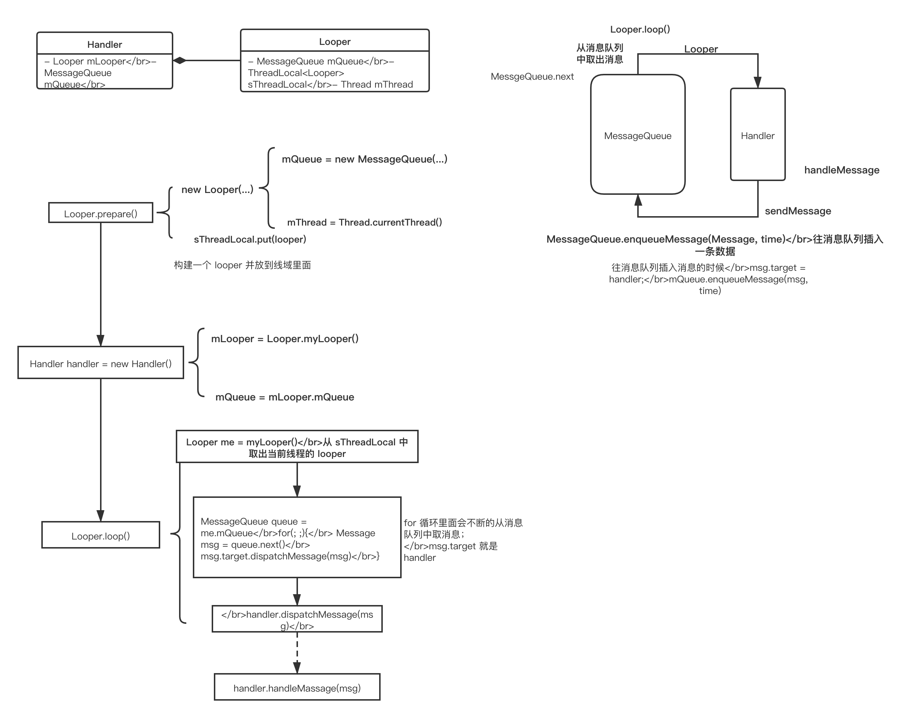
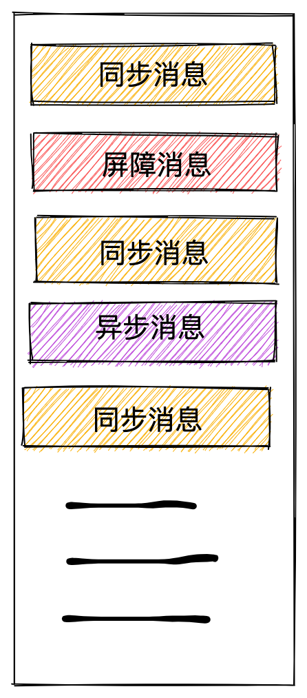
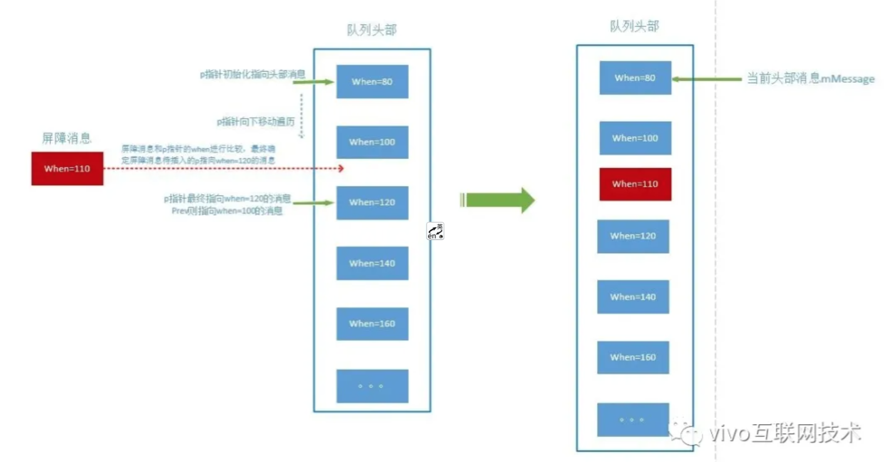

Android Handler

## 一、基本原理
Handler 机制的五个组成部分: Handler, ThreadLocal, Looper, MessageQueue, Message。

### 1. Handler

```java
public Handler() 

public Handler(@Nullable Callback callback) 

public Handler(@NonNull Looper looper)
 
public Handler(@NonNull Looper looper, @Nullable Callback callback) 

// 创建异步的消息的 Handler
public static Handler createAsync(@NonNull Looper looper) 

// 创建异步的消息的 Handler
public static Handler createAsync(@NonNull Looper looper, @NonNull Callback callback)
```
#### 1.1 创建 Handler 的方式

- **不传 Looper**
  需要在创建 Handler 之前，预先调用 Looper.prepare 来创建当前线程的默认 Looper, 否则会报错
  主线程不用调用 Looper.prepare， 是因为 ActivityThread的 main 方法里面准备了 Looper
  
  ```java
  // ActivityThread.java
    public static void main(String[] args) {
        
        ...
        
        Looper.prepareMainLooper();

        ActivityThread thread = new ActivityThread();
        thread.attach(false);

        if (sMainThreadHandler == null) {
            sMainThreadHandler = thread.getHandler();
        }

        ...
        
        Looper.loop();
    }
  
  ```
  
  - **传 Looper**
  
    传 Looper 就是让 Handler 和这个 Looper 进行绑定，也就是和这个 Looper 的线程绑定
    
    ```
  HandlerThread thread = new HandlerThread("MonitorThread");
    thread.start();
    handler = new Handler(thread.getLooper());
    ```
上面就是使用 `HandlerThread` 的 Looper
  
#### 1.2 Callback 参数
Callback 参数是消息被分发之后，在 Handler#dispatchMessage 是进行调用的

```java
// Handler.java
// 处理消息
 public void dispatchMessage(@NonNull Message msg) {
        if (msg.callback != null) { 
            handleCallback(msg);
        } else {
            if (mCallback != null) {
                if (mCallback.handleMessage(msg)) { // 这里
                    return;
                }
            }
            handleMessage(msg);
        }
    }
```

一般的使用例子：

```java
 private static class MainThreadCallback implements Handler.Callback {

        @Override
        public boolean handleMessage(Message message) {
                ...
                return true;
            }

            return false;
        }
    }

// 传入 Callback 参数
Handler MAIN_THREAD_HANDLER = new Handler(Looper.getMainLooper(), new MainThreadCallback());
```

#### 1.3 async 参数
Handler 创建的时候可以传入 async 参数，这个参数表明通过这个 Handler 发送的消息是否全部为异步消息，因为在消息压入队列的时候，会把这个标记位设置到 message 里面。正常情况下，我们一般使用的是非异步消息。当设置成异步消息时，需要配合屏障消息一起时候，关于屏障消息在后续会讲到。

```java
private boolean enqueueMessage(@NonNull MessageQueue queue, @NonNull Message msg,
        long uptimeMillis) {
    msg.target = this;
    msg.workSourceUid = ThreadLocalWorkSource.getUid();

    if (mAsynchronous) { 
        msg.setAsynchronous(true);
    }
    return queue.enqueueMessage(msg, uptimeMillis);
}
// mAsynchronous 在创建时设置值
public Handler(@Nullable Callback callback, boolean async) {
   ...
    mLooper = Looper.myLooper();
    if (mLooper == null) {
        throw new RuntimeException(
            "Can't create handler inside thread " + Thread.currentThread()
                    + " that has not called Looper.prepare()");
    }
    mQueue = mLooper.mQueue;
    mCallback = callback;
    mAsynchronous = async;
}
```

### 2. ThreadLocal
Handler 机制用到的是和 Thread 线程有关，其根本原因在于 Handler 必须和对应的 Looper 绑定，而 Looper 的创建和保存是跟 Thread 一一对应的，也就是每个线程都可以创建唯一一个且互不相关的 Looper ， 就是通过 ThreadLocal 来实现的，也就是用 ThreadLocal 对象来存储 Looper 对象，从而达到线程隔离的目的。

ThreadLocal 里面也是通过 ThreadLocalMap 来存储内容的

在 Looper.java 文件中

```java
static final ThreadLocal<Looper> sThreadLocal = new ThreadLocal<Looper>();
 
···
 
private static void prepare(boolean quitAllowed) {
    if (sThreadLocal.get() != null) {
        throw new RuntimeException("Only one Looper may be created per thread");
    }
    sThreadLocal.set(new Looper(quitAllowed));
}
```


### 3. Looper
Looper 是用于线程运行消息循环的类。子线程中是没有 Looper 的，需要自己准备一个 looper，再让它循环处理消息

```java
private static void prepare(boolean quitAllowed) {
    if (sThreadLocal.get() != null) {
        throw new RuntimeException("Only one Looper may be created per thread");
    }
    sThreadLocal.set(new Looper(quitAllowed));
}

public static void loop() {
    final Looper me = myLooper();
    if (me == null) {
        throw new RuntimeException("No Looper; Looper.prepare() wasn't called on this thread.");
    }
    final MessageQueue queue = me.mQueue;
    
    ...
    
      for (;;) {
        Message msg = queue.next(); // might block
        }
}
```

在子线程中使用

```java
class LooperThread extends Thread {
        public Handler mHandler;
  
       public void run() {
            Looper.prepare();
  
            mHandler = new Handler() {
                public void handleMessage(Message msg) {
                    // process incoming messages here
               }
            };
  
            Looper.loop();
        }
}
```

提供了获取 Looper 的方法

```java
// 获取主线程的 Looper
public static Looper getMainLooper() {
    synchronized (Looper.class) {
        return sMainLooper;
    }
}

// 获取当前线程的 Looper
public static @Nullable Looper myLooper() {
    return sThreadLocal.get();
}
```

### 4. MessageQueue 和 Message



MessageQueue 是一个消息队列， Handler 将 Message 发送到消息队列中，消息按照一定规则取出要执行 Message. Message 添加到队列时，是将 Handler 和 Looper 关联一起的。

```java
// sendMessage 和 post 方法最后都是到这里的
private boolean enqueueMessage(@NonNull MessageQueue queue, @NonNull Message msg,
        long uptimeMillis) {
    msg.target = this;  // this 是指 Handler
    msg.workSourceUid = ThreadLocalWorkSource.getUid();

    if (mAsynchronous) {
        msg.setAsynchronous(true);
    }
    return queue.enqueueMessage(msg, uptimeMillis); // 将消息发放入队列
}
```

MessageQueue 里的 message 是按时间排序的，越早加入队列的消息放到队列头部，优先执行。
存在 MessageQueue 里的消息可能有三种：同步消息、异步消息、屏障消息。



### 4.1 同步消息

我们默认使用的都是同步消息，在 Handler 的构造函数参数的 async 参数默认是 false。同步消息在 MessageQueue 里面的存取是按时间顺序 msg.when 来排序的

### 4.2 异步消息

异步消息是在创建 Handler 的构造函数参数的 async 参数为 true 或是设置 Message#setAsynchronous(true); 异步消息要和屏障消息一起搭配使用才有效，不然和同步消息一样处理。

```java
 private boolean enqueueMessage(@NonNull MessageQueue queue, @NonNull Message msg,
            long uptimeMillis) {
        msg.target = this;
        msg.workSourceUid = ThreadLocalWorkSource.getUid();

        if (mAsynchronous) {  // 创建 Handler 传入进来的 async
            msg.setAsynchronous(true);
        }
        return queue.enqueueMessage(msg, uptimeMillis);
    }
```

### 4.3 Barrier (屏障消息)

Barrier(屏障消息)是一种特殊的 Message, 它的 **target 为 null**, 只有屏障消息的 target 可以为 null, 如果是自己设置 Message 的 target 为 null 会报异常， 屏障消息的 arg1 属性被用来标识不同的屏障，后面就是根据这个标识（token）删除屏障消息。

**屏障消息的作用是拦截消息队列中的同步消息，放行异步消息**

- 添加屏障消息

```java
// MessageQueue.java
private int postSyncBarrier(long when) {
    // Enqueue a new sync barrier token.
    // We don't need to wake the queue because the purpose of a barrier is to stall it.
    synchronized (this) {
        final int token = mNextBarrierToken++;
        final Message msg = Message.obtain();
        msg.markInUse();
        msg.when = when;
        msg.arg1 = token;

        Message prev = null;
        Message p = mMessages;
        if (when != 0) {
           // 找到 when 大于 屏障消息的其他消息
            while (p != null && p.when <= when) {
                prev = p;
                p = p.next;
            }
        }
        // 找到这个消息，并把屏障消息插入
        if (prev != null) { // invariant: p == prev.next
            msg.next = p;
            prev.next = msg;
        } else {  // 如果  prev 为空，则说明是队列头部，直接放进去
            msg.next = p;
            mMessages = msg;
        }
        return token;
    }
}
```


- 删除屏障消息

```java
// MessageQueue.java
public void removeSyncBarrier(int token) {
    // Remove a sync barrier token from the queue.
    // If the queue is no longer stalled by a barrier then wake it.
    synchronized (this) {
        Message prev = null;
        Message p = mMessages;
        // 查找 p.target 为空或者 p.arga1 == token 的消息
        while (p != null && (p.target != null || p.arg1 != token)) {
            prev = p;
            p = p.next;
        }
        if (p == null) {
            throw new IllegalStateException("The specified message queue synchronization "
                    + " barrier token has not been posted or has already been removed.");
        }
        final boolean needWake;
        // 找到屏障消息后，把指针指向屏障消息的后一个消息，把屏障消息移除
        if (prev != null) {
            prev.next = p.next;
            needWake = false;
        } else {
            mMessages = p.next;
            needWake = mMessages == null || mMessages.target != null;
        }
        p.recycleUnchecked();

        // If the loop is quitting then it is already awake.
        // We can assume mPtr != 0 when mQuitting is false.
        if (needWake && !mQuitting) {
            nativeWake(mPtr);
        }
    }
}

```

### 4.4 屏障消息的作用

```java
Message prevMsg = null;
Message msg = mMessages;
// 当 msg.target == null，则说明当前是屏障消息。如果存在屏障消息。在它之后进来的消息中，只有异步消息 msg.isAsynchronous() 放行继续指向，同步消息阻塞，直到屏障消息被 remove 掉
if (msg != null && msg.target == null) {
    // Stalled by a barrier.  Find the next asynchronous message in the queue.
    do {
        prevMsg = msg;
        msg = msg.next;
        // 判断是否为异步消息，异步消息跳出循环，同步消息阻塞
    } while (msg != null && !msg.isAsynchronous());
}
```

### 4.5 屏障消息的实际应用

具体的应用可以看到 ViemRootImpl.scheduleTraversals 方法

```java
// ViemRootImpl.java
 void scheduleTraversals() {
        if (!mTraversalScheduled) {
            mTraversalScheduled = true;
            // 插入一个屏障消息
            mTraversalBarrier = mHandler.getLooper().getQueue().postSyncBarrier();
            // 将 mTraversalRunnable 任务包装成一个异步消息，放到消息队列里面。
            // mTraversalRunnable 最终会执行 doTraversal()， 会触发 View 的绘制流程。
            // 屏障消息的作用就是把主线程的同步消息先阻塞，优先把 View 绘制这个异步消息先执行
            mChoreographer.postCallback(
                    Choreographer.CALLBACK_TRAVERSAL, mTraversalRunnable, null);
            if (!mUnbufferedInputDispatch) {
                scheduleConsumeBatchedInput();
            }
            notifyRendererOfFramePending();
            pokeDrawLockIfNeeded();
        }
    }
    
final class TraversalRunnable implements Runnable {
        @Override
        public void run() {
            doTraversal();
        }
    }
final TraversalRunnable mTraversalRunnable = new TraversalRunnable();


// Choreographer.java
private void postCallbackDelayedInternal(int callbackType,
        Object action, Object token, long delayMillis) {
    ...
    
    synchronized (mLock) {
        final long now = SystemClock.uptimeMillis();
        final long dueTime = now + delayMillis;
        mCallbackQueues[callbackType].addCallbackLocked(dueTime, action, token);

        if (dueTime <= now) {
            scheduleFrameLocked(now);
        } else {
            Message msg = mHandler.obtainMessage(MSG_DO_SCHEDULE_CALLBACK, action);
            msg.arg1 = callbackType;
            msg.setAsynchronous(true); // 设置为异步消息
            mHandler.sendMessageAtTime(msg, dueTime);
        }
    }
}

```

在 doTraversal 之后移除屏障消息

```java
 void doTraversal() {
        if (mTraversalScheduled) {
            mTraversalScheduled = false;
            // 移除屏障消息
            mHandler.getLooper().getQueue().removeSyncBarrier(mTraversalBarrier);
            
            performTraversals();

           ...
        }
    }
```

### 4.6 IdleHandler 及其应用
IdleHandler ，只有在消息队列空闲的时候才会执行，如果消息队列有其他非 IdleHandler 消息在执行，它是不会执行的。并且，它不存在消息队列里面，而是以数组的形式保存。

```java
// MessageQueue.java
public static interface IdleHandler {
    /**
     * Called when the message queue has run out of messages and will now
     * wait for more.  Return true to keep your idle handler active, false
     * to have it removed.  This may be called if there are still messages
     * pending in the queue, but they are all scheduled to be dispatched
     * after the current time.
     */
    boolean queueIdle();
}

// 存储
private final ArrayList<IdleHandler> mIdleHandlers = new ArrayList<IdleHandler>();
```

添加或者删除 IdleHandler

```java
// MessageQueue.java
// 添加
public void addIdleHandler(@NonNull IdleHandler handler) {
    if (handler == null) {
        throw new NullPointerException("Can't add a null IdleHandler");
    }
    synchronized (this) {
        mIdleHandlers.add(handler);
    }
}

// 移除
public void removeIdleHandler(@NonNull IdleHandler handler) {
    synchronized (this) {
        mIdleHandlers.remove(handler);
    }
}
```

执行 IdleHandler

```java
// MessageQueue.java
 Message next(){
    
    ...
    
     int pendingIdleHandlerCount = -1; // -1 only during first iteration
     for (;;) {
     
        ...
        // 如果有其他消息，会执行 break 出 for 循环
        // 没有其他消息的时候才会往下走，执行 IdleHandler 
        
        
       // If first time idle, then get the number of idlers to run.
            // Idle handles only run if the queue is empty or if the first message
            // in the queue (possibly a barrier) is due to be handled in the future.
            //  pendingIdleHandlerCount < 0 
            if (pendingIdleHandlerCount < 0
                    && (mMessages == null || now < mMessages.when)) {
                pendingIdleHandlerCount = mIdleHandlers.size();
            }
            if (pendingIdleHandlerCount <= 0) {
                // No idle handlers to run.  Loop and wait some more.
                mBlocked = true;
                continue;
            }
    
            if (mPendingIdleHandlers == null) {
                mPendingIdleHandlers = new IdleHandler[Math.max(pendingIdleHandlerCount, 4)];
            }
            mPendingIdleHandlers = mIdleHandlers.toArray(mPendingIdleHandlers);
        }
    
        // Run the idle handlers.
        // We only ever reach this code block during the first iteration.
        for (int i = 0; i < pendingIdleHandlerCount; i++) {
            final IdleHandler idler = mPendingIdleHandlers[i];
            mPendingIdleHandlers[i] = null; // release the reference to the handler
    
            boolean keep = false;
            try {
                keep = idler.queueIdle();
            } catch (Throwable t) {
                Log.wtf(TAG, "IdleHandler threw exception", t);
            }
    
            if (!keep) {
                synchronized (this) {
                    mIdleHandlers.remove(idler);
                }
            }
        }
    
        // Reset the idle handler count to 0 so we do not run them again.
        pendingIdleHandlerCount = 0;
    
     }
 }
```


## 二、Hander 应用 HanderThread

## 三、Hander 应用 IntentService

## 四、Handler.post 和 View.post


## 五、参考
- [源码深度解析 Handler 机制及应用](https://www.cnblogs.com/vivotech/p/14072029.html)

