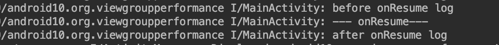
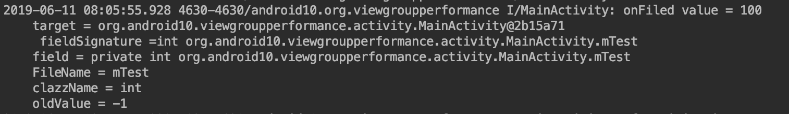
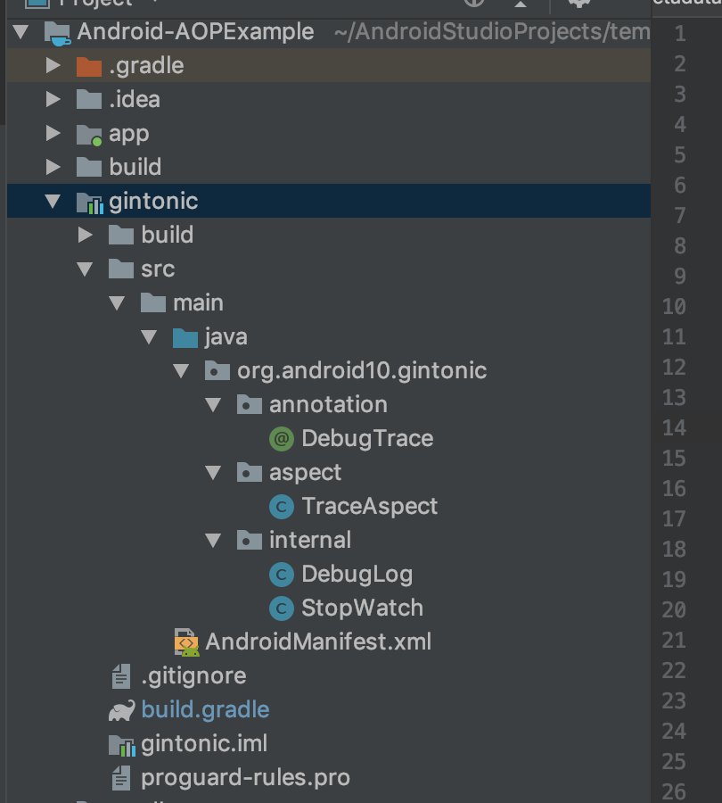
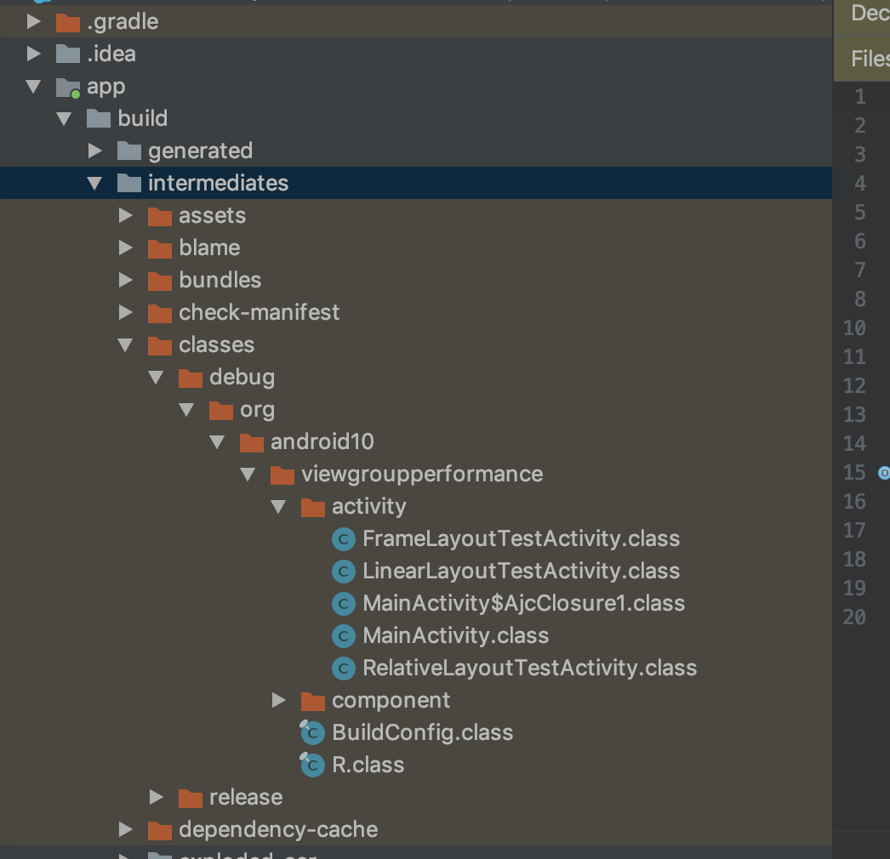
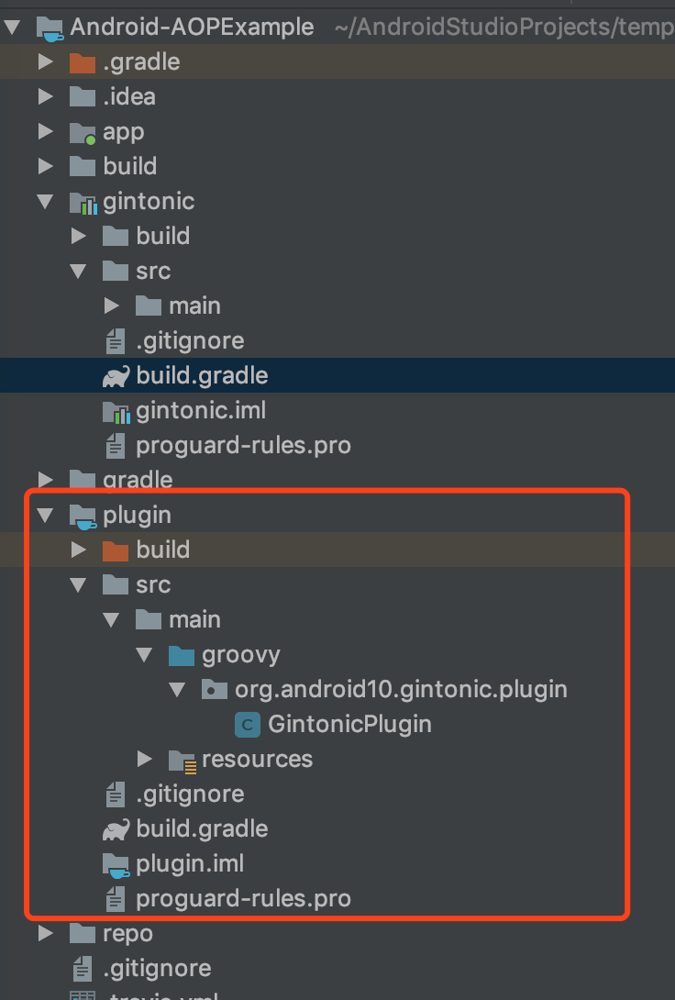

#AspectJ 在 Android 中的使用
在介绍 AspectJ 之前，我们先看看常见的几种编程架构思想。

- 面向对象编程 Object Oriented Programming
- 面向过程编程 Procedure Oriented Programming
- 面向切面编程 Aspect Oriented Programming

面向对象、面向过程、面向切面， 这三种是我们常见的三种编程架构思想，在日常的编程中， OOP 是 Android 开发中最常见的，其他的两种比较少见。

### 一、AOP
AOP 是面向切面编程，它在我们的日志系统、权限管理方面有着比较好的应用。
在项目中，我们的很多功能都是分散到各个模块，例如日志打印，AOP 的目标就是要把这些功能集中起来，放到一个统一的地方来控制和管理。

### 二、AspectJ 
AOP 是一种编程的思想，在具体的编程中需要实际的工具去实现这套思想。 AspectJ 就是这样的一个工具。使用 AspectJ 有两种方式

- 1. 完全使用 AspectJ 的语言开发；
- 2. 使用 AspectJ 注解，完全的使用纯 Java 开发

我们后续讲的，基本上都是以 AspectJ 注解的方法，同时在最后也会附上 AspectJ 和 AspectJ 注解的等价。

#### 1.AspectJ 语法
这里只是介绍简单的一些概念，如果想要去了解深入的用法，可参考文后的链接，去官网查看。

##### 1. JoinPoint
JoinPoint: A particular point in a program that might be the target of code injection.
JoinPoint 简单一点说就是程序运行时要执行一些动作的点。

 AspectJ 中可以选择的 JoinPoint
 
| JoinPoint |  说明 | 示例
| --- | --- | --- |
|method call| 函数调用 | 例如调用 Log.e( ) |
|method execution|函数执行|例如 Log.e( ) 的执行内部。<br> method call 是调用某个函数的地方<br> execution 是某个函数执行的内部|
|constructor call| 构造函数调用| 和 method call 类似|
|constructor execution|构造函数执行| 和 method execution 类似|
|field get| 获取某个变量| 例如读取 MainActivity.mTest 成员|
|field set| 设置某个变量| 例如设置 MainActivity.mTest 成员|
|pre-initialization|Object 在构造函数中做的一些工作||
|initialization| Object 在构造函数中做的工作||
|static initialization|类初始化| 例如类的 static{}|
|handler| 异常处理| 例如 try catch(xxx) 中，对应 catch 内的执行|
|advice execution| AspectJ 的内容||

JoinPoint 的选择要结合下面的 Pointcuts 表达式来看


##### 2. Pointcut
Pointcut: An expression which tell a code injection tool where to inject a particular piece of code
Pointcut 简单的说就是从一堆的 JoinPoint 中挑选感兴趣的 JoinPoint 的表达式。

例如
> 	pointcut anyCall(): call(* *.println(..)) && !within(TestAspect);

在 AspectJ 的语言中定义一个 Pointcout 需要用关键词 *pointcut* .
上面的这里是

- pointcut: 是定一个 Pointcut 的关键词
- anyCall(): 是 Pointcut 的名称
- call : 表示 JoinPoint 的类型为 call
- 第一个 '\*' 号是返回值， ‘\*’ 代表是任意返回值； 第二个 ‘\*’ 号代表是包名，‘\*’ 代表是任意包名,这边表明我们是选择任意包名下的 println 函数；在 （..） 中指定参数类型，‘..’ 通配符表示任意类型；
- &&！ 表示组合条件，有 &&， || 以及 ！
- within(TestAspect): within 是 JoinPoint 间接选择过滤的一个方法，后面会讲到。 ！within(TestAspect) 表示调用者的类型不是 TestAspect.

##### 3. JointPoint 的选择
JointPoint 的选择有分成直接选择和间接选择两种方式

- JointPoint 的直接选择就是通过和 Pointcut 的语法一一对应关系中选择；
- JointPoint 的间接选择就是通过一些通配符进行筛选过滤的选择，上面例子中的 within 就是间接选择的一种。

###### 1.JointPoint 直接选择
JoinPoint 的选择策略和 Pointcut 的语法对应关系

|JoinPoint Category  |  Pointcut Syntax |  
| --- | --- | 
|Method execution| execution(MethodSignature)  | 
|Method call     | call(MethodSignature)|
|Constructor execution|execution(ConstructorSignature)|
|Constructor call| call(ConstructorSignature)|
|Class initialization|staticinitialization(TypeSignature)|
|Field read access| get(FieldSignature)|
|Field write access| set(FieldSignature) |
|Exception handler execution|handler(TypeSignature)|
|Object initialization| initialization(ConstructorSignature)|
|Object pre-initialization|preinitialization(ConstructorSignature)|
|Advice execution|adviceexecution()|

JoinPoint 的策略的选择对应着不同 Pointcut，特别是 Pointcut 里面有着不同的 Signature。

以下有详细的说明：

**Method Signature 表达式**
语法
>@注解 访问权限 返回值的类型 包名.函数名(参数)
例子：
@before("execution(* android.app.Activity.on**(..))");

- 注解：  是可选项; 这里是 @before,关于注解的在后面 Adivce 中有更详细的说明
- 访问权限: 可选项; 有 public, private, protected 类型；例子没有设置
- 返回值的类型: 与普通函数的返回值类型是一样的，如果不限定类型，用通配符 * 表示。例子中是 *
- 包名.函数名：用于查找匹配的函数，可以使用通配符
    <br> 通配符的类型
    - ' * '表示用于匹配处 . 号之外的任意字符；
    -	' .. ' 表示任意子 package
    - ' + '号表示子类
    
    <br> 例子：
    
     - java.*.Data: 可以表示 java.sql.Data ，也可以表示 java.util.Date;
     - Test* : 表示Test开头的函数，可以表示 TestBase, 也可以表示 TestDervied
     - java..* : 表示 java 任意子类
     - java..*Model+: 表示 Java 任意 package 中名字以 Model 结尾的子类，比如 TabelModel, TreeModel 等
     
- 函数参数
  参数有不同的型式
  - (int, char): 表示参数只有两个， 并且第一个参数是 int, 第二个参数是 char;
  - (String, ..): 表示参数至少有一个。并且第一个参数是 String, 后面参数类型不限。在参数匹配中， .. 代表任意参数个数和类型；
  - （Oject ...）: 表示不定个数的参数，并且类型都是 Object, 这里的 ... 不是通配符，而是 java 中不定参数的意思；
  
**Constructor Signature 表达式**
和 Method Signature 类似
	    	不同点：
	    		构造函数没有返回值，并且函数名必须叫 new
例子：
>public *..TestDeived.new(..)
>
- public: 表示选择 public 访问权限的
- *.. : 代表任意包名
- TestDeived.new: 代表 TestDerived 的构造函数
- (..): 代表参数个数和类型都是任意的 

**Field Signature表达式**
语法
> @注解 访问权限 类型 类名.成员变量名

- @注解和访问权限是可选的
- 类型：成员变量类型， * 表示任意类型
- 类名.成员变量名： 成员变量名可以是*， 代表任意成员变量

例子, 用 AspectJ 打印成员变量赋值前后的值

```Java
// TraceAspect.java　set field 的切面
private static final String POINTCUT_FILEED =
        "set(int org.android10.viewgroupperformance.activity.MainActivity.mTest) && args(newValue) && target(t)";

@Before(POINTCUT_FILEED)
public void onFiled(JoinPoint joinPoint, Object newValue, Object t) throws IllegalAccessException {
    Object object = joinPoint.getThis();

    FieldSignature fieldSignature = (FieldSignature) joinPoint.getSignature();
    String fileName = fieldSignature.getName();
    Field field = fieldSignature.getField();
    field.setAccessible(true);
    Class clazz = fieldSignature.getFieldType();
    String clazzName = clazz.getSimpleName();

    Object oldValue = field.get(t);

    Log.i("MainActivity", "\nonFiled value = " + newValue.toString() + "\n fieldSignature =" + fieldSignature.toString()
                + "\nfield = " + field.toString() + " +  \nFileName = " + fileName
                + "\nclazzName = " + clazzName + " \noldValue = " + oldValue.toString() );
}

// 在 MainActivity.java 中
@Override
protected void onResume() {
        super.onResume();
        mTest = 100;
}
```
打印结果
> onFiled value = 100
     fieldSignature =int org.android10.viewgroupperformance.activity.MainActivity.mTest
    field = private int org.android10.viewgroupperformance.activity.MainActivity.mTest +  
    FileName = mTest
    clazzName = int 
    oldValue = -1

**TypeSignature表达式**
	例子：
	staticinitlization(test..TestBase): 表示 TestBase 类的 static block
handler(NullPointException): 表示 catch 到 NullPointerException 的 JPoin

###### 2.JointPoint 间接选择
JointPoint 的直接选择是通过 Signature 信息匹配的，除此之外还有其他的方式，这些方式都可以归类到间接选择


| 关键词 | 说明 | 实例 |
| --- | --- | --- | 
| within(TypePattern) | TypePattern 表示 package 或者类<br> TypePattern 可以使用通配符| 表示某个 Package 或者类中的 Point<br>within(Test): Test　类中（包括内部类）所有的 JointPoint |
|withcode(Constructor Signature\|Method Signature)| 表示某个构造函数或其他函数执行过程涉及到的 JointPoint | withinCode(* Test.testMethod(..))<br>表示 testMethod 涉及的 JointPoint<br>withinCode(*.Test.new(..))<br>表示 Test 的构造函数涉及的 JointPoint|
|cflow(pointcuts)|cflow 表示 call flow<br>cflow 的条件是一个 pointcut|cflow(call Test.testMethod)<br>表示调用 Test.testMethod 函数是所包含的 JointPoint,包含 testMethod 的 call 这个 JointPoint 本身|
|cflowbelow(pointcuts)|cflowbelow 表示不包含自身的 cflow|cflowbelow(call Test.testMethod)<br>表示调用 Test.testMethod 函数是所包含的 JointPoint, ***不包含*** testMethod 的 call 这个 JointPoint 本身 |
|this(Type)|JointPoint 的 this 对象是 Type 类型|JPoint是代码段（不论是函数，异常处理，static block），从语法上说，它都属于一个类。如果这个类的类型是Type标示的类型，则和它相关的JPoint将全部被选中。|
|target(Type)|JoinPoint 的 target 对象是 Type 类型|和this相对的是target。不过target一般用在call的情况。call一个函数，这个函数可能定义在其他类。比如testMethod是TestDerived类定义的。那么target(TestDerived)就会搜索到调用testMethod的地方。但是不包括testMethod的execution JointPoint|
|args(TypeSignature)| 用来对 JointPoint 的参数进行条件搜索|例如 arg(int, ..)<br>表示第一个参数是 int, 后面参数个数和类型不限的 JointPoint|

###### 3.call 与 execution 区别
当 call 捕获 joinPoint 时，捕获的签名方法的**调用点**;execution 捕获 joinPoint 时，捕获的则是**执行点**。
两个的区别在于一个是 ”调用点“， 一个是 ”执行点“

对于 call 来讲

```java
call(Before)
Pointcut {
    Pointcut Method
}
call(After)
```
对于 execution 来说

```java
Pointcut {
   Execution(Before)
   Pointcut Method
   Execution(After)
}
```

###### 3.AspectJ 注解的等价
AspectJ 提供了相应的注解，注解的方式和 AspectJ 语言编写是等效的。我们在 Android 中一般也是采用注解的方式

**Aspect**
> 	public aspect Foo{}
等效 
@Aspect
public class Foo{}

**call**
>@Pointcut("call(* *.*(..))")
	void anyCall(){}
	等效
	pointcut anyCall(): call(* *.*(..))
	
要绑定参数的时候，只需要将参数作为备注解的方法的参数即可
>@Pointcut("call(* *.*(int)) && arg(i) && target(callee)")
	void anyCall(int i, Fool callee){}
	等效
	pointcut anyCall(int i, Foo callee): call(* *.*(int)) && arg(i) && target(callee){};
说明要先定义参数 int i, Foo callee

**before**
>@Before("call(* org.android10.viewgroupperformance.activity..*(..)) && this(foo)")
public void callFromFoo(Foo foo){}
等效 
before(Foo foo): call(* org.android10.viewgroupperformance.activity..*(..)) && this(foo){}

**returning**
>@AfterReturning(pointcut="call(Foo+.new(..))", returning="f")
public void itsAFoo(foo f){}
等效
after returning(Foo f): call(Foo+.new(..)){}

其他的表达式也是类似的
##### 4. Advice
Advice: Advice defines pieces of aspect implementation that execute at well-defined points in the execution of the program.

通过前面的 Pointcuts 找到了相应的 JointPoint, 需要对这些 JointPoint 最一些事情，相当于对 JointPoint 进行 hook, 这就是 advice 要做的事。

advice 的分类

| 关键词 | 说明  | 示例 |
| --- | --- | --- |
| before() | before advice | 表示在 JointPoint 执行之前要干 的事 |
|after() | after advice | 表示在 JointPoint 执行之后要干的事|
|after(): returning(返回值类型)<br>after():throwing(异常类型)|returning 和 throwing 后面都可以指定具体的类型，如果不指定则匹配类型不限制|假设 JointPoint 是一个函数调用<br>那么函数调用执行完有两种方式退出<br>一个是正常的 return, 另一个是抛异常<br>after() 默认包括 returing 和 throwing 两种情况|
|返回值类型<br> around()|around 替代原来的 JointPoint| around 替代了原来的 JointPoint，如果要执行原 JointPoint 的话，需要调用 procced|

例子：
我们需要在 Activity 中的 onResume 方法调用前后输出

```java
// MainActivity.java
@Override
protected void onResume() {
    super.onResume();
    Log.i(TAG, "--- onResume---");
}

// TraceAspect.java
private static final String POINTCUT_ONMETHOD =
        "execution(* android.app.Activity.on**(..))";

@Before(POINTCUT_ONMETHOD)
public void beforeOnMethod(JoinPoint joinPoint) {
    MethodSignature methodSignature = (MethodSignature) joinPoint.getSignature();
    String className = methodSignature.getDeclaringType().getSimpleName();
    String methodName = methodSignature.getName();
    Log.i(className, "before " + methodName + " log");

}

@After(POINTCUT_ONMETHOD)
public void onMethLog(JoinPoint joinPoint){
    MethodSignature methodSignature = (MethodSignature) joinPoint.getSignature();
    String className = methodSignature.getDeclaringType().getSimpleName();
    String methodName = methodSignature.getName();
    Log.i(className, "after " + methodName + " log");
}
```
查看输出



改成 Around 的方式

```java
// TraceAspect.java
private static final String POINTCUT_ONMETHOD =
        "execution(* android.app.Activity.on**(..))";
@Pointcut(POINTCUT_ONMETHOD)
public void annotationOnMethodTrace(){

}

@Around("annotationOnMethodTrace()")
public Object weaveOnMethodJoinPoint(ProceedingJoinPoint joinPoint) throws Throwable {

  MethodSignature methodSignature = (MethodSignature) joinPoint.getSignature();
  String className = methodSignature.getDeclaringType().getSimpleName();
  String methodName = methodSignature.getName();

  Log.i("MainActivity", "before joinPoint proceed className = " + className + " methodName = " + methodName);

  Object result  = joinPoint.proceed();
  Log.i("MainActivity", "after joinPoint proceed className = " + className + " methodName = " + methodName);

  return result;
}
```
输出


从上面例子的输出我们可以看到 around 等价于 before + after, 另外 JointPoint#proceed 是原来的 JointPoint，在这里是 onResume 方法， 输出中的 *“--- onResume---”* 就是在 onResume 中打印的。

##### 5. 参数传递和 JointPoint 信息
经过前面的几个步骤，我们已经拿到了 JointPoint,但是我们经常需要对一些 advice 传入参数，然后进行处理的。例如如果传入的参数不合法，就不用调 JointPoint#proceed 方法处理了。

**参数传递**

advice 参数的方法由  ***this, target(), args()***

- **this(Type or Id):** 捕获当前对象（被绑定 this）实例执行的连接点 -- 实例由 Type 或者 Id 描述
- **target(Type or Id):** 捕获目标对象（被应用与对象上的调用和属性操作）实例的连接点 -- 实例由 Type 和 Id 描述（必须绑定和封装后放入通知或者切点定义）。它不匹配任何静态的调用、应用和设置成员。
- **args(Type or Id):**  捕获具有适当类型样式的实例连接点

下面是例子说明
我们在 MainActivity 定义一个成员变量 mTest, 初始值为 -1，在 OnResume() 方法对它进行赋值，用 target 和 args 对 mTest 赋值前后的值进行监听

```java
// MainActivity.java
private int mTest = -1;
@Override
protected void onResume() {
    super.onResume();
    Log.i(TAG, "--- onResume---");
    mTest = 100;
}

// TraceAspect.java
//　set field 的切面
private static final String POINTCUT_FILEED =
        "set(int org.android10.viewgroupperformance.activity.MainActivity.mTest) && args(newValue) && target(t)";

@Before(POINTCUT_FILEED)
public void onFiled(JoinPoint joinPoint, Object newValue, Object t) throws IllegalAccessException {

    FieldSignature fieldSignature = (FieldSignature) joinPoint.getSignature();
    String fileName = fieldSignature.getName();
    Field field = fieldSignature.getField();
    field.setAccessible(true);
    Class clazz = fieldSignature.getFieldType();
    String clazzName = clazz.getSimpleName();

    Object oldValue = field.get(t);

    Log.i("MainActivity",
               "\nonFiled value = " + newValue.toString()
                    + "\ntarget = " + t.toString()
                    + "\n fieldSignature =" + fieldSignature.toString()
                    + "\nfield = " + field.toString()
                    + "\nFileName = " + fileName
                    + "\nclazzName = " + clazzName
                    + " \noldValue = " + oldValue.toString() );
}
```
我们看看输出



定义切面表达式使用 *args(newValue) && target(t)* 它们的参数值 *newValue, t*,必须要和方法中的定义的对的上 
> public void onFiled(JoinPoint joinPoint, Object newValue, Object t)

**JointPoint 信息**
在 advice 中我们可以拿到 JointPoint 的信息，一般包含

- JointPoint 对象信息：例如参数、前面之类的
    
 > JoinPoint.getSignature() 包含有
 > 1. MethodSignature 方法的签名
 > 2. FieldSignature 成员变量的签名
 > 3. ConstructorSignature 构造函数的签名
 > 4. InitializerSignature 初始化的签名

不同的签名对应不同的场景

- JointPoint 源代码部分的信息，例如类型、所处的位置
- JointPoint 静态部分信息

例子：

```java
@Around("methodAnnotatedWithDebugTrace() || constructorAnnotatedDebugTrace()")
public Object weaveJoinPoint(ProceedingJoinPoint joinPoint) throws Throwable {
    // joint 对象信息
    MethodSignature methodSignature = (MethodSignature) joinPoint.getSignature();
    String className = methodSignature.getDeclaringType().getSimpleName();
    String methodName = methodSignature.getName();
    
    // 源代码部分信息
    SourceLocation sourceLocation = joinPoint.getSourceLocation();
    String fileName = sourceLocation.getFileName();
    int line = sourceLocation.getLine();
    String soucreClassName = sourceLocation.getWithinType().getName();
    DebugLog.log(className, "\nfileName = " + fileName + "\nline = " + line + "\nsoucreClassName = " + soucreClassName);
        
    // 静态部分
    JoinPoint.StaticPart staticPart = joinPoint.getStaticPart();
        
return result;
}
```

更详细的信息参考文档
https://www.eclipse.org/aspectj/doc/released/runtime-api/index.html

总结一下，使用 AspectJ 的步骤：
> 1. 设置 Pointcut 的表达式
> 2. 选择相应的 advice
> 3. 对 JointPoint 或参数进行相应的处理

### 三、AspectJ 集成在 Android studio 中
前面已经介绍完了 AspectJ, 那接下来看看在 Android 中的实际使用；
实例代码是在这个例子上进行修改的[Android-AOPExample](https://github.com/android10/Android-AOPExample)。

#### 1. Library 库依赖方式使用
项目的结构如下



在 library 项目 gintoinc 的 build.gradle 文件要添加 aspectj 的依赖

```grovy
buildscript {
  repositories {
    mavenCentral()
  }
  dependencies {
    classpath 'com.android.tools.build:gradle:2.1.0'
    classpath 'org.aspectj:aspectjtools:1.8.1'  // aspectjtools
  }
}

apply plugin: 'com.android.library'

repositories {
  mavenCentral()
}

dependencies {
  compile 'org.aspectj:aspectjrt:1.8.1'  // aspectjrt
}

android {
  compileSdkVersion 21
  buildToolsVersion '21.1.2'

  lintOptions {
    abortOnError false
  }
}

// -showWeaveInfo，输出编织过程信息
// -1.5 设置规范1.5，匹配java1.5
// -inpath class文件目录或者jar包， 源字节码，需要处理的类
// -aspectpath  定义的切面类
// -d 存放编辑产生的class文件
// -classpath ，所有class文件，源class，java包，编织时需要用到的一些处理类
android.libraryVariants.all { variant ->
  LibraryPlugin plugin = project.plugins.getPlugin(LibraryPlugin)
  JavaCompile javaCompile = variant.javaCompile
  javaCompile.doLast {
    String[] args = ["-showWeaveInfo",
                     "-1.5",
                     "-inpath", javaCompile.destinationDir.toString(),
                     "-aspectpath", javaCompile.classpath.asPath,
                     "-d", javaCompile.destinationDir.toString(),
                     "-classpath", javaCompile.classpath.asPath,
                     "-bootclasspath", plugin.project.android.bootClasspath.join(File.pathSeparator)]

    MessageHandler handler = new MessageHandler(true);
    new Main().run(args, handler)

    def log = project.logger
    for (IMessage message : handler.getMessages(null, true)) {
      switch (message.getKind()) {
        case IMessage.ABORT:
        case IMessage.ERROR:
        case IMessage.FAIL:
          log.error message.message, message.thrown
          break;
        case IMessage.WARNING:
        case IMessage.INFO:
          log.info message.message, message.thrown
          break;
        case IMessage.DEBUG:
          log.debug message.message, message.thrown
          break;
      }
    }
  }
}
```

在引用库工程的工程 build.gradle 也要进行相应的配置

```grovy
import org.aspectj.bridge.IMessage
import org.aspectj.bridge.MessageHandler
import org.aspectj.tools.ajc.Main

buildscript {
  repositories {
    mavenCentral()
  }
  dependencies {
    classpath 'org.aspectj:aspectjtools:1.8.1'
  }
}

apply plugin: 'com.android.application'

repositories {
  mavenCentral()
}

dependencies {
  compile project(':gintonic')
  compile 'org.aspectj:aspectjrt:1.8.1'
}

android {
  compileSdkVersion 21
  buildToolsVersion '21.1.2'

  defaultConfig {
    applicationId 'android10.org.viewgroupperformance'
    minSdkVersion 15
    targetSdkVersion 21
  }

  lintOptions {
    abortOnError true
  }
}

final def log = project.logger
final def variants = project.android.applicationVariants

variants.all { variant ->
  if (!variant.buildType.isDebuggable()) {
    log.debug("Skipping non-debuggable build type '${variant.buildType.name}'.")
    return;
  }

  JavaCompile javaCompile = variant.javaCompile
  javaCompile.doLast {
    String[] args = ["-showWeaveInfo",
                     "-1.5",
                     "-inpath", javaCompile.destinationDir.toString(),
                     "-aspectpath", javaCompile.classpath.asPath,
                     "-d", javaCompile.destinationDir.toString(),
                     "-classpath", javaCompile.classpath.asPath,
                     "-bootclasspath", project.android.bootClasspath.join(File.pathSeparator)]
    log.debug "ajc args: " + Arrays.toString(args)

    MessageHandler handler = new MessageHandler(true);
    new Main().run(args, handler);
    for (IMessage message : handler.getMessages(null, true)) {
      switch (message.getKind()) {
        case IMessage.ABORT:
        case IMessage.ERROR:
        case IMessage.FAIL:
          log.error message.message, message.thrown
          break;
        case IMessage.WARNING:
          log.warn message.message, message.thrown
          break;
        case IMessage.INFO:
          log.info message.message, message.thrown
          break;
        case IMessage.DEBUG:
          log.debug message.message, message.thrown
          break;
      }
    }
  }
}
```

文章[Aspect Oriented Programming in Android](https://fernandocejas.com/2014/08/03/aspect-oriented-programming-in-android/) 是通过注解去查看方法执行的时间，我们在这个基础上进行修改，去监听一个成员变量赋值变化的监听。

我们需要监听 *MainActivity* 中 *mTest*

```java
private int mTest = -1;
@Override
protected void onResume() {
    super.onResume();
    Log.i(TAG, "--- onResume---");
    mTest = 100;
}
```

**第一步. 设置 Pointcut 的表达式**
在 *TraceAspect.java*中

```java
 //　set field 的切面
    private static final String POINTCUT_FILEED =
            "set(int org.android10.viewgroupperformance.activity.MainActivity.mTest) && args(newValue) && target(t)";
            
```
根据 JoinPoint 的选择策略和 Pointcut 的语法对应关系，成员变量选择的 *set*, 参数传递的监听使用 *args(newValue) && target(t)*

**第二步. 选择相应的 advice**

```java
@Before(POINTCUT_FILEED)
public void onFiled(JoinPoint joinPoint, Object newValue, Object t) throws IllegalAccessException {
    
    ...
    
}
```
这里我们选择的是 *Before*, 注意在第一步  args(newValue) && target(t) 中的 *newValue 和 t* 是要在 advice 函数中定义的 *Object newValue, Object t*.

**第三步. 对 JointPoint 或参数进行相应的处理**

```java
@Before(POINTCUT_FILEED)
public void onFiled(JoinPoint joinPoint, Object newValue, Object t) throws IllegalAccessException {

    FieldSignature fieldSignature = (FieldSignature) joinPoint.getSignature();
    String fileName = fieldSignature.getName();
    Field field = fieldSignature.getField();
    field.setAccessible(true);
    Class clazz = fieldSignature.getFieldType();
    String clazzName = clazz.getSimpleName();

    // 获取旧的值
    Object oldValue = field.get(t);

    Log.i("MainActivity",
               "\nonFiled value = " + newValue.toString()
                    + "\ntarget = " + t.toString()
                    + "\n fieldSignature =" + fieldSignature.toString()
                    + "\nfield = " + field.toString()
                    + "\nFileName = " + fileName
                    + "\nclazzName = " + clazzName
                    + " \noldValue = " + oldValue.toString() );
    
}
```
通过 JoinPoint 获取相应的信息。

在 build 之后，在 app/intermediates/classes/debug 目录下的 



MainActivity.class 文件中

```java
protected void onResume() {
    super.onResume();
    Log.i("MainActivity", "--- onResume---");
    byte var1 = 100;
    JoinPoint var3 = Factory.makeJP(ajc$tjp_2, this, this, Conversions.intObject(var1));
    TraceAspect.aspectOf().onFiled(var3, Conversions.intObject(var1), this);
    this.mTest = var1;
}
```
我们发现上面生成了一下代码，这些生成的代码就是 AspectJ 根据我们前面设置的 Pointcut 和 adive 生成的。

输出
在 build 之后，在 app/intermediates/classes/debug 目录下的 


#### 2. Plugin 插件方式使用
如果是多个 Module 都依赖 AspectJ, 可以写成 plugin 插件的型式


关于如果使用 Android studio 的 Plugin 插件，可以去查看相关资料

项目的 build.gradle

```grovy
buildscript {
    repositories {
        mavenCentral()
        // 本地仓库
        maven {
            url uri('repo')
        }
    }
    dependencies {
        classpath 'com.android.tools.build:gradle:2.1.0'
        // 引入插件
        classpath 'com.yxhuang:autotrack.android:1.0.1'
    }
}

allprojects {
  repositories {
    mavenCentral()
      maven {
          url 'https://maven.google.com/'
          name 'Google'
      }
  }
}

//task wrapper(type: Wrapper) {
//  gradleVersion = '2.12'
//}
task clean(type: Delete) {
    delete rootProject.buildDir
}
```

gintonic 的 build.gradle 文件

```grovy
buildscript {
  repositories {
    mavenCentral()
    //　本地代码仓
    maven{
      url uri('../repo')
    }
  }
  dependencies {
    classpath 'com.android.tools.build:gradle:2.1.0'
    classpath 'com.yxhuang:autotrack.android:1.0.1' // 引用插件
  }
}

apply plugin: 'com.android.library'
apply plugin: 'com.yxhuang.android' // 引用插件

repositories {
  mavenCentral()
}

dependencies {
}

android {
  compileSdkVersion 21
  buildToolsVersion '21.1.2'

  lintOptions {
    abortOnError false
  }
}
```
app module 的 build.gradle 文件

```grovy
apply plugin: 'com.android.application'
apply plugin: 'com.yxhuang.android'  //引入插件

buildscript {
  repositories {
    mavenCentral()

    //　本地代码仓
    maven{
      url uri('../repo')
    }
  }
  dependencies {
    classpath 'com.yxhuang:autotrack.android:1.0.1' //引入插件
  }
}

repositories {
  mavenCentral()
}

dependencies {
  compile project(':gintonic')
}

android {
  compileSdkVersion 21
  buildToolsVersion '21.1.2'

  defaultConfig {
    applicationId 'android10.org.viewgroupperformance'
    minSdkVersion 15
    targetSdkVersion 21
  }

  lintOptions {
    abortOnError true
  }
}
```
具体的代码可以去 github [AndroidAopDemo](https://github.com/yxhuangCH/AndroidAopDemo) 选择 tag v2 即可。

### 四、参考
- 1. [深入理解Android之AOP](https://blog.csdn.net/innost/article/details/49387395)
- 2. [Aspect Oriented Programming in Android](https://fernandocejas.com/2014/08/03/aspect-oriented-programming-in-android/)
- 3.《Android 全埋点解决方案》第 8 章，*AppClick 全埋点方案5：AspectJ*
- 4. 极客时间专栏《Android 开发高手课》第 27 讲， *编译插桩的三种方法： AspectJ, ASM, ReDex*
- 5. [AspectJ 官方手册](https://www.eclipse.org/aspectj/doc/next/adk15notebook/index.html)


