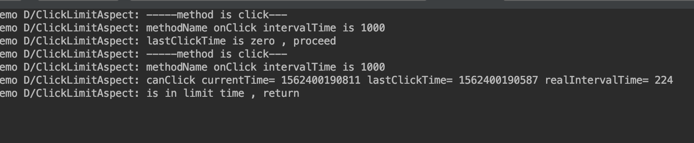
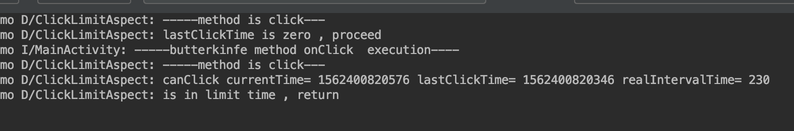
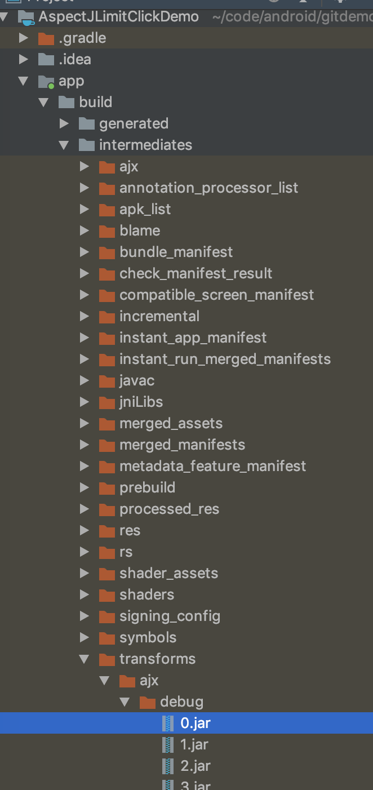
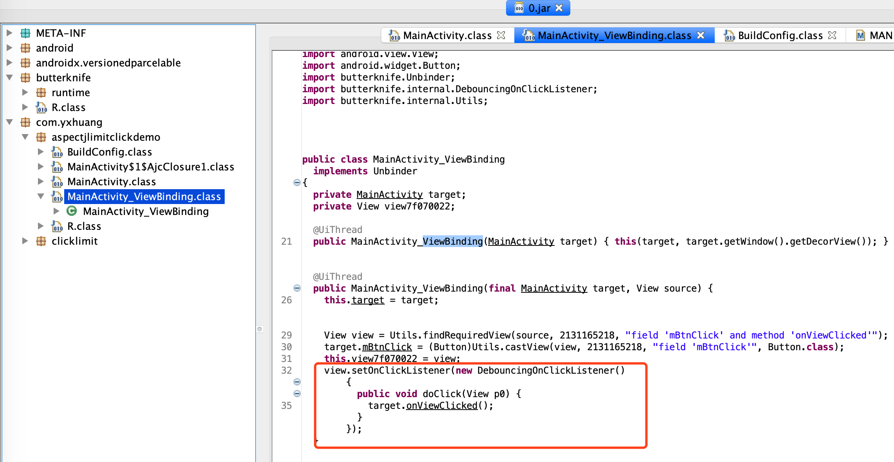

# Android 使用 Aspectj 限制快速点击

在[AspectJ 在 Android 中的使用](https://github.com/yxhuangCH/CSLearn/blob/master/android/Aspectj%20%E5%9C%A8Android%E4%B8%AD%E7%9A%84%E4%BD%BF%E7%94%A8.md)中，介绍了 Aspectj 的基本知识及其在 Android 中的基本使用，在这篇将会介绍如何使用 Aspectj 在 Android 中限制快速点击

### 1. 配置依赖
建立 clicklimt 的 lib，添加对 Aspect 的依赖，之前我们要做很多的配置工作，沪江的开源库 [gradle_plugin_android_aspectjx](https://github.com/HujiangTechnology/gradle_plugin_android_aspectjx) 已经帮我们弄了，省了很多工作。

在根项目的 build.gradle 配置

```grovy
buildscript {
    repositories {
        google()
        jcenter()
        
    }
    dependencies {
        classpath 'com.android.tools.build:gradle:3.3.2'
        
        // 添加 hujiang.aspectjx
        classpath 'com.hujiang.aspectjx:gradle-android-plugin-aspectjx:2.0.4'

        classpath 'com.jakewharton:butterknife-gradle-plugin:9.0.0-rc2'
    }
}

```

在 app 工程的 build.gradle 中使用 AspectJX 插件

```grovy
apply plugin: 'com.android.application'
apply plugin: 'android-aspectjx'  // 使用 AspectJX 插件

android {
    compileSdkVersion 28
    defaultConfig {
        applicationId "com.yxhuang.aspectjlimitclickdemo"
        minSdkVersion 21
        targetSdkVersion 28
        versionCode 1
        versionName "1.0"
        testInstrumentationRunner "android.support.test.runner.AndroidJUnitRunner"
    }
    buildTypes {
        release {
            minifyEnabled false
            proguardFiles getDefaultProguardFile('proguard-android-optimize.txt'), 'proguard-rules.pro'
        }
    }

    // Butterknife requires Java 8.
    compileOptions {
        sourceCompatibility JavaVersion.VERSION_1_8
        targetCompatibility JavaVersion.VERSION_1_8
    }
}

aspectjx {
    //指定只对含有关键字'universal-image-loader', 'AspectJX-Demo/library'的库进行织入扫描，忽略其他库，提升编译效率
//    includeJarFilter 'universal-image-loader', 'AspectJX-Demo/library'
//    excludeJarFilter '.jar'
//    ajcArgs '-Xlint:warning'
}

dependencies {
    implementation fileTree(dir: 'libs', include: ['*.jar'])
    implementation 'com.android.support:appcompat-v7:28.0.0'
    implementation 'com.android.support.constraint:constraint-layout:1.1.3'
    testImplementation 'junit:junit:4.12'
    androidTestImplementation 'com.android.support.test:runner:1.0.2'
    androidTestImplementation 'com.android.support.test.espresso:espresso-core:3.0.2'

    implementation project(':clicklimit')

    implementation 'com.jakewharton:butterknife:9.0.0-rc1'
    annotationProcessor 'com.jakewharton:butterknife-compiler:9.0.0-rc1'
}
```

在 clicklimt 库的 build.gradle 中添加 aspectj 依赖

```grovy
dependencies {
    implementation fileTree(dir: 'libs', include: ['*.jar'])

    api 'org.aspectj:aspectjrt:1.8.9'

}
```

### 2. 具体的处理
#### 1. 建立 ClickLimit 注解
我们会对整个项目中的点击事件做点击限制，如果不需要限制的方法，可以设置 value = 0 即可, 我们默认设置为 500 毫秒。

```java
@Target({ElementType.METHOD })
@Retention(RetentionPolicy.RUNTIME)
public @interface ClickLimit {

    int value() default 500;
}
```

#### 2. 选择 Pointcut
 
 我们这里选择 View#setOnClickListener 作为切入点
 
```java
// View#setOnClickListener
private static final String POINTCUT_ON_VIEW_CLICK =
            "execution(* android.view.View.OnClickListener.onClick(..))";
```

对 Joint 的处理

```java
private void processJoinPoint(ProceedingJoinPoint joinPoint) throws Throwable {
    Log.d(TAG, "-----method is click--- ");
    try {
        Signature signature = joinPoint.getSignature();
        if (!(signature instanceof MethodSignature)){
            Log.d(TAG, "method is no MethodSignature, so proceed it");
            joinPoint.proceed();
            return;

        }

        MethodSignature methodSignature = (MethodSignature) signature;
        Method method = methodSignature.getMethod();
        boolean isHasLimitAnnotation = method.isAnnotationPresent(ClickLimit.class);
        String methodName = method.getName();
        int intervalTime = CHECK_FOR_DEFAULT_TIME;
        // 这里判断是否使用了 ClickLimit 注解
        // 如果用注解，并且修改了限制点击的时间
        // 如果时间 <= 0 ，代表着不做限制，直接执行
        // 如果是其他时间，则更新限制时间
        if (isHasLimitAnnotation){
            ClickLimit clickLimit = method.getAnnotation(ClickLimit.class);
            int limitTime = clickLimit.value();
            // not limit click
            if (limitTime <= 0){
                Log.d(TAG, "method: " + methodName + " limitTime is zero, so proceed it");
                joinPoint.proceed();
                return;
            }
            intervalTime = limitTime;
            Log.d(TAG, "methodName " +  methodName + " intervalTime is " + intervalTime);
        }

        // 传进来的参数不是 View, 则直接执行
        Object[] args = joinPoint.getArgs();
        View view = getViewFromArgs(args);
        if (view == null) {
            Log.d(TAG, "view is null, proceed");
            joinPoint.proceed();
            return;
        }
        
        // 通过 viewTag 存储上次点击的时间
        Object viewTimeTag =  view.getTag(R.integer.yxhuang_click_limit_tag_view);
        // first click viewTimeTag is null.
        if (viewTimeTag == null){
            Log.d(TAG, "lastClickTime is zero , proceed");
            proceedAnSetTimeTag(joinPoint, view);
            return;
        }

        long lastClickTime = (long) viewTimeTag;
        if (lastClickTime <= 0){
            Log.d(TAG, "lastClickTime is zero , proceed");
            proceedAnSetTimeTag(joinPoint, view);
            return;
        }

        // in limit time
        if (!canClick(lastClickTime, intervalTime)){
            Log.d(TAG, "is in limit time , return");
            return;

        }
        proceedAnSetTimeTag(joinPoint, view);
        Log.d(TAG, "view proceed.");
    } catch (Throwable e) {
        e.printStackTrace();
        Log.d(TAG, e.getMessage());
        joinPoint.proceed();
    }
}

private void proceedAnSetTimeTag(ProceedingJoinPoint joinPoint, View view) throws Throwable {
    view.setTag(R.integer.yxhuang_click_limit_tag_view, System.currentTimeMillis());
    joinPoint.proceed();
}
```

通过 ViewTag 来存储上次点击的时间，如果上次的点击时间为 0， 说明是第一次点击，则立即执行；
如果有存储上次点击时间，则通过 canClick 方法配对时间，如果是在时间间隔之内，不执行。

### 3. 对 clicklimit 库的使用

在 app module 的 build.gradle 中添加 clicklimit 库的引用

```grovy
implementation project(':clicklimit')
```

我们一个使用 View#setOnClickListener 方法，一个使用 ButterKnife 绑定的方式


```java
@BindView(R.id.btn_click)
Button mBtnClick;


@Override
protected void onCreate(Bundle savedInstanceState) {
    super.onCreate(savedInstanceState);
    setContentView(R.layout.activity_main);
    ButterKnife.bind(this);

    TextView tvSay = findViewById(R.id.tv_say);
    tvSay.setOnClickListener(new View.OnClickListener() {

        @ClickLimit(value = 1000)
        @Override
        public void onClick(View v) {
            Log.i(TAG, "-----onClick----");
            showToast();
        }
    });
}


private void showToast() {
    Toast.makeText(MainActivity.this, "被点击", Toast.LENGTH_SHORT).show();
}

@OnClick(R.id.btn_click)
public void onViewClicked() {
    Log.i(TAG, "-----butterknife method onClick  execution----");
    showToast();
}
```
我们对 tvSay 快速点击两次，看到 log




第一次执行了， 第二在时间限制内，return 掉了

我们点击一下 butterknife 绑定的 button,看看 log



我们看到 butterknife 绑定的方法也被限制，但是我们的 Poincut 并没有对它做限制。


在 app/build/intermediates/transforms/ajx/debug 的路径下会生成 jar 包， ajx 这个路径就是使用了 android-aspectjx 生成



我们将 0.jar 文件放到软件 JD-GUI 上面可以看到里面的代码



其实是因为 ButterKnife 会生成一个 ViewBinding 的类，在里面调用了
View#setOnClickListener 方法

很多文章都需要对 butterknife 设置 Pointcut,  其实这完全是没有必要的.

