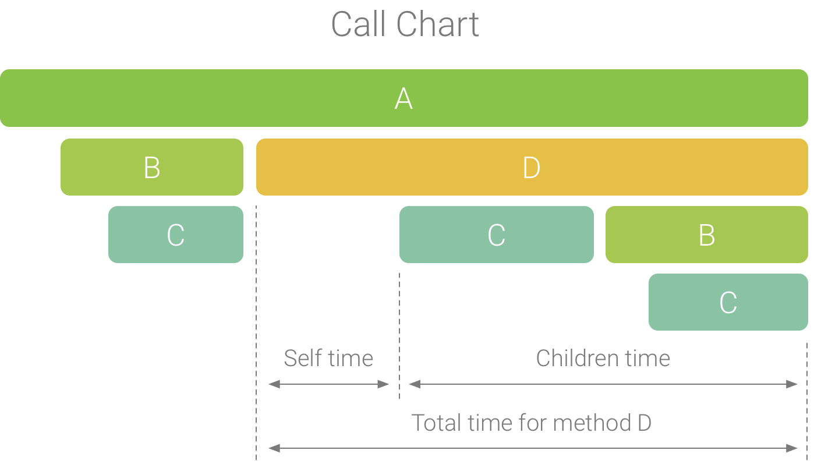
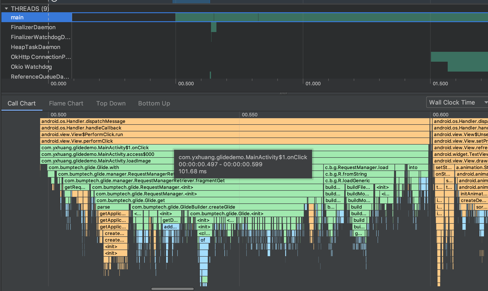
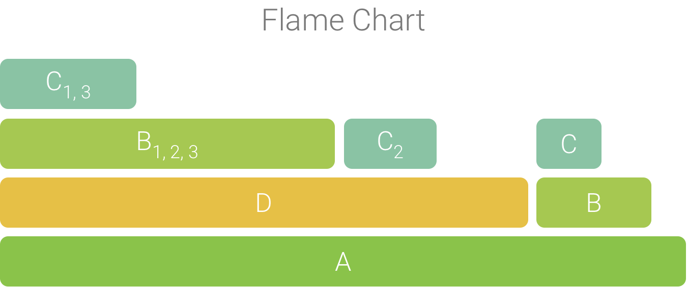
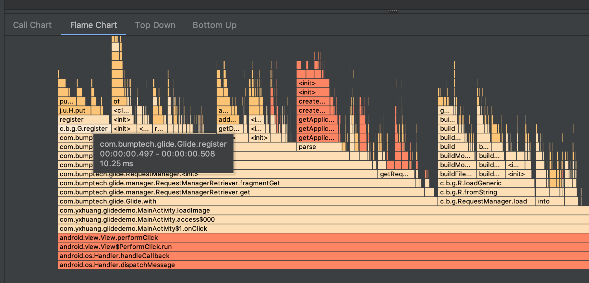
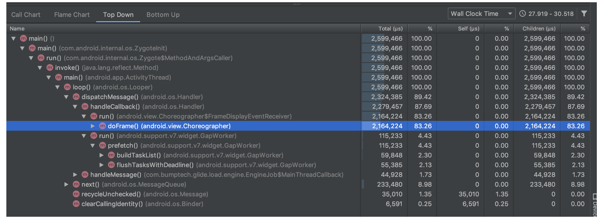
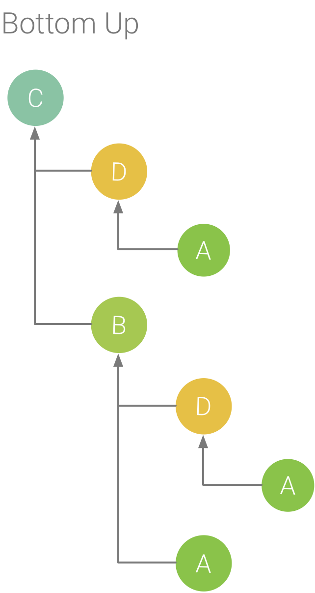
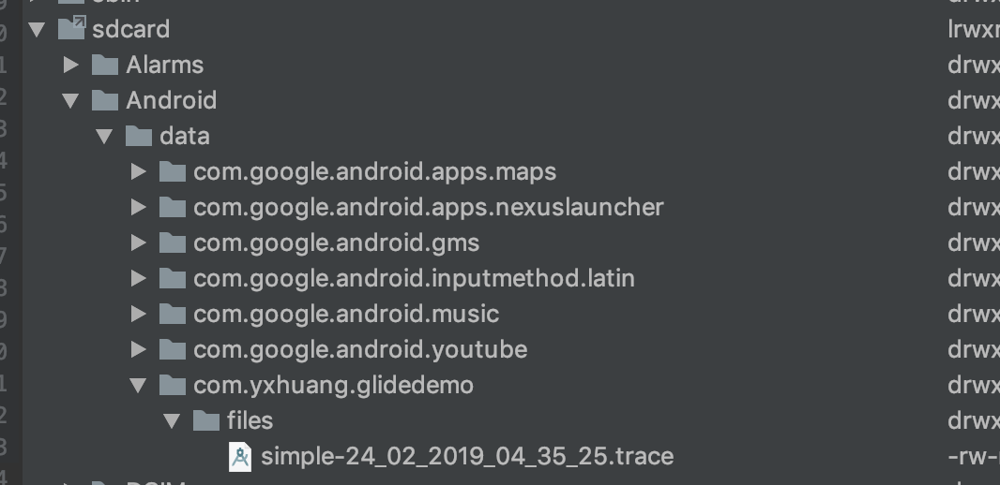
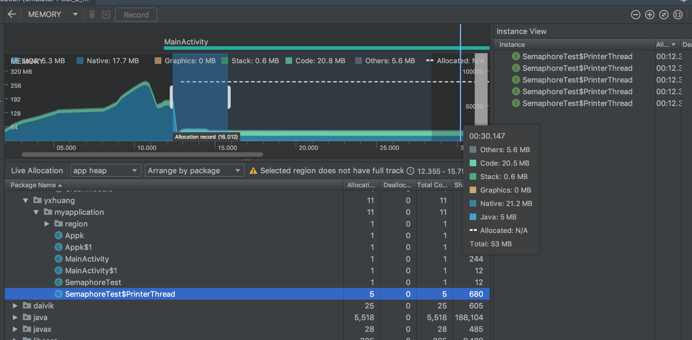
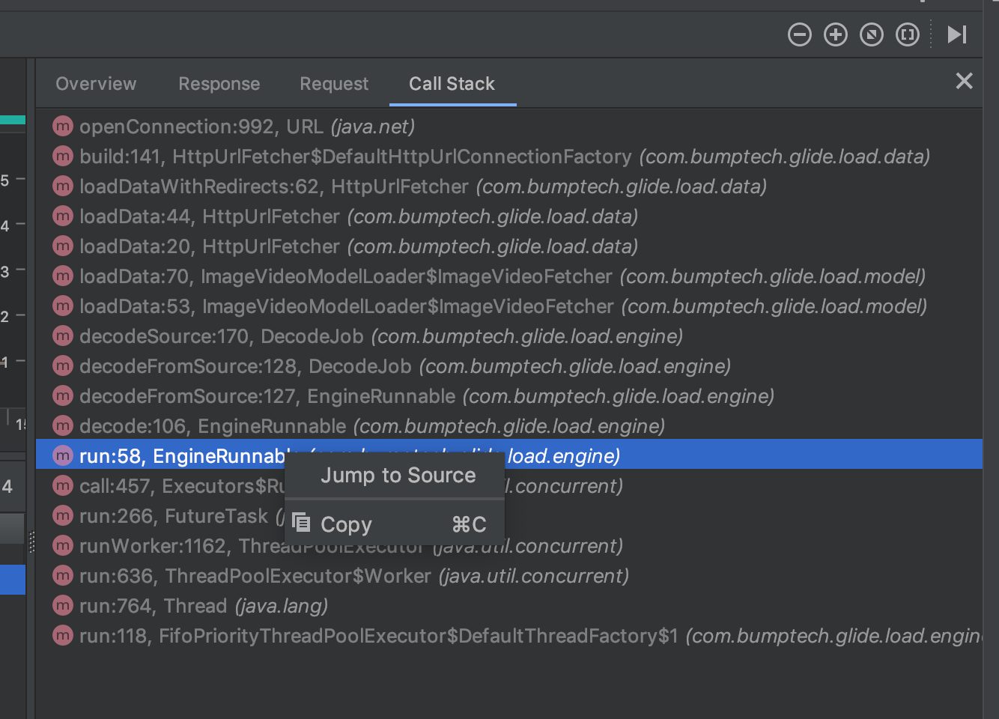

## Android 进阶系列： Android 卡顿（二）：Android Android Studio Profiler 的使用

Android Studio 3.0 开始提供了 Android Profiler 工具，这些工具可以提供关于 CPU, 内存和网络 Activity 的实时数据。

Android Profiler 包含三个部分：

- CPU Profiler 检查 CPU Activity 和函数跟踪；
- Memory Profiler 检查 Java 堆和内存分配
- Network Profiler 检查网络流量


### 1. 使用 CPU Profiler 检查 CPU Activity 和函数跟踪
使用 CPU Profiler 可以知道 CPU 的使用率。在应用进程的每个线程，可以做知道一段时间内执行了哪些函数，已经这些函数执行的时间。


备注：图片来源于官网

- 线程 Activity 时间线：
		绿色： 处于活动或准备使用 CPU
		黄色： 处于活动状态，但它正在等待一个 I/O 操作，然后才能完成它的工作
		灰色： 表示线程正在休眠并且没有消耗任何 CPU 时间

- 记录配置：
		Sampled: 默认配置， 在应用执行期间频繁捕获应用的调用堆栈。不会记录生命周期很短的函数
		Instrumented: 在运行时设置应用以在每个函数调用的开始和结束时记录时间戳, 开销会影响运行时性能，并可能会影响分析数据，对于生命周期相对较短的函数
		Edit configurations: 自定义配置

- Call Chart :

备注：图片来源于官网
		
水平轴表示函数调用的时间，垂直轴显示被调用者
系统 API 调用函数为 橙色
应用自身调用为 绿色
第三方调用为 蓝色
		
	
- Flame Chart :

		倒置的调用图表，汇总相同的调用栈。 可以查看那些函数消耗最多时间。水平轴表示每个函数执行的相对时间；



备注：图片来源于官网

- Top Down 说明每个函数调用上所花费的 CPU 时间

		Self: 表示函数调用在执行自己的代码上所花的时间；
		Children: 表示函数调用在执行自己的被调用放（非自己的代码）上所花的时间
		Total: 函数 Self + Children 时间的总和
		

- Bottom up 用于按照消耗最多（最小） CPU 排列函数。

备注：图片来源于官网

- 指定应用生成日志
可以通过代码设置，记录指定的函数
需要设置权限 
> <uses-permission android:name="android.permission.WRITE_EXTERNAL_STORAGE"/>


开始设置追踪的地方设置

```java
SimpleDateFormat date = new SimpleDateFormat("dd_MM_yyyy_hh_mm_ss");
String logDate = date.format(new Date());
Debug.startMethodTracing("simple-" + logDate);
```
结束的地方设置

```java
Debug.stopMethodTracing();
```
如果是在模拟器，则在路径
> sdcard/Android/data/包名/files/ 目录下


如果是真机，则需要用命令导出文件
> adb pull /sdcard/Android/data/com.yxhuang.glidedemo/files/simple-24_02_2019_04_35_25.trace 


### 2. Memory Profiler 检查 Java 堆和内存分配
- 可以查找可能会导致性能问题不理想的内存分配模式
- 转储 Java 堆中查看任何给定时间有哪些对象耗尽了使用内存。 可以识别内存泄露


### 3. Network Profiler 检查网络流量
Network Profiler 目前只支持 HttpURLConnection 和 OkHttp 网络连接库。


Call Stack 可以看到整个图片的调用栈，还可以跳进去看源码


### 4. Energy Profiler
[Energy Profiler](https://developer.android.com/studio/profile/energy-profiler) 分析应用电能的消耗


### 参考
[利用 Android Profiler 测量应用性能](https://developer.android.com/studio/profile/android-profiler?hl=zh-cn)


