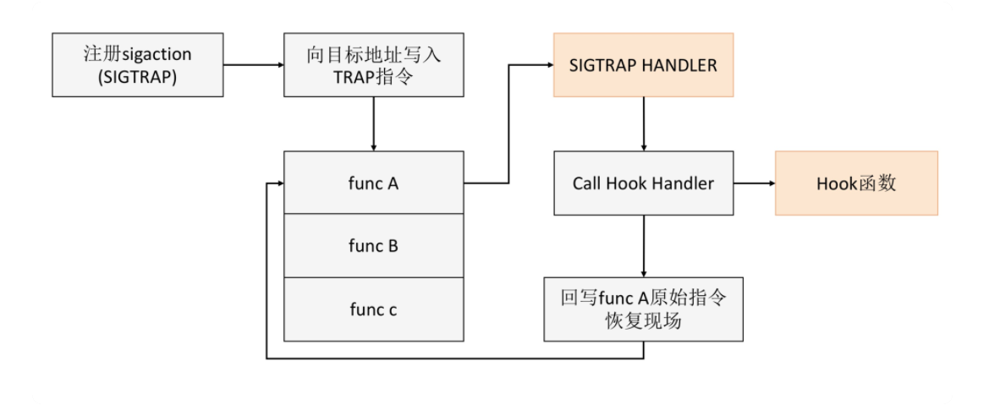
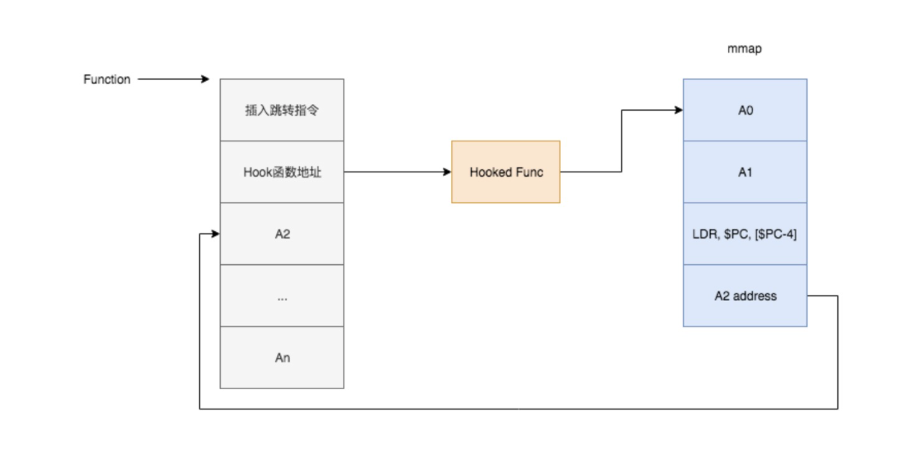

Android Native Hook 前言

# 一、前言
在 Java 层中的 hook 方式有 [AspectJ](https://github.com/yxhuangCH/CSLearn/blob/master/android/Aspectj%20%E5%9C%A8Android%E4%B8%AD%E7%9A%84%E4%BD%BF%E7%94%A8.md) 和 [ASM](https://github.com/yxhuangCH/CSLearn/blob/master/android/Android%20%E7%BC%96%E8%AF%91%E6%8F%92%E6%A1%A9%EF%BC%88%E4%B8%80%EF%BC%89%EF%BC%9A%20ASM.md), 但是有些情况下需要对 native 进行 hook, 例如对 malloc 进行 hook 监控内存的分配情况，对线程创建等。还有就是在 apm 场景中通过 hook 底层系统库的 io appi 实现对程序读写文件的监控，找出在主线程进行文件读写、耗时过大等问题。

对于 Native 层来说 Hook 的难点是在理解 ELF 文件与学习 ELF 文件上。

关于 ELF 的学习，参考 [《程序员的自我修养》](https://book.douban.com/subject/3652388/) 一书，我也做了[笔记](http://www.yxhuang.com/2021/03/28/linker-read-one/)。

相应学习 Native Hook 技术的应用， 需要 ELF 相关知识是前提。

# 二、Android Native hook 分类

Native hook 主要分成 PLT Hook、 Trap Hook 和 Inline Hook，
它们的原理和应用场景有差异。

## 2.1 GOT/PLT Hook

GOT/PLT Hook 主要是用于替换某个 SO 的外部调用，通过将外部函数调用跳转成目标函数。

GOT/PLT Hook 是一个经典的 Hook 方法，非常稳定，可以应用到生产环境中。

GOT/PLT Hook 可以大量 hook 系统 API， 但是难以精准 hook 某次函数调用。因此 **GOT/PLT hook 适用开发者自家 APP 性能监控的需求**

## 2.2 Trap Hook

Trap Hook 也叫作断点 Hook, 原理是在需要 Hook 的地方想办法触发断点，并捕获异常。一般会利用 SIGTRAP 或者 SIGKILL (非法指令异常) 这两种信号。

Trap Hook 兼容性非常好，也可以在生成环境中大规模使用。但是它存在效率低的问题，并不是适合 hook 非常频繁调用的函数.

Facebook 的 [Profio](https://github.com/facebookincubator/profilo) 就是实践方案。

## 2.3 Inline Hook

Inline Hook 是函数内部调用的 Hook。通过替换函数开始处的指令为跳转指令，使得原函数跳转到自己的函数，通常还会保留原函数的调用接口。与 GOT/PLT Hook 相比， Inline Hook 具有更广泛的适用性，几乎可以 Hook 任何函数，不过实现很复杂，而且无法对一些太短的函数 Hook。

# 三、总结
- 1. GOT/PLT Hook 性能好，实现难度中等，但是只能 Hook 动态库之间的调用函数，无法 hook 未导出的私有函数。 GOT/PLT hook 适用开发者自家 APP 性能监控的需求。
- 2. Trap Hook 最稳定，但是需要切换运行模式，而且依赖内核的信号机制，导致性能很差。
- 3. Inline Hook 有很好的性能，而且没有 GOT/PTL 作用域的限制。但是实现难度极高。

|  | GOT/PLT Hook |  Trap Hook | Inline Hook |
| --- | --- | --- | --- |
| 粒度 |  函数|  指令 |  指令|
| 性能 | 高 | 低 |  高|
|实现难度| 中 | 中| 极高|
|作用域| 低（GOT/PLT 表）|高 | 高|
|稳定性| 高| 高| 低（实现难度极大）|

# 四、参考

- [极客时间|Android 开发高手课《Native Hook 技术，天使还是魔鬼》](https://time.geekbang.org/column/article/87269)

- [Android Native Hook技术路线概述](https://gtoad.github.io/2018/07/05/Android-Native-Hook/)

