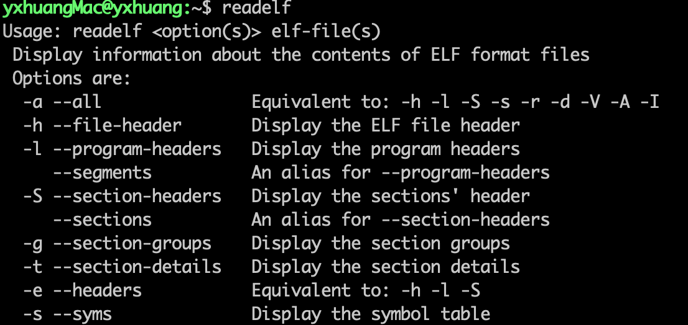
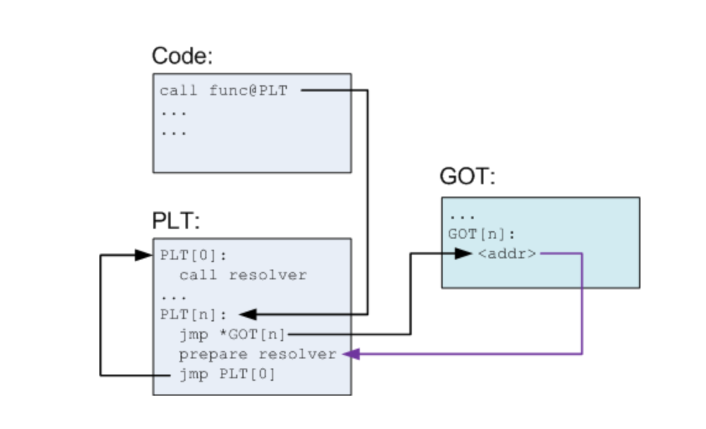
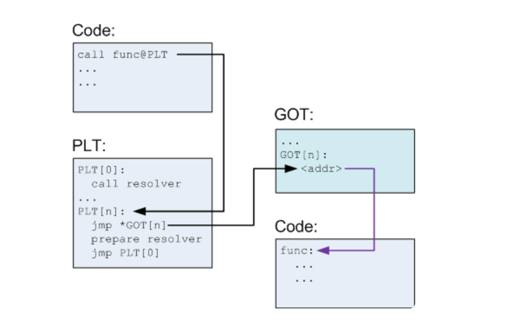
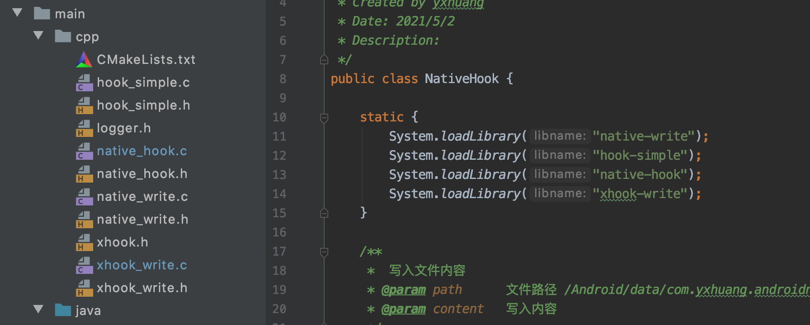

[TOC]

Android Native Hook 分成

- GOT/PLT Hook 
- Inline Hook

本篇讲述 GOT/PLT Hook 的原理、具体实现以及它的优缺点

如果想在 mac 上使用 readelf, objdump 等命令，需要将 NDK 里面的路径配置到 path
在 `~./bashrc` 文件中添加路径

```
export PATH="$PATH:/..(自己的目录)/android/sdk/ndk/21.0.6113669/toolchains/arm-linux-androideabi-4.9/prebuilt/darwin-x86_64/bin/"
```
保存，使用命令

> source ~/.bashrc

使其生效



# 一、原理
Linux 在执行动态链接 ELF 的时候，为了优化性能使用了延迟绑定策略；

当动态链接的 ELF 程序里调用共享库的函数时，第一次调用时会先去查找 PTL 表中相应的项目， 而 PTL 表中再跳跃到 GOT 表中希望得到该函数的实际地址，但这是 GOT 表中指向的是 PLT 中那条跳跃指令下面的代码，最终会执行 _dl_runtime_resolve() 并执行目标函数。
第二次调用时也是 PTL 跳跃到 GOT 表，但是 GOT 中对应项目已经在第一次 _dl_runtime_relove() 中被修改为函数实际地址，因此第二次及以后的调用直接去执行目标函数，不再执行 _dl_runtime_relove() 了。
因此，PTL 通过修改 GOT 表，使得在调用该共享库的函数时跳转的是用户自定义的 Hook 功能代码。

- 外部函数第一次调用流程

 

- 外部函数第二次调用流程

 
 
 
# 二、具体实现

## 2.1 总体实现方案

总体的步骤：

- 通过读取 /proc/<PID>/maps 文件找到链接库的基地址；
- 读取动态库，解析 ELF 文件，找到符号（需要对 ELF 文件格式有了解）
- 计算目标函数绝对地址
  目标进程函数绝对地址 = 动态库基地址 + 函数地址

具体的步骤：

- 1.获取动态库的基地址；
- 2.计算 .so 文件中的 program header table 程序头地址；
- 3.遍历程序头部表，获取动态段(.dynamic)地址；
- 4.找到 GOT 表地址；
- 5.修改内存属性为可写；
- 6.遍历 got 表，修改要替换的函数；
- 7.恢复内存属性为可读可执行。

## 2.2 方案的具体实现

下面具体实现的代码参考文章 [android中基于plt/got的hook实现原理](https://blog.csdn.net/byhook/article/details/103500524?spm=1001.2014.3001.5502) 

我们在 Demo 里使用 CMake 将 Native 代码编译成 native_write.so 文件，放入到 libs 对应的架构目录下，然后通过 hook 住 so 文件中的 fwrite 函数。

先看我们要 hook 的目标，是在 `native_write.c` 中的 fwrite 函数

```c
/**
 * 写入文件
 * @param path
 * @param text
 */
void writeText(const char *path, const char *text){
    FILE *fp = NULL;
    if((fp = fopen(path, "w")) == NULL){
        LOG_E("file cannot open");
        return;
    }
    // 写入数据
    fwrite(text, strlen(text), 1, fp);
    if(fclose(fp) != 0){
        LOG_E("file cannot be closed");
        return;
    }
}
```

我们把自己 hook 的 Native 也编译成 native_hook.so 文件，让 Android 把它加载
hook 的代码, hook 的代码在 `native_hook.c` 中

```c
size_t new_fwrite(const void *buf, size_t size, size_t count, FILE *fp) {
    // 插入文本
    const char *text = "hello native ";
    LOG_D("new_fwrite hook fwrite success insert text: %s", text);
    old_fwrite(text, strlen(text), 1, fp);
    return old_fwrite(buf, size, count, fp);
}
```
上面是的 `new_fwrite` 函数就是在原来 `fwrite` 函数之前先写入 ‘hello native’ 的内容


-  **第一步：获取动态库的基地址**

```c
// 1. 获取目标进程中模块的加载地址
void *base_addr = get_module_base(getpid(), soPath);
    
/**
 *  获取so的加载基址
 */
void *get_module_base(pid_t pid, const char *module_name) {
    FILE *fp;
    long addr = 0;
    char filename[32] = "\n";
    char line[1024] = "\n";
    LOG_D("get_module_base pid=%d", pid);
    if(pid < 0){
        snprintf(filename, sizeof(filename), "/proc/self/maps");
    } else {
        snprintf(filename, sizeof(filename), "/proc/%d/maps", pid);
    }
    // 获取指定 pid 进程加载的内存模块信息
    fp = fopen(filename, "r");
    while (fgets(line, sizeof(line), fp)) {
        if (NULL != strstr(line, module_name) &&
            sscanf(line, "%"PRIxPTR"-%*lx %*4s 00000000", &addr) == 1)
            break;
    }
    fclose(fp);
    return (void *) addr;
}
```

- **第二步：计算 .so 文件中的 program head table 程序头地址；**

```c
// 2.计算 header table 的实际地址
Elf32_Ehdr *header = (Elf32_Ehdr *) (base_addr);

// 程序头表地址 program header = base_addr + 程序头表在Elf文件中的偏移
Elf32_Phdr *phdr_table = (Elf32_Phdr *) (base_addr + header->e_phoff);

// 程序头表里面 Segment 的数量
size_t phdr_count = header->e_phnum;
LOG_D("hook_fwrite phdr_count : %d", phdr_count);
// 遍历程序头表，找到 dynamic 段
unsigned long p_vaddr = 0;  // dynamic 段在虚拟内存的地址
unsigned int p_memsz = 0;  // dynamic 段在虚拟内存的中所占用的长度
int j = 0;
for (j = 0; j < phdr_count; j++) {
    if (phdr_table[j].p_type == PT_DYNAMIC) {
        // 打印 .dynamic 段的虚拟内存地址
        LOG_D("hook_fwrite phdr_table[j].p_vaddr : %x", phdr_table[j].p_vaddr);
        p_vaddr = base_addr + phdr_table[j].p_vaddr;
        p_memsz = phdr_table[j].p_memsz;
        break;
    }
}
```

- **第三步：遍历程序头部表，获取动态段（.dynamic）地址；**

```c
// .dynamic　段的结构  /*
//    typedef struct dynamic {
//         Elf32_Sword d_tag;
//         union {
//          Elf32_Sword d_val;
//          Elf32_Addr d_ptr;
//          } d_un;
//   } Elf32_Dyn;
Elf32_Dyn *dynamic_table = (Elf32_Dyn *) p_vaddr;
unsigned long jmpRelOff = 0;
unsigned long strTabOff = 0;
unsigned long ptlRelSz = 0;
unsigned long symTabOff = 0;
// 3. 多个 .dynamic 段  (理解这段代码)
// 遍历 动态段
int dynCount = p_memsz / sizeof(Elf32_Dyn);
for (int i = 0; i < dynCount; i++) {
    int val = dynamic_table[i].d_un.d_val;
    int d_tag = dynamic_table[i].d_tag;
    switch (d_tag) {
        case DT_JMPREL:  // Address of relocations associated with PLT PTL 的重定位表地址
            jmpRelOff = val;
            break;
        case DT_STRTAB:
            strTabOff = val; // Address of dynamic string table,动态链接字符串表地址
            break;
        case DT_PLTRELSZ:  // Size of relocation entries in PLT, PLT 中的所有重新定位项大小
            ptlRelSz = val / sizeof(Elf32_Rel);
            break;
        case DT_SYMTAB: // Address of dynamic symbol table, 动态链接符号表的地址
            symTabOff = val;
            break;
    }
}
```

- **第四步：找到 GOT 表地址；** 

```c
// 重定位表
/**
 * typefef struct{
 *    Elf32_Addr r_offset;
 *    Elf32_Word r_info;
 * } Elf32_Rel;
 *
 * typedef struct elf32_sym {
 *     Elf32_Word st_name;
 *     Elf32_Addr st_value;
  *    Elf32_Word st_size;
  *    unsigned char st_info;
 *     unsigned char st_other;
  *    Elf32_Half st_shndx;
 *  } Elf32_Sym;
 */
Elf32_Rel *rel_table = (Elf32_Rel *) (jmpRelOff + base_addr);
```

-  **第五步：找到被 hook 函数的**

```c
// 4.遍历 got 表
for (int i = 0; i < ptlRelSz; i++) {
    //ELF32_R_SYM 右移八位，查找改符号（rel_table[i].r_info）在 rel_table 符号表中下标
    uint16_t ndx = ELF32_R_SYM(rel_table[i].r_info);
    // 符号表  地址 = 基址 + got 表地址 + 下标 * 符号大小
    Elf32_Sym *symTable = (base_addr + symTabOff + ndx * sizeof(Elf32_Sym));
    // 获取符号名 ???
    char *funcName = (char *) (symTable->st_name + base_addr + strTabOff);
    // 5. 找到fwrite 函数
    if (memcmp(funcName, hookFuncName, strlen(funcName)) == 0) {
        // 获取当前内存分页的大小
        uint32_t page_size = getpagesize();
        // 获取内存分页的起始地址（需要内存对齐）
        uint32_t mem_page_start = base_addr + rel_table[i].r_offset;
        LOG_D("hook_fwrite old_function=0x%08X new_function=0x%08X", mem_page_start,
              new_fwrite);
        LOG_D("hook_fwrite mem_page_start=0x%08X page_size=%d", mem_page_start, page_size);
        // 6. 修改内存属性为可写
        mprotect((uint32_t) PAGE_START(mem_page_start), page_size,
                 PROT_READ | PROT_WRITE | PROT_EXEC);
        // 7. 替换
        *(unsigned int *) (base_addr + rel_table[i].r_offset) = new_fwrite;
        // 8. 清除指令缓存
        __builtin___clear_cache((void *) PAGE_START(mem_page_start),
                                (void *) PAGE_END(mem_page_start));
    }
}
```
- **第六步：修改内存属性为可写**

```c
// 6. 修改内存属性为可写
mprotect((uint32_t) PAGE_START(mem_page_start), page_size,
```

- **第七步：替换 hook 的函数**

```c
// 7. 替换
*(unsigned int *) (base_addr + rel_table[i].r_offset) = new_fwrite;
```


- **第八步：恢复存属性为可读可执行(清除指令缓存)**

```c
// 6. 清除指令缓存
__builtin___clear_cache((void *) PAGE_START(mem_page_start),
```

**缺流程图**

# 三、优缺点及应用

## 3.1 PTL/GOT hook 的特点
- 1. 由于修改 GOT 表中的数据，因此修改后，所有对该函数进行调用的地方都会被 hook 到。影响范围是该 PLT 和 GOT 所处的整个 so 库；
- 2. PTL 与 GOT  表中仅仅包含本 ELF 需要调用的共享库函数，因此不在 PTL 中的函数无法 hook 到。

## 3.2 使用场景
 - 1. 可以大量 hook 系统 API, 但是难以精准 hook 某次函数调用。因此 PLT/GOT hook 适用开发者自家 APP 性能监控的需求；
 - 2. 一些函数不在 PLT 表和 GOT 表里，因此对这些 so 内部自定义的函数无法 hook 到；
 - 3. 在回调原函数方面， PLT hook 在 hook 目标函数时，如果需要回调原来的函数，那么在hook 之后的功能函数中直接调用目标函数即可
 
```c
size_t new_fwrite(const void *buf, size_t size, size_t count, FILE *fp) {
    // 插入文本
    const char *text = "hello native ";
    LOG_D("new_fwrite hook fwrite success insert text: %s", text);
    // 直接调用原来的目标函数
    old_fwrite(text, strlen(text), 1, fp);
    return old_fwrite(buf, size, count, fp);
}
```


# 四、其他

## 4.1 使用 xhook
上面是具体是实现，如果是在正常的日常使用中，可以使用 [xhook](https://github.com/iqiyi/xHook)

**使用 xhook 的步骤：**

- 1. **将 xhook 以 lib 形式集成**
- 2. **在主项目中引用这个 lib, 并将 xhook.h 文件放入都自己 cpp 路径中**
- 3. **注册要 hook 的 so 和 so 里面的函数**

```c
JNIEXPORT void JNICALL
Java_com_yxhuang_nativehook_NativeHook_xhookWrite(JNIEnv *env,jobject thiz, jstring hook_content){
    const char *hookContent = (*env)->GetStringChars(env, hook_content, 0);
    LOG_D("xhookWrite hook_content=%s", hookContent);

    xhook_register("libnative-write.so", "writeText",
            (void *)xhook_write, NULL);

    xhook_refresh(0);
    xhook_clear();
}
```
- 4. **提供替换 hook 的函数**

```c
/**
 * 替换的函数
 */
void *xhook_write(const char *path, const char *text){
    // 插入文本
    const char *textHook = "hello native ";
    LOG_D("new_fwrite hook fwrite success insert text: %s", text);
    writeText(path, textHook);
}
```

- 5. **将生成的 hook 的 so 加载**

 
 


# 参考
- [android中基于plt/got的hook实现原理](https://blog.csdn.net/byhook/article/details/103500524?spm=1001.2014.3001.5502)
- [Android PLT hook 概述](https://github.com/iqiyi/xHook/blob/master/docs/overview/android_plt_hook_overview.zh-CN.md)
- [Android so注入(inject)和Hook技术学习（一）](https://www.cnblogs.com/goodhacker/p/9296901.html)
- [Android so注入(inject)和Hook技术学习（二）——Got表hook之导入表hook](https://www.cnblogs.com/goodhacker/p/9306997.html)
- [Android so注入(inject)和Hook技术学习（三）——Got表hook之导出表hook](https://www.cnblogs.com/goodhacker/p/9313297.html)
- [【Android】ELF格式及动态加载过程](https://gslab.qq.com/article-279-1.html)
- [Android平台导入表Hook方式实现](https://gslab.qq.com/portal.php?mod=view&aid=169)


