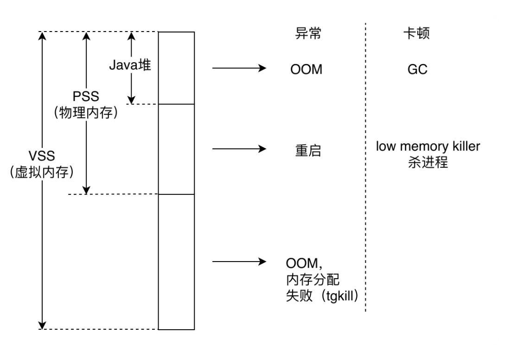
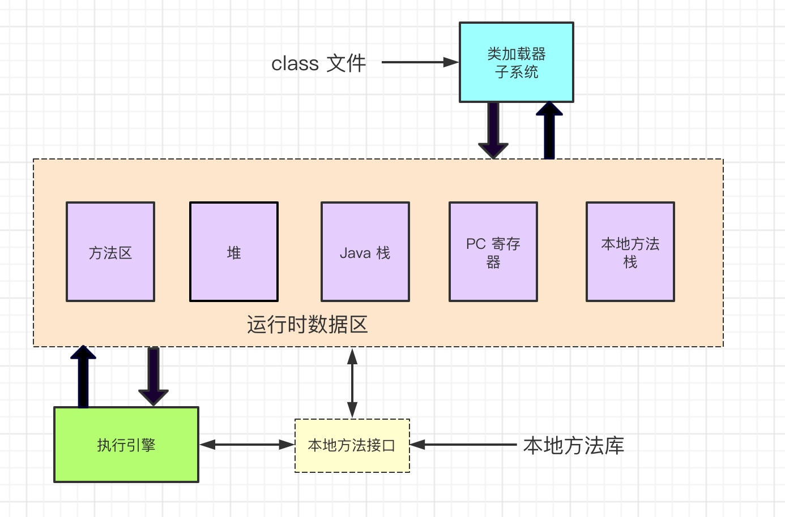

# Android 内存优化（一）

Android 内存的内容分为几个部分

- 内存有问题的表现
- 分配内存
- 监控内存分配
- 监控内存泄露
- 优化内存

## 1.内存问题
- 异常
因为内存不足会导致应用被杀死、设备重启。
异常还包括 OOM, 内存分配失败等崩溃
- 卡顿
Java 内存不足会导致频繁 GC, 从而导致卡顿

## 2.分配内存

### 2.1 内存分配原理
程序运行的内存分三种策略

**静态的**
静态的分配，对于内存空间的静态存储区（方法区），内存在编译程序的时候的时候已经分配好，这个内存在程序运行期间都在。主要存储静态数据、全局 static 数据和常量

**栈式的**
栈式的分配，对应内存的栈区。在执行函数时，函数内局部的存储单元在栈上创建，函数执行结束时这些存储单元自动释放。

**堆式的**
堆式的分配，对应内存的堆区。这块区域是动态分配内存。程序在运行的时候用 malloc 或 new 申请内存，在适当的时候用 free 或 delete 释放内存（Java 则是 垃圾回收器自动回收）

局部变量的基本数据类型和引用存储于栈中，引用的对象实体存储在堆中。

成员变量存储在堆中，包括基本数据类型，引用和引用的实体对象

### 2.2 虚拟机中分配内存

下图 Java 虚拟机运行时数据区

Java 程序在运行时创建的所有类的实例或数组都放在同一个堆中。 一个 Java 虚拟机实例中只有一个堆空间，因此所有线程都将共享这个堆。

即 Java 虚拟机在堆中分配新对象。

## 3.监控内存分配

暂时待整理

JVMTI

