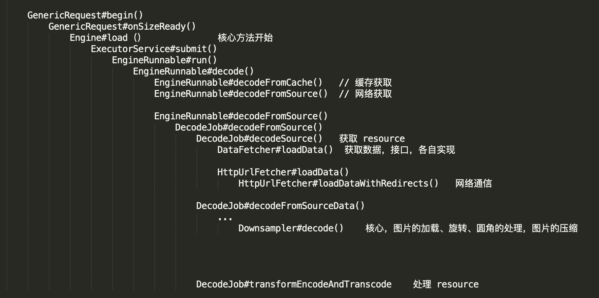
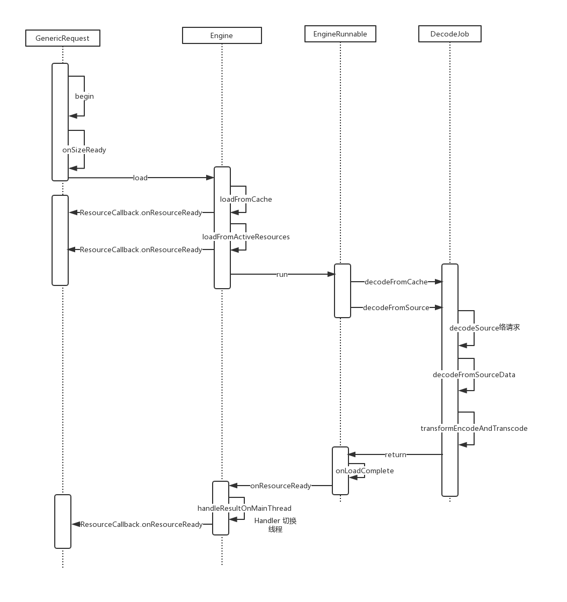
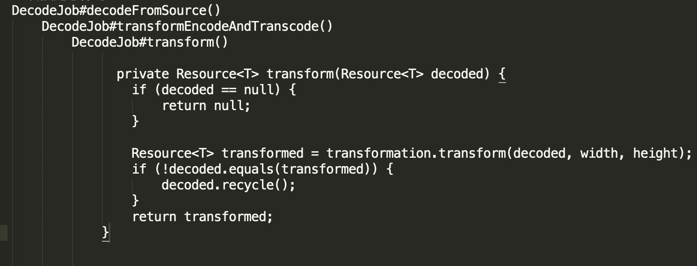

### 一、前言
Glide 是 Android 比较好的图片加载库，最近的项目中使用到了，所以有必要去了解一下 Glide 的源码。Glide 的源码非常多，不可能所有的东西都去了解，所以结合 [郭霖的博客](https://blog.csdn.net/guolin_blog/article/details/53759439) 对 Glide 的源码做了简要的分析。

对 Glide 的了解，主要想解决一下的几个问题：

* 1. Glide 加载图片的流程
* 2. Glide 加载图片流程的监听回调
* 3. Glide 是如何感知外部宿主的生命周期的
* 4. Glide 是如何处理缓存
* 5. Glide 是如何处理转换的
* 6. Glide 如何自定义 GlideModule
* 7. 其他重要的方法和类


本文是基于 Glide 3.7.0 版本分析的。

### 二、正文
#### 1. Glide 加载图片的流程
Glide 加载图片

```java
Glide.with(context).load(url).into(ImageView);
```
- Glide.with() 返回是 RequestManager, RequestManager 是用来管理请求的，同时根据外部宿主（Activity/Fragment）生命周期的变化来管理请求；
- Glide.with(context).load(url), 调用的是 DrawableTypeRequest.load(url), 返回是 DrawableRequestBuilder
- DrawableRequestBuilder.into() 调用父类的 GenericRequestBuilder.into()

图片加载的核心流程开始于 GenericRequest#begin()，中间重要的类是 Engine、EngineRunnable、DecodeJob、EngineJob。

- 简要的流程分析：


- 简要的时序图：



#### 2. Glide 加载图片流程的监听回调
当  EngineRunnable#run() 从数据源（缓存或者网络）获取数据，调用 onLoadComplete（） 方法，并通过回调到 EngineJob#onResourceReady， 然后通过 Handler 讲数据切换回主线程，最后回调 GenericRequest#onResourceReady() 通知完成数据的加载。
EngineRunnable#onLoadComplete()
    ->EngineJob#onResourceReady()
    ->EngineJob#handleResultOnMainThread()
    ->GenericRequest#onResourceReady()
    
当我们设置了 Glide 的 listener 时，调用的时机是在 GenericRequest#onResourceReady() 里面

 
#### 3. Glide 是如何感知外部宿主的生命周期的
Glide 在内部生成一个空的RequestManagerFragment, RequestManagerFragment 用来感知外部宿主的生命周期，然后这个 Fragment t通过 ActivityFragmentLifecycle 影响 RequestManager，来决定 Glide 请求过程中的决定

Glide.with() 是入口；
涉及的类
RequestManagerRetriever、RequestManagerFragment、ActivityFragmentLifecycle


#### 4. Glide 是如何处理缓存
内存缓存，防止应用重复将图片数据读取到内存当中
硬盘缓存， 防止应用重复从网络或其他地方重复下载和读取数据

LruResourceCache  内存缓存
InternalCacheDiskCacheFactory  磁盘缓存策略，默认是 250 MB, DiskCache 类中
DiskLruCacheWrapper 默认的磁盘缓存类
	
- 加载的时候， Engine.load() 方法中会调用 
    - loadFromCache() 从缓存中获取
    - loadFromActiveResources()  从弱引用中获取
- 放入到缓存中
    - 从网络获取数据成功是 EngineRunnable#run() 中回调用 onLoadComplete 回调，然后通过 handle 发送消息回到主线程，调用了EngineJob#handleResultOnMainThread，
		通过回调 Engine#onEngineJobComplete() 中放入到 弱引用缓存中
		EngineResource#acquire() 当前使用资源会加 1；
		EngineResource#release() 不再使用资源减 1； 回调 ResourceListener#onResourceReleased 回到 Engine 中, 放入到LRU内存缓存中


    - 放到磁盘缓存中
     DecodeJob#cacheAndDecodeSourceData()   			
     writeTransformedToCache#writeTransformedToCache()     这两个方法中存入磁盘, 使用 DiskLruCacheWrapper 类
     
     
```java
//EngineRunnable#decodeFromCache
private Resource<?> decodeFromCache() throws Exception {
        Resource<?> result = null;
        try {
            result = decodeJob.decodeResultFromCache(); 先尝试取出 result 的缓存
        } catch (Exception e) {
            if (Log.isLoggable(TAG, Log.DEBUG)) {
                Log.d(TAG, "Exception decoding result from cache: " + e);
            }
        }

        if (result == null) {
            result = decodeJob.decodeSourceFromCache(); 然后再取出 source 的缓存
        }
        return result;
 }
 ```
     
Glide 的缓存策略是在创建 Glide 时确定的

```java
  // GlideBuilder.java
  Glide createGlide() {
        if (sourceService == null) {
            final int cores = Math.max(1, Runtime.getRuntime().availableProcessors());
            sourceService = new FifoPriorityThreadPoolExecutor(cores);
        }
        if (diskCacheService == null) {
            diskCacheService = new FifoPriorityThreadPoolExecutor(1);
        }

        MemorySizeCalculator calculator = new MemorySizeCalculator(context);
        if (bitmapPool == null) {
            if (Build.VERSION.SDK_INT >= Build.VERSION_CODES.HONEYCOMB) {
                int size = calculator.getBitmapPoolSize();
                bitmapPool = new LruBitmapPool(size);
            } else {
                bitmapPool = new BitmapPoolAdapter();
            }
        }

        if (memoryCache == null) {
            memoryCache = new LruResourceCache(calculator.getMemoryCacheSize());
        }

        if (diskCacheFactory == null) {
            diskCacheFactory = new InternalCacheDiskCacheFactory(context);
        }

        if (engine == null) {
            engine = new Engine(memoryCache, diskCacheFactory, diskCacheService, sourceService);
        }

        if (decodeFormat == null) {
            decodeFormat = DecodeFormat.DEFAULT;
        }

        return new Glide(engine, memoryCache, bitmapPool, context, decodeFormat);
    }
```
如果想要改变这些策略，需要自定义 GlideModule,在其 applyOptions 中设置；


#### 5. Glide 是如何处理转换的
```java
 Glide.with(getContext()).load(R.drawable.ic_launchers)
                    .transform(new CircleTransform())
                    .into(mImgUserAdver);
```
 .transform（） 方法设置了 Transformation 的实例，会一直传递到 DecodeJob 中，在 DecodeJob#transform() 中调用

调用的流程

 
所有的变换都需要继承 Transformation

```java
 public interface Transformation<T> {
		 	Resource<T> transform(Resource<T> resource, int outWidth, int outHeight);
		 	String getId();
}
```
 有 Glide 常用变换的开源库可用 https://github.com/wasabeef/glide-transformations
#### 6. Glide 如何自定义 GlideModule
继承 GlideModule，在 AndroidManifest.xml 中加入配置

```xml
<application>
        <meta-data
            android:name="com.example.glidetest.MyGlideModule"
            android:value="GlideModule" />
        ...
  </application>
```

Glide.get() 方法里会把 GlideModule 解析出来

```java
 public static Glide get(Context context) {
        if (glide == null) {
            synchronized (Glide.class) {
                if (glide == null) {
                    Context applicationContext = context.getApplicationContext();
                    List<GlideModule> modules = new ManifestParser(applicationContext).parse();

                    GlideBuilder builder = new GlideBuilder(applicationContext);
                    for (GlideModule module : modules) {
                        module.applyOptions(applicationContext, builder);
                    }
                    glide = builder.createGlide();
                    for (GlideModule module : modules) {
                        module.registerComponents(applicationContext, glide);
                    }
                }
            }
        }
        return glide;
    }
```

#### 7. 其他重要的方法和类
- into() 方法，可以传入自定义 Target
- preload() 方法， 预加载
- downloadOnly() 只下载
- 更改 Glide 的配置，在 GlideBuilder 类中

    - setMemoryCache() 
    用于配置Glide的内存缓存策略，默认配置是LruResourceCache。

    - setBitmapPool() 
用于配置Glide的Bitmap缓存池，默认配置是LruBitmapPool。

    - setDiskCache() 
用于配置Glide的硬盘缓存策略，默认配置是InternalCacheDiskCacheFactory。

    - setDiskCacheService() 
用于配置Glide读取缓存中图片的异步执行器，默认配置是FifoPriorityThreadPoolExecutor，也就是先入先出原则。

    - setResizeService() 
用于配置Glide读取非缓存中图片的异步执行器，默认配置也是FifoPriorityThreadPoolExecutor。

    - setDecodeFormat() 
用于配置Glide加载图片的解码模式，默认配置是RGB_565。

在自定义的 GlideMedule 的 applyOptions 中改配置

```java
 public class MyGlideModule implements GlideModule {

    @Override
    public void applyOptions(Context context, GlideBuilder builder) {
    	// 改配置
        builder.setDiskCache(new ExternalCacheDiskCacheFactory(context));
    }

    @Override
    public void registerComponents(Context context, Glide glide) {
    	// 自定义组件
    	glide.register(GlideUrl.class, InputStream.class, new OkHttpGlideUrlLoader.Factory());

    }
}
```

### 三、其他
- LruBitmapPool 使用 LRU 算法实现的一个 Bitmap 缓存池，可以参考
- DiskCacheWriteLocker 锁的实现


