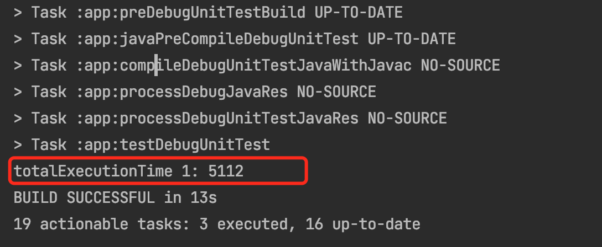
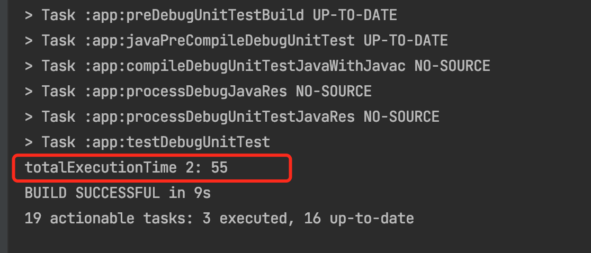
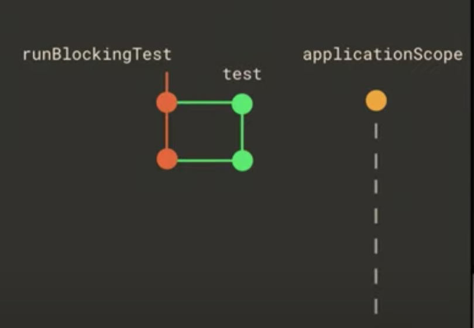
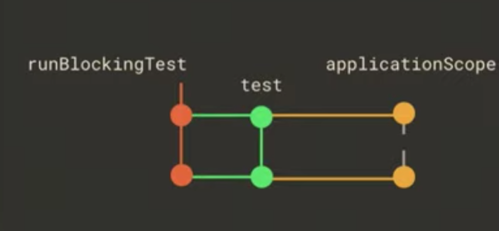

Android Coroutine & LiveData Test

[TOC]

## runBlocking 与 runBlockingTest

runBlockingTest 会跳过挂起函数里面的延迟时间

### runBlocking

```kotlin
class MainViewModel : ViewModel() {

    private var isSessionExpired = false

    suspend fun checkSessionExpiry(): Boolean {
        delay(5_000)
        isSessionExpired = true
        return isSessionExpired
    }
}
```

测试代码

```kotlin

@OptIn(ExperimentalCoroutinesApi::class)
class MainViewModelTest {

    @Test
    fun testCheckSessionExpired() = runBlocking {
        val mainViewModel = MainViewModel()
    
        val totalExecutionTime = measureTimeMillis {
            val isSessionExpired = mainViewModel.checkSessionExpiry()
            assertThat(isSessionExpired).isTrue()
        }
        println("totalExecutionTime 1: $totalExecutionTime")
    }
}
```
输出,可以看到 delay 的 5 秒钟是执行的



### runBlockingTest
按照官方文档 [kotlinx-coroutines-test](https://github.com/Kotlin/kotlinx.coroutines/tree/version-1.4.1/kotlinx-coroutines-test) 应该是可以跳过 delay 时间的

```kotlin
// runBlockingTest 会跳过 delay, 
@Test
fun testCheckSessionExpired2() = runBlockingTest {
    val mainViewModel = MainViewModel()
    val totalExecutionTime = measureTimeMillis {
        val isSessionExpired = mainViewModel.checkSessionExpiry()
        assertThat(isSessionExpired).isTrue()
    }
    println("totalExecutionTime 2: $totalExecutionTime")
}
```



## CoroutineRule

MainViewModel 增加下一个新的函数 saveSessionData, 该函数使用了 viewModelScope

```kotlin
private var userData: Any? = null
fun getUserData(): Any? = userData

suspend fun saveSessionData() {
    viewModelScope.launch { // viewModelScope 需要， CoroutineRule
        userData = "some_user_data"
    }
}
```
如果这是跑一下 `saveSessionData` 的测试代码

```kotlin
@Test
fun testSaveSessionData() = runBlockingTest {
    val mainViewModel = MainViewModel()

    mainViewModel.saveSessionData()

    val userData = mainViewModel.getUserData()

    assertThat(userData).isEqualTo("some_user_data")
}
```

发现会抛出异常

```
Exception in thread "Test worker @coroutine#1" java.lang.IllegalStateException: Module with the Main dispatcher had failed to initialize. For tests Dispatchers.setMain from kotlinx-coroutines-test module can be used
	at kotlinx.coroutines.internal.MissingMainCoroutineDispatcher.missing(MainDispatchers.kt:110)
	at kotlinx.coroutines.internal.MissingMainCoroutineDispatcher.isDispatchNeeded(MainDispatchers.kt:91)
	at kotlinx.coroutines.internal.DispatchedContinuationKt.resumeCancellableWith(DispatchedContinuation.kt:329)
	at kotlinx.coroutines.intrinsics.CancellableKt.startCoroutineCancellable(Cancellable.kt:30)
	at kotlinx.coroutines.intrinsics.CancellableKt.startCoroutineCancellable$default(Cancellable.kt:25)
	at kotlinx.coroutines.CoroutineStart.invoke(CoroutineStart.kt:110)
	at kotlinx.coroutines.AbstractCoroutine.start(AbstractCoroutine.kt:126)
	at kotlinx.coroutines.BuildersKt__Builders_commonKt.launch(Builders.common.kt:56)
	at kotlinx.coroutines.BuildersKt.launch(Unknown Source)
	at kotlinx.coroutines.BuildersKt__Builders_commonKt.launch$default(Builders.common.kt:47)
	at kotlinx.coroutines.BuildersKt.launch$default(Unknown Source)
	at com.yxhuang.androiddailydemo.viewmodel.MainViewModel.saveSessionData(MainViewModel.kt:40)

```

这是因为缺少 Main Dispatcher, 可以通过创建 CoroutineRule  设置解决

```kotlin
class MainCoroutineRule(
    val testDispatcher: CoroutineDispatcher = TestCoroutineDispatcher()
) : TestWatcher(), TestCoroutineScope by TestCoroutineScope(testDispatcher) {

    override fun starting(description: Description?) {
        super.starting(description)
        Dispatchers.setMain(testDispatcher)  // 设置 Main Dispatcher
    }

    override fun finished(description: Description?) {
        super.finished(description)
        cleanupTestCoroutines()
        Dispatchers.resetMain()
    }
}

```

设置使用

```kotlin
@OptIn(ExperimentalCoroutinesApi::class)
class MainViewModelTest {

    @get:Rule
    var mainCoroutineRule = MainCoroutineRule() // 解决  viewModelScope.launch
    
    @Test
    fun testSaveSessionData() = runBlockingTest {
        val mainViewModel = MainViewModel()

        mainViewModel.saveSessionData()

        val userData = mainViewModel.getUserData()

        assertThat(userData).isEqualTo("some_user_data")
    }

```

## LiveData 使用 InstantTaskExecutorRule

```kotlin
class MainViewModel : ViewModel() {


   private var _userLogin = MutableLiveData<Boolean>()
 
    val userLogin :MutableLiveData<Boolean> = _userLogin
    
    suspend fun login(){
        viewModelScope.launch {
             _userLogin.value = true      
        }
    }
}

```
测试

```kotlin

@Test
fun testLogin() = runBlockingTest {

    val mainViewModel = MainViewModel()

    mainViewModel.login()

    val value = mainViewModel.userLogin.value

    assertThat(value).isTrue()
}

```

结果是会失败的

```kotlin
Exception in thread "DefaultDispatcher-worker-1 @coroutine#2" java.lang.RuntimeException: Method getMainLooper in android.os.Looper not mocked. See http://g.co/androidstudio/not-mocked for details.
	at android.os.Looper.getMainLooper(Looper.java)
	at androidx.arch.core.executor.DefaultTaskExecutor.postToMainThread(DefaultTaskExecutor.java:67)
	at androidx.arch.core.executor.ArchTaskExecutor.postToMainThread(ArchTaskExecutor.java:101)
	at androidx.lifecycle.LiveData.postValue(LiveData.java:293)
	at androidx.lifecycle.MutableLiveData.postValue(MutableLiveData.java:45)
	at com.yxhuang.androidtest.coroutines.MainViewModel$login$2.invokeSuspend(MainViewModelTest.kt:51)
```

看到这个异常，就是觉得让 `ArchTaskExecutor#isMainThread()` 函数返回 true， ~~mockkStatic ArchTaskExecutor~~

```kotlin
@OptIn(ExperimentalCoroutinesApi::class)
class MainViewModelTest {

    @get:Rule
    var mainCoroutineRule = MainCoroutineRule() // 解决  viewModelScope.launch


    @Before
    fun setup(){
        mockkStatic(ArchTaskExecutor::class)
        every { ArchTaskExecutor.getInstance().isMainThread } answers { true }
    }
    
    @Test
    fun testLogin() = runBlockingTest {

        val mainViewModel = MainViewModel()

        mainViewModel.login()

        val value = mainViewModel.userLogin.value

        assertThat(value).isTrue()
    }
```
这样是可以通过。

但是这样是有问题的。

会抛出异常，是因为 LivaData 昨晚 Android lifecycle 的一部分，需要 main looper 进行消息处理。应该使用 `InstantTaskExecutorRule` 作为 Rule 使用

```kotlin
@OptIn(ExperimentalCoroutinesApi::class)
class MainViewModelTest {

    @get:Rule
    var mainCoroutineRule = MainCoroutineRule() // 解决  viewModelScope.launch

    @get:Rule
    var instantTaskExecutorRule = InstantTaskExecutorRule()
     // 解决 Method getMainLooper in android.os.Looper not mocked. See http://g.co/androidstudio/not-mocked for details.

```
`InstantTaskExecutorRule` 里面的 ArchTaskExecutor#isMainThread() 固定返回 true

```kotlin
public class InstantTaskExecutorRule extends TestWatcher {
    @Override
    protected void starting(Description description) {
        super.starting(description);
        ArchTaskExecutor.getInstance().setDelegate(new TaskExecutor() {
            @Override
            public void executeOnDiskIO(Runnable runnable) {
                runnable.run();
            }

            @Override
            public void postToMainThread(Runnable runnable) {
                runnable.run();
            }

            @Override
            public boolean isMainThread() {
                return true;
            }
        });
    }
    ...
}

```

## Observer LiveData change

如果要观察 LiveData 的变化，需要使用下面的工具类


```kotlin
@VisibleForTesting(otherwise = VisibleForTesting.NONE)
fun <T> LiveData<T>.getOrAwaitValueTest(
    time: Long = 2,
    timeUnit: TimeUnit = java.util.concurrent.TimeUnit.SECONDS,
    afterObserver: () -> Unit = {}
): T {
    var date: T? = null
    val latch = CountDownLatch(1)
    val observer = object :Observer<T>{
        override fun onChanged(t: T) {
            date = t
            latch.countDown()
            this@getOrAwaitValueTest.removeObserver(this)
        }
    }
    this.observeForever(observer)

    try {
        afterObserver.invoke()
        if (!latch.await(time,timeUnit)){
            throw java.util.concurrent.TimeoutException("LiveData value was never set.")
        }
    } finally {
        this.removeObserver(observer)
    }
    @Suppress("UNCHECKED_CAST")
    return date as T
}
```

使用 getOrAwaitValueTest

```kotlin
@Test
fun testLogin() = runBlockingTest {

    val mainViewModel = MainViewModel()

    mainViewModel.login()

    val value = mainViewModel.userLogin.getOrAwaitValueTest() 

    assertThat(value).isTrue()
}

```

这个测试是通过的。但是使用 getOrAwaitValueTest 是主要下被测试的函数里面有延迟的情况下。

我们把被测试的函数 `login()` 修改成下面的样子

```kotlin
 private var _userLogin = MutableLiveData<Boolean>()
    val userLogin :MutableLiveData<Boolean> = _userLogin
    suspend fun login(){
        viewModelScope.launch {
             delay(3_000)
            _userLogin.postValue(true)
        }
    }
```

这时候会抛出异常 `LiveData value was never set.` 

```kotlin
LiveData value was never set.
java.util.concurrent.TimeoutException: LiveData value was never set.
	at com.yxhuang.androidtest.utils.LiveDataUtilTestKt.getOrAwaitValueTest(LiveDataUtilTest.kt:60)

```
这是因为 getOrAwaitValueTest 里面超时了，LiveData 的值还没通过 onChanged 函数调用

如果添加 advanceTimeBy 或者 advanceUntilIdle 跳过 delay 的时候，应该可以的。

```kotlin
   @Test
    fun testLogin() = runBlockingTest {

        val mainViewModel = MainViewModel()

        println("testLogin : ${Thread.currentThread().name}")

        mainViewModel.login()

        val value = mainViewModel.userLogin.getOrAwaitValueTest {
            advanceTimeBy(3_000)
            // or
//            advanceUntilIdle()
        }

        assertThat(value).isTrue()
    }

```
 但是还是抛出异常，`LiveData value was never set.`
 这是因为它们跑在不同的线程
 
 
 
 修改它们在关联线程即可
 
 ```kotlin
@Test
fun testLogin() = mainCoroutineRule.runBlockingTest {

    val mainViewModel = MainViewModel()

    println("testLogin : ${Thread.currentThread().name}")

    mainViewModel.login()

    val value = mainViewModel.userLogin.getOrAwaitValueTest {
        advanceTimeBy(3_000)
        // or
//            advanceUntilIdle()
    }

    assertThat(value).isTrue()
}
 
 ```
  


## Inject Dispatchers

如果是测试下面的代码

```kotlin

class MainViewModel(
): ViewModel() {
 private var userData: Any? = null
    fun getUserData(): Any? = userData

    suspend fun saveSessionData() {
        viewModelScope.launch(Dispatchers.IO) { // Dispatchers.IO
            userData = "some_user_data"
        }
    }
}
```
测试代码
 
 ```kotlin
@Test
fun testSaveSessionData() = runBlockingTest {
    val mainViewModel = MainViewModel()

    mainViewModel.saveSessionData()

    val userData = mainViewModel.getUserData()

    assertThat(userData).isEqualTo("some_user_data")
}
 ```
 测试代码时候会失败，因为 `userData` 跑在了Dispatchers.IO 线程中。
 
这个使用应该使用注入 CoroutineDispatcher 的方式

```kotlin
class MainViewModel(
    private val dispatcher: CoroutineDispatcher
): ViewModel() {

   suspend fun saveSessionData() {
        viewModelScope.launch(dispatcher) { 
            userData = "some_user_data"
        }
    }
```

测试代码

```kotlin
class MainViewModelTest {

    @get:Rule
    var mainCoroutineRule = MainCoroutineRule() // 解决  viewModelScope.launch

    private val testCoroutineDispatcher = mainCoroutineRule.testDispatcher

    @get:Rule
    var instantTaskExecutorRule = InstantTaskExecutorRule()
    
    
    @Test
    fun testSaveSessionData() = runBlockingTest {
        val mainViewModel = MainViewModel(testCoroutineDispatcher)

        mainViewModel.saveSessionData()

        val userData = mainViewModel.getUserData()

        assertThat(userData).isEqualTo("some_user_data")
    }
```


 
 


# 参考
- [kotlinx-coroutines-test](https://github.com/Kotlin/kotlinx.coroutines/tree/version-1.4.1/kotlinx-coroutines-test)
- [Unit Testing with Kotlin Coroutines: The Android Way](https://medium.com/swlh/unit-testing-with-kotlin-coroutines-the-android-way-19289838d257)
- [Kotlin Coroutines in Android — Unit Test](https://medium.com/swlh/kotlin-coroutines-in-android-unit-test-28ff280fc0d5)

