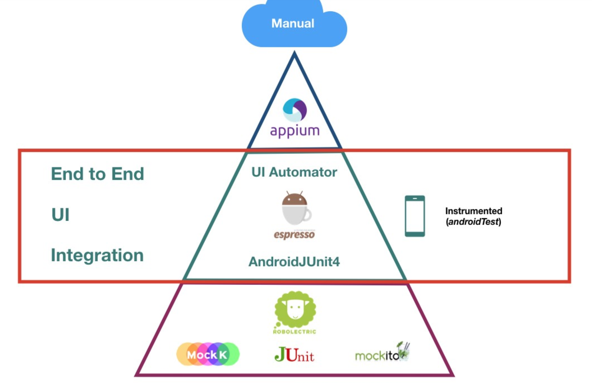
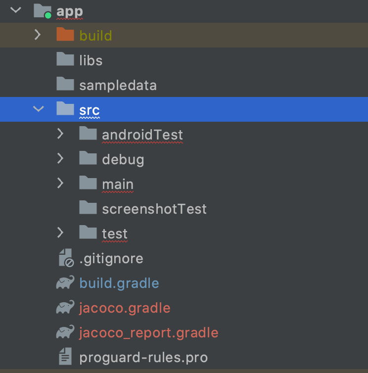
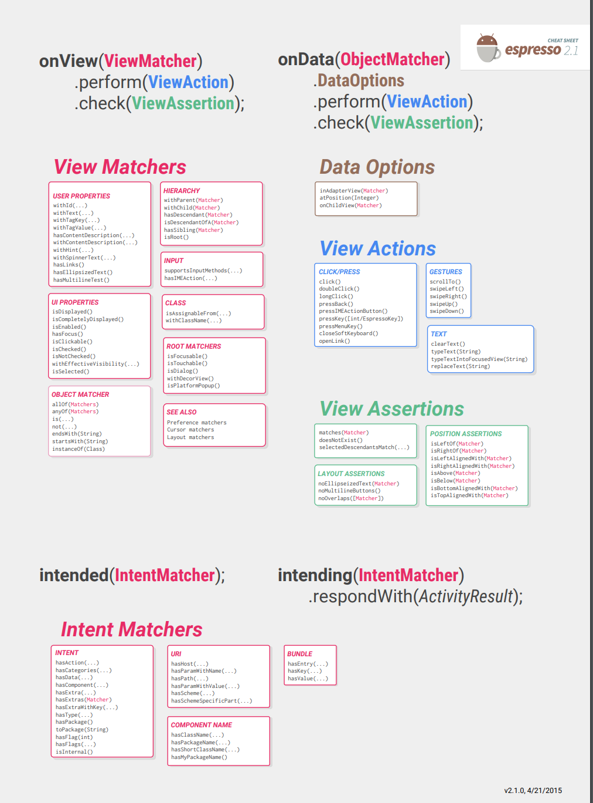

[toc]

Android 测试基本内容



Android 的测试主要分为： Android Test,  Test 

它们的位置在下图中比较清楚的看到



# Android Test
Android Test 是跑在实体机或者模拟机上的。
它一般是 Android 里面的 UI test 还有是页面转换的测试，例如从 A 页面点击跳转到 B 页面。

# Test
Test 是跑在本地 JVM 上的单元测试。

# 必要的测试
在 Android 中必要的测试包含：

- ViewModel or Presenters 的单元测试
- 数据层的单元测试，例如 Respository
- 工具类的单元测试
- 其他与平台无关的的单元测试，例如 Domain layer
- 临界条件的单元测试，例如 List 的边界，除数为 0 等

# 非必要的测试
非必要的测试一般是指直接测试 framework 里面的 activity, fragment , service  等。但是如果是我们自己写的 activity, fragment, service  则是需要测试的。
第三方库也是不需要测试的。


# 测试框架

## JUnit 4

## Espresso test
主要是用于 UI 测试
流程是 ViewMatcher -> ViewAction -> ViewAssertion

```kotlin
// withId(R.id.my_view) is a ViewMatcher
// click() is a ViewAction
// matches(isDisplayed()) is a ViewAssertion
onView(withId(R.id.my_view))
    .perform(click())
    .check(matches(isDisplayed()))

```

进行 Espresso 测试需要改变以下三个选项，在设置 ->开发者选项里面

- Window animation scale
- Transition animation scale
- Animator duration scale

常用的 Espresso Api




# 模拟对象测试
在写测试的时候，为了解决代码的依赖问题，需要一些模拟对象。例如 A 依赖 B， 可以创建一个模拟的对 B'.
模拟对象的分类分为
Fake, Mock, Stub, Dummy, Spy, Shadow

| 模拟对象类型 |  说明 |
| --- | --- |
| Fake | A test double that has a "working" implementation of the class, but it is implemented in a way that makes it good for tests but unsuitable for production <br> Example: an in-memory database <br><br> Fakes don't require a mocking framework and are lightweight. They are preferred | 
| Mock | A test double that behaves how you program it to behave and that has expectations about its interactions. Mocks will fail tests if their interactions don't match the requirements that you define. Mocks are usually created with a *mocking framework* to achieve all this <br><br>Example: Verify that a method in a database was called exactly once|
| Stub |A test double that behaves how you program it to behave but doesn't have expectations about its interactions. Usually created with a mocking framework. Fakes are preferred over stubs for simplicity.|
| Dummy| A test double that is passed around but not used, such as if you just need to provide it as a parameter.<br>Example: an empty function passed as a click callback. |
| Spy| A wrapper over a real object which also keeps track of some additional information, similar to mocks. They are usually avoided for adding complexity. Fakes or mocks are therefore preferred over spies.|
| Shadow| Fake used in Robolectric.|


参考 [Use test doubles in Android](https://developer.android.com/training/testing/fundamentals/test-doubles)

关于这几个模拟对象的使用，在后续的具体代码中讨论。


# 参考
- [Test apps on Android](https://developer.android.com/training/testing) 


