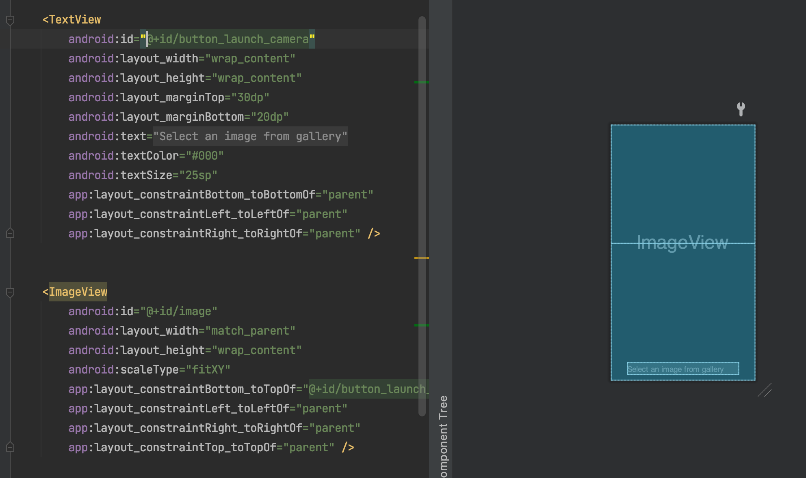

Espresso Intent

[toc]

这是 Espresso UI 测试系列的第四篇文章。这篇主要是讲述 Intent 的测试。
Intent  在 Android 里面用的比较频繁，一般会用于启动新的 Activity 或者 Service.

代码来源于 youtube 视频：https://www.youtube.com/watch?v=xxO0Z9GzcBU&list=PLgCYzUzKIBE_ZuZzgts135GuLQNX5eEPk&index=10

# 1.0 知识点
## 1.1 IntentsTestRule
IntentsTestRule 是继承 ActivityTestRule, 它是为了更加方便使用 Espresso-Intents 的 api 用于 UI 测试。

## 1.2 Matcher\<T>

Matcher 可以用于拦截 intents, 但是需要同时配合 `intended()` 和 `intending()` 函数一起使用。

其中 `intending(expectedIntent).respondWith(activityResult)` 类似于 `when ... return ...`,当调用 expectedIntent, 返回 activityResult 结果。

例如：

```kotlin
   // GIVEN
    val expectedIntent: Matcher<Intent> = allOf(
        hasAction(Intent.ACTION_PICK),
        hasData(MediaStore.Images.Media.EXTERNAL_CONTENT_URI)
    )

    val activityResult = createGalleryPickActivityResultStub()

    // 要调整的 intent, 要验证的返回结果 activityResult
    // 类似于 when ... return ...
    intending(expectedIntent).respondWith(activityResult)

    // Execute and Verify
    onView(withId(R.id.button_open_gallery)).perform(click())
    intended(expectedIntent)
```


## 1.3 InstrumentationRegistry
主要用于获取 Instrumentation 和 application context 

如果是用于获取 application context 可以用 `ApplicationProvider.getApplicationContext<Context>()`  来替代。


链接：https://developer.android.com/reference/kotlin/androidx/test/InstrumentationRegistry

## 1.4 Espresso.intent
参加 1.2 Matcher>

## 1.5 BoundedMatcher\<T, S extends T>

BoundedMatcher<T, S extends T>:一些匹配的语法糖，可以让你创建一个给定的类型，而匹配的特定亚型的只有过程项匹配。
 类型参数：
 
 - \<T> : 匹配器的期望类型
 - \<S> : T 的亚型

链接：https://developer.android.com/training/testing/espresso/lists

例子：判断 ImageView 是否设置了 drawable

```kotlin
object ImageViewHasDrawableMatcher {

    fun hasDrawable(): BoundedMatcher<View, ImageView> {
        return object : BoundedMatcher<View, ImageView>(ImageView::class.java) {
            override fun describeTo(description: Description?) {
                description?.appendText("has drawable")
            }

            override fun matchesSafely(item: ImageView?): Boolean {
                return item?.drawable != null
            }
        }
    }
}

```

# 2.0 Intent test

## 2.1 需求代码
现在是从一个页面点击，发出 intent 去相册里去挑选照片，返回，设置到 ImageView 上。




ImageViewerActivity.kt

```kotlin
const val GALLERY_REQUEST_CODE_2 = 1234
const val KEY_IMAGE_DATA = "data"

class ImageViewerActivity : AppCompatActivity() {

    companion object {
        private const val TAG = "ImageViewerActivity_"
    }

    override fun onCreate(savedInstanceState: Bundle?) {
        super.onCreate(savedInstanceState)
        setContentView(R.layout.activity_image_viewer)
        Log.i(TAG, "onCreate")

        findViewById<TextView>(R.id.button_launch_camera).setOnClickListener {
            pickFromGallery()
        }
    }

    override fun onActivityResult(requestCode: Int, resultCode: Int, data: Intent?) {
        super.onActivityResult(requestCode, resultCode, data)

        if(resultCode == Activity.RESULT_OK){
            Log.d(TAG, "RESULT_OK")
            when(requestCode){

                GALLERY_REQUEST_CODE_2 -> {
                    Log.d(TAG, "REQUEST_IMAGE_CAPTURE detected.")
                    data?.extras.let{ extras ->
                        if (extras == null || !extras.containsKey(KEY_IMAGE_DATA)) {
                            return
                        }
                        val imageBitmap = extras[KEY_IMAGE_DATA] as Bitmap?
                        image.setImageBitmap(imageBitmap)
                    }
                }
            }
        }
    }

    private fun pickFromGallery() {
        val intent = Intent(Intent.ACTION_PICK, MediaStore.Images.Media.EXTERNAL_CONTENT_URI)
        startActivityForResult(intent, GALLERY_REQUEST_CODE_2)
    }

}

```


## 2.2 测试代码

```kotlin
@RunWith(AndroidJUnit4ClassRunner::class)
class ImageViewerActivityTest {

    @get:Rule
    val intentsTestRule = IntentsTestRule(ImageViewerActivity::class.java)

    @Test
    fun test_validateIntentSendToPackage() {

        // GIVEN
        val expectedIntent: Matcher<Intent> = hasAction(Intent.ACTION_PICK)

        val activityResult = createGalleryPickActivityResultStub()
        intending(expectedIntent).respondWith(activityResult)

        // Execute and Verify
        onView(withId(R.id.image)).check(matches(not(ImageViewHasDrawableMatcher.hasDrawable())))
        onView(withId(R.id.button_launch_camera)).perform(click())
        // 验证
        intended(expectedIntent)
        onView(withId(R.id.image)).check(matches(ImageViewHasDrawableMatcher.hasDrawable()))
    }

    private fun createGalleryPickActivityResultStub(): Instrumentation.ActivityResult {
        val bundle = Bundle()
        bundle.putParcelable(
            KEY_IMAGE_DATA, BitmapFactory.decodeResource(
                intentsTestRule.activity.resources,
                R.drawable.ic_launcher_background
            )
        )
        val resultData = Intent()
        resultData.putExtras(bundle)
        return Instrumentation.ActivityResult(Activity.RESULT_OK, resultData)
    }
}

```

相关代码已经放置到 Github: https://github.com/yxhuangCH/EspressoDemo/tree/Espresso/intent

# 参考
- https://developer.android.com/training/testing/espresso/intents

