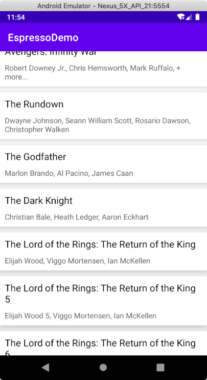

Espresso RecyclerView

[toc]

这是 Espresso UI 测试系列的第六篇文章。这篇主要是讲述 RecyclerView 的测试。

代码来源于 youtube 视频 UI Testing for Beginners ：https://www.youtube.com/playlist?list=PLgCYzUzKIBE_ZuZzgts135GuLQNX5eEPk

# 1.0 知识点

和 RecyclerView 交换测试的函数都在 RecyclerViewActions 有

- scrollTo(): 滑动到匹配到的 View 的位置
- scrollToHolder(): 滑动到匹配的 ViewHolder
- scrollToPosition(): 活动到指定的 Item 的位置
- scrollOnHolderItem(): 对匹配的 View Holder 进行对应的 View Action
- actionOnItem(): 对匹配到的 View 进行 View Action
- actionOnItemAtPosition(): 对指定位置 View 进行相应的 View Action

https://developer.android.com/training/testing/espresso/lists

# 2.0 实例代码

## 2.1 项目代码

要实现的比较简单就是一个 ListFragment 展示电影的相关信息




## 2.2 测试代码

测试页面显示

```kotlin
@Test
fun test_isListFragmentVisible_onAppLaunch() {
    onView(withId(R.id.recycler_view)).check(matches(isDisplayed()))
}
```

测试其中一个 item 的 text 文本内容存在

```kotlin
@Test
fun test_itemText_Exist() {
    val  movieTitle = MOVIE_IN_TEST.title
    onView(withId(R.id.recycler_view))
        .perform(RecyclerViewActions.scrollTo<MoviesListAdapter.MovieViewHolder>(hasDescendant(withText(movieTitle))))
}
```

测试滚动到指定位置进行操作，actionOnItemAtPosition

```kotlin
@Test
fun test_selectListItem_isDetailFragmentVisible() {
    // Click list item #LIST_ITEM_IN_TEST
    onView(withId(R.id.recycler_view)).perform(
        actionOnItemAtPosition<MoviesListAdapter.MovieViewHolder>(LIST_ITEM_IN_TEST, click()))
    // Confirm nav to DetailFragment and display title
    onView(withId(R.id.movie_title)).check(matches(withText(MOVIE_IN_TEST.title)))
}
```

完整的测试相关代码已经放置到 Github: https://github.com/yxhuangCH/EspressoDemo/tree/Espresso/RecyclerView


