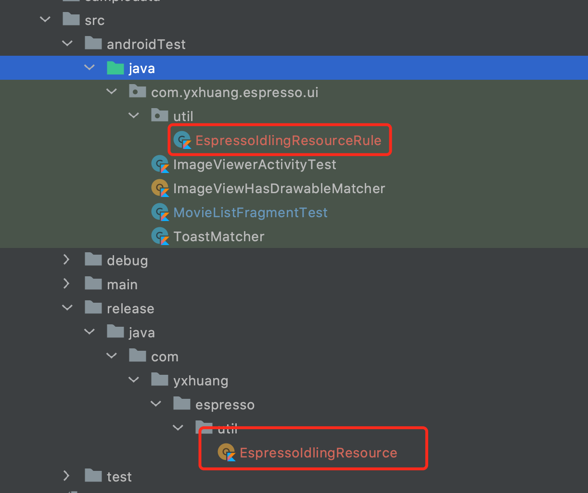
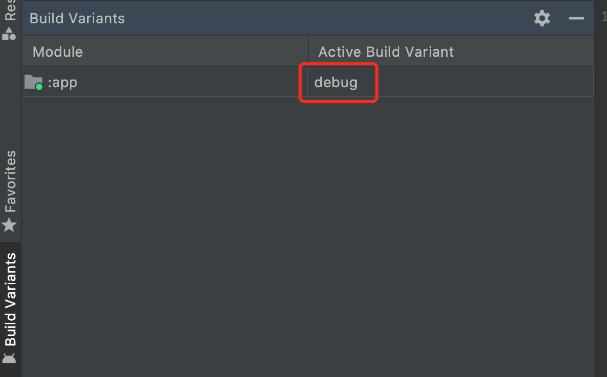

Espresso Test Rule


[toc]

这是 Espresso UI 测试系列的第八篇文章。这篇主要是讲述 idling resources 在 debug 和 release 中设置，TestRule 的设置 的测试。

代码来源于 youtube 视频：https://www.youtube.com/watch?v=55BsY7mfIhI&list=PLgCYzUzKIBE_ZuZzgts135GuLQNX5eEPk&index=18

# 1.0 TestWatcher

TestWatcher 是继承 TestRule，我们复写它的几个常用方法有，

- succeeded，在测试成功的时候调用
- failed, 在测试失败的时候调用
- starting，在测试开始之前调用
- finished，在测试之后调用

```kotlin
public abstract class TestWatcher implements TestRule {

    ...


    /**
     * Invoked when a test succeeds
     */
    protected void succeeded(Description description) {
    }

    /**
     * Invoked when a test fails
     */
    protected void failed(Throwable e, Description description) {
    }


    /**
     * Invoked when a test is about to start
     */
    protected void starting(Description description) {
    }

    /**
     * Invoked when a test method finishes (whether passing or failing)
     */
    protected void finished(Description description) {
    }

}

```

在我们的例子中是在测试开始前注册 EspressoIdlingResource， 在测试介绍之后反注册  EspressoIdlingResource

```kotlin
// EspressoIdlingResourceRule.kt

class EspressoIdlingResourceRule : TestWatcher() {

    override fun starting(description: Description?) {
        IdlingRegistry.getInstance().register(EspressoIdlingResource.countingIdlingResource)
        super.starting(description)
    }

    override fun finished(description: Description?) {
        IdlingRegistry.getInstance().unregister(EspressoIdlingResource.countingIdlingResource)
        super.finished(description)
    }
}
```


# 2.0 EspressoIdlingResource 的 release 和 debug 设置



**Debug 中的 EspressoIdlingResourceRule****

```kotlin
class EspressoIdlingResourceRule : TestWatcher() {

    override fun starting(description: Description?) {
        IdlingRegistry.getInstance().register(EspressoIdlingResource.countingIdlingResource)
        super.starting(description)
    }

    override fun finished(description: Description?) {
        IdlingRegistry.getInstance().unregister(EspressoIdlingResource.countingIdlingResource)
        super.finished(description)
    }

}

```

**Release 中的 EspressoIdlingResourceRule**

```kotlin
object EspressoIdlingResource {

    fun increment() {

    }

    fun decrement() {

    }
}
```
根据编译的类型，自己可以选 Active Build Variant 的版本为 debug 或者 release. 
如果选择的是 debug,  则编译进去的是 Debug 中的 EspressoIdlingResourceRule， 这样 EspressoIdlingResource 能起到作用。
如果选择的是 release， 则编译进去的是 Release 中 EspressoIdlingResourceRule。 这时  increment 和 decrement 里面都是空方法，这样对 release 的逻辑没有影响。




<br>

相关代码已经放置到 Github: https://github.com/yxhuangCH/EspressoDemo/tree/Espresso/IdlingResource2


