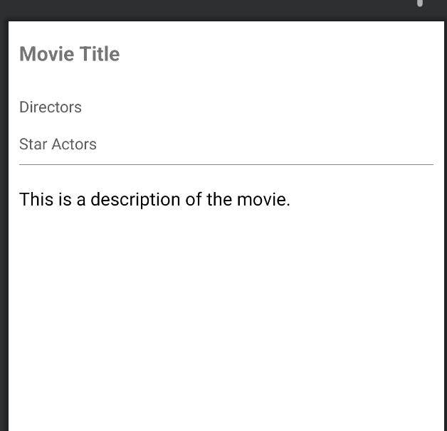
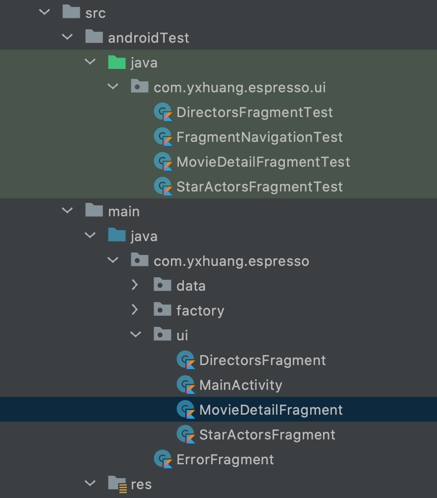

https://developer.android.com/guide/fragments/test

Espresso Fragment Test
这是 Espresso 的第二篇，Fragment 的 UI 测试。
它包括两部分内容， 一是测试 fragment 的 UI 测试，另外一部分是 fragment 的跳转测试。

参考代码来源：[youtube 视频Fragments in Isolation Espresso Testing (Espresso for Beginners PART 6)](https://www.youtube.com/watch?v=VuPU6yG0uwg&list=PLgCYzUzKIBE_ZuZzgts135GuLQNX5eEPk&index=7)

 页面是一个电影介绍页 `MovieDetailFragment`，包括：

 - Directors 导演，点击可以进去详细页面， `DirectorsFragment`
 - Star Actors 演员，点击可以进去详细页面, `StarActorsFragment`




# 知识点

**launchFragmentInContainer**
是创建测试fragment 的方法，被创建的 fragment 可以用于交互

**launch**
也是创建测试 fragment 的方法，但是被创建的 fragment 不可进行交互

官方文档：https://developer.android.com/guide/fragments/test

# Fragment Test

测试页面包含， `DirectorsFragmentTest` 和 `StarActorsFragmentTest`

如下图所示




## MovieDetailFragmentTest

MovieDetailFragmentTest 是测试 MovieDetailFragment， 主要是验证 MovieDetailFragment 的创建展示。

```kotlin
@RunWith(AndroidJUnit4ClassRunner::class)
class MovieDetailFragmentTest {

    @Test
    fun test_isMovieDataVisible() {
        // SETUP
        val movie = THE_RUNDOWN
        val fragmentFactory = MovieFragmentFactory()
        val bundle = Bundle()
        bundle.putInt("movie_id", movie.id)
        val scenario = launchFragmentInContainer<MovieDetailFragment>(
            fragmentArgs = bundle,
            factory = fragmentFactory
        )

        // VERIFY
        onView(withId(R.id.movie_title)).check(matches(withText(movie.title)))
        onView(withId(R.id.movie_description)).check(matches(withText(movie.description)))
    }
}
```


## DirectorsFragmentTest

DirectorsFragmentTest 是测试 DirectorsFragment 主要是验证 DirectorsFragment 的创建展示。

```kotlin
@RunWith(AndroidJUnit4ClassRunner::class)
class DirectorsFragmentTest{

    @Test
    fun test_isDirectorsListVisible() {
        // GIVEN
        val directors = arrayListOf("贾樟柯", "张艺谋")
        val fragmentFactory = MovieFragmentFactory()
        val bundle = Bundle()
        bundle.putStringArrayList("args_directors", directors)
        val scenario = launchFragmentInContainer<DirectorsFragment>(
            fragmentArgs = bundle,
            factory = fragmentFactory
        )

        // 验证
        onView(withId(R.id.directors_text))
            .check(matches(withText(DirectorsFragment.stringBuilderForDirectors(directors))))
    }
}

```


## StarActorsFragmentTest
StarActorsFragmentTest 是测试 StarActorsFragment 主要是验证 StarActorsFragment 的创建展示。

```kotlin
@RunWith(AndroidJUnit4ClassRunner::class)
class StarActorsFragmentTest{

    @Test
    fun test_isActorsListVisible() {
        // GIVEN
        val actors = arrayListOf(
            "李雪健",
            "吴京",
            "郝蕾"
        )
        val fragmentFragmentFactory = MovieFragmentFactory()
        val bundle = Bundle()
        bundle.putStringArrayList("args_actors", actors)
        val scenario = launchFragmentInContainer<StarActorsFragment>(
            fragmentArgs = bundle,
            factory = fragmentFragmentFactory
        )

        // VERIFY
        onView(withId(R.id.star_actors_text))
            .check(ViewAssertions.matches(withText(StarActorsFragment.stringBuilderForStarActors(actors))))

    }
```

# Fragment 跳转测试

    
fragment 测试跳转，先创建 MainActivity， 它会默认加载 MovieDetailFragment, 点击，跳转到 DirectorsFragment。
然后点击返回按钮，返回 MovieDetailFragment，
再点击跳转去 StarActorsFragment，然后再点击返回 MovieDetailFragment 这样的一个过程。


```kotlin
@RunWith(AndroidJUnit4ClassRunner::class)
class FragmentNavigationTest {

    @Test
    fun testMovieFragmentsNavigation() {

        // Setup
        val activityScenario = ActivityScenario.launch(MainActivity::class.java)

        // NAV DirectorsFragment
        onView(withId(R.id.movie_directiors)).perform(click())

        // 验证
        onView(withId(R.id.fragment_directors_parent)).check(matches(isDisplayed()))

        // 返回 MovieDetailFragment
        pressBack()

        // 验证 MovieDetailFragment 页面
        onView(withId(R.id.fragment_movie_detail_parent)).check(matches(isDisplayed()))

        // 跳转到 StarActorsFragment
        onView(withId(R.id.movie_star_actors)).perform(click())

        // 验证 StarActorsFragment
        onView(withId(R.id.fragment_star_actors_parent)).check(matches(isDisplayed()))

        // 返回 MovieDetailFragment
        pressBack()

        // 验证 MovieDetailFragment 页面
        onView(withId(R.id.fragment_movie_detail_parent)).check(matches(isDisplayed()))

    }
}
```
# 其他
- Scenario.moveToState 可以驱动 fragment 到不同的状态
- Scenario.recreate() 重建 fragment


