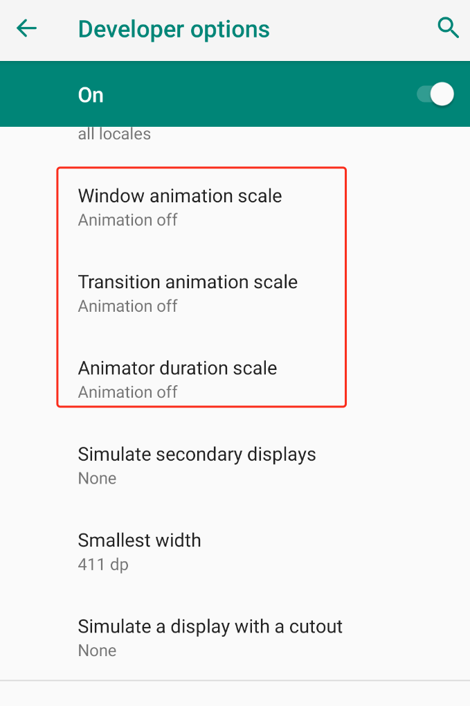

Espresso

[toc]

# 核心的部分

- **ViewMatchers**
是一个实现了 `Matcher<? super View>` 接口的集合对象。它可以作为参数出入到 `onView()` 函数里面.

- **ViewActions**
是一个可以作为参数出入到 `ViewInteraction.perform()`的参数，它也是 `ViewAction` 对象的集合对象. 例如 `click()`

- **ViewAssertions**
是一个可以作为参数出入到 `ViewInteraction.check()`的参数。用来判断 View 的状态。

```java
onView(ViewMatcher)             ①    
 .perform(ViewAction)           ②  
   .check(ViewAssertion);       ③
```
① - 找到 View
② - 对这个 View 执行动作
③ - 进行有效的断言

```kotlin
// withId(R.id.my_view) is a ViewMatcher
// click() is a ViewAction
// matches(isDisplayed()) is a ViewAssertion
onView(withId(R.id.my_view))
    .perform(click())
    .check(matches(isDisplayed()))
```

# 使用前注意事项
使用前应该关掉实体机或模拟机的动画




# 参考
https://www.vogella.com/tutorials/AndroidTestingEspresso/article.html

https://developer.android.com/training/testing/espresso


