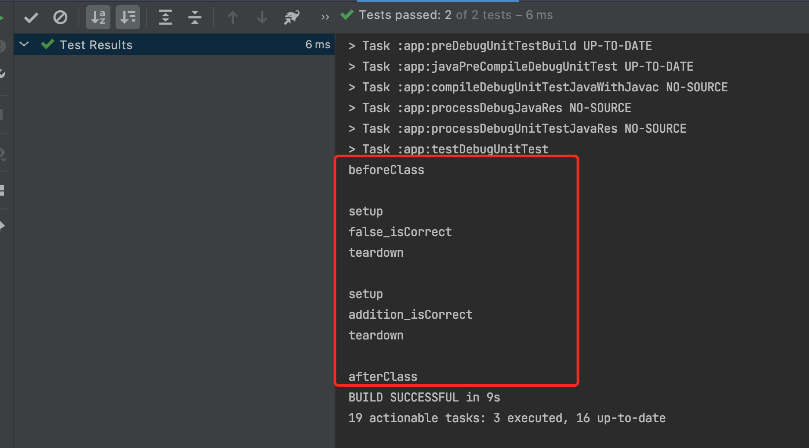

JUnit4

# 定义
JUint是Java编程语言的单元测试框架，用于编写和运行可重复的自动化测试。


#常用注解
**@Test**
 在junit3中，是通过对测试类和测试方法的命名来确定是否是测试，且所有的测试类必须继承junit的测试基类。在junit4中，定义一个测试方法变得简单很多，只需要在方法前加上@Test就行了。 注意：测试方法必须是public  void，即公共、无返回数据。可以抛出异常。 
 
**@Ignore**
有时候我们想暂时不运行某些测试方法\测试类，可以在方法前加上这个注解。在运行结果中，junit会统计忽略的用例数，来提醒你。但是不建议经常这么做，因为这样的坏处时，容易忘记去更新这些测试方法，导致代码不够干净，用例遗漏。使用此标注的时候不能与其它标注一起使用，如：和@Test 标注一起使用，那就没用了 
如果在这个测试通不过，暂时又没法很快解决的时候，可以添加 @Ignore


**@BeforeClass**
 当我们运行几个有关联的用例时，可能会在数据准备或其它前期准备中执行一些相同的命令，这个时候为了让代码更清晰，更少冗余，可以将公用的部分提取出来，放在一个方法里，并为这个方法注解@BeforeClass。意思是在测试类里所有用例运行之前，运行一次这个方法。例如创建数据库连接、读取文件等。 注意：方法名可以任意，但必须是public static void，即公开、静态、无返回。这个方法只会运行一次。 
 
**@AfterClass**
跟@BeforeClass对应，在测试类里所有用例运行之后，运行一次。用于处理一些测试后续工作，例如清理数据，恢复现场。 注意：同样必须是public static void，即公开、静态、无返回。这个方法只会运行一次。 @Before 与@BeforeClass的区别在于，

**@Before**
**不止运行一次，它会在每个用例运行之前都运行一次**。主要用于一些独立于用例之间的准备工作。 比如两个用例都需要读取数据库里的用户A信息，但第一个用例会删除这个用户A，而第二个用例需要修改用户A。那么可以用@BeforeClass创建数据库连接。用@Before来插入一条用户A信息。 注意：必须是public void，不能为static。不止运行一次，根据用例数而定。 

**@After**
与@Before对应。


# 生命周期
添加依赖

```gradle
  testImplementation "junit:junit:4.13"
```

测试代码
kotlin
```kotlin
class ExampleUnitTest {

    companion object{

        @BeforeClass  // 静态
        @JvmStatic
        fun beforeClass(){
            println("beforeClass")
            println()
        }

        @AfterClass
        @JvmStatic
        fun afterClass(){
            println("afterClass")
        }
    }

    @Before
    fun setup(){
        println("setup")
    }

    @After
    fun teardown(){
        println("teardown")
        println()
    }
    @Test
    fun addition_isCorrect() {
        println("addition_isCorrect")
        assertEquals(4, 2 + 2)
    }

    @Test
    fun false_isCorrect() {
        println("false_isCorrect")
        val result = false
        assertFalse(result)
    }
}

```

Java

```java

   @BeforeClass
    public static void beforeClass() { // 静态
        System.out.println("in before class");
    }

    @AfterClass
    public static void afterClass() {
        System.out.println("in after class");
    }
```



# 常用的断言


| 断言 | 描述 |
| --- | --- | 
| void assertEquals([String message],expected value,actual value) |    断言两个值相等。值类型可能是int，short，long，byte，char，Object，第一个参数是一个可选字符串消息 |
|void assertTrue([String message],boolean condition) | 断言一个条件为真|
| void assertFalse([String message],boolean condition) | 断言一个条件为假 |
|void assertNotNull([String message],java.lang.Object object)|断言一个对象不为空（null）|
|void assertNull([String message],java.lang.Object object)|断言一个对象为空（null）|
| void assertSame([String message],java.lang.Object expected,java.lang.Object actual)| 断言两个对象引用相同的对象 |
| void assertNotSame([String message],java.lang.Object unexpected,java.lang.Object actual)| 断言两个对象不是引用同一个对象|
|void assertArrayEquals([String message],expectedArray,resultArray)| 断言预期数组和结果数组相等，数组类型可能是int，short，long，byte，char，Object|

        
# 测试异常

```kotlin
@Test(expected = ArithmeticException::class)
fun exceptionFailTest() {
    val a = 0
    val b = 1 / a
}
```

或者

```kotlin
@Test
fun exceptionFailTest() {
    assertThrows(ArithmeticException::class.java) {
        val blackHole = 1 / 0
    }
}
```


