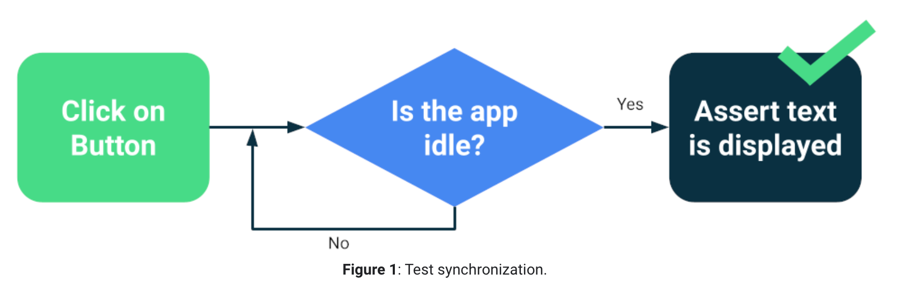
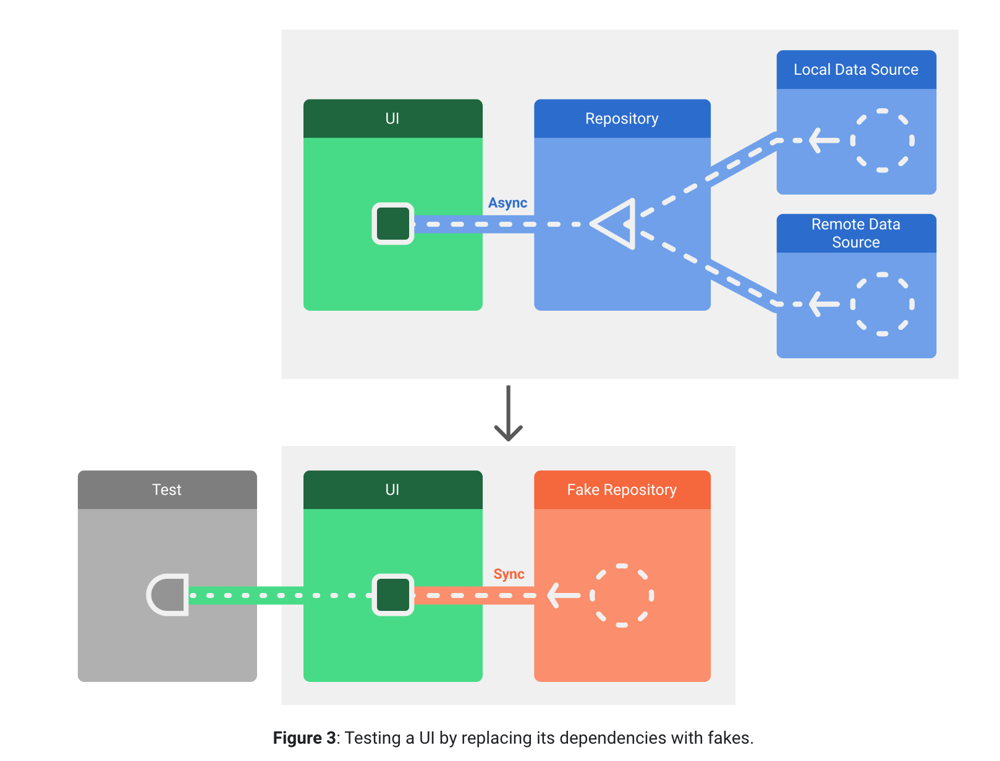

Android UI Test

## Test synchronization

| 类型 | 使用 | 
| --- | --- | 
|Espresso | [Espresso Idling Resources](https://developer.android.com/training/testing/espresso/idling-resource) |
|Coroutines| [TestDispatcher](https://developer.android.com/kotlin/coroutines/coroutines-best-practices#test-coroutine-dispatcher) |
|RxJava| [RxIder](https://github.com/square/RxIdler) |

应该等 app idle

而不是直接设置等待时间

## Architecture and test setup

可以测试的架构

## 参考

