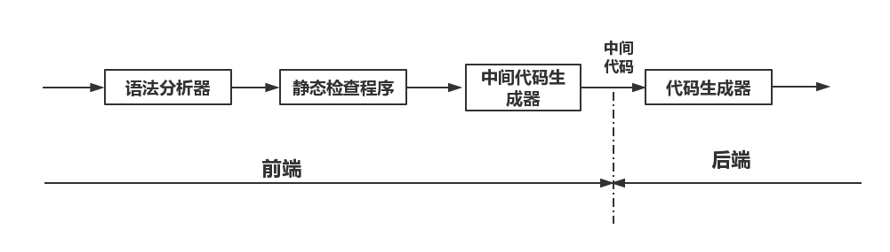
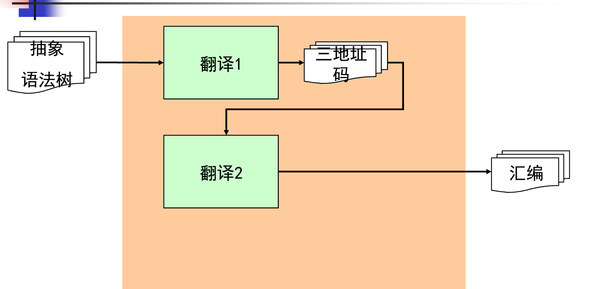
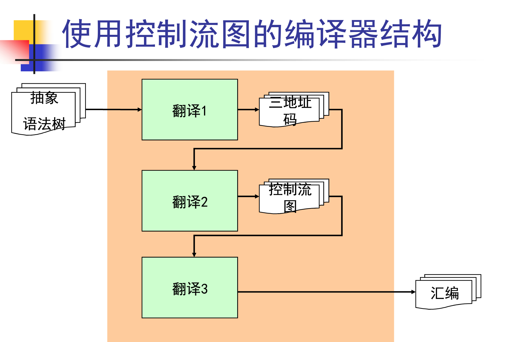
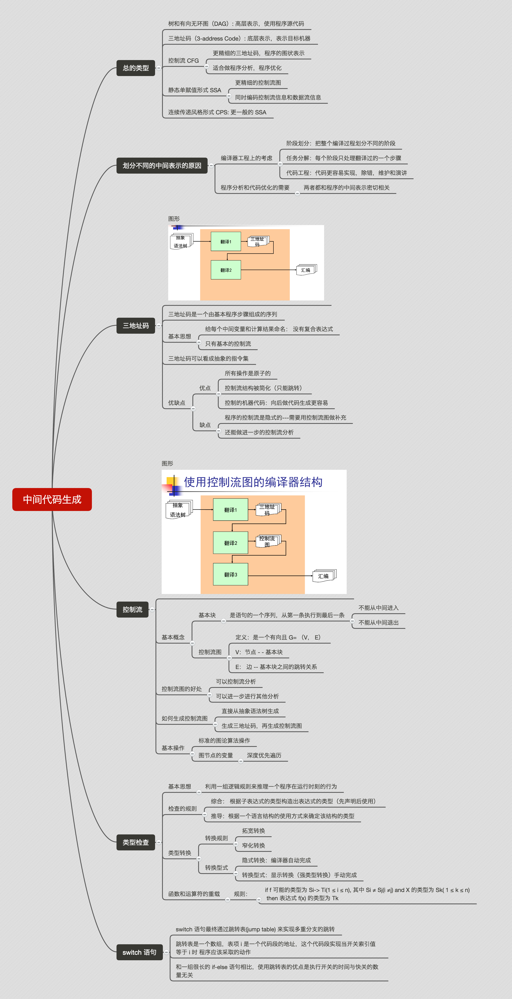

### 中间代码所处的位置

###总的类型
- 树和有向无环图（DAG）: 高层表示，使用程序源代码
- 三地址码（3-address Code）: 底层表示，表示目标机器
- 控制流 CFG
    - 更精细的三地址码，程序的图状表示
    - 适合做程序分析，程序优化
- 静态单赋值形式 SSA
    - 更精细的控制流图    
    - 同时编码控制流信息和数据流信息
- 连续传递风格形式 CPS: 更一般的 SSA
- 划分不同的中间表示的原因
    - 编译器工程上的考虑
        - 阶段划分：把整个编译过程划分不同的阶段
        - 任务分解：每个阶段只处理翻译过的一个步骤
        - 代码工程：代码更容易实现，除错，维护和演讲
- 程序分析和代码优化的需要
    - 两者都和程序的中间表示密切相关
    
###三地址码
- 图形

- 三地址码是一个由基本程序步骤组成的序列
- 基本思想
    - 给每个中间变量和计算结果命名： 没有复合表达式
    - 只有基本的控制流
- 三地址码可以看成抽象的指令集
- 优缺点
    - 优点
        - 所有操作是原子的
        - 控制流结构被简化（只能跳转）
        - 控制的机器代码：向后做代码生成更容易
    - 缺点
        - 程序的控制流是隐式的---需要用控制流图做补充
        - 还能做进一步的控制流分析

###控制流
- 图形

- 基本概念
    - 基本块
        - 是语句的一个序列，从第一条执行到最后一条
            - 不能从中间进入
            - 不能从中间退出
- 控制流图
    - 定义：是一个有向且 G= （V， E）
    - V：节点 - - 基本块
    - E： 边 -- 基本块之间的跳转关系
- 控制流图的好处
    - 可以控制流分析
    - 可以进一步进行其他分析
- 如何生成控制流图
    - 直接从抽象语法树生成
    - 生成三地址码，再生成控制流图
- 基本操作
    - 标准的图论算法操作
    - 图节点的变量
        - 深度优先遍历
- 类型检查
    - 基本思想:
利用一组逻辑规则来推理一个程序在运行时刻的行为
    - 检查的规则
        - 综合： 根据子表达式的类型构造出表达式的类型（先声明后使用）
        - 推导：根据一个语言结构的使用方式来确定该结构的类型
    - 类型转换
        - 转换规则
            - 拓宽转换
            - 窄化转换
    - 转换型式
        - 隐式转换：编译器自动完成
        - 转换型式：显示转换（强类型转换）手动完成
    - 函数和运算符的重载
        - 规则：
if f 可能的类型为 Si-> Ti(1 ≤ i ≤ n), 
其中 Si ≠ Sj(i ≠j) and X 的类型为 Sk( 1 ≤ k ≤ n) then 表达式 f(x) 的类型为 Tk

###switch 语句
- switch 语句最终通过跳转表(jump table) 来实现多重分支的跳转
- 跳转表是一个数组，表项 i 是一个代码段的地址，这个代码段实现当开关索引值等于 i 时 程序应该采取的动作
- 和一组很长的 if-else 语句相比，使用跳转表的优点是执行开关的时间与快关的数量无关

### 总图

