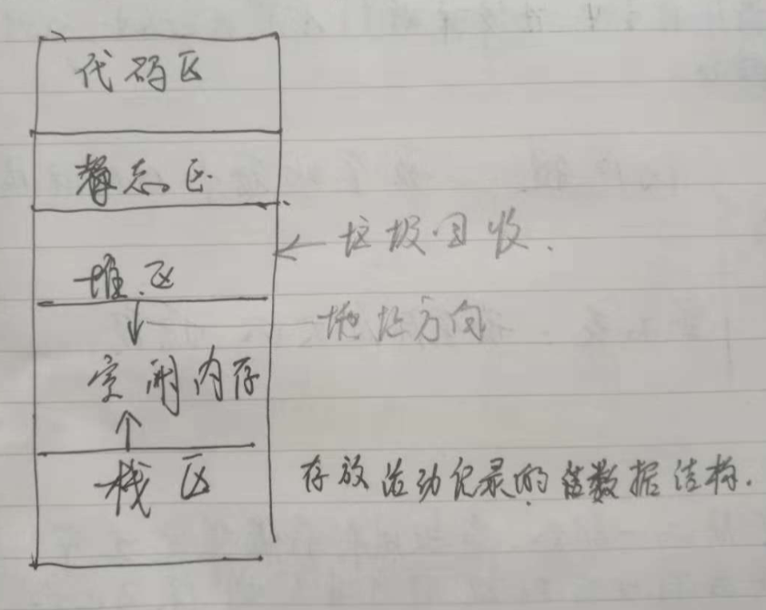
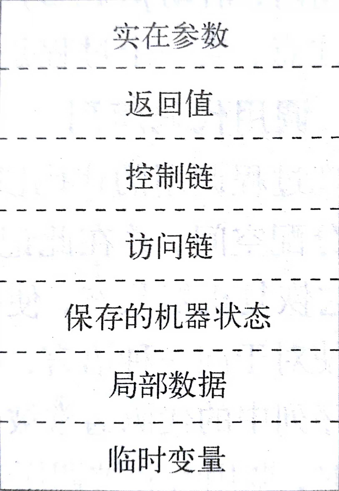
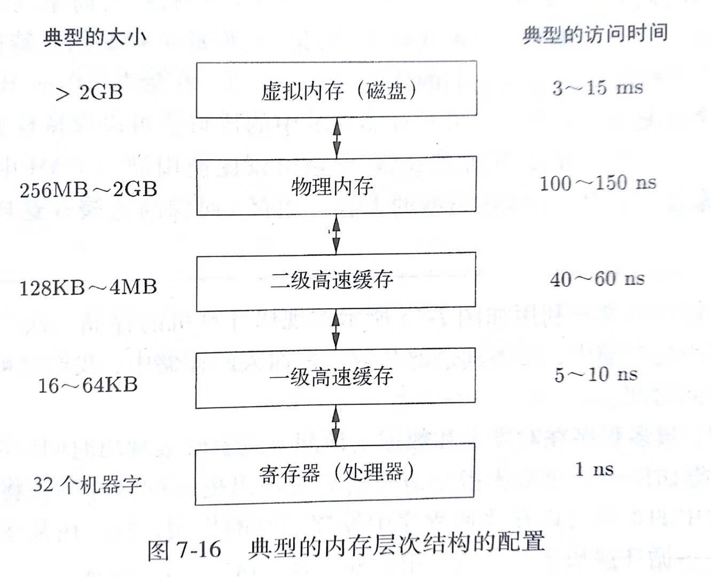
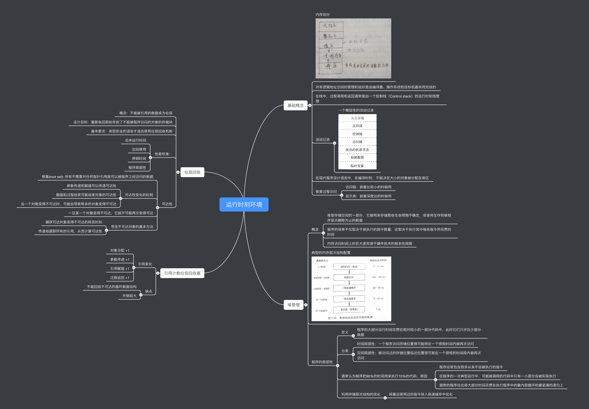

# 运行时刻环境

### 1. 基础概念
-  内存划分

-  对有逻辑地址空间的管理和组织是由编译器、操作系统和目标机器共同完成的
- 在栈中，过程调用和返回通常是由一个控制栈（Control stack）的运行时刻栈管理
-  活动记录
 - 一个概括性的活动记录

 

- 在现代程序设计语言中，在编译时刻，不能决定大小的对象被分配在堆区
- 嵌套过程访问
    - 访问链：嵌套比较小的时候用
    - 显示表：嵌套深度达的时候用

### 2. 堆管理
##### 1. 概念
 - 堆是存储空间的一部分，它被用来存储那些生命周期不确定，或者将生存到被程序显示删除为止的数据
- 程序的效率不仅取决于被执行的指令数量，还取决于执行其中每条指令所花费的时间
- 内存访问时间上的巨大差异源于硬件技术的根本性局限

##### 2. 典型的内存层次结构配置

#### 3. 程序的局部性
- 定义
    - 程序的大部分运行时间花费在相对较小的一部分代码中，此时它们只涉及少部分数据
- 分类
    - 时间局部性：一个程序访问存储位置很可能将在一个很短时间内被再次访问
    - 空间局部性：被访问过的存储位置临近位置很可能在一个很短的时间段内被再次访问
- 通常认为程序把90%的时间用来执行10%的代码，原因：
    - 程序经常包含很多从来不会被执行的指令
    - 在程序的一次典型运行中，可能被调用的代码中只有一小部分会被实际执行
    - 通常的程序往往将大部分时间花费在执行程序中的最内层循环和最紧凑的递归上
- 利用存储层次结构的优化
    - 将最近使用过的指令放入高速缓存中优化

### 3. 垃圾回收
##### 1. 概念：
不能被引用的数据成为垃圾
##### 2. 设计目标：
重新收回那些存放了不能被程序访问的对象的存储块
##### 3. 基本要求
类型安全的语言才适合使用垃圾回收机制
##### 4. 性能标准：
 - 总体运行时间
 - 空间使用
 - 停顿时间
 - 程序局部性
 
##### 5. 可达性
- 根集(root set): 
    所有不需要对任何指针引用就可以被程序之间访问的数据
- 可达性变化的时刻
    - 参数传递和赋值可以传递可达性
    - 赋值和过程结束可能结束对象的可达性
    - 当一个对象变得不可达时，可能会导致等多的对象变得不可达
- 一旦某一个对象变得不可达，它就不可能再次变得可达
- 寻找不可达对象的基本方法
    - 捕获可达对象变得不可达的转变时刻
    - 传递地跟踪所有的引用，从而计算可达性
    
### 4. 引用计数垃圾回收器
##### 1. 引用变化
- 对象分配 +1
- 参数传递 +1
- 引用赋值 +1
- 过程返回 +1

##### 2.缺点
- 不能回收不可达的循环数据结构
- 开销较大

 

