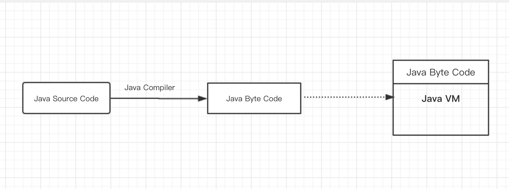
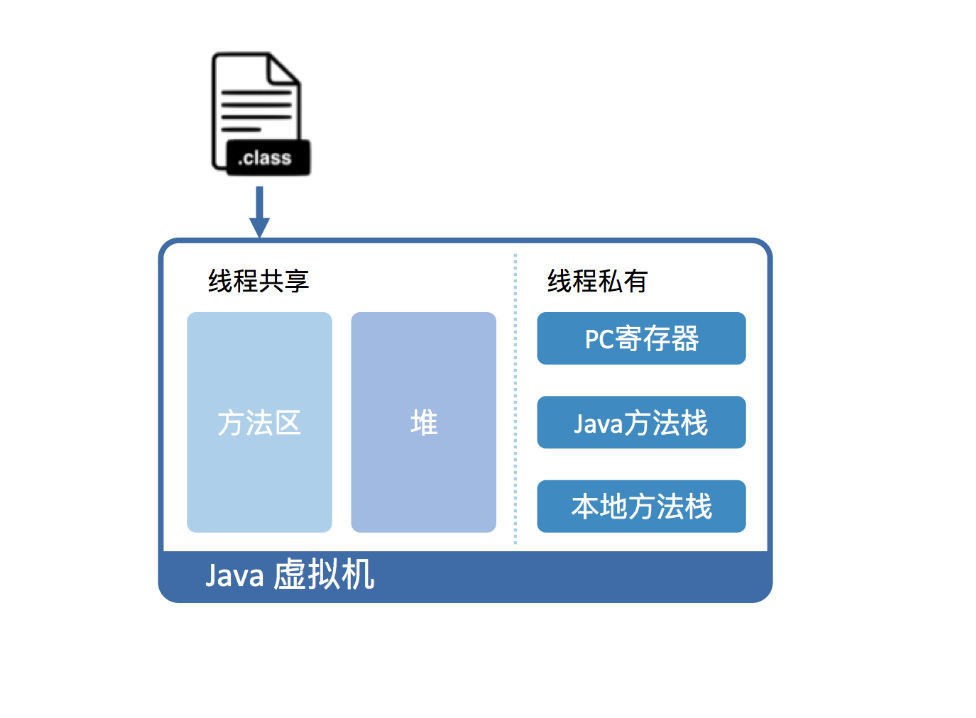
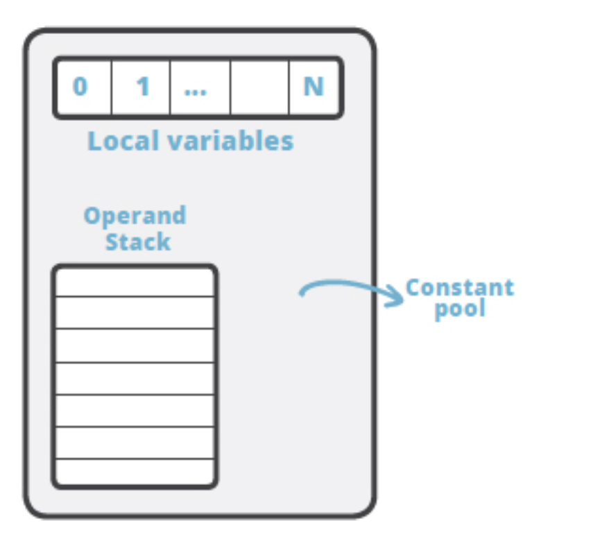
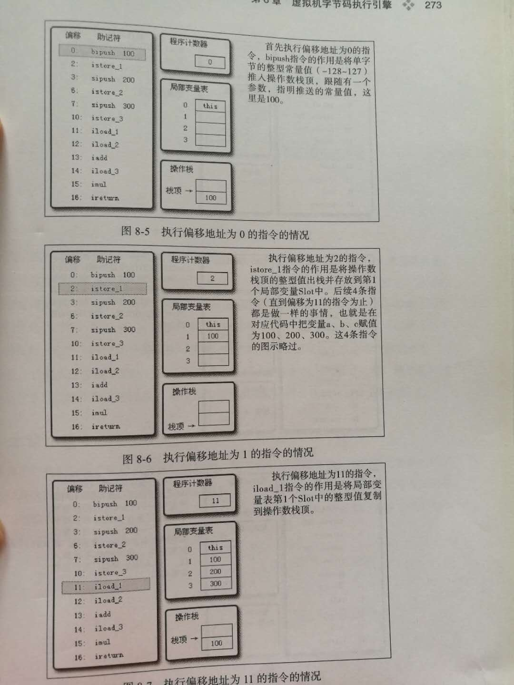
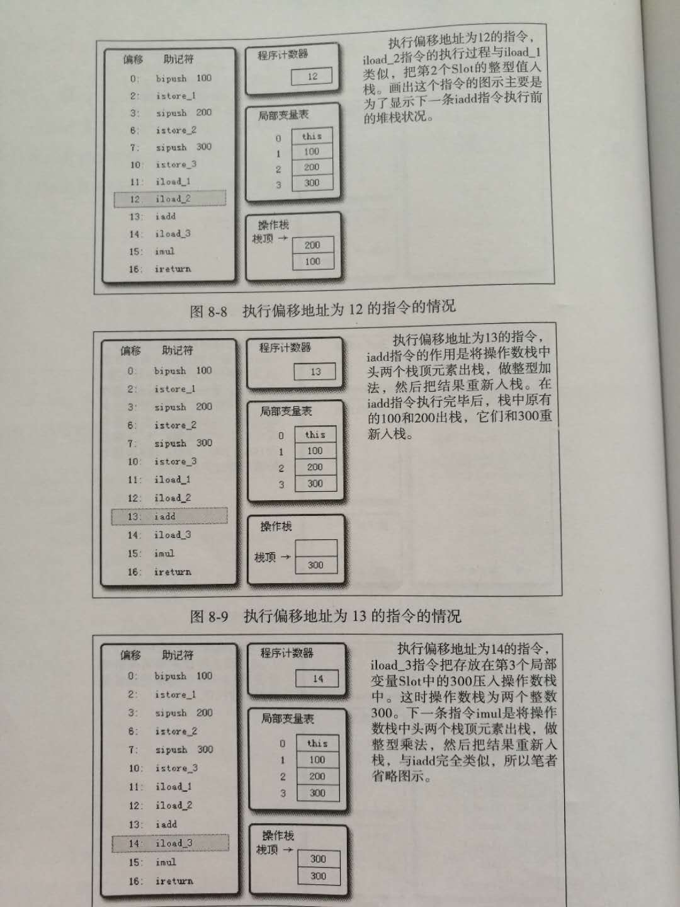
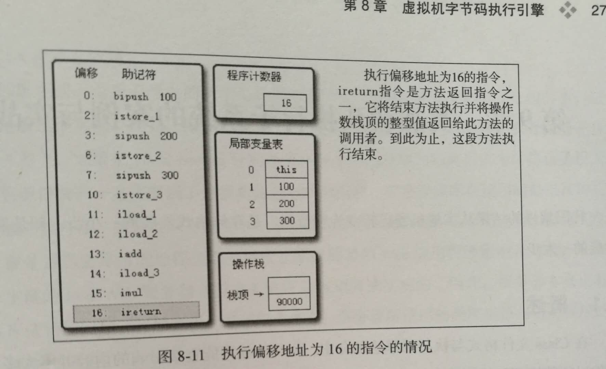
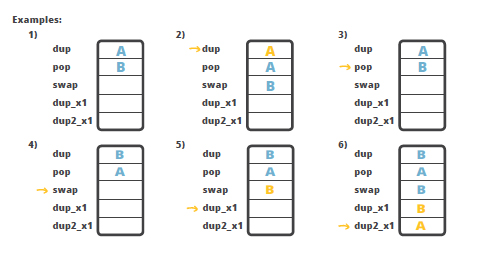
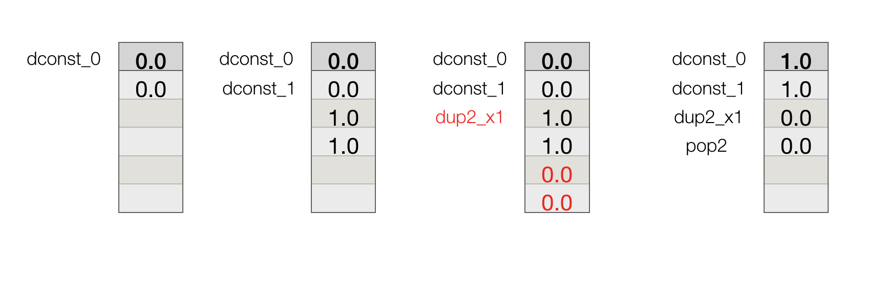

#Java 字节码
Java 字节码是 JVM 里面指令的型式, Java 的源码经过 Java 编译器会形成 Java 字节码，这的字节码才能在 Java 虚拟机中运行。


## 一、栈基架构
一个虚拟机有基于栈虚拟机（Stack based Virtual Machine）和 基于寄存器虚拟机（Register based Virtual Machine）之法， 它们的差别可以看[这里](https://markfaction.wordpress.com/2012/07/15/stack-based-vs-register-based-virtual-machine-architecture-and-the-dalvik-vm/)。

Java 的虚拟机是基于栈的, 它包含 PC 寄存器、 JVM 栈、堆和方法区

注：图片来自于 极客时间专栏《深入拆解 Java 虚拟机》

- **PC 寄存器（program counter)**: Java 程序里面的每一个运行的线程，都有一个 PC 寄存器存储着当前指令的地址。

- **JVM 栈**：对于每一个线程，栈 是用来存放局部变量、方法参数以及返回值的

- **堆**：所有线程共享的内存区域，存放着对象（类的实例化和数组）。对象由垃圾回收器进行再分配

- **方法区**：对于每一个加载的类，方法区里面都存放着方法的代码，以及符号表（对象或字段的引用）以及常量池中的常量

JVM 的栈是由一系列的 Frame 组成的，它包含


注：图片来自[JVM 内部原理（六）— Java 字节码基础之一](https://www.cnblogs.com/richaaaard/p/6214929.html)

- 一个局部变量数组(Local Variables), 索引从 0 到数组长度减一。数据的长度由编译器计算。除了 **long** 和 **double** 类型值需要两个局部变量的空间存储外，其他类型的值都可以存储在一个局部变量里；

- 一个用来存储中间变量的操作栈(Operand Stack)。该中间变量的作用充当指令的操作数，或者存放方法调用的参数。它是一个后进先出（LIFO）栈

## 二、JVM 数据类型
JVM 定义的数据类型有：

- 基本数据类型：
  - 数字类型
  
 | 类型 | 位数|
| --- | --- |
|byte| 8位 | 
|short| 16位|
|int | 32 位|
|long | 64 位 |
|char | 16 位|
| float | 32 位 单精度|
|double | 64 位 双精度|
 
  - boolean 类型
  - returenAdress: 指令指针，指向一条虚拟机指令的操作码
  
- 引用类型

    - 类类型 class type
    - 集合类型 array type
    - 接口类型 interface type
  
## 三、指令
Java 字节码的指令有一个 JVM 数据类型前缀和操作名组成，例如 idd 指令是由 "i" 表示 int 类型数据和 “add"相加操作组成，因此 iadd 表示对 int 类型数值求和。

根据指令的性质，可以分为以下类型：

- 加载和存储指令
- 运算指令
- 转移指令
- 对象创建和访问指令
- 操作数栈管理指令
- 控制转移指令
- 方法调用和返回指令
- 异常处理指令
- 同步指令

下面有详细的说明

#### 1.加载和存储指令
加载和存储指令用于数据在栈帧（Frame）中的局部变量数组（Local Variables）和操作栈（Operand Stack）之间来回传输；

具体为:

- 将一个局部变量加载到操作栈： iload, xxxload
- 将一个数值从操作数栈存储到局部变量表： istore,  xxxstore
- 将一个常量加载到操作数栈：bipush, xxxpush,  iconst_xxx, ladc_w, ladc2_w, aconst_null 等
- 扩充局部变量表的访问索引的指令： wide

例如：
例子1：
Calc.java 文件

```java
public class Calc {
	public int calc(){
		int a = 100;
		int b = 200;
		int c = 300;
		return (a + b ) * c;
	}
}
```
通过命令
> javac Calc.java  

会生成 Calc.class 文件
然后在通过命令 javap 可以看到相应的字节码

> javap -v Calc.class

相应的字节码

```java
  public int calc();
    descriptor: ()I
    flags: ACC_PUBLIC
    Code:
      stack=2, locals=4, args_size=1
         0: bipush        100
         2: istore_1
         3: sipush        200
         6: istore_2
         7: sipush        300
        10: istore_3
        11: iload_1
        12: iload_2
        13: iadd
        14: iload_3
        15: imul
        16: ireturn
```
执行过程





*注：图片来自于周志明《深入理解 Java 虚拟机》*


#### 2.运算指令
运算指令用于对两个操作栈上的值进行某种特定运算，并把结果重新存入到操作栈顶。
分为两类：对整形数据进行运算的指令和对浮点型数据进行运算的指令。

- 加法指令： iadd, ladd, fadd, dadd
- 减法指令： isub, lsub, fsub, dsub
- 乘法指令： imul, lmul, fmul, dmul
- 除法指令： idiv, ldiv, fdiv, ddiv
- 求余指令： irem, lrem, frem, drem
- 取反指令： ineg, lneg, fneg, dneg
- 位移指令： ishl, ishr, iushr, lshl, lshr, lushr
- 按位或指令：ior, lor
- 按位与指令： iand, land
- 按位异或指令：ixor, lxor
- 局部变量自增指令：iinc
- 比较指令：dcmpg, dcmpl, fcmpg, fcmpl, lcmp

上面例子1中的执行偏移地址13指令 iadd 就是将操作栈顶中两个数 200 加上 100, 再把它的和 300 压回栈。

在除非指令（idiv, ldiv）以及求余指令（irem 和 lrem ）中， 当出现除数为零时会导致虚拟机抛出 ArithmeticException 异常

#### 3.转换指令
转换指令可以将两种不同的数值类型进行相互转换，一般用于显示类型转换
包含： i2b, i2c, i2s, l2i, f2i, f2l, d2i, d2l 和 d2f
其中 i 是 int, b 是 byte, c 是 char, s 是 short, l 是long, f 是 float, d 是 double 类型

例子2：
java 源码

```java
public class Test {
	public static void main(String[] args) {
			long zz = 10000;
			int yy = (int)zz;
			int a = 1;
			int b = 2;
			int c = a + b;
		}
}
```
用 javap 生成的字节码是

```java
  public static void main(java.lang.String[]);
    descriptor: ([Ljava/lang/String;)V
    flags: ACC_PUBLIC, ACC_STATIC
    Code:
      stack=2, locals=7, args_size=1
         0: ldc2_w        #2                  // long 10000l , 将常量 1000l 加载到操作栈
         3: lstore_1
         4: lload_1
         5: l2i         // 这里对应 int yy = (int)zz; 进行强转
         6: istore_3
         7: iconst_1
         8: istore        4
        10: iconst_2
        11: istore        5
        13: iload         4
        15: iload         5
        17: iadd
        18: istore        6
        20: return
}
```

#### 4.对象创建与访问指令
在 Java　中一切皆为对象，类实例和数组都是对象，但是 Java 虚拟机对类实例和数组的创建与操作使用了不同的字节码指令。

- 创建类实例的指令： new
- 创建数组的指令： newarray, anewarry, multianewarray
- 访问类字段（static 字段）和实例字段（非 static 字段）的指令： getfield, putfield, getstatic, putstatic
- 把一个数组元素加载到操作栈的指令： baload, caload, saload, iaload, laload, faload, daload, aaload
- 把一个操作数栈的值存储到数组元素中的指令： bastore, castore, sastore, iastore, fastore, dastore, aastore
- 取数组长度的指令 ： arraylength
- 检查类实例类型的指令： instanceof, checkcast

例3：

```java
public class Test {

    public static void main(String[] args) {
        ByteTest byteTest = new ByteTest();
        byteTest.name = "zhangsan";
        byteTest.age = 13;

        String[] list = new String[1];
        list[0] = "one";
        int size = list.length;
    }

    public static class ByteTest{

        public static String name;

        public int age;
    }
}
```
生成的部分字节码

```java
 public static void main(java.lang.String[]);
    descriptor: ([Ljava/lang/String;)V
    flags: ACC_PUBLIC, ACC_STATIC
    Code:
      stack=3, locals=4, args_size=1
         0: new           #2                  // new 指令，new 一个 ByteTest 对象
         3: dup
         4: invokespecial #3                  // Method com/yxhuang/temp/Test$ByteTest."<init>":()V
         7: astore_1
         8: aload_1
         9: pop
        10: ldc           #4                  // String zhangsan
        12: putstatic     #5                  // 访问 ByteTest 静态字段 name
        15: aload_1
        16: bipush        13
        18: putfield      #6                  // 访问 ByteTest 实例的字段 age
        21: iconst_1
        22: anewarray     #7                  // 创建数组
        25: astore_2
        26: aload_2
        27: iconst_0
        28: ldc           #8                  // String one
        30: aastore
        31: aload_2
        32: arraylength                     // 取数组的长度
        33: istore_3
        34: return

```

#### 5.操作数栈管理指令
包括

- 将操作数栈的栈顶一个或两个元素出栈： pop, pop2
- 复制栈顶一个或两个数值并将复制值或双份的复制值重新压入栈顶：dup, dup2, dup_x1, dup_x2, dup2_x1, dup2_x2;
- 将栈最顶端的两个数值互换： swap

其中 pop 是将栈顶一个元素出栈，pop2 是将栈顶的两个元素出栈；

dup 是复制栈顶数值并将复制值压入栈顶， dup2 是复制栈顶一个（对于 long 或 double 类型）或 两个（非 long, double 类型）的数值弹出；

dup_x1 是复制栈顶的值并将两个复制值压入栈顶，dup_x2 复制栈顶一个（对于 long 或 double 类型）或 两个（非 long, double 类型）的数值并压入栈顶；

dup2_x1 是 dup_x1 的双倍版本， dup2_x2 是 dup_x2 的双倍版本；



*注：图片来自于[JVM 内部原理（六）— Java 字节码基础之一](https://www.cnblogs.com/richaaaard/p/6214929.html)*

在 java 中 long 和 double 类型需要占用两个存储空间，为了交换两个 double　值，需要　dup2_x2



#### 6.控制转移指令
控制转移指令可以让 Java 虚拟机有条件或无条件地从指定的位置指令而不是控制转移指令的下一条指令继续执行程序

- 条件分支

| 指令 | 例子|说明  |
| --- | --- | --- |
|ifeq| if (i == 0)<br>if (bool == false) |当栈顶 int 型数值等于0 或者是 false 跳转 |
|ifne| if (i != 0) <br> if (bool == true)|当栈顶 int 型数值不等于0 或者是 true 跳转|  
|ifge| if (i >= 0)| 当栈顶 int 型数值大于或等于0时跳转|
|ifgt| if (i > 0)|当栈顶 int 型数值大于0时跳转|
|ifle| if (i <= 0)|当栈顶 int 型数值小于或等于0时跳转|
|iflt| if (i < 0)|当栈顶 int 型数值小于0时跳转|
|if_icmple||比较栈顶两个 int 型数值的大小，当结果小于或等于0时跳转|

- 复合条件分支
    - tableswitch, 用于 switch 条件跳转， case 值连续（可变长度指令）
    - lookupswitch, 用于 switch 条件跳转， case 值不连续（可变长度指令）

- 无条件分支
    - goto, 无条件跳转
    
在 Java 虚拟机中，各种类型的比较最终都会转化为 int 类型的比较。

例4：

```java
static int gt(int a, int b){
    if (a > b){
        return 1;
    } else {
        return -1;
    }
}

// 生成的字节码
  static int gt(int, int);
    descriptor: (II)I
    flags: ACC_STATIC
    Code:
      stack=2, locals=2, args_size=2
         0: iload_0                 // 将 a 入栈 local[0]{a}
         1: iload_1                 // 将 b 入栈 local[1]{b}
         2: if_icmple     7         // 如果 local[0] <= local[1] 跳去 7 ，即 iconst_m1
         5: iconst_1     // 将 int 型 1 推送至栈顶
         6: ireturn      // 返回
         7: iconst_m1    // 将 int 型 -1 推送至栈顶
         8: ireturn      // 返回
```
 
 
注意上面的 if_icmple 指令是比较栈顶两个 int 型数值的大小，当结果小于或等于0时跳转， 与我们代码中 a > b 刚好是相反的

<br>
例5：

```java
 static int calc(int count){
        int result = 0;
        while (count > 0){
            result += count--;
        }
        return result;
    }
    
// 字节码
 static int calc(int);
    descriptor: (I)I
    flags: ACC_STATIC
    Code:
      stack=2, locals=2, args_size=1
         0: iconst_0        // count 入栈
         1: istore_1
         2: iload_0
         3: ifle          16   // 当栈顶数值小于或等于0时调到 16， 即跳出 while 选好
         6: iload_1
         7: iload_0
         8: iinc          0, -1   // 自增或自减， 即 count--   
        11: iadd            // result+
        12: istore_1
        13: goto          2 // 回到 2
        16: iload_1
        17: ireturn
```

例6：

```java
 static int calcSwitch(int type){
        int result = 0;
        switch (type){
            case 1:
                result = 10;
                break;
            case 2:
                result = 11;
                break;
        }
        return result;
    }

// 字节码
static int calcSwitch(int);
    descriptor: (I)I
    flags: ACC_STATIC
    Code:
      stack=1, locals=2, args_size=1
         0: iconst_0
         1: istore_1
         2: iload_0
         3: lookupswitch  { // 2
                       1: 28
                       2: 34
                 default: 37
            }
        28: bipush        10
        30: istore_1
        31: goto          37
        34: bipush        11
        36: istore_1
        37: iload_1
        38: ireturn
```
    
#### 7.方法调用和返回指令
- invokevirtual 指令用于调用对象的实例方法，根据对象的实际类型进行分派；
- invokeinterface 指令用于调用接口方法，会在运行时搜索一个实现了这个接口方法的对象，找出合适的方法进行调用；
- invokespecial 指令用于调用一些需要特效处理的实例方法，包括实例初始化方法、私有方法和父类方法
- invokestatic 指令调用类方法（static 方法）
- invokedynamic 指令用于在运行时动态解析出调用点限定符所引用的方法，并执行该方法

#### 8.异常处理指令
arthrow 指令是 Java 程序中显式抛出异常的操作（throw 语句）

#### 9.同步指令
 同步一段指令集序列通常是由 Java 语言中的 synchroined 语句来表示， Java 虚拟机的指令集中有 monitorenter 和 monitorexit 两条指令来支持 synchronizd.
 
 例7：
 
 ```java
   static void sycn(Object object){
        synchronized (object){

        }
    }
    
    // 相应的字节码
    static void sycn(java.lang.Object);
    descriptor: (Ljava/lang/Object;)V
    flags: ACC_STATIC
    Code:
      stack=2, locals=3, args_size=1
         0: aload_0
         1: dup
         2: astore_1
         3: monitorenter
         4: aload_1
         5: monitorexit
         6: goto          14
         9: astore_2
        10: aload_1
        11: monitorexit
        12: aload_2
        13: athrow
        14: return
 ```
 
 每条 monitorenter 指令都必须有其对应的 monitorexit 指令，上面例子中的 3 和 5 是对应的。9 是处理异常的，这是编译器会自动产生一个异常处理，同步指令也需要在异常的时候退出，11 monitorexit 就是编译器自动生成在异常时退出的指令。

## 四、参考
1.[【译】如何阅读 Java 字节码](http://wl9739.github.io/2018/07/17/%E5%A6%82%E4%BD%95%E9%98%85%E8%AF%BB-Java-%E5%AD%97%E8%8A%82%E7%A0%81/)
2. [JVM 内部原理（六）— Java 字节码基础之一](https://www.cnblogs.com/richaaaard/p/6214929.html)
3. 周志明《深入理解 Java 虚拟机》

