# Class 文件结构

**Class 文件是一组以 8 位字节为基础单位的二进制流，各个数据项目严格按照顺序紧凑地排列在 Class 文件中，中间没有添加任何分隔符。**

## 1  ClassFile 结构
（从上往下顺序）

| 数据类型 |定义  | 说明 |
| --- | --- | --- |
| u4 |magic  |魔数，固定是 0xCAFEBABE  |
| u2 |minor_version  | 副版本号 |
| u2 |major_version | 主版本号 |
| u2 |constanct_pool_count  | 常量池计数器 |
| cp_info | constanct_pool[constanct_pool_count - 1] | 常量池 |
| u2 |access_flags  |访问标志  |
| u2 |this_class | 类索引 |
| u2 |super_class  | 父类索引 |
| u2 |interfaces_count  |接口计数器  |
| u2 |interfaces[interfaces_count]| 接口表 |
| u2 |fields_count |字段计算器  |
| field_info |fields[fields_count]  | 字段表 |
| u2 |methods_count | 方法计数器 |
| method_info | methods[methods_count] |类和接口中定义的所有方法  |
| u2 |attributes_count | 属性计数器|
| attribute_info|attributs[attributes_count]| 属性表|

说明：
- u1 代表1个字节
- u2 代表2个字节
- u4 代表4个字节
- u8 代表8个字节


### 1.1 特殊方法
- <init> 这个方法名称由编译器生成的，它代表着类的实例化，也就是说构造函数的调用
- <clinit> 这个方法名称也是由编译器生成的，它代表着静态类的调用

### 1.2 描述符标识字符含义


| 标识符字符 |含义 |
| --- | --- |
| B | byte  |
| C | char |
| D | double |
| F | float |
| I | int |
| J | long |
| S | short |
| Z | boolean|
| V | 特殊类型 void|
| L | 对象类型，例如 Ljava/lang/Object|

数组类型，每一维将使用一个前置的 "[" 字符来描述，
例如 String[][] -> [[Ljava/lang/String, int[] -> [i

用描述符描述方法时，按参数先，后返回值的顺序描述
例如
>int  indexOf(Sting a, int i) 对应是 (Ljava/lang/StringI)I
>void inc()  对应 ()V


## 2 Magic 魔数 与版本

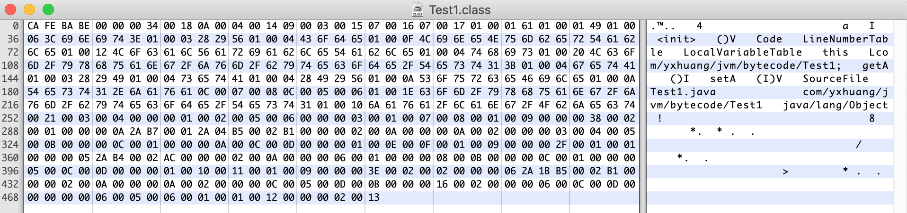

源码

```java
package com.yxhuang.jvm.bytecode;

public class Test1 {

    private int a = 1;

    public int getA() {
        return a;
    }

    public void setA(int a) {
        this.a = a;
    }
}
```


### 2.1 Magic Number 魔数 u4
位于 Class 文件的头四个字节成为魔数(Magic Number)
作用是确定这个文件能否被虚拟机接受的 Class 文件

上图中 `CA FE BA BE` 四个字节就是 Magice Number 固定不变

### 2.2 版本
- minor_version 副版本号 u2
- major_version 主版本号 u2

**高版本好的虚拟机可以支持低版本号的 Class 文件，反之则不行**

例如52.1
52 是主版本号， 0.1 是副版本号

常用的 Class 文件版本号

| 编译器器版本 | 十六进制版本号 | 十进制版本号 |
| --- | --- | --- |
| JDK 1.7.0 |00 00 00 32 | 50  |
| JDK 1.8.0 |00 00 00 34 | 52  |

上图中 `00 00 00 34` 代表版本号，副版本号是 `00 00`, 主版本号是 `00 34` 则说明是 JDK 1.8 编译的


## 3 常量池 constant_pool
### 3.1 说明
**Class 文件结构中，只有常量池的计数是从 1 开始的，其他集合类型都是从 0 开始**


图一中的 contant_pool_count 是 `00 18` 变成 10 进制是 24，但是常量个数 = 24 -1 = 23 个

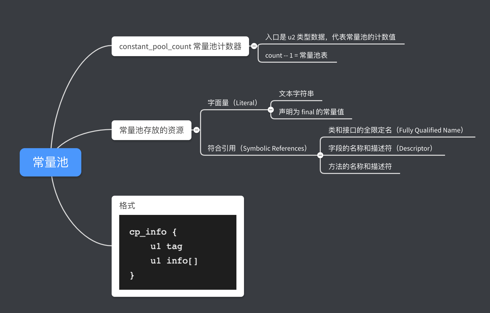

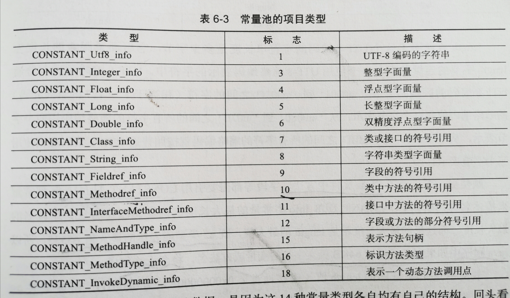

### 3.2 例子
看第一个常量 `0x0A` 是 10，对应上表是 CONSTANT_Methodref_info 

```
CONSTANT_Methodref_info{
    u1 tag                   0A
    u2 class_index           00 04  
    u2 name_and_type_index   00 14
}
```
- **0A** 对应是 CONSTANT_Methodref_info 类型
- **00 04** class_index， 指向常量池表中索引 #4 的 CONSTANT_Class_info 结构。
CONSTANT_Class_info 表示一个类或接口，当前字段或方法就是这个类或接口的成员
- **00 14** name_and_type_index，指向常量池索引为 #20 的 CONSTANT_NameAndType_info结构。 CONSTANT_NameAndType_info 结构表示当前字段或方法的描述符

对着下图，我们看到

>  #1 对应 Methodref, 指向   #4.#20， 和我们上面分析的一致
>  #4 Class 指向 #23 java/lang/Object 说明当前这个方法是 java.lang.Object
>  #20 NameAndType 指向了 #7和#8  <init>()V 说明这个方法是 <init>；方法描述符是 ()V

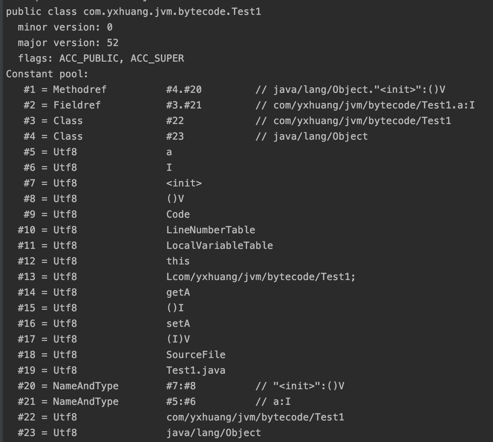
常量池例子图一

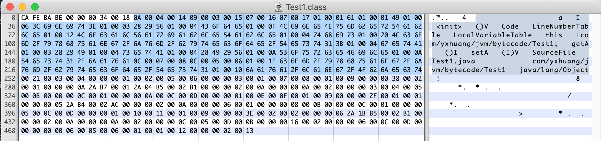
常量池例子图二

常量池例子图二 中选中的字节就是常量池的内容
其他的方法可以用类似例子的方法对照常量项的结构总表一个个去分析

常量池中的 14 种常量项的结构总表
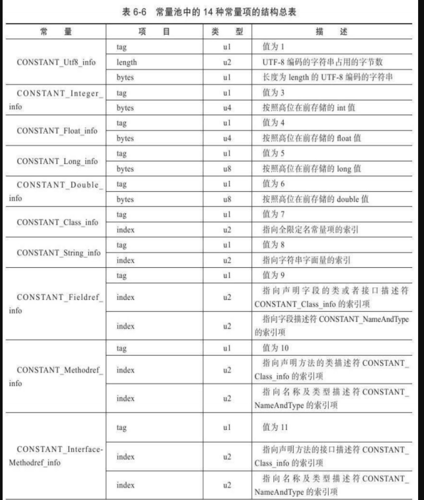
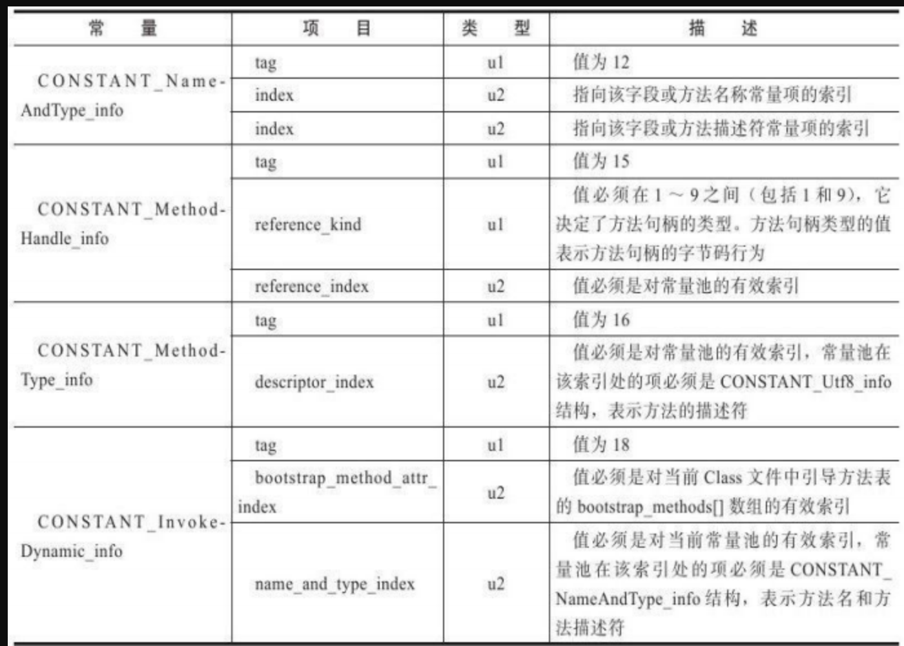

### 3.3  访问标志 access_flags u2

访问标志在常量池之后的后两位 u2, 用于标志类或接口层次的访问信息；
包括
- 这个 Class 是类还是接口
- 是否定义为 public 类型
- 是否定义为 abstract 类型
- 如果是类的话，是否被定义为 final

一般是两个位的组合


| 标志名称 |标志值  | 含义 |
| --- | --- | --- |
| ACC_PUBLIC    | 0x0001 | 是否为 pulic 类型 |
| ACC_FINAL     | 0x0010 | 是否声明为 final,只有类可设置 |
| ACC_SUPER     | 0x0020 | 是否允许使用 invokespecial 字节码的新语意 |
| ACC_INTERFACE | 0x0200 |  标志这是个接口|
| ACC_ABSTEACT  | 0x0400 | 是否为 sbstract 类型，对于接口或抽象类说，此标志值为真，其他类值为假|
| ACC_SYNTHETIC  |0x1000 |标识这个类并非由用户代码产生的  |
| ACC_ANNOTATION |0x2000 |标识这个是注解 |
| ACC_ENUM     | 0x4000 |标识这个是枚举 |


如果是一个普通类，不是接口、枚举或者注解，被 public 关键字修饰但没有被声明为 final 和 abstract.是用组合值

0x0021 = 0x0001|0x0020

说明这个类是 PUBLIC, SUPTER


## 4 类索引、父索引与接口索引集合

**Class 文件由类索引、父索引和接口索引这三项数据来确定这个类的继承关系。**

### 4.1 类索引 this_class
类索引用于确定这个类的全限定名
u2 类型的索引值，指向类型 CONSTANT_Class_info 的类描述符

### 4.2 父索引 super_class
父索引用于确定这个类的父类全限定名
u2 类型的索引值，指向类型 CONSTANT_Class_info 的类描述符
除了 java.lang.Object 外，所有的 Java 类的父类索引都不为 0


### 4.3 接口索引 interfaces
接口索引，入口是 u2 类型的的接口计数器（interfaces_count）表示索引表的容量。
如果及计数器值为 0 ，表示这个类没有任何接口，后面接口的索引表不占任何字节。


例子
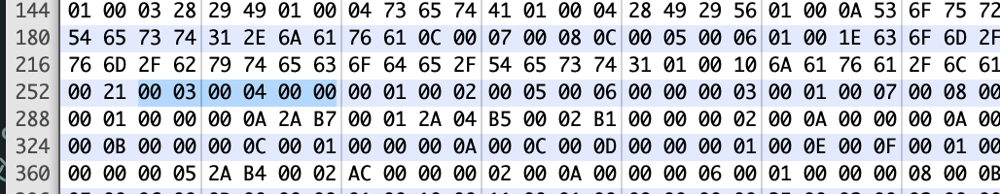

上图中在常量池结束之后，就是类索引，查看 常量池例子图一
`00 03`  指向 #3 的 CONSTANT_Class_info 索引， #3再指向 #20， 是

>  #22 = Utf8               com/yxhuang/jvm/bytecode/Test1
说明这个类 `com.yxhuang.jvm.bytecode.Test1`

父类索引是 `00 04`， 指向 #4 的 CONSTANT_Class_info 索引，#4 再指向#23
>  #23 = Utf8  java/lang/Object

说明这个类的父类是 java.lang.Object。在 java 中如果一个类没有继承其他类，它的父类默认是 Object, 与我们现在看到的内容是对得上的

接口索引计数器 `00 00` 说明接口数量为 0， 则没有后面的接口索引表


## 5 字段表 field_info
**字段表用于描述接口或类中声明的变量。
字段（field）包括类级变量（static field）以及实例变量,但不包括在方法内部声明的局部变量。**

字段表中不会列出从超类或者父类接口中继承而来的字段。

### 5.1 字段表结构

```
field_info {
    u2              access_flags
    u2              name_index
    u2              descriptor_index;
    u2              attributes_count;
    attribute_info   attributes[attributes_count]; 
}
```
- access_flags 用于定义字段的访问权限和基本属性的掩码标识
- name_index 对应常量池中的一个有效索引，指向 CONSTANT_Utf8_info 结构，标识一个有效的字段的非全限定名
- descriptor_index 对应常量池中的一个字段描述符索引
- attributes_count 表示当前字段的附加属性数量
- attribute_info 附加属性
一般有：
    - ConstantValue
    - Synthetic
    - Signature
    - Dprecated
    - RuntimeVisibleAnnotations
    - RuntimeInvisibleAnnoation

表5.1 字段 acces_flags 标志列表

| 标志名 | 值 | 说明 |
| --- | --- | --- |
| ACC_PUBLIC | 0x0001  | 声明为 public, 可以从包外访问 |
| ACC_PRIVATE | 0x0002 | 声明为 private, 只能自身访问 |
| ACC_PROTECTED | 0x0004  | 声明为 protected, 子类可以访问 |
| ACC_STATIC | 0x0008 | 声明为 static |
| ACC_FINAL | 0x0010| 声明为 final, 定义后无法修改 |
| ACC_VOLATILE |0x0040  | 声明为 valatile, 被标识的字段无法储存  |
| ACC_TRANSIENT | 0x0080 | 声明为 transient, 被标识的字段不会序列化  |
| ACC_SYNTHETIC| 0x1000 | 声明为被表示的字段的编译器产生 |
| ACC_ENUM| 0x4000| 声明为 enum, 枚举类型|

descriptor_index 是 1.2 节中的描述符

attributes 属性包含 见后面的 属性 章节

`00 01` 是 fields_count，字段个数，说明只有 1 个字段
`00 02` 是 access_flags，表示是该字段是 private
`00 05` 是 name_index， 指向 #05 是 a
`00 06` 是 descriptor_index， 指向 #06 是 I, 根据 1.2 描述符表说明这个类是 int
`00 00` 是附加属性个数，0 说明这字段没有附加属性

```
#5 = Utf8               a
#6 = Utf8               I
```
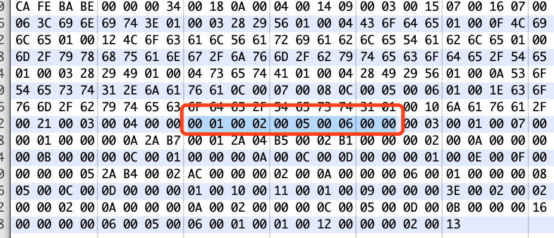


## 6 方法 method

所有方法，包括实例初始化话方法以及类或接口初始化方法在内，都是由 methode_info 结构定义的

```
method_info {
    u2               access_flags
    u2               name_index
    u2               descriptor_index
    u2               attributes_count
    attribute_info   attributes[attributes_count]
}
```
- access_flags 用于定义当前方法的访问权限和基本属性的掩码标识
- name_index 对应常量池中的一个有效索引，指向 CONSTANT_Utf8_info 结构，标识一个有效的字段的非全限定名
- descriptor_index 对应常量池中的一个字段描述符索引
- attributes_count 表示当前方法的附加属性数量
- attribute_info 附加属性
    包含：
        - Code
        - Exceptions
        - Synthetic
        - Signature
        - Dprecated
        - RuntimeVisibleAnnotations
        - RuntimeInvisibleAnnotations
        - RuntimeVisibleParameterAnnotations
        - RuntimeInvisibleParameterAnnotations
        - AnnotationDefault
  
  
  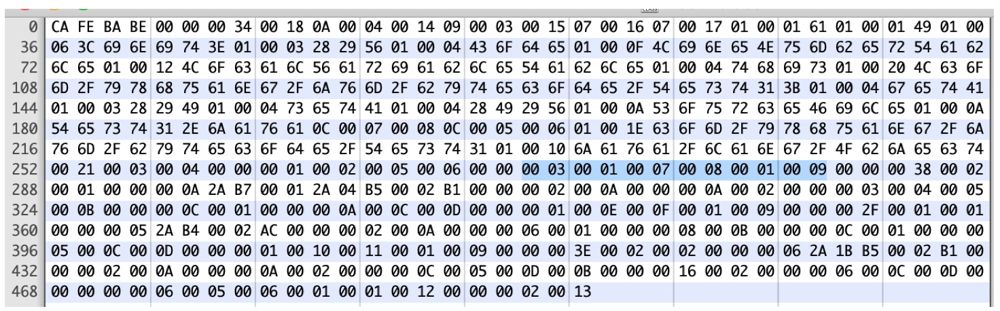

     
 `00 03` 是 method_count ,说明方法的入口说明有三个方法，对照我们的源码，我们定义了 `getA` `setA` 两个方法，另外就是编译器自动为当前类生成的无参构造函数方法
 
 `00 01` 是 access_flags， 对照方法访问标志表，说明该方法是 public
 `00 07` 是 name_index， 指向常量池 #7 ，是<init>
 `00 08` 是 descriptor_index， 指向常量池的 #8, 是 ()V
 `00 01` 是 attributes_count， 附加属性个数是 1
 `00 09` 是 attribute_info， 附加属性的指向索引 #9，是 Code, 关于 Code 可以看 第七节属性 

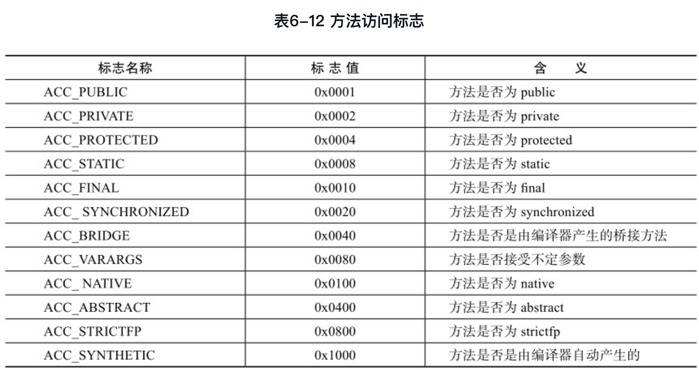


## 7 Code 属性
Code 属性是变长属性，位于 method_info 结构的 `attribute_info` 中。
一个 Code 属性只为唯一一个方法、实例初始化方法、类或接口初始化方法保存 Java　虚拟机指令及其相关辅助信息。
 
### 7.1 格式

```
Code_attribute {
    u2      attribute_name_index;   // 一般是 'Code'
    u4      attribute_length;
    u2      max_stack;
    u2      max_locals;
    u4      code_length;
    u1      code[code_length];
    u2      exception_table_length;
    {
        u2  start_pc;
        u2  end_pc;
        u2  handler_pc;
        u2  catch_type;
    } exception_table[exception_table_length];
    u2      attributes_count;
    attribute_info  attributes[attributes_count];
}
```

- attribute_name_index 是 属性名称的的常量索引 ，值一般是 Code
- attribute_length 属性的的长度
- max_stack 代表了操作数栈（Operand Stacks）深度的最大值。在方法执行的任意时刻，操作栈都不会超过这深度。
- max_locals 代表了局部变量表所需的存储空间。存储单位是 Slot
- code_length 代表编译之后的字节码指令长度， u4 类型，说明一个方法的最大长度是  `2^32 - 1`,也就是 65535
- code[] 当前方法的 java 虚拟机的实际字节码， code 用于存储字节码指令的一系列字节流。 每个指令是 u1 类型， 根据对应的值去查虚拟机指令表
- exception_table_length 异常表的成员个数
- exception_table[] 异常表
    - start_pc 和 end_pc 表示异常处理的索引范围，既 start_pc ≤ x < end_pc
    - handle_pc 异常处理器的起点
    - catch_type 异常类型，指向常量池中的索引
- attributes_count 表示 Code 中的附加属性个数
- attribute_info 附加属性

### 7.2 具体的例子

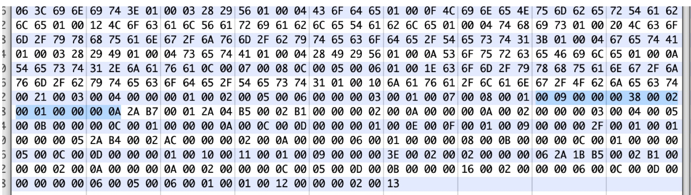


`00 09` 在上面的 第 6 节已经说明了，是 #9, 值是 Code
`00 00 00 38`  是 attribute_length 是 Code 属性长度，变成10进制是 56 个字节
`00 02` 是 max_stack，说明操作栈是的最大深度是 2
`00 01` 是 max_locals，说明存储空间是 1
`00 00 00 0A` 是 code_length 说明 code 的长度是10个字节

#### 7.2.1 Code 的指令
下面的内容是具体的 Code, 10 个字节， 每个字节可以根据虚拟机字节码指令表查找到,关于指令的具体行为，查看另外的资料 

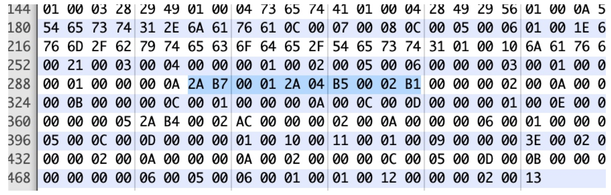


> 2A B7 00 01 2A 04 B5 00 02 B1

- `2A` 是 aload_0 指令
- `B7` 是 invokespecial指令， 调用父类的构造方法，  格式是  `invokespecial indexByte1 indexByte2`  
- `00 01` 指向常量池的 #1，是 `java/lang/Object."<init>":()V`
- `2A` 是 aload_0 指令
- `04` 是 iconst_1 指令，将 int 型 1 推送至栈顶
- `B5` 是 putfield 是为指定的的类的实例赋值， 格式是 `putfield indexbyte1 indexbyte2` 
- `00 02` 指向常量池的 #2 是 
> Fieldref       #3.#21         // com/yxhuang/jvm/bytecode/Test1.a:I

- `B1` 是 return 指令

通过 javap -verbose 看到的， 是一样的

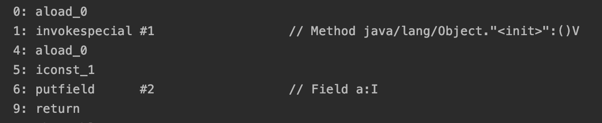

#### 7.2.2 Code 异常表

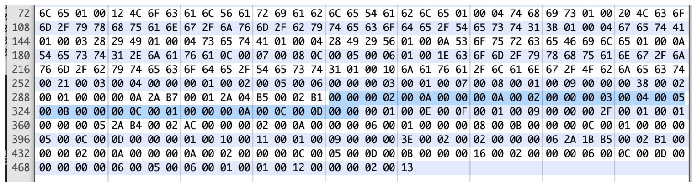


根据 Code 结构，在 Code 中跟在指令后面的是异常表

`00 00` 是 exception_table_length 异常表的长度，这里是 0, 说明这个方法没有异常


#### 7.2.3 Code 的附近属性 attribute_info 
根据 Code 结构，在 Code 中跟在异常表后面的是附近属性


`00 02` 是 attributes_count 代表这个方法的附近属性，这里是两个

**第一个附加属性**
`00 0A` 是指向常量池的 #10, 是 LineNumberTable，说明这个属性是 LineNumberTable, 关于 LineNumberTable 属性，可以看后面的第 8 节
`00 00 00 0A` 是 attribute_length， 表示附近附加属性的字节长度，只是是 10 个字节， 即后面的 `00 02 00 00 00 03 00 04 00 05`

`00 02` 是 line_number_table_length，表示  line_number 数组的个数，2 个

*第一个数组*
`00 00` 是 start_pc，表示字节码行号， 这里是 0
`00 03` 是 line_number， 表示 Java 源代码行数，这里是 3

*第二个数组*

`00 04` 表示字节码行数是 4
`00 05` 表示 Java 源代码行数是 5

对照下图，是和我们分析的一样

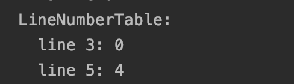

第一个属性已经结束了，来看看第二个属性

**第二个属性**
`00 0B` 指向常量池的 #11 是 LocalVariableTable，是局部变量表，具体信息看看第 9 节
`00 00 00 0C` 表示这个附加属性的长度是 14 个字节,即 `00 01 00 00 00 0A 00 0C 00 0D 00 00`

`00 01` 是 local_variable_table_length, 表示局部变量表的个数是 1
`00 00` 是 start_pc 字节码行数 0
`00 0A` 是 length，表示当前属性的长度，是 10
`00 0C` 是 name_index，表示局部变量的名称，指向常量池的索引 #12，是 this
`00 0D` 是 descriptor_index,表示局部变量的描述符，指向常量池的索引 #13，是 Lcom/yxhuang/jvm/bytecode/Test1;
`00 00` 是 index，表示这个局部变量在栈帧局部变量表中 Slot 的位置，是 0

从上面的分支，和下图的结果可以看到是一样的

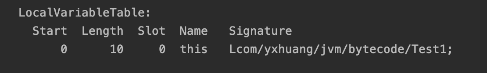


其他剩下的两个方法都可以按照这样去分析

## 8  LineNumberTable 属性
是可选、变长属性，位于 Code 结构中。
是用来确定源文件中的行号

### 8.1 结构
```
LineNumberTable_attribute {
    u2      attribute_name_index;  // 一般是 `LineNumberTable`
    u4      attribute_length;
    u2      line_number_table_length;
    {
        u2  start_pc;
        u2  line_number;
    }line_number_table[line_number_table_length];
}
```

- attribute_name_index 指向常量池中的索引，是 “LineNumberTable”
- attribute_length 表示当前属性的长度
- line_number_table_length 表示数组的成员的个数
- start_pc 表示改字符在源文件中的字节码行数
- line_number 表示这个值在源文件的行数

## 9  LocalVaribleTable 属性
是可选、变长属性，位于 Code 结构中
确定在执行过程中给定局部变量的信息

结构

```
LocalVaribleTable_attribute {
    u2    attribute_name_index;    // 一般是`LocalVaribleTable`
    u4    attribute_length; 
    u2    local_variable_table_length;
    {
        u2  start_pc;
        u2  length;
        u2  name_index;
        u2  descriptor_index;
        u2  index;
    } local_variable_table[local_variable_table_length]
}
```
- attribute_name_index 是指向常量池中的索引，是 "LocalVaribleTable"
- attribute_length 属性的长度
- local_variable_table_length 局部变量表的长度
- start_pc 和 length，表示所有给定的局部变量的索引都在范围[start_pc, start_pc + length) 
- index 表示一个局部变量的有效的非全限定名，指向常量池表的索引
- descriptor_index 表示源程序中局部变量类型的字段描述符，指向常量池的索引
- index 表示此局部标量在当前栈帧的局部变量表中的索引


## 10 属性 attribute

**属性在 Class 文件格式中 ClassFile 结构、 field_info 结构、 method_info 结构 和 Code_attribute 结构中**

### 通用格式

```
attribute_info{
    u2      attribute_name_index
    u4      attribute_length
    u2      info[attribute_length]
}
```
## 11 字节码文件的 Attribute

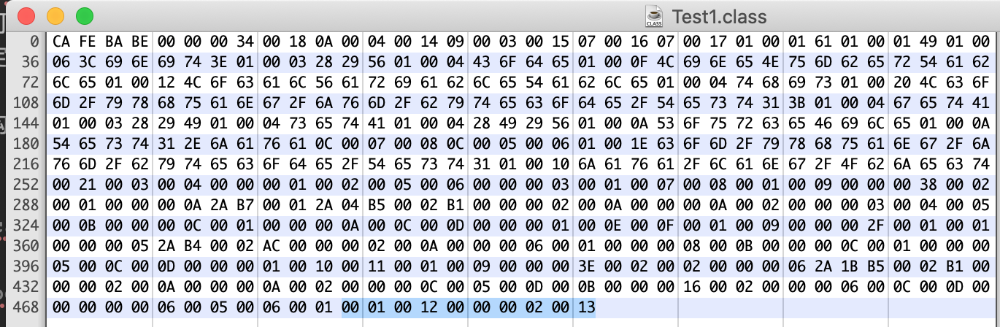

`00 01` 代表属性个数， attributes_count， 只有一个
`00 12` 是 attribute_name_index， 表示属性名称，指向 #18，是 SoureFile
`00 00 00 02` 是 attribute_length， 表示属性长度，是 2
`00 13` 是 attribute_info 的信息，指向 #19，是 Test1.java

上面说明，这个属性名称是 SourceFile, 名称是 Test1.java


## 12 总结
至此，我们整个 Class 文件已经分析完成了。分析 Class　文件需要耐心，按照　Class 文件结构，一个字节码，一个字节码去分析，就可以将整个 Class 文件弄清楚。

如果弄懂了整个 class 文件，对于学习 java 或者 kotlin 都有很大的帮助。``

## 参考
- [《深入理解 Java 虚拟机》(第2版)](https://book.douban.com/subject/24722612/)
- [《Java 虚拟机规范》（Javs SE 7 版）](https://book.douban.com/subject/25792515/)


