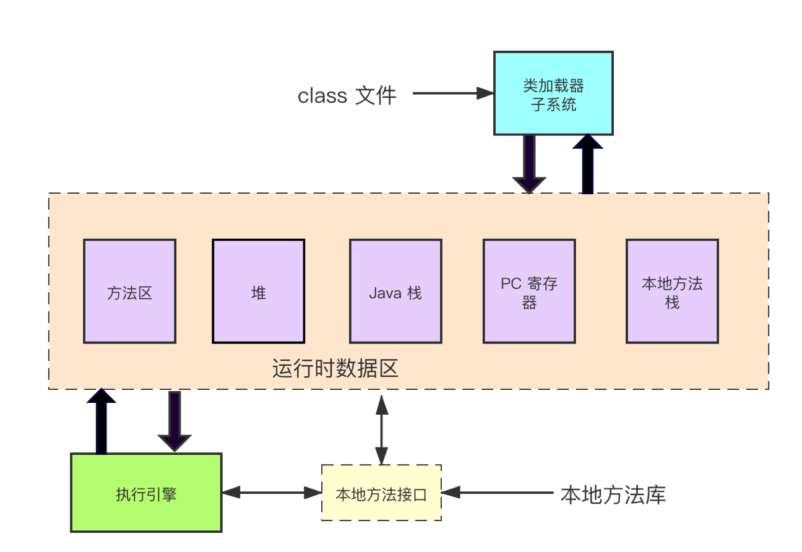
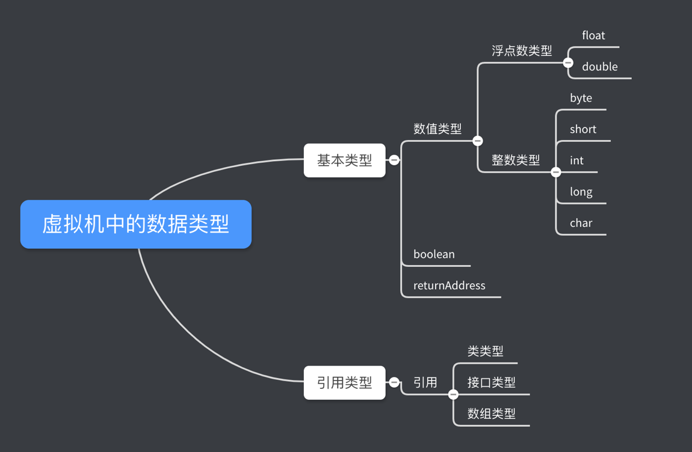
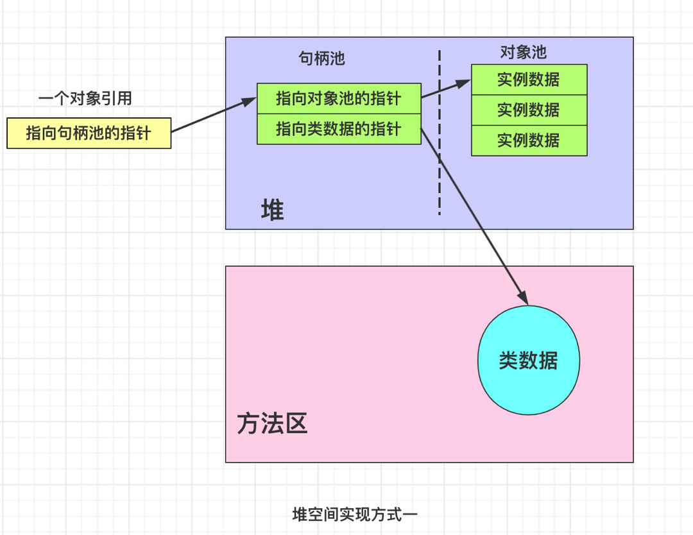
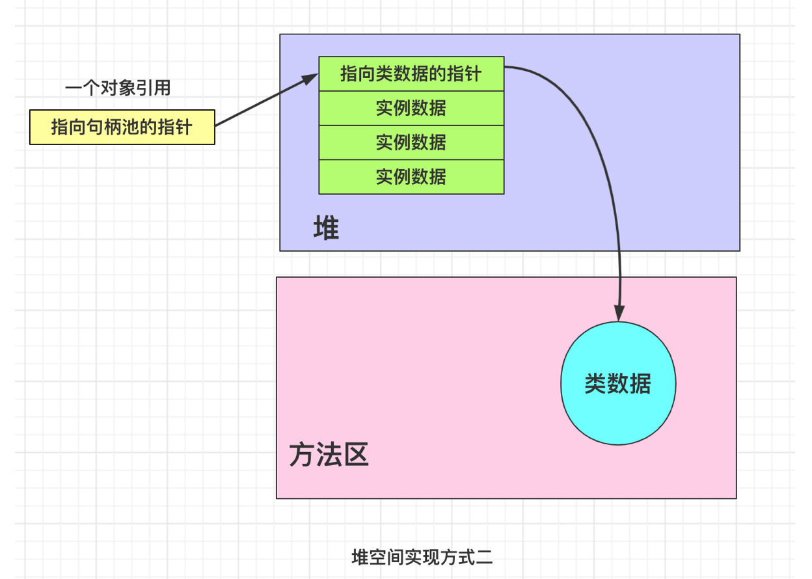
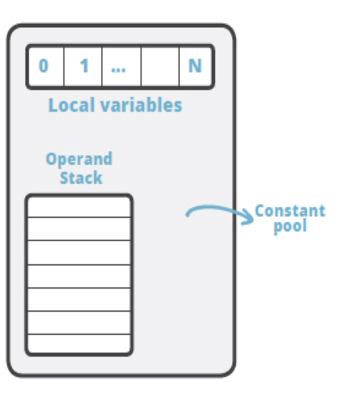
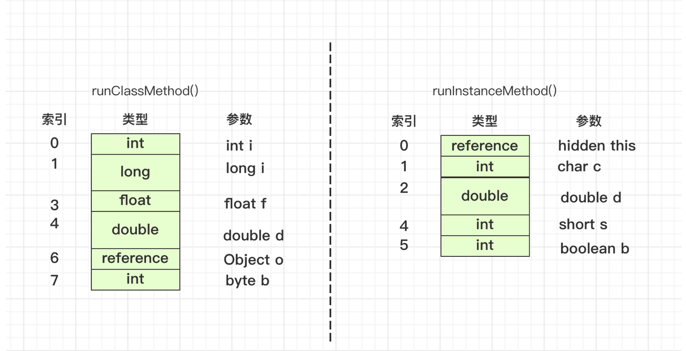
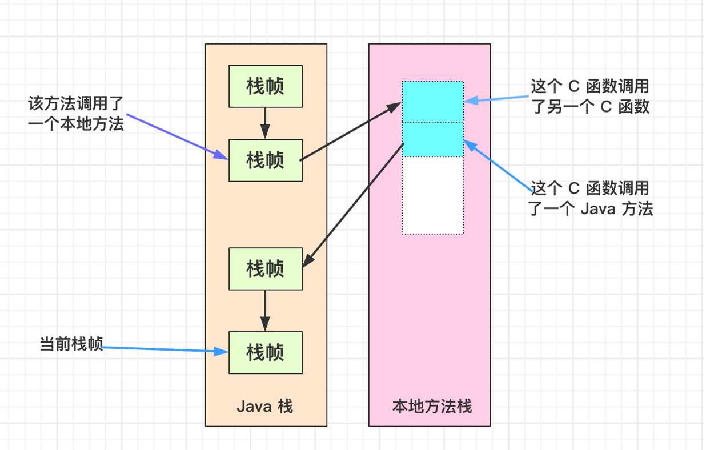

[TOC]

**Java 虚拟机子所以被称为”虚拟“的，就是因为它仅仅是由一个规范来定义的抽象计算机。**

### 1.Java虚拟机是什么
- 抽象规范
- 一个具体的实现
- 一个运行中的虚拟机实例


### 2.虚拟机的生命周期

在 Java 虚拟机内部有两种线程： 守护线程 和 非守护线程

**守护线程**
由虚拟机自己使用的，例如执行垃圾回收任务的线程

**非守护线程**
守护线程之外的其他线程都是非守护线程

只要还有非守护线程在运行，虚拟机就不会自动退出。

**结束虚拟机的方式** 有两种

- System.exit() 方法退出
- 非守护线程执行完


### 3.虚拟机的体系结构

   
 Java 虚拟机的内部体系结构图
      
 **方法区和堆都是线程共享的**
    
   
 图5-3 线程专有的运行时数据区
   
当一个线程被创建时，它将得到一个属于自己的 PC 寄存器（程序计数器）已经一个 Java 栈。当线程执行一个 Java 方法时， PC 寄存器的值总是指示下一条将被执行的指令， 它的 Java 栈存储该线程中 Java 方法调用的状态，包含它局部变量、被调用时传进来的参数、它的返回值、以及运算的中间结果。

Java 栈是由许多栈帧（stack frame）组成的，一个栈帧包含一个 Java 方法调用的状态。当线程调用一个 Java 方法时，虚拟机压入一个新的栈帧到该线程的 Java 栈中；当方法返回时，这个栈帧被从 Java 栈中弹出并抛弃。

Java 虚拟机没有寄存器，其指令集使用 Java 栈来存储中间数据。这样设计的原因是保持 Java 虚拟机的指令集尽量紧凑，同事也便于 Java 虚拟机在那些只有很少通用寄存器的平台上实现。
这样基于栈的体系结构，也有助于某些虚拟机实现的动态编译和即时编译器的代码优化。


#### 3.1 数据类型




数据类型分为两种：

- 基本类型
- 引用类型
    - 类类型引用  -- 对类实例的引用
    - 接口类型引用 -- 对实现了该接口的某个类实例的引用
    - 数组类型引用 -- 对数组对象的引用

Java 语言中的所有基本类型同样也都是 Java 虚拟机中的基本类型。
只是 boolean 类型不一样，编译器吧 Java 源码编译为字节码时，它用 int 或者 byte 表示 boolean.

**returnAddress** 只是 Java 虚拟机中内部使用的基本类型


#### 3.2 字的长度
在 Java 虚拟机中，最基本的数据单元就是字（word）, 它的大小是有每个虚拟机实现的设计者来决定的。

#### 3.3 类加载器子系统

负责查找并加载类型的那部分被称为类加载子系统。也就是我们所说的类加载器部分

Java 虚拟机有两种类加载器：启动类加载器和用户定义类加载器。如果按更详细的来分，就是启动类加载器、应用类加载器、拓展类加载器和用户自定义类加器。

类加载器子系统要定位和导入二进制 class 文件，还必须负责验证被导入类的正确性，为类变量分配并初始化内存，以及帮助解析符号引用。

执行的顺序：

1. 装载 -- 查找并加载类型的二进制数据
2. 连接 -- 执行验证，准备，以及解析（可选）

- 验证，确保被导入类型的正确性
- 准备，为类变量分配内存，并将其初始化为默认值
- 解析，把类型中的符号引用转换为直接引用 

3.初始化 -- 把类变量初始化为正确初始值

命名空间
每个类加载器都有自己的命名空间，其中维护着由它加载的类型

#### 3.4 方法区

方法区是存储关于被加载类型的信息

方法区是线程共享的，需要对方法区数据的访问设计为线程安全

方法区也被称为垃圾收集，因为虚拟机允许通过用户定义的类加载器来加载 Java 程序，当一些类不要被引用是，Java 虚拟机可以卸载这些不再被引用的类，从而使方法区占据的内存保存最小。

**存储的类型信息：**

- 这个类型的全限定名
- 这个类型的直接超类的全限定名（除了 java.lang.Object， 它没有超类）
- 这个类型的访问修饰符（public , abstract 或 final 的某个子集）
- 任何直接超类的接口的全限定名的有序列表
在 Java Class 文件和虚拟机汇总， 类型名称是以全限定名出现的，例如 java/lang/Object
- 这类型的常量池

- 字段信息
  包含：
    - 字段名
    - 字段的类型
    - 字段的修饰符（public, private, protected, static, final, volatile, transient 的某个子集）

- 方法信息
  包含：
  - 方法名
  - 方法的返回类型（或 void）
  - 方法参数的数量和类型（按声明顺序）
  - 方法的修饰符（public, private, protected, static, fianl, synchronized, native, abstract 的某个子集）
  - 方法的字节码（bytecodes）
  - 操作数栈和该方法的栈帧中局部变量区的大小
  - 异常表

- 除了常量以为的所有类（静态）变量
  类变量是由所有类实例共享的，即使没有任何类实例，它都可以被访问。
  而编译时常量（那些 final 声明及用编译时已知的值初始化的类变量）会复制它的所有常量到自己的常量池中或嵌入到它的字节码中。

- 一个到类 ClassLoader 的引用

- 一个到 Class 类的引用
  对于被加载的类型（类或接口），虚拟机都会相应地为它创建一个 java.lang.Class 类的实例，而且虚拟机以某种方式把这个实例和存在在方法区中的类型数据关联起来。
  在 java 程序中，可以得到并使用指向 Class 对象的引用。 Class 类中的一个静态方法可以让用户得到任何已加载的类的 Class 实例的引用
  
  
 
#### 3.5 堆 heap
  **Java 虚拟机实例中只有一个堆空间，所有线程都将共享这个堆。** 需要考虑多线程访问对象（堆数据）的同步问题
  
  **Java 程序在运行时创建的所有类型实例或数组都放在同一个堆中**
  
  Java 虚拟机有一条在堆中分配新对象的指令，却没有释放内存的指令，所以释放内存的任务就交给了垃圾回收机器处理。
  
  
  垃圾回收器的主要工作是自动回收不再被运行的程序引用的对象所占用的内存。也可能去移动那些还在使用的对象，以此减少堆碎片。
  
  堆空间可以是不连续的内存空间，可以动态扩展或收缩。
  
##### 3.5.1 堆空间的设计
  Java 虚拟机规范没有规定 Java 对象在堆中是如何实现的，它由虚拟机的实现者决定。
  
  Java 对象中包含的基本数据由它所属的类及其超类声明的实例变量组成。虚拟机能够通过对象实例的引用访问相应的类数据（存储在方法区的类型信息）。因此对象中会有一个指向方法区的指针。
  
  **设计一：**
  
  
  把堆分成两部分：句柄池 和 对象池
  
  一个对象引用就是一个指向方法区句柄池的本地指针
  
  句柄池包含两部分：一个是指向对象池的指针，一个指向方法区类型数据的指针
  
  **优点：**
  有利于堆碎片的整理
  当移动对象池中的对象时，句柄部分只需要更改一下指针指向对象的新地址就可以了
  
  **缺点：**
  每次访问对象的实例变量都要经过两次指针传递。
  
  
  **设计二**
  
  
  使对象指针直接指向一组数据，改数据包括对象实例数据以及指向方法区中的数据的指针。
  
  **优点**
  访问对象实例比较快，只有一次指针传递
  
  **缺点**
  整理堆中实例对象时，变得复杂
  
  
##### 3.5.2 虚拟机必须通过引用得到类数据的原因
当程序在运行时需要转换某个对象引用为另一种类型时，虚拟机必须要检查这种是否被允许，被转换的对象是否的确是被引用的对象或者它的超类型。（强转的时候）

当程序在执行 instanceof 操作时，虚拟机也进行了同样的检查。


#### 3.6 程序计数器
**每个线程都有一个属于自己的 PC (程序计数器)寄存器**， 它在线程启动的时候被创建。

PC 寄存器的大小是一个字长，它可以持有一个本地指针或持有一个 returnAddress.

当线程在执行某个 java 方法时， PC 寄存器的内容是下一条将要被执行指令的 “地址”，这个地址可以是一个本地指针，也可以是方法字节码中相对于该方法指令的偏移量。

当线程在执行一个本地方法是， PC 寄存器的值是 “undefined”


#### 3.7 Java 栈

**Java 栈也是每个线程独有的**， Java 栈上的数据都是此线程独有的

 Java 栈以帧的为单位保存线程的运行状态。
 
 虚拟机直接对 Java 栈执行两种操作：以帧为单位的压栈和出栈。
 
 某个线程正在执行的方法被称为该线程的当前方法，当前方法使用的栈帧称为当前帧，当前方法所属的类称为当前类，当前类的常量池被称为当前常量池。
 
 
 每当线程调用一个 Java 方法时，虚拟机会在该线程的 Java 栈中压入一个新栈，这个新栈就是当前帧。
 
 
 Java 方法通过两种方式完成返回。一是通过正常的 return 返回，另外是抛出异常而终止。无论是哪一方式返回，都会弹出当前帧释放。
 
##### 栈帧
  
 
 栈帧由三部分组成：局部变量表（Local variables）, 操作栈（Operand） 和 栈数据区
 
**局部变量表**
局部变量表是以字长为单位，从 0 开始计数的数组。
类型 int, float, reference 和 returnAddress 的值在数组中只占一个字长度；
long 和 double 占两个字长度。在访问时只需要范围第一个字的索引值即可。

byte, short, char 和 boolean 在局部变量表中用 int 。

```java
  
   public static int runClassMethod(int i, long l, float f, double d,
                                     Object o, byte b){
        return 0;
    }

    public int runInstanceMethod(char c, double d, short s, boolean b){
        return 0;
    }
    
```
 
    

  
  注意上图中， runInstanceMethod 方法第一个变量是 reference ，指向 this ,代表对象
  
  
 **操作栈**
 操作栈也是以字为单位的数组。
 
 它通过压栈和出栈来访问。

 存储时 byte, short, char 和 boolean 用 int 表示 
 
 Java 虚拟机运行方式是基于栈而不是寄存器的。它的指令是从操作栈中取得。
 
 虚拟机把操作栈作为它的工作区，大多数指令在操作栈中弹出数据，执行运算，然后把结果压回操作栈。
 
 
 **帧数据区**
 帧数据区用来处理支持常量池解析、正常方法返回已经异常派发机制的数据。
 
   
    
#### 3.8 本地方法接口 
 本地接口方法也就是 JNI
 
#### 3.9 本地方法栈
 本地方法栈是运行本地方法的相关的数据区
 
  

  
#### 3.10 执行引擎
 
 执行引擎是 Java 虚拟机的核心。
 
 执行引擎可以理解为一个抽象的规范，一个具体的实现，一个正在运行的实例。
 
 运行中的 Java 程序每一个线程都是一个独立的虚拟机执行器引擎的实例。
 
 执行引擎包含指令集，执行技术，线程等方法的内容构成。
 
 **指令集**
 指令集是指 Java 虚拟机中的指令序列构成的方法的字节码流。
 
 **执行技术**
 执行技术包含：解析、即时编译，自适应优化
 
 **线程**
 线程模型也属于执行引擎的一部分。
 
 
### 参考
[《深入 Java 虚拟机》](https://book.douban.com/subject/1138768/)
 
 
   
   
   

   

