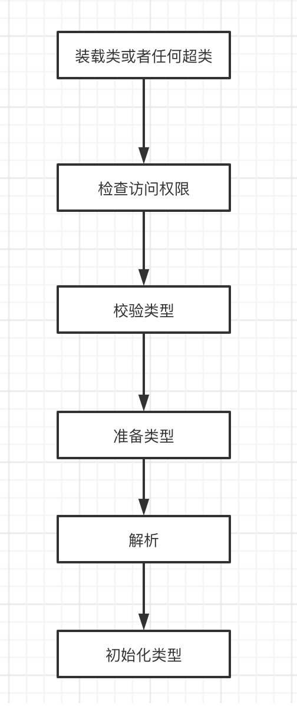
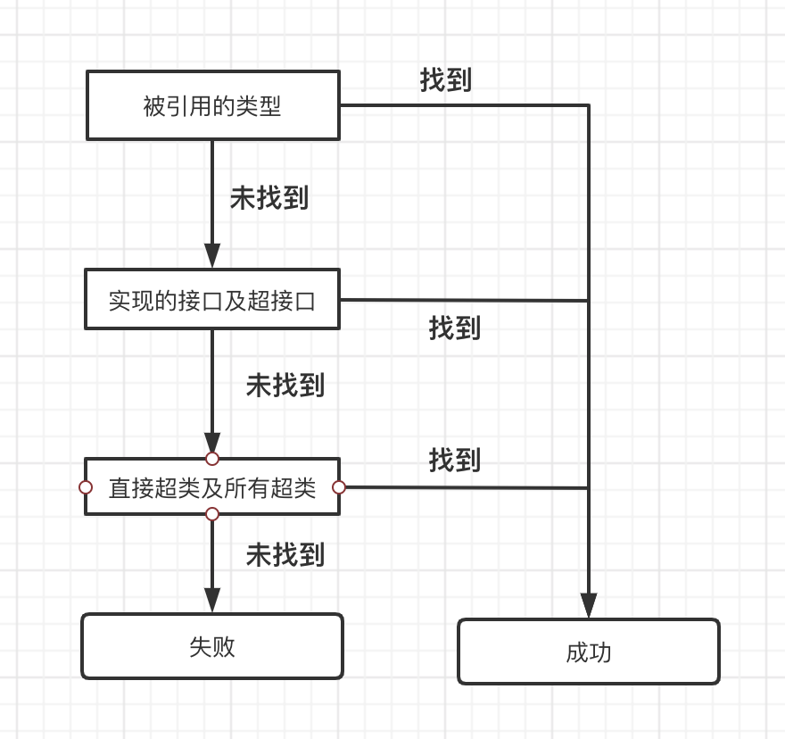

# Java 虚拟机（五）- 链接模式

从程序员的角度来看，理解 Java 虚拟机体系结构最重要的方面之一就是连接模型

### 1.解析和动态扩展
编译一个 Java 程序之后，会得到程序中每个类和接口的独立 class 文件。它们是通过接口符号（harbor）相互联系的，或者用 Java API 的 class 文件相联

class 文件把它所有的引用符号都保存在常量池中。在程序运行时，如果某个特定的接口符号将要被使用，它通过解析，根据符号引用查到实体，再把符号引用替换成一个直接引用的过程。
因为所有的符号引用都保存在常量池中，这个过程也被称为**常量池解析。**

解析分成早解析和迟解析

- 早解析：程序在它的 main() 方法尚未被调用时就已经完全连接了
- 迟解析：JVM 在执行程序的第一次用到这个符号引用的最后一刻才去解析

**连接包括把符号引用替换成直接引用，还包括检查正确性和权限。**

检查内容包含：

- 那个类是否存在
- 该类是返回有权访问那个类
- 那个类中是否存在名称相符的字段
- 那个字段的类型和期望的类型是否相符
- 本类是否有权访问那个字段
- 那个字段的确是一个类变量，而不是一个实例变量。

**Java 虚拟机为每一个装载的类和接口都保存一份独立的常量池。**

### 2.类加载器和双亲委托机制
看前面的文章

### 3.常量池的解析

 被初始化为编译时常量的静态 final 变量的引用，在编译时被解析为常量值的一个本地拷贝
 

### 4.其他类型的解析

#### 4.1 解析 CONSTANT_Class_info 入口

- 1. 装载类或任何超类
在第一步，虚拟机确定被引用的已经被装载进当前命名空间，并为该类标记为初设装载器。
如果当前类加载器是启动类加载器，虚拟机根据不同的实现，使用不同的方式加载。
如果是自定义类加载器，则通过 loadClass() 方法完成加载请求，把需要加载的类的全限定名作为参数传递进去。

被引用的类型被加载了，虚拟机检测它的二进制数据。如果类型是一个类，并且不是 java.lang.Object， 虚拟机根据类的数据得到它的直接超类的全限定名。如果超类没有被加载进当前命名空间。如果没有，先加载超类。一旦超类被加载了，虚拟在此检查超类的二进制数据来找到它的超类。一直重复到超类是 Object 为止。

一旦一个类型被加载进当前命名空间，而且通过递归，所有该类型的超类和超接口都会被加载成功。

- 2.检查访问权限
如果没有访问权限，会抛出 **IllegalAccessError 异常**，符号引用解析失败。

- 3.检验类型
校验过程要去虚拟机加载的类型符合 Java 语言的语义

- 4.准备阶段
准备阶段虚拟机为类变量以及实现不同有差别的数据结构分配内存

- 5.解析类型
解析类型的阶段是可以选择的，根据参数选择解析或不解析

- 6.初始化类型
超类必须在子类之前被初始化，必须确保它的所有超类都被初始化，从 Object 开始沿着继承的结构向下处理，直达被引用的类。
如果一个类型没有被连接，在初始化之前必须被连接。
超类必须被初始化，超接口是不必的

如果虚拟机因为内存不足，在初始化的时候会抛出 **OutOfMemoryError 异常**

#### 4.2 解析 CONSTANT_Fieldref_info 入口
要解析 CONSTANT_Fieldref_info 入口，必须要先解析 CONSTANT_Class_info 入口。

搜索 Field 字段过程

- 1.虚拟机在被引用的类型中查找具有指定的名称和类型的字段。如果找到，则成功。
- 2.否则虚拟机检测类型的直接实现或拓展的接口，以及递归地检查它们的超接口。如果找到，则成功
- 3.否则检测直接超类，并且递归地检查类型的所有超类。如果找到，则成功
- 4.最后都找不到，则字段搜索失败

如果没有在被引用的类或者它的任何超类中找到名字和类型都符合的字段，虚拟机就会抛出 **NoSuchFieldError 异常**
如果字段搜索成功，但是当前类没有权限访问该字段，虚拟机就会抛出 **IllegalAccessError 异常**

成功了之后，虚拟机就会把这个入口标记为已解析，并在这个常量池入口的数据中放上指向这个字段的直接引用。

#### 4.3 解析 CONSTANT_Methodref_info 入口
要解析 CONSTANT_Methodref_info 入口，必须要先解析 CONSTANT_Class_info 入口。

解析 methodref 的过程

- 1.如果被解析的类型是一个接口，而非类，虚拟机就会抛出 **IncompatibleClassChangeError 异常**
- 2.如果解析的类型是一个类。虚拟机检查被引用的类是否有一个符合指定名字以及描述符。如果找到，则成功
- 3.否则虚拟机检查是否这个类直接实现了任何接口，并递归地检查由类型直接实现的接口的超接口，查看是否有方法符合指定的名称和描述符。如果找到，则成功
- 4.最后都找不到，则方法搜索失败

如果没有在被引用的类和它的任何超类中找到名称、返回类型、参数数量和类型都符合的方法，虚拟机就会抛出 **NoSuchMethodError 异常**

成功了之后，虚拟机就会把这个入口标记为已解析，并在这个常量池入口的数据中放上指向这个字段的直接引用。

#### 4.4 解析 CONSTANT_InterfaceMethodref_info 入口
要解析 CONSTANT_InterfaceMethodref_info 入口，必须要先解析 CONSTANT_Class_info 入口。

解析 InterfaceMethodref 的过程

- 1.如果被解析的类型是一个类，而非接口，虚拟机就会抛出 **IncompatibleClassChangeError 异常**
- 2.如果解析的类型是一个接口。虚拟机检查被引用的接口是否有符合指定名称和描述符。如果找到，则成功
- 3.否则虚拟机检查接口的直接超接口，并且递归地检查接口的所有超接口，以及 java.lang.Object 类来查找符合指定名称和描述符的方法。如果找到，则成功
- 4.最后都找不到，则接口方法搜索失败

如果在被引用的接口和它的任何超类型中都招标名称、返回类型、参数数量和类型都符合的方法，虚拟机就会抛出 **NoSuchMethodError 异常**

成功了之后，虚拟机就会把这个入口标记为已解析，并在这个常量池入口的数据中放上指向这个字段的直接引用。

#### 4.5 解析 CONSTANT_String_info 入口

要解析 CONSTANT_String_info 入口，虚拟机必须把一个指定内部字符串对象的引用放置到被解析的常量池入口数据中。该字符串对象必须按照 sting_index 项在 CONSTANT_String_info 中指明 CONTANT_Utf8_info 入口所指定的字符顺序组织。

要完成 CONSTANT_String_info 入口的解析过程，虚拟机应把指向被拘留的字符串对象的引用放置到被解析的常量表入口数据中。

### 5.直接引用
**常量池解析的最终目标是把符号引用替换为直接引用**

**直接存储的格式是用指针**

指向类、类变量和类方法的直接引用是指向方法区的本地指针
指向实例变量和实例方法的直接引用都是偏移变量。实例变量的直接引用是从对象的映像开始算起到这个实例位置的偏移量。实例方法的直接引用是方发表的偏移量。

## 参考：

- [《深入 Java 虚拟机》](https://book.douban.com/subject/1138768/)

