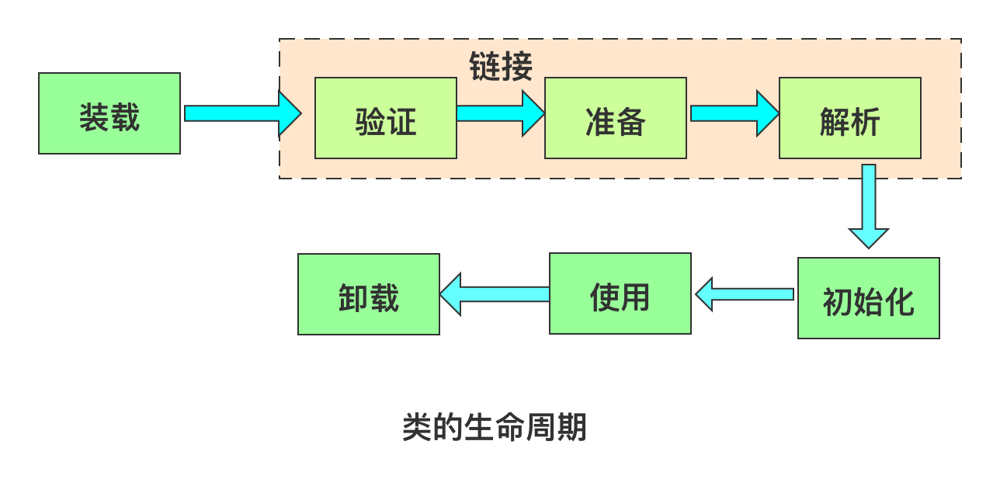
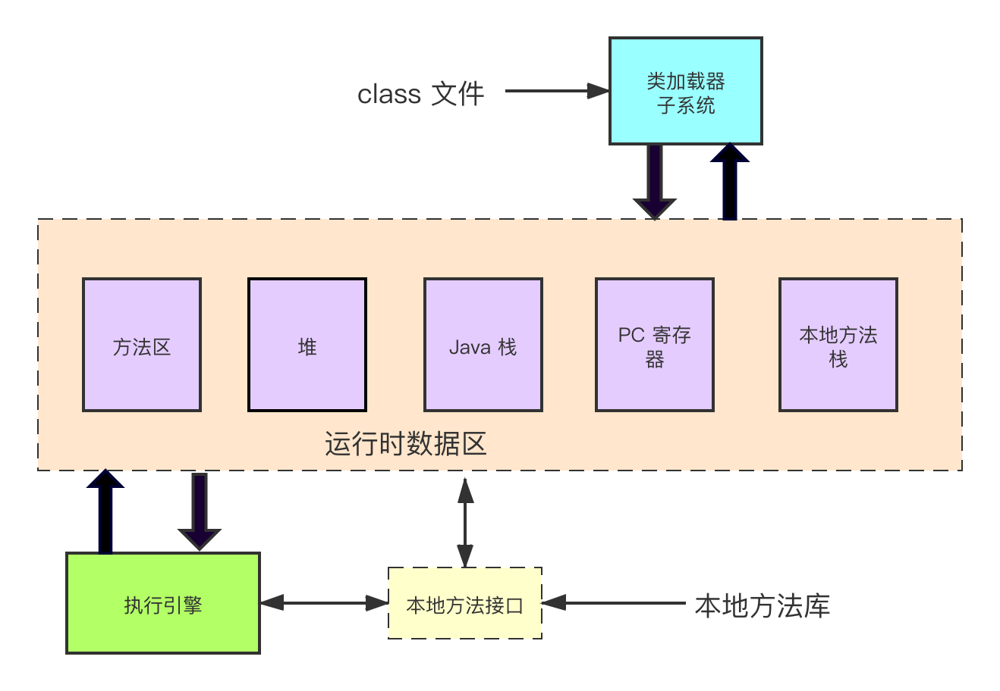
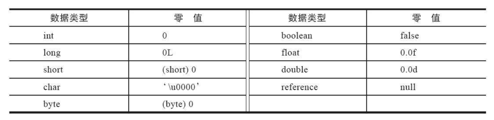

[TOC]

**Java 虚拟机通过装载、连接和初始化一个 Java 类型**

类的完整生命周期包括：加载、验证、准备、解析、初始化、使用、卸载



图 1-1 类的完整生命周期


重要的阶段
- **装载**：把二进制型式的 Java 类型读入 Java 虚拟机中
- **连接**：把已经读入虚拟机中的二进制型式的类型数据合并到虚拟机的运行时状态中去
连接分三个子步奏：验证、准备和解析
- **初始化**：给类变量赋予适当的初始值





## 1 装载
**装载**：就是把二进制型式的 Java 类型读入 Java 虚拟机中

装载有三个基本动作组成

- 通过该类型的完全限定名，产生一个代表该类型的二进制数据流；
- 解析这个二进制数据流为方法区内的数据结构
- 创建一个表示该类型的 java.lang.Class 类的实例

类型二进制数据流产生的方式有多种
例如：

- 从本地文件系统装载一个 Java Class 文件
- 通过网络下载一个 Java Class 文件
- 动态为某个类型计算其 Class 文件格式

创建类型就是把一个类型的二进制数据解析为方法区中的内部数据结构，并在堆上建立一个 Class 对象的过程。

## 2 连接
**连接**：就是把已经读入虚拟机中的二进制型式的类型数据合并到虚拟机的运行时状态中去
连接分三个子步奏：验证、准备和解析

### 2.1 验证
验证的目的就是确认类型符合 Java 语言的语义，并且它不会危及虚拟机的完整性。
在验证阶段，虚拟机规范会说明在每种情况下应该抛出哪种异常，例如找不到相应的类，就会抛出 NoClassDefFoundError 异常。

在验证阶段，会使用 class 文件检验器保证装载的 class 文件内容是正确的结构。这里的 class 文件内容见 [Java 虚拟机（二）：Class 文件结构](https://www.jianshu.com/p/ea05cea9c1be)

class 文件检验器会进行四趟扫描检测；

**验证扫描检测**
#### 第一趟扫描：class 文件的结构检查

- 时间：第一趟扫描是在类被装载是进行的
- 目的：它的主要目的是保证字节序列正确地定义一个类型，并且必须遵循 Java 的 class 文件的固定格式，这样它才能被编译成在方法区中的内部数据结构
- 检验的内容：
    - 是否是魔数 OxCAFEBABE 开头
    - class 文件的主版本号和次版本号是否在虚拟机的支持范围之内
    - 。。。
#### 第二趟扫描: 语义检查

- 时间：在连接过程时进行
- 目的：确保类型数据遵从 Java 编程语言的语义
- 检验的内容：
    - 检查 class 文件每个组成部分，确保它们是否是其所属类型的实例，结构是否正确；
    - 检查 final 的类不能拥有子类；
    - 检查 final 的方法不能被覆盖；
    - 确保在类型和超类型直接没有不兼容的方法声明（比如两个方法拥有同样的名字，参数在数量、类型、类型上都相同，但是返回类型不同）
    - 检查这个类是否有父类（除了 Object 类以外的所有类，都必须有一个超类）

#### 第三趟扫描： 字节码验证

- 时间：在连接过程时进行
- 目的：确保程序语义是合法的、符合逻辑的
- 检验内容：对数据流和控制流分析

#### 第四趟扫描： 符号引用的验证

- 时间：在**动态连接阶段**进行的
- 目的：确保被引用的类、字段及其方法确实存在
- 检查内容：
    - 符号引用中通过字符串描述的全限定名是否能找到对应的类
    - 在指定类中是否存在符合方法的字段描述符及简单名称所描述的方法和字段
    - 符合引用中的类、字段、方法的访问性（private、protected、public、default）是否可被当前类访问

符号引用验证的目的是确保解析动作能正常执行，如果没有通过验证、就会抛出 java.lang.InCompatibleClassChangeErro 的子类，例如 java.lang.ILLegalAccessError, java.lang.NoSuchFieldError, java.lang.NoSuchMethodError 等。
      

### 2.2 准备
在准备阶段，Java 虚拟机会为 **类变量**分配内存，设置默认值。

例如


```java
 class A {
    public static int value = 123;
 }
```

value 是 A 的类变量，类型是 int, 在准备阶段，变量 value 赋值为默认值 0;至于将值 123 赋值给 value 是在初始化阶段。

基本类型的默认值




### 2.3 解析（可选）
**解析过程就是在类型的常量池中寻找类、接口、字段和方法的符号引用，把这些符号引用替换成直接引用的过程**

常量池解析的最终目标是把符号引用替换为直接应用。

直接应用的数据格式：

- 指向类型、类变量和类方法的直接引用是 指向方法区的本地指针
- 指向实例变量和实例方法的直接引用是 偏移量

实例变量的直接引用可能是从对象的映像开始算起到这个实例变量位置的偏移量；
实例方法的直接应用是到方法表的偏移量。

## 3 初始化
在初始化阶段是为类变量赋予正确的值。
这里的”正确“初始值指的是程序员希望这个类变量所具备的起始值。

在 Java 代码中，一个正确的初始值是通过类变量初始化语句或者静态初始化给出的。
那上面的例子为例

```java
 class A {
    public static int value = 123;
 }
```
value 在准备阶段已经赋予默认值 0， 在初始化阶段，就会设值为 123

### 3.1 初始化步骤
初始化一个类包含两个步骤：

- 如果类存在直接超类，且直接超类没有被初始化，就先初始化直接超类；
- 如果类存在一个类初始化方法，就执行此方法

### 3.2 主动使用和被动使用
这里的主动使用和被动使用，指的是虚拟机初始化 class 类时机时的使用方式，所有的 java 虚拟机实现必须在每个类或接口首次主动使用时初始化。

下面六种情形符合主动使用的要求：

- 当创建某个类的新实例时（或者通过字节码中执行 new 指令；或者通过不明确的创建、反射或者反序列化）
- 当调用某个类或接口的静态字段，或者对该字段赋值（在字节码中，执行 getstatic 或 putstatic 指令时），用 final 修饰的静态字段除外，它被初始化编译时的常量表达式
- 当调用 Java API 的某个反射方法时，比如类 Class 中的方法或者 java.lang.reflect 包中类方法
- 当初始化某个类的子类时（某个类初始化时，要求它的超类已经被初始化了）
- 当虚拟机启动时某个被标明为启动的类（即含有 main() 方法的那个类


例子：

```java
public class TestParent {

    static int sleep = (int)(Math.random() * 3.0);

    static final  int touch = (int)(Math.random() * 2.0);

    static {
        System.out.println("TestParent was initialized");
    }
}

public class TestChild extends TestParent {

    static int crying = 1 + (int)(Math.random() * 2.0);

    static {
        System.out.println("TestChild was initialized.");
    }
}

public class TestClient {
    static {
        System.out.println("TestClient was initialized");
    }

    public static void main(String[] args){
        int hours = TestChild.sleep;
        System.out.println("TestClient hours: " + hours);
    }
}
```

输出：

```text
TestClient was initialized
TestParent was initialized
TestClient hours: 1
```
从上面的例子可以看出， TestChild 没有被初始化，TestParent 被初始化了。


### 3.3 接口的初始化

当 Java 虚拟机初始化一个类时，要求它所有父类都已经被初始化，但是这条规则不适用于接口

- 在初始化一个类时，并不会初始化它所实现的接口
- 在初始化一个接口时，并不会先初始化它的父接口

因此，一个父接口并不会因为它的子接口或者实现类的初始化而初始化。只有当程序首次使用特定接口的静态变量时，才会导致该接口的初始化。


