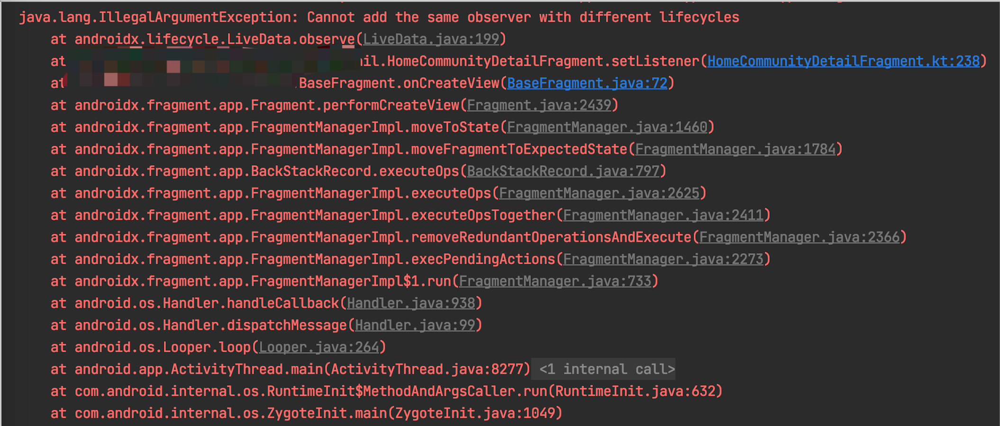
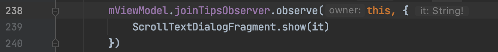

LiveData: Cannot add the same observer with different lifecycles

[toc]

## 1. 崩溃
测试在跑 Monkey 的时候，出现了崩溃

```
java.lang.IllegalArgumentException: Cannot add the same observer with different lifecycles
	at androidx.lifecycle.LiveData.i(LiveData.java:6)
	at xxxx.HomeCommunityDetailFragment.X0(HomeCommunityDetailFragment.kt:7)
	at com.tcloud.core.ui.baseview.BaseFragment.onCreateView(BaseFragment.java:9)
	at androidx.fragment.app.Fragment.performCreateView(Fragment.java:6)
	at androidx.fragment.app.f.P0(FragmentManager.java:64)
	at androidx.fragment.app.f.M0(FragmentManager.java:6)
	at androidx.fragment.app.a.A(BackStackRecord.java:22)
	at androidx.fragment.app.f.r0(FragmentManager.java:6)
	at androidx.fragment.app.f.s0(FragmentManager.java:14)
	at androidx.fragment.app.f.W0(FragmentManager.java:10)
	at androidx.fragment.app.f.p0(FragmentManager.java:4)
	at androidx.fragment.app.f.i0(FragmentManager.java:4)
	at androidx.fragment.app.f.E(FragmentManager.java:3)
	at androidx.fragment.app.c.c(FragmentController.java:1)
	at androidx.fragment.app.FragmentActivity.onStart(FragmentActivity.java:5)
	at androidx.appcompat.app.AppCompatActivity.onStart(AppCompatActivity.java:1)
     
	...
```
这个是在 `HomeCommunityDetailFragment` 的 setListener 方法里面抛出来的

## 2. 原因

上面对崩溃路径做了还原，但是没有具体的行号，不知道崩溃在哪个 observe。

对此，我们先看看抛出的异常点。

### 2.1 查找抛出异常点

在 LiveData#observe 的源码中

```java
public void observe(@NonNull LifecycleOwner owner, @NonNull Observer<? super T> observer) {
    assertMainThread("observe");
    if (owner.getLifecycle().getCurrentState() == DESTROYED) {
        // ignore
        return;
    }
    LifecycleBoundObserver wrapper = new LifecycleBoundObserver(owner, observer);
    ObserverWrapper existing = mObservers.putIfAbsent(observer, wrapper);
    // 这里抛异常
    if (existing != null && !existing.isAttachedTo(owner)) {
        throw new IllegalArgumentException("Cannot add the same observer"
                + " with different lifecycles");
    }
    if (existing != null) {
        return;
    }
    owner.getLifecycle().addObserver(wrapper);
}
```

在上面会抛出异常，注释是这样写的

> If the given owner, observer tuple is already in the list, the call is ignored. If the observer is already in the list with another owner, LiveData throws an IllegalArgumentException.

大致的意思是如果 observer 已经在其的 owner 里面了，就会抛出异常。
从中可以得出的信息是，observer 已经在 map 里面，重复添加导致的异常。

但是，我们没办法重现现场，无法知道是哪个 observer 重复添加了。
没办法重现，那就从日志入手，看看当时崩溃的现场是怎样。

### 2.2 分析日志

经过对崩溃日志的分析和简化后

```

[D][2022-03-17 +8.0 00:11:02.699][28477, 4874][chikii][, , 0][onCreateView: HomeCommunityDetailFragment{8c00d05 #0 id=0x7f090279}(P:28477)(T:2)(C:BaseFragment)at (BaseFragment.java:1)
[D][2022-03-17 +8.0 00:11:02.708][28477, 4874][chikii][, , 0][onCreateView: HomeCommunityDetailFragment{65317d6 #3 id=0x7f090279}(P:28477)(T:2)(C:BaseFragment)at (BaseFragment.java:1)
[I][2022-03-17 +8.0 00:11:03.115][28477, 4874][chikii][, , 0][-----------onCrash---------------(P:28477)(T:2)(C:PcgoApp)at (PcgoApp.java:1)
```

发现在非常短的时间内创建了 HomeCommunityDetailFragment，猜测是不是因为这个原因导致的。

### 2.3 重现问题
根据上面的分析，HomeCommunityDetailFragment 是在 HomeCommunityFragment 中 tab 选中的时候创建的


```kotlin
// `HomeCommunityFragment#setListener`

 override fun setListener() {
   
SC.get(IHomeService::class.java).getHomeCommunityCtrl().addUpdateInfoObserver(this)
    tabContainerView.setOnTabSelectedListener(object : HomeCommunityTabContainerView.OnTabSelectedListener {
        override fun onTabSelect(tabSelectedBean: HomeCommunityTabContainerView.HomeCommunityTabSelectedBean) {
            mCurCommunityId = tabSelectedBean.communityId

            hideTabFragment(tabSelectedBean.lastTag, tabSelectedBean.lastCommunityId > 0)
            showTabFragment(tabSelectedBean.targetTag, tabSelectedBean.targetPath)
        }

    
        override fun onSelectTheSameTab(targetTag: String) {
          ...
        }
    })
```
我们模拟崩溃的线程，连续调用两次 showTabFragment 方法，这样就可以在很短的时间内创建 `HomeCommunityDetailFragment` 

```kotlin
tabContainerView.setOnTabSelectedListener(object : HomeCommunityTabContainerView.OnTabSelectedListener {
        override fun onTabSelect(tabSelectedBean: HomeCommunityTabContainerView.HomeCommunityTabSelectedBean) {
            mCurCommunityId = tabSelectedBean.communityId

            hideTabFragment(tabSelectedBean.lastTag, tabSelectedBean.lastCommunityId > 0)
            showTabFragment(tabSelectedBean.targetTag, tabSelectedBean.targetPath)
            showTabFragment(tabSelectedBean.targetTag, tabSelectedBean.targetPath) // ← 这里 重复调用
        }

        override fun onSelectTheSameTab(targetTag: String) {
          ...
        }
    })
```

然后在启动 app　后创建　HomeCommunityDetailFragment　的过程中出现了崩溃



上面重现的现场和日志中的崩溃堆栈一致,根据现场的日志发现崩溃的地方是在 238 行




### 2.4 分析问题

找到了崩溃点、并且能重现现场那就好办了，下面要研究为什么会出现这个崩溃

```kotlin
mViewModel.joinTipsObserver.observe(this, {
	ScrollTextDialogFragment.show(it)
})
```
根据注释
> If the given owner, observer tuple is already in the list, the call is ignored. If the observer is already in the list with another owner, LiveData throws an IllegalArgumentException.

难得我们的 observer 会重复添加，但是我们明明是创建了两个 HomeCommunityDetailFragment， 所以，这里应该也是不同的 observer 才符合逻辑的。

可问题出在哪了呢

百思不得其解，在 google 的帮助下找到了一些线索

在这个[问答](https://stackoverflow.com/questions/47025233/android-lifecycle-library-cannot-add-the-same-observer-with-different-lifecycle)下 和 这篇文章 [Support for Kotlin SAM in release 1.4](https://jorgecastillo.dev/kotlin-sam-conversions) 可以得出的结论，**Kotlin 的 lambda 表达式里面如果仅仅只有 final 的静态变量或者静态函数。那么为了让每次使用的时候减少内存的分配，编译器会将里面的内容用一个全局的单例。**

对于上面的这个结论是否正确，我们先看下面 kotlin 代码生成的字节码

```kotlin
  mViewModel.joinTipsObserver.observe(this, {
	ScrollTextDialogFragment.show(it)
  })
```
对应的字节码生成是

```
   LINENUMBER 238 L6
    ALOAD 0
    INVOKESPECIAL xxxxHomeCommunityDetailFragment.getMViewModel ()LxxxxHomeCommunityDetailViewModel;
    INVOKEVIRTUAL xxxxHomeCommunityDetailViewModel.getJoinTipsObserver ()Landroidx/lifecycle/MutableLiveData;
    ALOAD 0
    CHECKCAST androidx/lifecycle/LifecycleOwner
    GETSTATIC xxxxHomeCommunityDetailFragment$setListener$7.INSTANCE : LxxxxHomeCommunityDetailFragment$setListener$7;
    CHECKCAST androidx/lifecycle/Observer
    INVOKEVIRTUAL androidx/lifecycle/MutableLiveData.observe (Landroidx/lifecycle/LifecycleOwner;Landroidx/lifecycle/Observer;)V
```
从上面的字节码我们可以得知：

-  1.定义了一个匿名内部类 `HomeCommunityDetailFragment$setListener$7`
- 2.获取一个上面这个匿名内部类的单例 `HomeCommunityDetailFragment$setListener$7.INSTANCE`
- 3.将 这个匿名内部类转成 Observer, 传递给 MutableLiveData.observe 函数

根据字节码的分析上面的结论是正确的。

## 3. 解决

已经知道了因为崩溃的原因，那剩下的就是要把它解决。

思路就是：崩溃的原因是使用了一个全局的单例导致的，那我们可以尝试，不让编译器生成一个单例，而是让它每次都生成一个对象，这样虽然没法优化内存，但是可以解决我们的问题。

### 3.1 方法一：不使用 lambda 表达式

第一个方式是不使用 lambda 表达式，还是用接口方法的形式, 添加的是 `Observer` 匿名内部类

```kotlin
mViewModel.joinTipsObserver.observe(this, object :Observer<String>{
	override fun onChanged(string: String?) {
		string?.let {
			ScrollTextDialogFragment.show(it)
		}
	}
})
```
然后看生成的字节码

```
 LINENUMBER 238 L6
    ALOAD 0
    INVOKESPECIAL xxx/HomeCommunityDetailFragment.getMViewModel ()Lxxx/HomeCommunityDetailViewModel;
    INVOKEVIRTUAL xxx/HomeCommunityDetailViewModel.getJoinTipsObserver ()Landroidx/lifecycle/MutableLiveData;
    ALOAD 0
    CHECKCAST androidx/lifecycle/LifecycleOwner
    NEW xxx/HomeCommunityDetailFragment$setListener$7
    DUP
    INVOKESPECIAL xxx/HomeCommunityDetailFragment$setListener$7.<init> ()V
    CHECKCAST androidx/lifecycle/Observer
    INVOKEVIRTUAL androidx/lifecycle/MutableLiveData.observe (Landroidx/lifecycle/LifecycleOwner;Landroidx/lifecycle/Observer;)V
```
在上面的字节码，我们可以看到，现在是 NEW  `HomeCommunityDetailFragment$setListener$7` 的对象
然后是将这个对象传入到 MutableLiveData.observe 函数中。
这点与使用 lambda 使用一个单例是完全不同。


跑一下，没有出现崩溃，证明这个方法是可行的。

当然这样的写法，也有它的问题，就是每次 observe 的值变化的时候，都会生成一个新的对象，没有内存优化的效果。


### 3.2 方法二：引用一个外部非 final或者非 static 的变量或方法
我们在 lambda 的表达式内引用一个外部非 final或者非 static 的变量或方法，让lambda 的表达式内引不仅仅是final 的静态变量或者静态函数，也可以避免生成一个单例。
我们添加一个 `unused` 的一个变量

```kotlin
var unused = "unused"
mViewModel.joinTipsObserver.observe(this, {
	L.info(TAG, "joinTipsObserver $unused")
	ScrollTextDialogFragment.show(it)
})
```
查看生成的字节码

```
L6
    LINENUMBER 238 L6
    NEW kotlin/jvm/internal/Ref$ObjectRef
    DUP
    INVOKESPECIAL kotlin/jvm/internal/Ref$ObjectRef.<init> ()V
    ASTORE 1
    ALOAD 1
    LDC "unused"
    PUTFIELD kotlin/jvm/internal/Ref$ObjectRef.element : Ljava/lang/Object;
   L7
    LINENUMBER 239 L7
    ALOAD 0
    INVOKESPECIAL xxx/HomeCommunityDetailFragment.getMViewModel ()Lxxx/HomeCommunityDetailViewModel;
    INVOKEVIRTUAL xxxx/HomeCommunityDetailViewModel.getJoinTipsObserver ()Landroidx/lifecycle/MutableLiveData;
    ALOAD 0
    CHECKCAST androidx/lifecycle/LifecycleOwner
    NEW xxx/HomeCommunityDetailFragment$setListener$7
    DUP
    ALOAD 1
    INVOKESPECIAL xxx/HomeCommunityDetailFragment$setListener$7.<init> (Lkotlin/jvm/internal/Ref$ObjectRef;)V
    CHECKCAST androidx/lifecycle/Observer
    INVOKEVIRTUAL androidx/lifecycle/MutableLiveData.observe (Landroidx/lifecycle/LifecycleOwner;Landroidx/lifecycle/Observer;)V
```
在上面的字节码可以看到：
- 1. 在 238 行生成一个 ObjectRef 的对象， 然后将常量池中的 `unused` 字符串赋值给 ObjectRef.element
- 2. 在 239 行，也是 NEW `HomeCommunityDetailFragment$setListener$7` 的一个匿名内部类
- 3. 再将这个生成的匿名对象转成 Observer，然传入到 MutableLiveData.observe 函数中。

再跑一下，也没有出现崩溃，证明这个方法也是可行的。

## 4. 避坑
经过上面的分析，当我们在使用 lambda 表达式的时候，要注意，**如果表达式如果仅仅只有 final 的静态变量或者静态函数，那么为了让每次使用的时候减少内存的分配，编译器会将里面的内容用一个全局的单例**。 

这个优化是没有问题，但是在 LiveData#observe 的使用情况下会出现坑。

后续使用的时候需要注意，避免在 lambda 的表达式内仅仅只使用 final 的静态变量或者静态函数。


## 5. 参考
- [Android lifecycle library: Cannot add the same observer with different lifecycles](https://stackoverflow.com/questions/47025233/android-lifecycle-library-cannot-add-the-same-observer-with-different-lifecycle)
- [Support for Kotlin SAM in release 1.4](https://jorgecastillo.dev/kotlin-sam-conversions)


