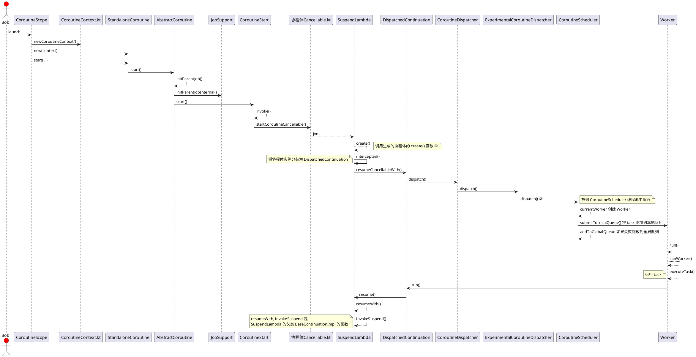
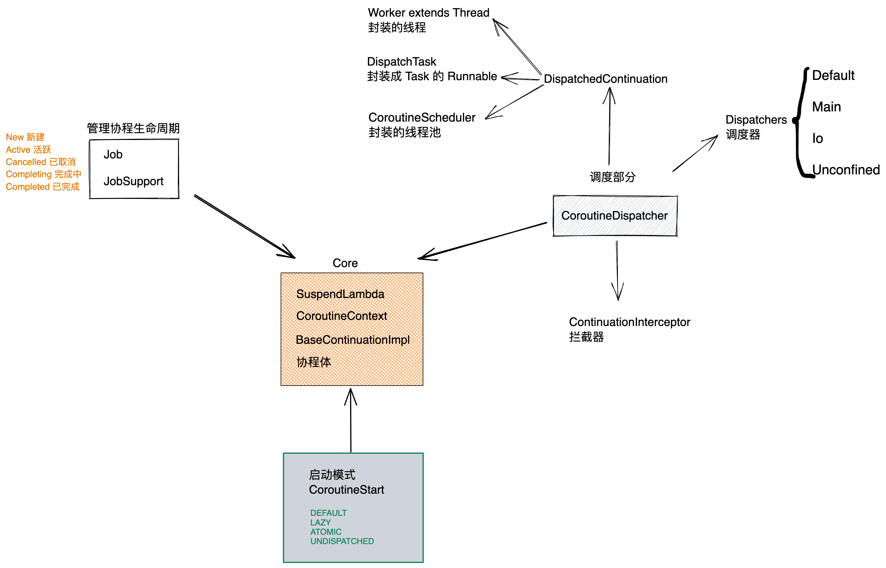

Koltin 协程 2

[toc]

## 3. 协程的整个配套体系

### 3.1 启动流程




说明：
SuspendLambda 是协程体类对象，封装协程体的操作


继承关系
SuspendLambda --> ContinuationImpl --> BaseContinuationImpl

①

```kotlin
public actual fun <R, T> (suspend R.() -> T).createCoroutineUnintercepted(
    receiver: R,
    completion: Continuation<T>
): Continuation<Unit> {
    val probeCompletion = probeCoroutineCreated(completion)
    return if (this is BaseContinuationImpl)
        create(receiver, probeCompletion) // 调用生成代码里面的 create
    else {
        createCoroutineFromSuspendFunction(probeCompletion) {
            (this as Function2<R, Continuation<T>, Any?>).invoke(receiver, it)
        }
    }
}

```

反编译的代码

```java
 public static final void main(@NotNull String[] args) {
      Intrinsics.checkParameterIsNotNull(args, "args");
      BuildersKt.launch$default((CoroutineScope)GlobalScope.INSTANCE, (CoroutineContext)null, (CoroutineStart)null, (Function2)(new Function2((Continuation)null) {
         int label;

        // BaseContinuationImpl 的 invokeSuspend() 调用
         @Nullable
         public final Object invokeSuspend(@NotNull Object $result) {
            Object var2 = IntrinsicsKt.getCOROUTINE_SUSPENDED();
            switch(this.label) {
            case 0:
               ResultKt.throwOnFailure($result);
               Item var10000 = new Item();
               this.label = 1;
               if (CoroutineKt.postItem(var10000, this) == var2) {
                  return var2;
               }
               break;
            case 1:
               ResultKt.throwOnFailure($result);
               break;
            default:
               throw new IllegalStateException("call to 'resume' before 'invoke' with coroutine");
            }

            return Unit.INSTANCE;
         }

        // 调用到这里的 create 方法
         @NotNull
         public final Continuation create(@Nullable Object value, @NotNull Continuation completion) {
            Intrinsics.checkParameterIsNotNull(completion, "completion");
            Function2 var3 = new <anonymous constructor>(completion);
            return var3;
         }

         public final Object invoke(Object var1, Object var2) {
            return ((<undefinedtype>)this.create(var1, (Continuation)var2)).invokeSuspend(Unit.INSTANCE);
         }
      }), 3, (Object)null).start();
   }

```

② CoroutineScheduler 是个线程池

BaseContinuationImpl 的 resumeWith() 会调用 invokeSuspend() 函数， invokeSuspend() 会调用生成协程体的 invokeSuspend()


### 3.2 协程体系
根据个人的理解将整个协程体系分为 Core, 调度部分，管理协程生命周期，启动模式四部分，这样的划分不一定正确，只是为了更加方便理解协程而划分的。




```kotlin
internal abstract class BaseContinuationImpl(
    public val completion: Continuation<Any?>?
) : Continuation<Any?>, CoroutineStackFrame, Serializable {
    // This implementation is final. This fact is used to unroll resumeWith recursion.
    public final override fun resumeWith(result: Result<Any?>) {
        // This loop unrolls recursion in current.resumeWith(param) to make saner and shorter stack traces on resume
        var current = this
        var param = result
        while (true) {
            probeCoroutineResumed(current)
            with(current) {
                val completion = completion!!
                val outcome: Result<Any?> =
                    try {
                        // 调用 invokeSuspend 函数， 协程体真正执行
                        val outcome = invokeSuspend(param) 
                        //// invokeSuspend方法返回值为COROUTINE_SUSPENDED，resumeWith方法被return，结束执行，说明执行了
                        if (outcome === COROUTINE_SUSPENDED) return
                        Result.success(outcome)
                    } catch (exception: Throwable) {
                        Result.failure(exception)
                    }
                releaseIntercepted()
                if (completion is BaseContinuationImpl) {
                    current = completion
                    param = outcome
                } else {
                    completion.resumeWith(outcome)
                    return
                }
            }
        }
    }

    // 这会调用协程体的 invokeSuspend 函数
    protected abstract fun invokeSuspend(result: Result<Any?>): Any?

    ...
}

```

### 3.3 async / await

 使用 async 可以让 supend 函数并发执行，减少整个函数的执行时间


### 3.5 挂起和恢复

挂起的本质是切线程，并且在相应的逻辑处理完成之后再重新切回线程。

挂起函数内执行挂起操作的时候会返回 coroutine_suspended 标志，结束协程体的运行，使协程挂起。

