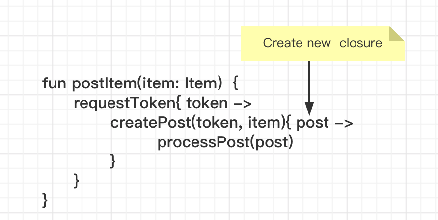

Kotlin 协程 一

[TOC]

## 学习前的疑问：
1. 为什么需要协程，它解决了什么问题
2. 协程的原理是怎样的
3. 协程的优点和缺点是什么
4. 协程的整个配套体系是怎样的
5. 与其他语言，例如Go, 相比，Kotlin 的协程有什么差别

## 1. 为什么需要协程，它解决了什么问题

- 用同步代码解决异步问题
- 使用挂起和恢复的方式，替代了回调

### 1.1 用同步代码解决异步问题

**回调方式**

平时我们做异步操作，例如网络、 IO ，这里耗时的操作，一般是通过 callback 的方式，这样可以避免在主线程中的阻塞。

通过下面的示例代码说明：

```kotlin
fun postItem(item: Item){
    requestToken(object :ITokenCallback{
        override fun onToken(token: Token) { // 回调
            createPost(token, item, object :ICreatePostCallback{  // 回调
                override fun onPost(post: Post) {
                    processPost(post)  // 处理最终结果
                }
            })
        }
    })
}
```
在上面的示例代码中，
- 1. `requestToken` 通过 `ITokenCallback` 回调 Token, 
- 2. 然后再将这个 token 给 `createPost`函数作为参数，同时传入 `ICreatePostCallback` 回调
- 3. createPost 通过回调返回 post, 然后将它作为参数调用 `processPost` 函数

在上面的例子，我们看看到通过回调的方式非常麻烦，一个个回调，如果回调多了，就会陷入回调地狱。

如果是用 kotlin 的协程，看看是怎样解决这个问题的。

**koltin 协程**
那我们看看协程是如何解决的

```kotlin
suspend fun postItem(item: Item) {
    val token = requestToken()
    val post = createPost(token, item)
    processPost(post)
}

suspend fun requestToken(): Token {
    ...
}

suspend fun createPost(token: Token, item: Item): Post {
    ...
}
```
在上面的代码使用协程的方式，对比用 callback 的异步,**这种用同步代码的方式，解决了回调地狱的问题。** 更近一步，还可以解决不同函数在不同线程的调用。
下面的代码就是将耗时的 `requestToken` 函数放到子线程中执行.

```kotlin
suspend fun postItem(item: Item) = withContext(Dispatchers.Main) {
    // 切换到 IO 线程中执行
    val token = withContext(Dispatchers.IO){
        requestToken()
    }
    val post = createPost(token, item)
    processPost(post)
}
```

### 1.2 使用挂起和恢复的方式，替代了回调

协程的解决的另外一个问题，就是使用挂起和恢复的方式，替代了回调，

先看原来的代码

```kotlin
fun firebaseAuthWithGoogle(token: Token, iTokenCallback: ITokenCallback){
    val auth: FirebaseAuth = FirebaseAuth.getInstance()
    val credential = GoogleAuthProvider.getCredential(googleToken, null)
    iTokenCallback.onToken(credential.token)
}
```
原来的代码，使用 callback 的方式执行

```kotlin
suspend fun firebaseAuthWithGoogle(token: Token) = suspendCoroutine { continuation ->
    val auth: FirebaseAuth = FirebaseAuth.getInstance()
    val credential = GoogleAuthProvider.getCredential(googleToken, null)
    if (credential != null){
        continuation.resumeWith(credential.token)
    } else {
        continuation.resumeWithException(IllegalArgumentException("firebaseAuthWithGoogle googleToken is wrong"))
    }
}

```

现在我们指定 kotlin 协程可以解决的两个问题
- 1. 用同步代码解决异步问题
- 2. 使用挂起和恢复的方式，替代了回调

那下面我们要看看 koltin 是怎样做到的，那就是它的原理是怎样的。

## 2. 协程的原理

在讲述协程原理之前，先讲述一些基本知识做铺垫，包含
- 高阶函数
- CPS, 既 Continuation-Passing Style
- CDS，既 Coroutines Direct Style

### 2.1 高阶函数

高阶函数就是将函数作为参数或者返回值是函数的函数。
这就话有些拗口，可以拆成两部分：
- 第一种情况是函数作为参数
- 第二种情况是返回值是函数

通过下面的实例代码进行说明

**函数作为参数的情况**

```kotlin
fun highFunction(block:() ->Unit){
    if(Debug.isTest){
        block.invoke()
    }
}

// 调用示例
fun testFunction(post: Post) {
    highFunction { // processPost(...) 函数作为参数
        processPost(post)
    }
}

```
`highFuction` 函数的参数是 `block:() ->Unit` 它是一个函数


**返回值是函数的情况**

```kotlin
fun <T> lock(lock: Lock, body: () -> T): T {
    lock.lock()    
	try {        
		return body()
	} finally {
	    lock.unlock()
        }
}
```
在上面的代码可以看到 return 的返回值是 `body()` 函数


通过上面的两个例子


### 2.2 CPS
CPS 是 Continuation-Passing Style 的缩写， 是指一种代码风格，

**CPS**
```kotlin
fun postItem(item: Item) {
     requestToken{ token ->
         val post = createPost(token, item)
         processPost(post)
     }
}
```
其中

```kotlin
val post = createPost(token, item)
processPost(post)
```
是 Continuation, 这里使用了高阶函数。

这样的代码称为， CPS

### 2.3 CDS
CDS 是 Coroutines Direct Style，就是直接用协程的方式。
看下来的d代码，用 CDS 的方式呈现。

```kotlin
suspend fun postItem(item: Item)  {
    val token = requestToken()
    val post = createPost(token, item)
    processPost(post)
}
```

有了前面的铺垫，我们可以正式讲述协程的原理了。

### 2.4 koltin 协程原理
如果用 kotlin 协程的代码反编译成 java 代码，看到非常复杂，很难理解。
如果简单的老说，**kotlin 协程的原理就是通过包装 callback, 同时利用状态机进行切换，实现函数的不同调用**。

通过下面的例子进行说明。


协程的写法
```kotlin
suspend fun postItem(item: Item)  {
    val token = requestToken()
    val post = createPost(token, item)
    processPost(post)
}
```

kotlin 是如何实现让异步的代码用同步来表达的？

**第一种方式是把它变成 CPS 的代码风格**
```kotlin
fun postItem(item: Item)  {
    requestToken{ token ->
        createPost(token, item){ post ->
            processPost(post)
        }
    }
}
```
这样能解决问题，但是它的缺点也是很明显，每个函数都会创建一个闭包，对内存有影响。



如果是在一个循环里面，那就是回调地狱了

```kotlin
fun postItem(items: List<Item>)  {
    ...
}
```
但是如果用状态机的型式就比较简单了

```kotlin
suspend fun postItem(items: List<Item>)  {
    for (item in items){
        val token = requestToken()
        val post = createPost(token, item)
        processPost(post)
    }
}
```

**第二种方式就是编译成状态机**
实际上 kotlin 也是编译成状态机的型式实现协程的原理

在介绍状态机之前，先看一下在 koltin 源码中的 `Continuation.kt`

```kotlin
public interface Continuation<in T> {

    public val context: CoroutineContext

    public fun resumeWith(result: Result<T>)

    public fun resumeWithException(exception: Throwable) // 拓展函数
}
```
Continuation 是一个接口，它其实就是一个回调。


原始代码
```kotlin
suspend fun postItem(item: Item)  {
    val token = requestToken()
    val post = createPost(token, item)
    processPost(post)
}
```

用状态机的方式等效写法表示
```kotlin
fun postItem(items: Item, cont: Continuation)  {
    val sm = object :CoroutineImpl(.., const){
        fun resume(...){
            postItem(null, this)
        }
    }

    swith(sm.label){
        case 0:
            sm.item = items
            sm.label = 1
            requestToken(sm)
        case 1:
            val item  = sm.item
            val token = sm.result as Token
            sm.label = 2
            createPost(token, item, sm)
        case 2:
            val post = sm.result as Post
            processPost(post)
    }
}
```
下面进行详细的讲解：

- postItem 函数在在编译的时候，会生成一个`Continuation`作为参数传入进去。

- 在 postItem 里面会生成一个 `CoroutineImpl` 的对象。这个对象是 `Continuation` 的实现类，也带有 resume 方法和 label 变量。

- 当第一次调用 postItm 的时候，会在内部生成  `CoroutineImpl` 的对象，并且 sm.label 默认是 0， 于是进入了状态机的第 0 个状态。

- 在 case 0, 会将 items 作为参数赋值给 sm.item 同时将 label = 1，设置成状态机的下一个状态，然后调用 `requestToken` 函数， `CoroutineImpl` 作为参数。`requestToken` 函数完成后，会通过 `CoroutineImpl` 的 resume 方法调用 `postItem`。于是函数再一次到了 `postItem` 这个方法里面。

- 由于这次进来的 label 值是 1，会跳到 case 1 执行。
在 case 1 里面，通过 sm.result 取出在上一个状态 case 0 获取到的 token。将 label = 2 设置为下一个状态。token、item 和 sm 作为`createPost` 的参数传入进去执行。

- 这次进来的 label 值是2， 会跳到 case 2 中执行。
在 case 2 里面，通过 sm.result 获取到 `createPost` 执行的结果 token ,然后调用  `processPost` 函数。

通过上面几步详细的讲解，我们知道**kotlin 协程的原理就是通过包装 callback, 同时利用状态机进行切换，实现函数的不同调用**。

如果仅仅通过反编译 kotlin 的字节码去看协程的原理的话，会发现是非常困难的，里面包含着太多不规则的命名变量和函数调用。

## 参考
- [Deep Dive into Coroutines on JVM](https://www.youtube.com/watch?v=YrrUCSi72E8)
- [官方关于 kotlin 协程设计的文档](https://github.com/Kotlin/KEEP/blob/master/proposals/coroutines.md)
- [Kotlin 协程实现原理](https://blog.csdn.net/suyimin2010/article/details/91125803)
- [硬核万字解读——Kotlin协程原理解析](https://mp.weixin.qq.com/s?__biz=MzUyMDAxMjQ3Ng==&mid=2247495170&idx=1&sn=b54e233699fd7bba0e940e2837258002&chksm=f9f279d1ce85f0c741857443332c20a82caedc24d8ea798219c2098c2d09ee58e11a6aba9296&mpshare=1&scene=23&srcid=1212Jz0IsITrVDTTTBRNCn0j&sharer_sharetime=1607751713936&sharer_shareid=65073698ab9ac2983b955fa53b4ff585%23rd)