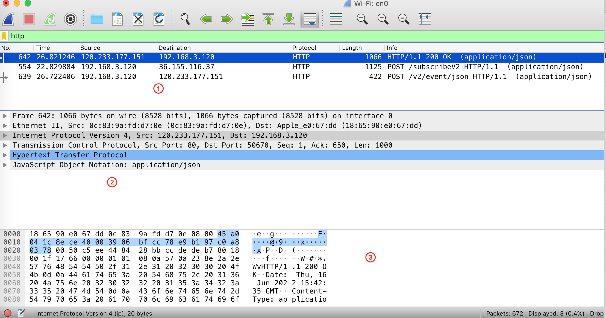

Wireshark过滤规则

# Wirshark 的使用

## Wirshak 的简单介绍

图 1

在图1中：

- ① 部分是捕获到的数据包列表
- ② 部分是选中的数据包的详情
- ③ 部分是数据包的内容，它是以十六进制 和 ASCII 的型式展示

## Wirshak 看网络分层
在图1 中的第 ②部分，可以看到 Wireshark 已经把这个包的内容用分层的结构显示出来了。

- **应用层**：就是 Hypertext Transfer Protocl, 就是 HTTP 超文本传输协议；
- **传输层**：Transmission Control Protocol, 这一层用到了 TCP 协议。点开里面的内容可以看到 Seq 号和 Ack 号等一些列信息。它们用于网络数据包的排序、重传、流量控制等。
-**网络层**：Internet Protocol Version 4, 这层的数据在传输层的基础上增加了目标 IP 和源 IP。
-**数据链路层**： Ethernet II,里面有目标的 Mac 地址和原地址的 Mac 地址。

# 使用过滤器
## 1.过滤IP
**来源IP 或者 目标IP 等于某个IP**
ip.src eq 192.168.43.91  (来源)
ip.dst eq 192.168.43.91  (目标)
ip.addr eq 192.168.43.91  (来源、目标同时显示)
## 2.过滤端口
**显示来源端口和目标端口同时满足条件**
tcp.port eq 80
tcp.port == 80
tcp.port eq 80 or udp.port eq 80

**显示目标端口满足条件**
tcp.dstport == 80

**显示来源端口满足条件**
tcp.srcport == 80

**过滤端口范围**
tcp.port >=1 and tcp.port <= 80

## 3.协议过滤
比如TCP，只显示TCP协议。
**IP 过滤**
比如 ip.src ==192.168.1.102 显示源地址为192.168.1.102，
ip.dst==192.168.1.102, 目标地址为192.168.1.102

**端口过滤**
tcp.port ==80,  端口为80的
tcp.srcport == 80,  只显示TCP协议的愿端口为80的。

**Http模式过滤**
http.request.method=="GET",  只显示HTTP GET方法的。
逻辑运算符为 AND/ OR

# 参考
- [Wireshark 抓包工具的使用](https://juejin.cn/post/7033769047544037407)

