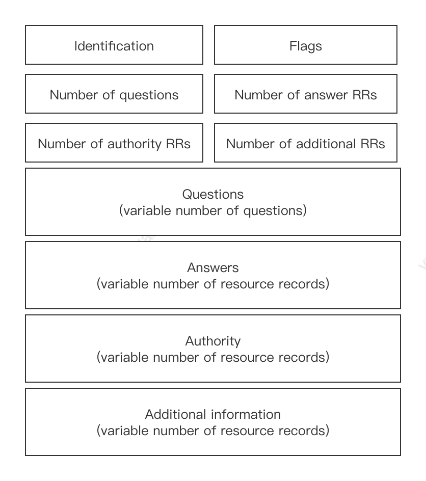
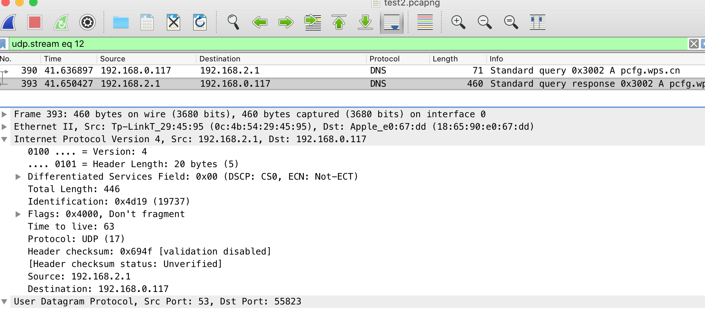
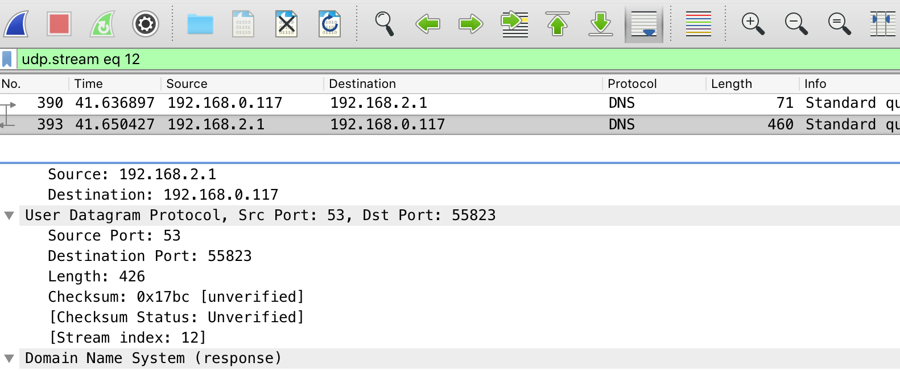
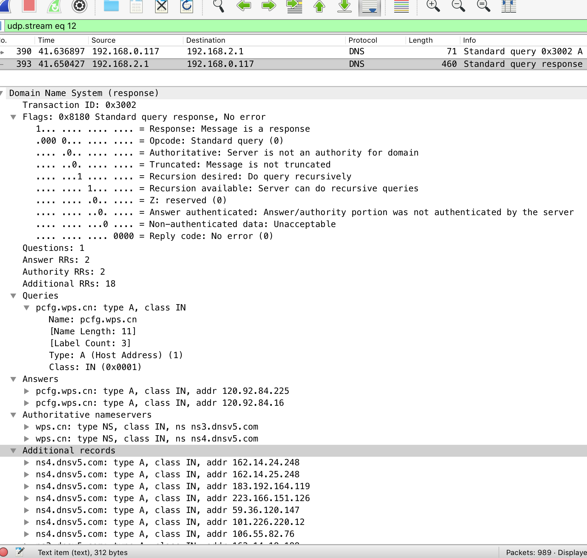

计算机网络 Wireshark 实验： DNS

DNS message format

图一

Wireshark 上拦截的内

图二、图三
在图二，图三中我们可以得知

- 1.这次 DNS 查询用的是 UDP 协议
- 2.Source ip 是 192.168.2.1，端口号是 53； 目标 ip 是 192.128.0.117， 端口号是 55823

对照图一 DNS 消息格式

看到

- Transaction ID 标识符是 0x3002，表示这次的查询
- Flags 标记位是 1， 表示回复
- Questions 查询数量是 1， Answers 数量是 2，Authority  是 2，  Additional 是 18
- Queries 查询数量是 1
    - 查询的字段是 pcfg.wps.cn
    - 查询的类型是 type A,也就是查询域名类型

- Answers 返回查询域名的结果，这个域名对应有两个 ip, 一个是 120.92.84.225 另一个是 120.92.84.16
- Authoritative nameservers 认证服务器也有两个
- Additional records 额外的信息

