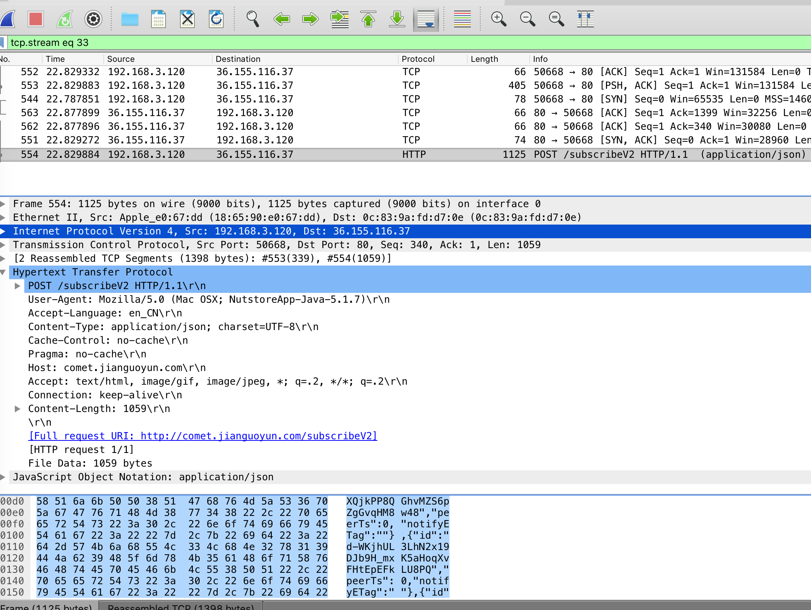
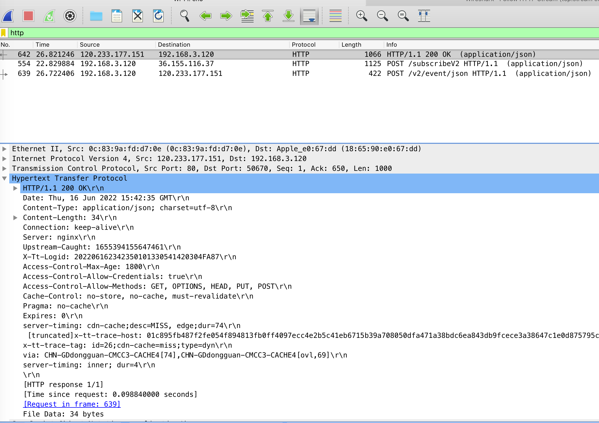
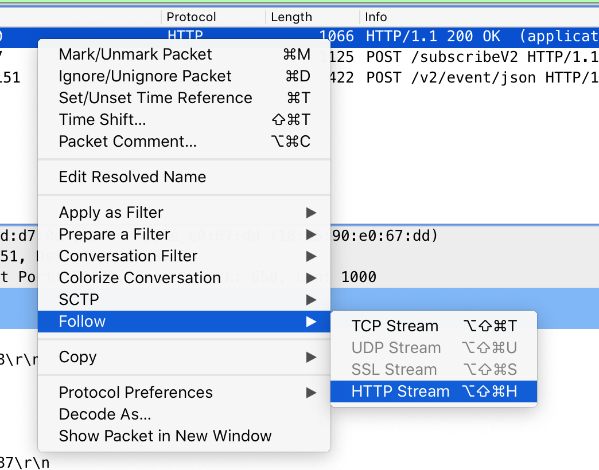
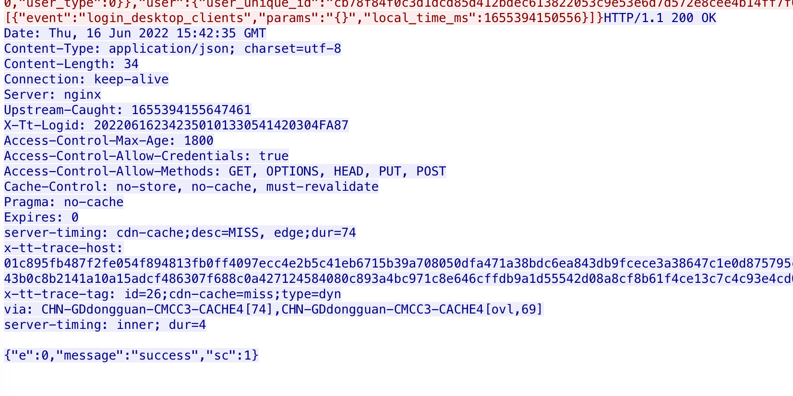

计算机网络 Wireshark 实验： HTTP


## HTTP 请求报文


在上图的 HTTP 拦截中，我们可以看到 HTTP 请求报文的内容


- 1. 这是个 POST 请求，运行的 HTTP 版本是 1.1
- 2. 在 User-Agent 中浏览器的类型是 Mozilla/5.0
- 3. 请求的处理的语言是 en_CN, 也就是中文
- 4. Host, 服务器的地址是 comet.jianguoyun.com
- 5. Connection: 是保存链接  keep-alive


## HTTP 响应报文



在上图的 HTTP 拦截中，我们可以看到 HTTP 响应报文的内容

- 1. 服务端返回的状态码 200， 请求没有问题
- 2. Date 服务端响应的报文时间是 6 月 16号 15：42：35
- 3. Connection 是保持连接 keep-alive
- 4. 服务的 nginx
- 5. 响应的内容长度 Content-Length 是 34
- 6. 响应的内容类型是 json

json 里面的内容我们通过 右键 -> Follow ->HTTP Stream 可以查看



具体的内容如下图所示的最后一行



响应的内容是

```json
{"e":0,"message":"success","sc":1}
```

