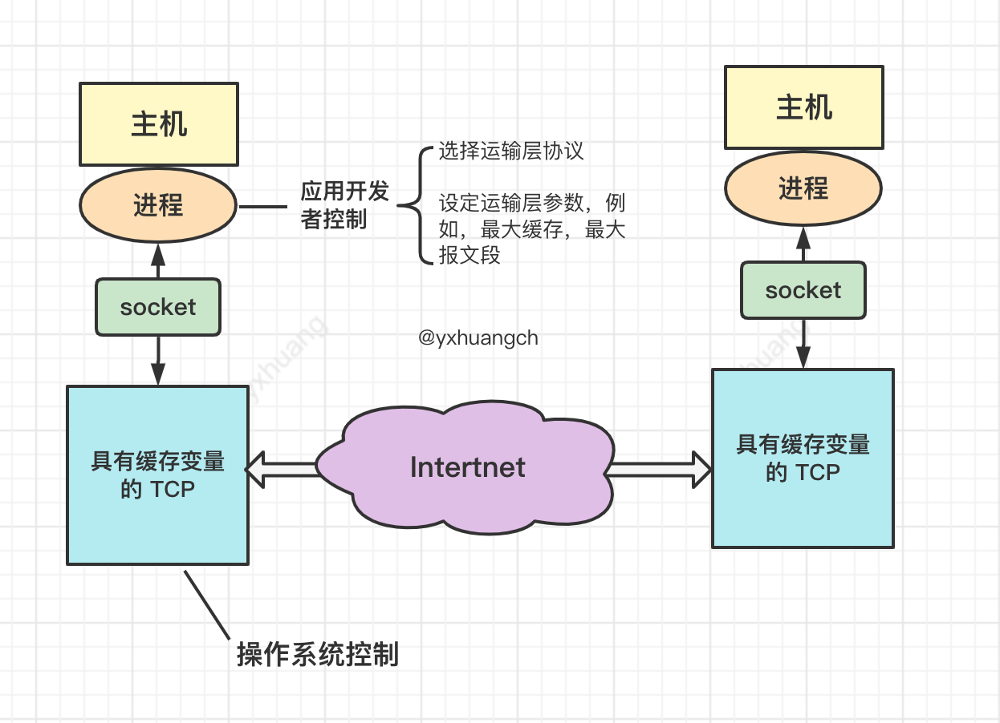

计算机网络（一）：应用层协议

[toc]

## 概念
在通信模型中，发起通信的一方称为客户度进程；
等待联系的一方，被称为服务端段进程。

进程与计算机网络之间的接口是 socket.

## 运输协议的服务
- 可靠的数据传输
- 吞吐量
- 定时
- 安全性

## Internet 提供的运输服务

### TCP
- 需要建立连接
- 面向连接的服务和可靠数据传输服务
- 拥塞控制机制
- 面向连接

### UDP
- 无连接
- 通信前没有握手过程

## 应用层协议
应用层协议定义的内容：

- 交换的报文类型，例如，请求报文和相应报文
- 各种报文类型的语法，例如报文中的各个字段及这些字段是如何描述的
- 字段的语义，即这些字段中包含的信息含义
- 一个进程何时以及如何发送报文，对报文进行相应的规则

## 应用层的应用
常用的应用：

### Web 和 HTTP
### FTP 文件传输协议
  FTP 使用了两个并行的 TCP 连接控制文件。
  一个是控制连接
  另一个数据连接
  
### 电子邮件
使用的协议有: SMTP, POP3, IMAP 等

### DNS
DNS 是域名解析系统，
将域名 Domain  转换成 IP

### P2P 应用
  
  

