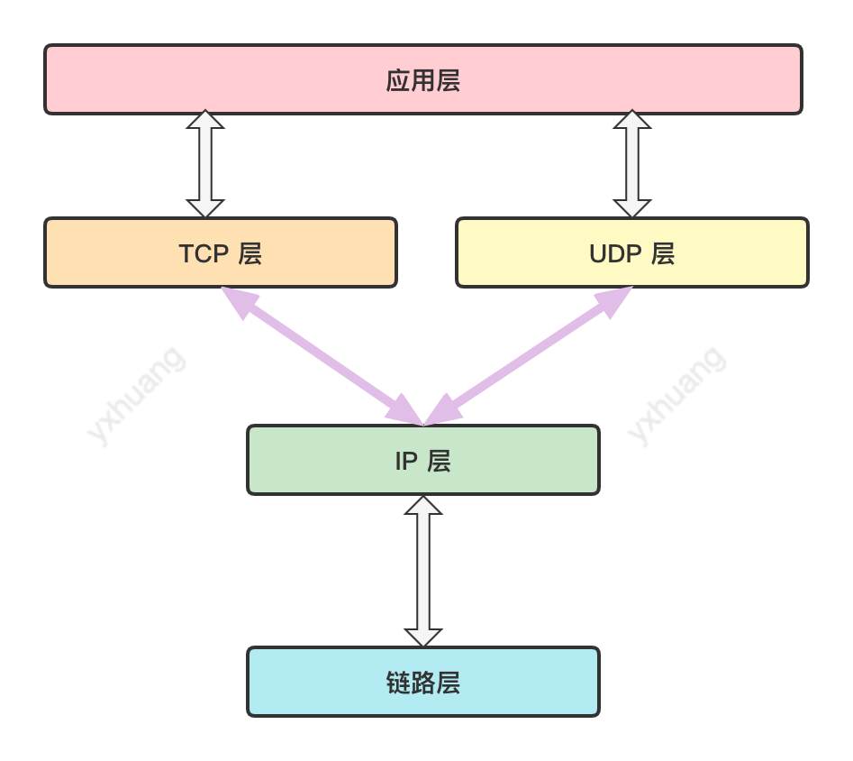
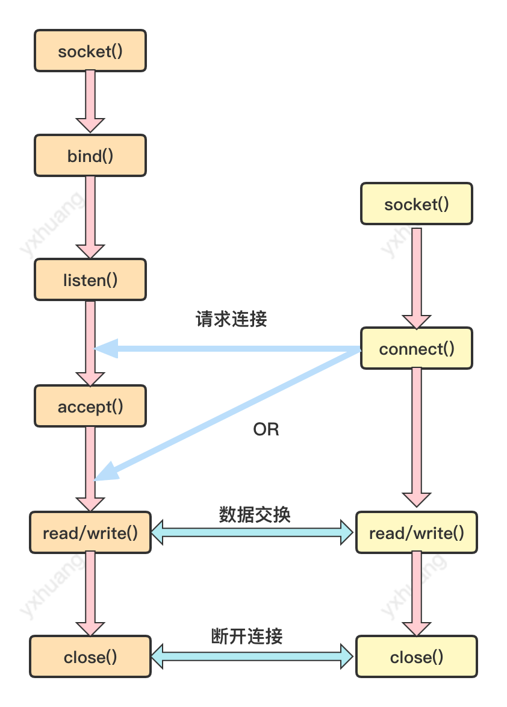

 计算机网络(三)：TCP Socket 编程
 
 [TOC]
 
## Socket
Socket 是应用进程与端到传输协议(TCP/UDP) 直接的门户

### 地址信息的表示
下面这几个结构体是在 socket 编程中用到的。

**表示 IPv4 地址的结构体**

```c
struct sockaddr_in
{
    sa_family_t     sin_family;     // 地址族 Address Family
    unit16_t        sin_port;       // 16 位 TCP/UDP 端口号
    struct in_addr  sin_addr;       // 32 位 IP 地址
    char            sin_zero[0];    // 不使用 
}
```
结构体 in_addr 用来存放 32 位 IP 地址

```c
struct in_addr
{
    in_addr_t   s_addr;     // 32 位 IPv4 地址
}
```
说明：

- sin_family, 表示不同的 address

|Address Family | 含义  |
| --- | --- | --- |
| AF_INET | IPv4 网络协议中使用的地址族 |  
| AF_INET6| IPv6 网络协议中使用的地址族||
| AF_LOCAL| 本地通信中采用的 UNXI 协议的地址族|

- sin_port, 16 位 TCP/UDP 端口号, 它以网络字节序保存
- sin_addr, 32 位 IP 地址，以网络字节序保存 
- sin_zero, 无特殊含义，仅仅为了填充 0

**网络字节序**
CPU 解析数据的方式分为两种，一种是大端序，即高位字节放到低地址；另一种是小端序，即高字节存放到高地址。

为了数据能在网络中传输，统一定为网络字节序(Network Byte Order),就是先把数据转化为大端序格式再进行网络传输。

**字节序转化**
在填充 `sockadr_in` 结构体前将数据转成网络字节序，需要用到下列的几个函数

```c
unsigned short htons(unsigned short);
unsigned short ntohs(unsigned short);
unsigned long htonl(unsigned long);
unsigned short ntohl(unsigned long);
```
说明：

- 函数中 s 指的是 short, l 指的是 long
- htons  是 h（host）, to, n(network), s  的组合， 即把 short 型数据从 Host 中转化为网络字节序。

## TCP/IP 协议栈




## TCP 的服务端/客户端函数调用关系



它们之间的函数调用关系，会在下面的 TCP 服务端编程和客户端编程中详细说明。

### TCP 服务端编程

```c
// 简单的  hello server, 演示 socket 的联机
#include<stdio.h>
#include<stdlib.h>
#include<string.h>
#include<unistd.h>
#include<arpa/inet.h>
#include<sys/socket.h>

void error_handling(char *message);

int main(int argc, char *argv[]){

    int serv_sock;
    int clnt_sock;

    struct sockaddr_in serv_addr;
    struct sockaddr_in clnt_addr;
    socklen_t clnt_addr_size;

    char message[] = "hello world";

    if (argc !=2 )
    {
       printf("Usage: %s <port>\n", argv[0]);
       exit(1);
    }

    // 第一步，调用 socket 函数创建套接字
    serv_sock = socket(PF_INET,SOCK_STREAM, 0);
    if (serv_sock == -1)
    {
        error_handling("socket() error");
    }

    memset(&serv_addr, 0, sizeof(serv_addr));
    serv_addr.sin_family = AF_INET;                 
    serv_addr.sin_addr.s_addr = htonl(INADDR_ANY);
    serv_addr.sin_port = htons(atoi(argv[1])); // hton 中的 s 指的是 short,htonl 的 l 指的是 long

    // 第二步， 调用 bind 函数分配 IP 地址和端口号
    if (bind(serv_sock, (struct sockaddr*)&serv_addr, sizeof(serv_addr)) == -1)
    {
       error_handling("bind() error");
    }
    
    // 第三步，调用 listen 函数转为可接收请求状态
    if (listen(serv_sock, 5) == -1)
    {
        error_handling("listen() error");
    }

    clnt_addr_size = sizeof(clnt_addr);
    // 第四步，调用 accept 函数受理连接请求；
    clnt_sock = accept(serv_sock, (struct sockaddr*)&clnt_addr, &clnt_addr_size);
    if (clnt_sock == -1)
    {
        error_handling("accept() error");
    }

    // 第五步， 数据交换
    write(clnt_sock, message, sizeof(message)); // 向文件描述符 clnt_sock 写入信息
    // 第六步，断开连接
    close(clnt_sock); // 关闭
    close(serv_sock);

    return 0;
}

void error_handling(char *message){
    fputs(message, stderr);
    fputc('\n', stderr);
    exit(1);
}
```

### TCP 客户端编程

```c
// socket 的客户端例子
#include <stdio.h>
#include <stdlib.h>
#include <string.h>
#include <unistd.h>
#include <arpa/inet.h>
#include <sys/socket.h>

void error_handling(char *message);

int main(int argc, char const *argv[])
{
    int sock;
    struct sockaddr_in serv_addr;
    char message[30];
    int str_len;

    if (argc != 3)
    {
       printf("Usage: %s <IP> <Port>\n", argv[0]);
       exit(1);
    }

    // 第一步，创建 socket
    sock = socket(PF_INET, SOCK_STREAM, 0);
    if (sock == -1)
    {
        error_handling("socket() error");
    }
    
    memset(&serv_addr, 0, sizeof(serv_addr));
    serv_addr.sin_family = AF_INET;
    serv_addr.sin_addr.s_addr = inet_addr(argv[1]); // 服务端地址
    serv_addr.sin_port = htons(atoi(argv[2])); // 服务端断开

    // 第二步：请求连接，错误返回 -1
    if (connect(sock, (struct sockaddr*)&serv_addr, sizeof(serv_addr)) == -1)
    {
       error_handling("connect() error");
    }
    
    // 第三步，交换数据
    str_len = read(sock, message, sizeof(message) - 1);
    if (str_len == -1)
    {
        error_handling("read() error");
    }

    printf("Message from server: %s \n", message);
    // 第四步，断开连接
    close(sock);
    return 0;
}

void error_handling(char *message){
    fputs(message, stderr);
    fputc('\n', stderr);
    exit(1);
}
```

编译服务端代码：
> gcc hello_server.c -o hserver

启动服务端
> ./hserver 9190 

编译客户端代码：
> gcc hello_client.c -o hclient

启动客户端
>./hclient 127.0.0.1 9190

其中 127.0.0.1 是本机 ip

运行结果


## 参考
- [《TCP/IP网络编程》](https://book.douban.com/subject/25911735/)
- [《计算机网络自顶向下》](https://book.douban.com/subject/30280001/)


 


