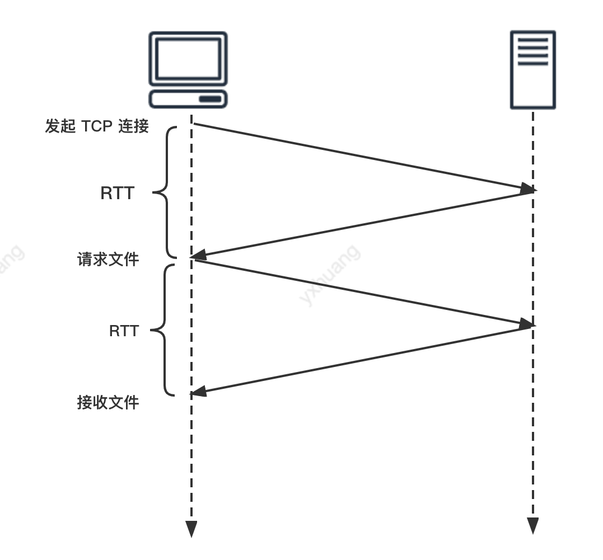
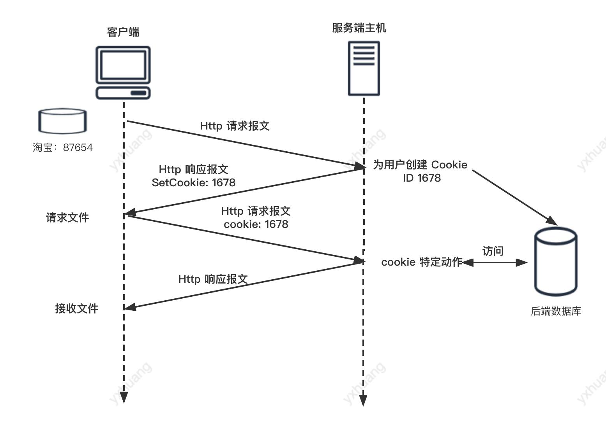
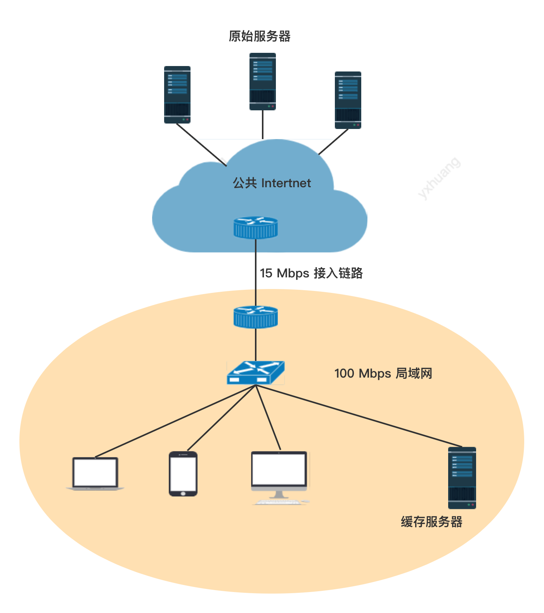
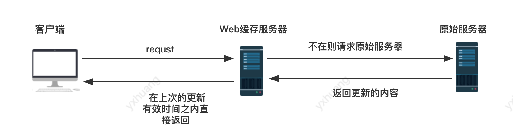

计算机网络（二）： HTTP 部分

[toc]

## 概念
- HTTP 是超文本协议；
- HTTP 是在 TCP 基础上的；
- HTTP 是无状态协议(stateless protocol)
- 默认是持续性连接(persistent connection)

### 持续性连接和非持续性连接
**持续性连接**
即每个请求及其响应经相同的 TCP  连接发送

**非持续性连接**
每个请求/响应是经一个单独的 TCP 连接发送


**RTT**
Round-Trip Time, 是指一个短分组从客户端到服务端然后再返回客户端所花费的时间。
RTT 包含分组传播时延、分组在中间路由和交换机上的排队时延以及分组处理时延。



HTTP 默认选择持续性连接是因为它比非持续性连接所花费的时间少。

非持续性连接有两个缺点：

- 每个请求都建立、维护连接，增加服务器的负担；
- 两倍的 RTT 时延，一个是创建 TCP 连接，另一个是请求和接收对象。例如上图所示。


## HTTP 报文格式

### HTTP 请求报文

```json

GET /page.html HTTP/1.1   ①  // request line 请求行
Host: www.baidu.com       ② // 后面几行都是 Header line
Connection: close         ③
User-agent: Mozilla/5.0   ④
Accept-language: en       ⑤

```
- `GET` 请求方法字段，包含 GET, POST, HEAD, PUT 和 DELETE
- `/page.html` 请求对象
-  `HTTP/1.1` 请求的 HTTP 版本
-  ② 是主机地址
-  `Connection` 是请求之后的连接状态，这里是 close, 就是要求服务端在发送完之后关闭连接
- `User-agent` 是浏览器类型
-  `Accept-language` 是语言

### HTTP 响应报文

```json
HTTP/1.1 200 OK                                 ①
Connection: close                               ②
Date: Tue, 11 Jun 2022 21:43:21 GMT             ③
Server: Apache/2.2.3 (CentOS)                   ④
Last-Modified: Tue, 11 Jun 2022 09:43:21 GMT    ⑤
Content-Length: 6821                            ⑥
Content-Type: text/html                         ⑦

(data ....)                                     ⑧
```
① 是 status line 状态行， ② -- ⑦ 是 header line，  ⑧ 是 entity body 数据实体

- `Connection` 发送数据之后 close
- `Date` 服务器发送响应报文的日期和时间
- `Server` 服务器的信息
- `Last-Modified`  内容最近一次修改时间，这个在 CDN 缓存的时候很有用
- `Content-Length` 响应的内容长度
- `Content-Type` 响应的数据实体的类型

## Cookie
HTTP 服务是无状态的， Web 服务器希望能够识别用户，或者希望把内容与用户身份联系起来。

解决方案就是使用 Cookie, Cookie 允许站点对用户进行跟踪。

它的缺点就是涉及到用户的隐私问题。



Cookie 的四个组件：

- 在 HTTP 响应报文中的一个 cookie header line；
- 在 HTTP 请求报文中的一个 cookie header line;
- 在客户端系统中保留一个 cookie 文件，并由用户的浏览器进行管理；
- 位于 Web 站点的一个后端数据库。

##  WebCache
Web Cache 是它能够代表原始服务器来满足 HTTP 请求的网络实体。

CDN 是 Content Distribution Network, 内容分发网络。

### 需要 WebCache 的原因：

- 减少客户端的请求时间
- 减少通信量，降低费用



说明：

- 如果没有缓存服务器，客户端请求经过 15 Mbps 接入链路进入到公共的 Intertnet 请求到原始服务器
- 如果客户端经过局域网内的路由器请求到缓存服务器，就可以减少进入到公共 Internet,这样就可以减少请求时间，并且降低了进入公共网络的通信量，从而降低了费用。


### WebCache 导致的问题
放在缓存服务器中的内容可能是旧的，如果服务器中的内容已经修改，客户端可能拿到的是旧的内容。

**解决方案：**
条件 GET,就是一个 Get 请求方式，在请求报文中添加 `If-Modified-Since:` header line.




