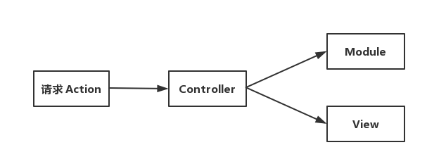
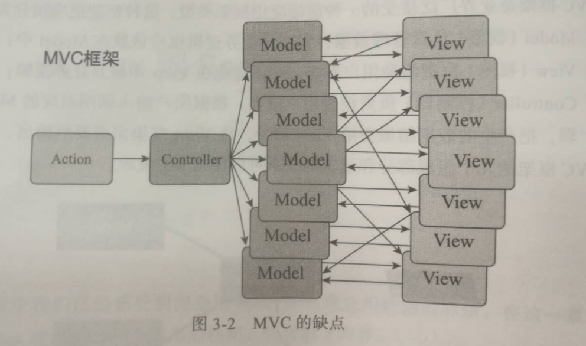

# Flux
Flux 是 Fackbook 推出的一个前端应用架构，为了解决 MVC 的框架的缺陷。

**Flux 的特点是数据的单向流动**

### 1 MVC 框架的缺陷
#### MVC 的结构



- Model(模型)负责管理数据，大部分业务逻辑存放；
- View (视图) 负责渲染界面，避免在 View 中涉及业务逻辑；
- Controller(控制器) 负责接受用户输入，根据用户输入调用对应的 Model 部分逻辑，并把产生的数据结果教给 View 部分，让 View 渲染出必要的输出

#### MVC 架构的缺点



- MVC 最大的问题是无法禁绝 View 和 Model 之间的直接对话

### 2 Flux 架构


- Dispatcher: 用来分发 action
- Action: 动作，包含一个 type 定义 action的类型，一个是数据
```java
    class Action {
        type: ActionType
        data: data
    }
```
- Store: 接收 Dispatcher 分发过来的 action, 决定是否更改视图
- View: 展示页面，发出相应的 Action
    - View 如果想要改变 Store 中的转态，必须并且只能派发 action

#### 参考
[Flux 架构入门教程](http://www.ruanyifeng.com/blog/2016/01/flux.html)

[Flux](https://facebook.github.io/flux/)

《深入浅出 React 和 Redux》程墨著


