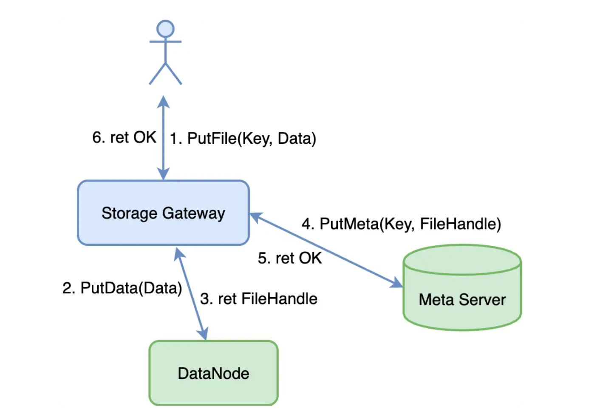
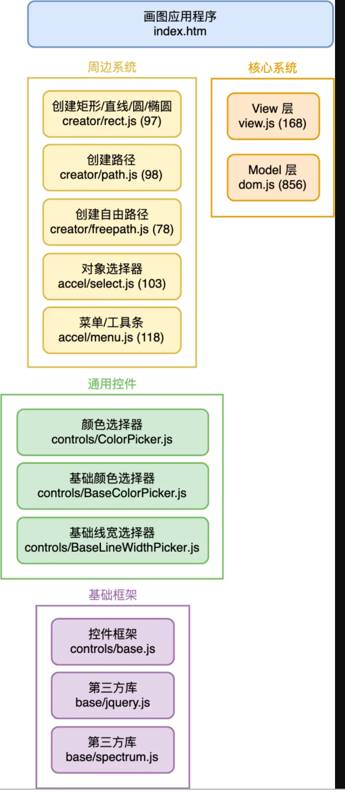
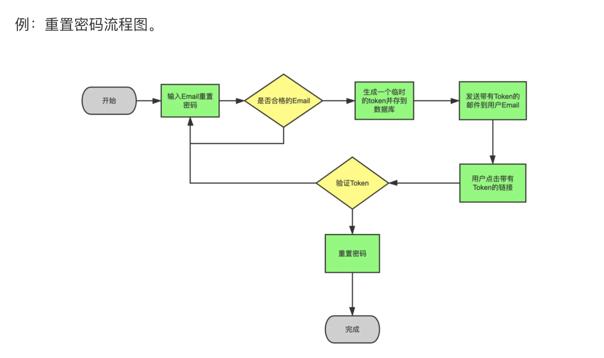
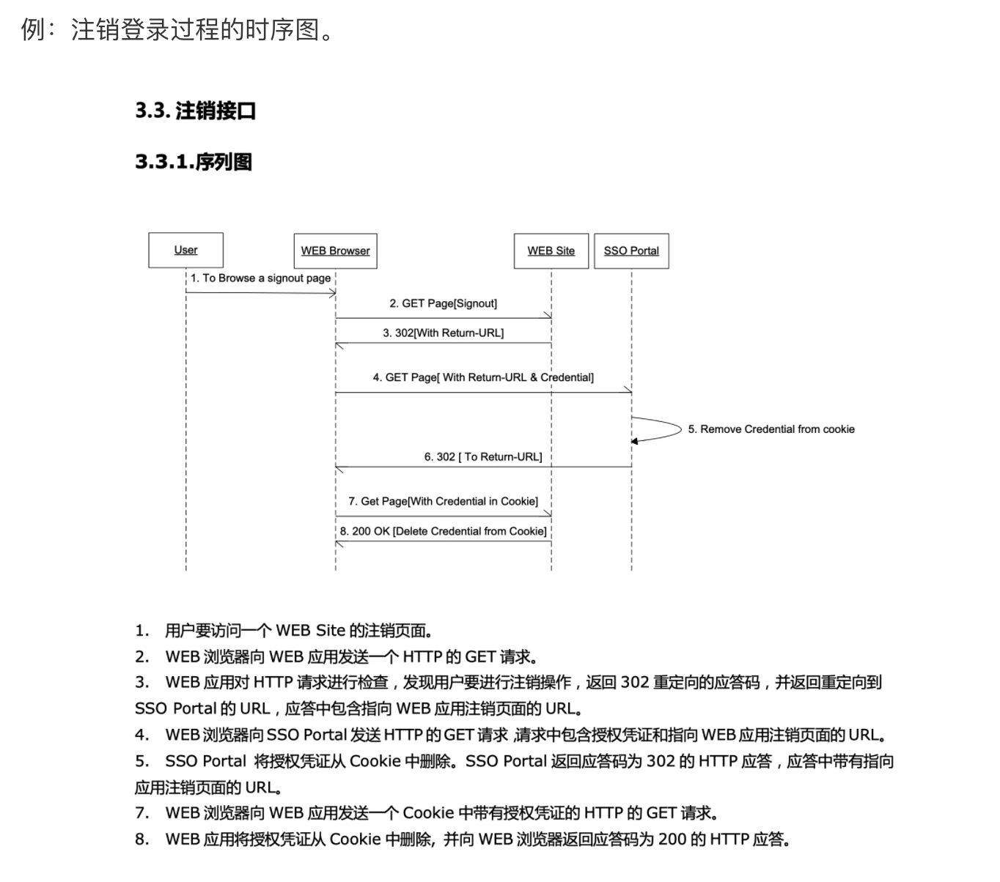

如何写设计文档

[TOC]

这是极客时间《许式伟的结构课》中的 [<70|怎样写设计文档>](https://time.geekbang.org/column/article/185234) 的笔记

**产品经理和架构师是一体两面，对人的能力要求比较像，但是分工不同，关注的维度不一样
产品经理关注的维度，关键词是：用户需求、技术赋能、商业成功
架构师的关注维度是，关键词是：用户需求、技术实现、业务迭代**

**设计是软件工程中的头等大事，我们应该在这里“多浪费点时间”，这样的 ”浪费“ 是最终会得到十倍甚至百倍以上的回报**

## 1. 文档的大体内容

设计文档包含的内容，大体如下

- 现状：我们在哪里，现状是什么样的
- 需求：我们的问题或诉求是什么，要如何改进
- 需求满足方式：
    - 要做成什么样，交付物规格，使用界面（接口）是什么
    - 怎么做到？交付物的实现原理
    
### 1.1 现状

现状不需要长篇累牍，现状更的多是陈述与我们要做的改变相关的重要事实，侧重于强调这些事实的存在性和重要性。

### 1.2 需求

需求也不需要长篇累牍，陈述对痛点和改进方法即可

### 1.3 需求满足方式

要详细写清楚，把我们的设计方案谈清楚。具体包含交付物规格和实现原理

#### 1.3.1 交付物规格

交付物规格或者说使用页面（接口）体现的是别人怎么使用我。
如果是产品设计，交付物规格可能是 “产品原型”。
架构设计，交付物规格可能是 “网络 API 协议” 或者 “包（package）导出的公开类或函数”

#### 1.3.2 实现原理

实现原理，写的是我们是怎样做到的。
如果是产品设计，它写的是用户需求对应的 UserStory 设计，也就是业务流具体是怎样完成的。
架构设计，它写的是 UserStory 具体如何被我们的程序逻辑所实现的。

**指导思想**是下面的公式

>  程序 = 数据结构 + 算法

在写程序实现逻辑时，从数据结构和算法两个维度去描述它。
其中数据结构可以是内存数据结构，也可以是外存数据结构，还可以是数据库的表结构。
算法是基于数据结构， 它描述的是 UserStory 的具体实现，它可以是 UML 是时序图或者外代码。

对于模块的详细设计需要做的是

- 第一，要交代清楚 “数据结构” 是什么样的
- 第二，然后再将一个个 UserStory 的业务流程讲清楚
    
在用 UserStory 的时候，画 UML 时序图，在表达上伪代码的设计都是必需的。

#### 1.3.3 使用界面（接口）

使用界面，也就是接口，主要关心有两点：

- 接口是否足够简单，是否自然体现业务需求
- 尽可能避免进行接口变更，接口要向前兼容

这些接口能够把系统的关键 UserStory 串起来。

一个方法是对模块的调用接口进行分类，它对外提供的访问接口一般是下面三种：

- 常规 DOM API, 即正常的模块功能调用
- 事件(Event)的发送与监听
- 插件(Plugin)的注册

**如何表达模块间的关系**
如何表达模块间的关系是非常重要，但是也是件非常复杂的事。
一般有以下几种方式表达模块间的关系：

- 不整体描述模块的关系，而是基于一个个 UserStory 把模块之间的调用关系画出来
    这类图并不是表达模块的好选择，因为并没有对模块关系进行抽象。
    这类图更多是被用在面向客户介绍 API SDK 的背后实现原理时采用，而不是出现在设计文档。
    例如，下图是上传一个文件的业务流程图

    

- 如果只是对于 UserStory 业务流程的表达，UML 时序图通常是更好的表达方式

- 表达模块关系的视角，可以是从架构分解上看待，可以把系统看着 “一个最小化的核心系统 + 多个彼此正交分解的周边系统” 
    
 
 
 **其他常见的几种图**
 
 - 线框图
 
 
 - 流程图
  
 
 - 时序图
 

### 1.4 多个设计方案对比

有时候一篇设计文档不仅仅只有一个方案，而是有多个可能的需求实现方式，这个时候，在设计文档可以放多个多个方案对比。
对比的话，通常需要描述清楚两个设计方案的本质差别，并且从下面的几个维度进行对比：

- 方案的易实施性与可维护性
- 方案的时间复杂度与空间复杂度

不同的业务系统倾向性不太一样。
对绝大部分业务，我们最关心的是工程效率，所以在方案的易实施性与可维护性为先
对于部分成本与性能非常敏感的业务，则通常在保证方案的时间复杂度与空间复杂度达到业务预期的前提下，再考虑工程效率。

## 2.参考
- [极客时间《许式伟的架构课  -- 70 | 怎么写设计文档？》](https://time.geekbang.org/column/article/185234)
- [极客时间《软件工程之美 -- 16 | 怎样才能写好项目文档？》](https://time.geekbang.org/column/article/88606)

