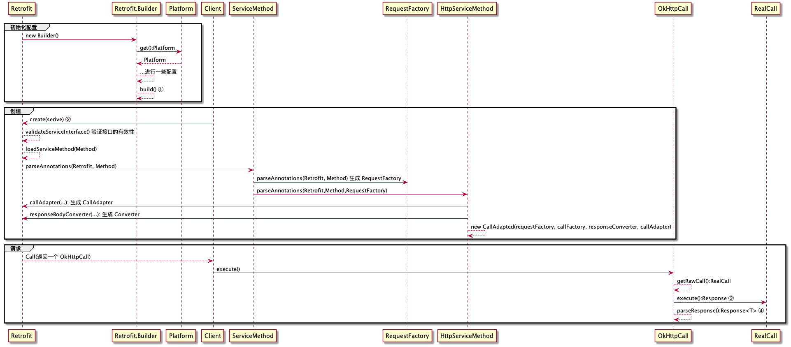
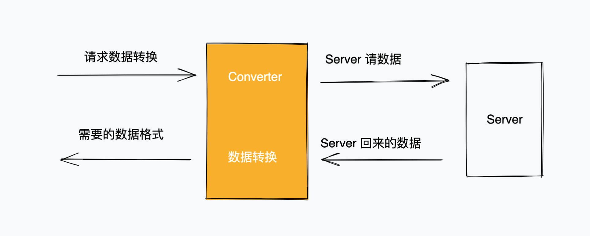

# 1. 简单的类图

```plantuml
@startuml
class Retrofit{
    serviceMethodCache: ConcurrentHashMap
    baseUrl:HttpUrl
    callFactory: okhttp3.Call.Factory
    converterFactories: List<Converter.Factory>
    callAdapterFactories: List<CallAdapter.Factory>
    callbackExecutor: Executor
    validateEagerly: boolean
    
    <T> T create(final Class<T> service)
    void validateServiceInterface(Class<?> service) 

    loadServiceMethod(Method method)：ServiceMethod<?>
}

interface Call.Factory{

     Call newCall(Request request)
}

interface Cloneable

interface Call{

     Request request()
     Response execute()
     enqueue(Callback responseCallback)
     cancel()
     timeout():Timeout
}

Call.Factory ..> Call
Call ..|> Cloneable

Retrofit ..> Call.Factory
Retrofit ..> Converter.Factory
Retrofit ..> CallAdapter.Factory
Retrofit ..> Executor
Retrofit ..> ServiceMethod

interface Converter<F, T>{
    T convert(F value)
}

abstract Converter.Factory{
    + responseBodyConverter(Type,Annotation[], Retrofit):Converter<ResponseBody, ?>
    + requestBodyConverter(Type,Annotation[], Retrofit) :Converter<?, RequestBody>
    +  stringConverter(Type,Annotation[], Retrofit):Converter<?, String>

   # getParameterUpperBound(index, ParameterizedType):Type 
   # getRawType(Type):Class<?>
} 
Converter.Factory ..>Converter

interface CallAdapter<R, T>{
    responseType():Type
    adapt(Call<R>): T
}

abstract CallAdapter.Factory{
   + get(Type,Annotation[], Retrofit):CallAdapter<?, ?>
   # getParameterUpperBound(index, ParameterizedType):Type
   # getRawType(Type):Class<?>
}
CallAdapter.Factory ..>CallAdapter

interface Executor{
    execute(Runnable)
}

class MainThreadExecutor{
    - handler:Handler
}

Executor <|-- MainThreadExecutor

class Retrofit.Builder{

}

class Platform{
    + get():Platform
    # defaultCallbackExecutor():Executor
    # defaultCallAdapterFactories(Executor):List<? extends CallAdapter.Factory>
    # defaultConverterFactories():List<? extends Converter.Factory>
}

Platform <|-- Android
Android --> MainThreadExecutor

Retrofit.Builder ..> Platform
Retrofit.Builder ..> Retrofit
Retrofit.Builder ..> OkHttpClient

abstract class ServiceMethod<T>{
    + invoke(Object[])
    + parseAnnotations(Retrofit, Method):<T> ServiceMethod<T>
}
ServiceMethod <|-- CallAdapted 
ServiceMethod <|-- HttpServiceMethod

HttpServiceMethod --> CallAdapter
HttpServiceMethod --> Converter
HttpServiceMethod --> CallAdapted

class RequestFactory{

}
ServiceMethod --> RequestFactory

@enduml

```

# 2. 请求的时序图

请求例子：

```java

 public interface GitHub {
    @GET("/repos/{owner}/{repo}/contributors")
    Call<List<Contributor>> contributors(@Path("owner") String owner, @Path("repo") String repo);
  }

// Create a very simple REST adapter which points the GitHub API.
Retrofit retrofit = new Retrofit.Builder()
        .baseUrl(API_URL)
        .addConverterFactory(GsonConverterFactory.create())
        .build();

// Create an instance of our GitHub API interface.
GitHub github = retrofit.create(GitHub.class);

// 请求 返回是 OkHttpCall
// Create a call instance for looking up Retrofit contributors.
Call<List<Contributor>> call = github.contributors("square", "retrofit");

// Fetch and print a list of the contributors to the library.
List<Contributor> contributors = call.execute().body();

```

时序图
 ## 3. 建立  Retrofit build 的过程

 ```plantuml
 @startuml

group 初始化配置
 Retrofit -> Retrofit.Builder : new Builder()
 Retrofit.Builder -> Platform: get():Platform
 Platform -->   Retrofit.Builder:  Platform
 Retrofit.Builder -->Retrofit.Builder: ...进行一些配置
 Retrofit.Builder --> Retrofit.Builder: build() ①
end 
group 创建
Client -> Retrofit:create(serive) ②
Retrofit --> Retrofit: validateServiceInterface() 验证接口的有效性
Retrofit --> Retrofit: loadServiceMethod(Method)
Retrofit -> ServiceMethod:parseAnnotations(Retrofit, Method)
ServiceMethod -> RequestFactory:parseAnnotations(Retrofit, Method) 生成 RequestFactory
ServiceMethod -> HttpServiceMethod:parseAnnotations(Retrofit,Method,RequestFactory)
HttpServiceMethod -> Retrofit:callAdapter(...): 生成 CallAdapter
HttpServiceMethod -> Retrofit:responseBodyConverter(...): 生成 Converter
HttpServiceMethod --> HttpServiceMethod :new CallAdapted(requestFactory, callFactory, responseConverter, callAdapter)
end

group 请求
Retrofit --> Client: Call(返回一个 OkHttpCall)
Client -> OkHttpCall:execute()
OkHttpCall --> OkHttpCall:getRawCall():RealCall
OkHttpCall -> RealCall:execute():Response ③
OkHttpCall --> OkHttpCall: parseResponse():Response<T> ④
end

 @enduml
 ```

在 ① build() 方面里面进行 Retrofit 的一下初始化配置
③ 是真正处理网络请求，使用 OkHttp 里面的东西，这里先默认返回
④ 是将网络请求回来的数据，通过 Converter#convert() 将返回的数据转换成需要的数据格式


## 4. Retrofit 的核心

### 4.1 Converter

Converter 是 Retrofit 的核心，会把请求的数据转换为网络请求的数据，
网络回来的数据转换为需要的数据格式。
它要配合 Converter$Factory 一起使用
```java 

public interface Converter<F, T> {
    @Nullable
    T convert(F value) throws IOException;
}

 // 创建 Converter 实例
abstract class Factory {

// 网络请求回来的数据转为自己需要的数据
public @Nullable Converter<ResponseBody, ?> responseBodyConverter(
    Type type, Annotation[] annotations, Retrofit retrofit) {
    return null;
}

// 将请求的数据转换为网络请求的数据
public @Nullable Converter<?, RequestBody> requestBodyConverter(
    Type type,
    Annotation[] parameterAnnotations,
    Annotation[] methodAnnotations,
    Retrofit retrofit) {
    return null;
}
 
```
 


 ### 4.2 CallAdapter

 CallAdapter 将 okhttp.Call 转换成 Retrofit.Call

 

Retrofit.Call 通过代理，将所有对 Call 的方法转为为对  okhttp3.Call 的调用
 
```java
// Call 是 retrofit 的 call
final class OkHttpCall<T> implements Call<T> {
      private @Nullable okhttp3.Call rawCall; // 这里是 okhttp 的 call ，最后实际的对象 是 okttp 的 ReaCall
}
```

### 4.3 对 okhttp.call 之后返回的结果线程的切换

在 okhttp 中对 call 的调用

```java
//主线程
Call call = client.newCall(request);

call.enqueue(new Callback() {
 @Override
 public void onResponse(@NotNull Call call, @NotNull Response response) throws IOException {
   //后台线程
 }

 @Override
 public void onFailure(@NotNull Call call, @NotNull IOException e) {
   //后台线程
 }
});
```

在  retrofit 中做了封装，如果是 Android 中使用，默认的回调是 `MainThreadExecutor`, 利用 handler 将结果 post 会主线程

```java
static final class MainThreadExecutor implements Executor {
      private final Handler handler = new Handler(Looper.getMainLooper());

      @Override
      public void execute(Runnable r) {
        handler.post(r);
      }
}
```


