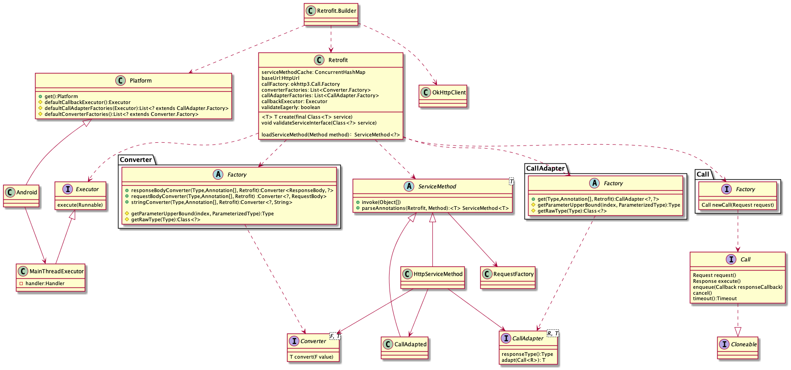
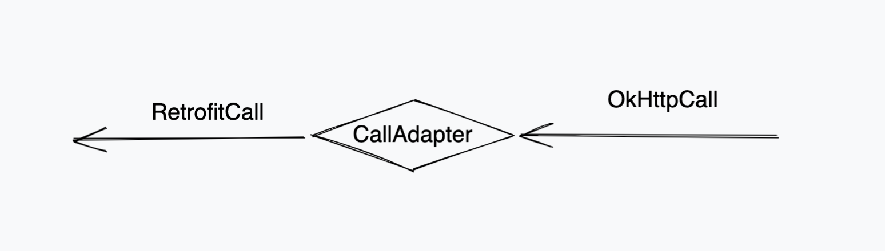

# 1. 简单的类图



# 2. 请求的时序图

请求例子：

```java

 public interface GitHub {
    @GET("/repos/{owner}/{repo}/contributors")
    Call<List<Contributor>> contributors(@Path("owner") String owner, @Path("repo") String repo);
  }

// Create a very simple REST adapter which points the GitHub API.
Retrofit retrofit = new Retrofit.Builder()
        .baseUrl(API_URL)
        .addConverterFactory(GsonConverterFactory.create())
        .build();

// Create an instance of our GitHub API interface.
GitHub github = retrofit.create(GitHub.class);

// 请求 返回是 OkHttpCall
// Create a call instance for looking up Retrofit contributors.
Call<List<Contributor>> call = github.contributors("square", "retrofit");

// Fetch and print a list of the contributors to the library.
List<Contributor> contributors = call.execute().body();

```

时序图

## 3. 建立  Retrofit build 的过程


在 ① build() 方面里面进行 Retrofit 的一下初始化配置
③ 是真正处理网络请求，使用 OkHttp 里面的东西，这里先默认返回
④ 是将网络请求回来的数据，通过 Converter#convert() 将返回的数据转换成需要的数据格式


## 4. Retrofit 的核心

### 4.1 Converter

Converter 是 Retrofit 的核心，会把请求的数据转换为网络请求的数据，
网络回来的数据转换为需要的数据格式。
它要配合 Converter$Factory 一起使用

```java 

public interface Converter<F, T> {
    @Nullable
    T convert(F value) throws IOException;
}

 // 创建 Converter 实例
abstract class Factory {

// 网络请求回来的数据转为自己需要的数据
public @Nullable Converter<ResponseBody, ?> responseBodyConverter(
    Type type, Annotation[] annotations, Retrofit retrofit) {
    return null;
}

// 将请求的数据转换为网络请求的数据
public @Nullable Converter<?, RequestBody> requestBodyConverter(
    Type type,
    Annotation[] parameterAnnotations,
    Annotation[] methodAnnotations,
    Retrofit retrofit) {
    return null;
}
 
```

 


### 4.2 CallAdapter

 CallAdapter 将 okhttp.Call 转换成 Retrofit.Call

 

Retrofit.Call 通过代理，将所有对 Call 的方法转为为对  okhttp3.Call 的调用
 
```java
// Call 是 retrofit 的 call
final class OkHttpCall<T> implements Call<T> {
      private @Nullable okhttp3.Call rawCall; // 这里是 okhttp 的 call ，最后实际的对象 是 okttp 的 ReaCall
}
```

### 4.3 对 okhttp.call 之后返回的结果线程的切换

在 okhttp 中对 call 的调用

```java
//主线程
Call call = client.newCall(request);

call.enqueue(new Callback() {
 @Override
 public void onResponse(@NotNull Call call, @NotNull Response response) throws IOException {
   //后台线程
 }

 @Override
 public void onFailure(@NotNull Call call, @NotNull IOException e) {
   //后台线程
 }
});
```

在  retrofit 中做了封装，如果是 Android 中使用，默认的回调是 `MainThreadExecutor`, 利用 handler 将结果 post 会主线程

```java
static final class MainThreadExecutor implements Executor {
      private final Handler handler = new Handler(Looper.getMainLooper());

      @Override
      public void execute(Runnable r) {
        handler.post(r);
      }
}
```


