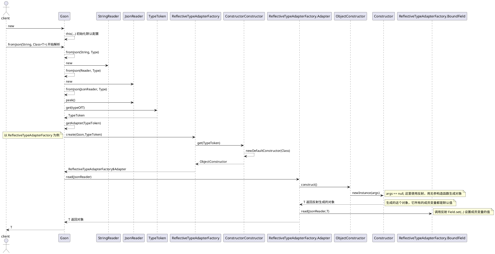
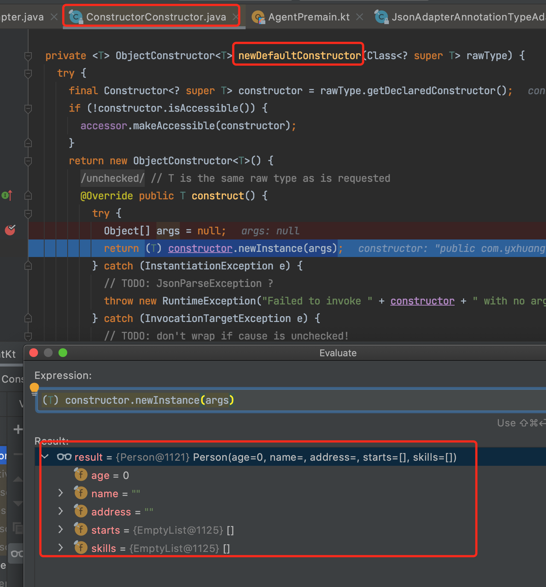
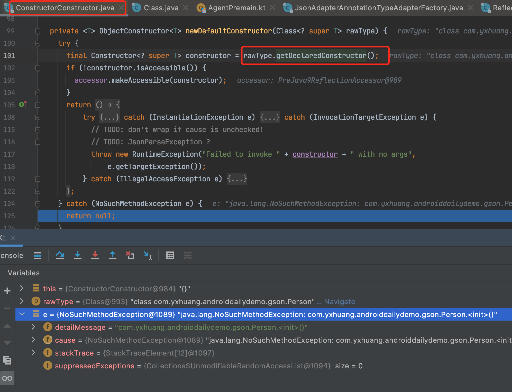

Gson 在 Android 开发中一般用于和服务器交换数据。

但是在使用的时候,如果不留意就会掉到坑里面去。


## 踩坑
下面是一个模拟将一个服务返回 json 字符串，解析成 Person 对象的例子。

```kotlin
fun main() {
    val gson = Gson()

    val json = "{\"age\":\"18\", \"name\":\"tom\"}" // 模拟服务器返回的数据

    val person = gson.fromJson<Person>(json, Person::class.java)

    println("person: $person")
    println("person address: ${person.address}")
    println("person starts: ${person.starts.size}")
}

data class Person(
        val age: Int = 0,
        val name: String = "",
        val address: String?,
        val starts: List<Int> = emptyList(),
        val skills: List<Skill> = emptyList()
)

data class Skill(
        val name: String,
        val level: String
)
```
在运行的时候，会发现崩溃。

```
person: Person(age=18, name=tom, address=null, starts=null, skills=null)
person address: null
Exception in thread "main" java.lang.NullPointerException
	at com.yxhuang.androiddailydemo.gson.GsonClientKt.main(GsonClient.kt:21)
	at com.yxhuang.androiddailydemo.gson.GsonClientKt.main(GsonClient.kt)
```
我们已经将 starts 和 skills 设置为默认值了，为什么 这两个成员变量还是为 null 的呢？

如果我们将 Person 改成下面的形式

```kotlin
data class Person(
        val age: Int = 0,
        val name: String = "",
        val address: String? = "",
        val starts: List<Int> = emptyList(),
        val skills: List<Skill> = emptyList()
)
```
再运行，发现是没有问题的

```
person: Person(age=18, name=tom, address=, starts=[], skills=[])
person address: 
person starts: 0
```

## Gson 崩溃分析
这里就有个疑问了，address 不是一个可选为空的字段吗，给没给默认值，会参数影响呢？

有个办法，就是将 Person 反编译成 java 代码，看看 address 设值和不设值有什么不一样。


**可空成员变量不设默认值**
主要看它的构造函数

```java
  public Person(int age, @NotNull String name, @Nullable String address, @NotNull List starts, @NotNull List skills) {
      Intrinsics.checkNotNullParameter(name, "name");
      Intrinsics.checkNotNullParameter(starts, "starts");
      Intrinsics.checkNotNullParameter(skills, "skills");
      super();
      this.age = age;
      this.name = name;
      this.address = address;
      this.starts = starts;
      this.skills = skills;
   }

   // $FF: synthetic method
   public Person(int var1, String var2, String var3, List var4, List var5, int var6, DefaultConstructorMarker var7) {
      if ((var6 & 1) != 0) {
         var1 = 0;
      }

      if ((var6 & 2) != 0) {
         var2 = "";
      }

      if ((var6 & 8) != 0) {
         var4 = CollectionsKt.emptyList();
      }

      if ((var6 & 16) != 0) {
         var5 = CollectionsKt.emptyList();
      }

      this(var1, var2, var3, var4, var5);
   }

```

**可空成员变量设默认值**

```java
  public Person(int age, @NotNull String name, @Nullable String address, @NotNull List starts, @NotNull List skills) {
      Intrinsics.checkNotNullParameter(name, "name");
      Intrinsics.checkNotNullParameter(starts, "starts");
      Intrinsics.checkNotNullParameter(skills, "skills");
      super();
      this.age = age;
      this.name = name;
      this.address = address;
      this.starts = starts;
      this.skills = skills;
   }

   // $FF: synthetic method
   public Person(int var1, String var2, String var3, List var4, List var5, int var6, DefaultConstructorMarker var7) {
      if ((var6 & 1) != 0) {
         var1 = 0;
      }

      if ((var6 & 2) != 0) {
         var2 = "";
      }

      if ((var6 & 4) != 0) {
         var3 = "";
      }

      if ((var6 & 8) != 0) {
         var4 = CollectionsKt.emptyList();
      }

      if ((var6 & 16) != 0) {
         var5 = CollectionsKt.emptyList();
      }

      this(var1, var2, var3, var4, var5);
   }

   public Person() {
      this(0, (String)null, (String)null, (List)null, (List)null, 31, (DefaultConstructorMarker)null);
   }

```

**如果是给可空成员变量给了默认值，就会发现多了一个无参构造函数**, 这个无参构造函数就是关键.

## Gson 分析

### 调用流程




### 反射生成对象


会根据不同的类型，使用不同的 ObjectConstructor

```java
// ConstructorConstructor.java
public final class ConstructorConstructor {

    public ConstructorConstructor(Map<Type, InstanceCreator<?>> instanceCreators) {
        this.instanceCreators = instanceCreators;
    }

    public <T> ObjectConstructor<T> get(TypeToken<T> typeToken) {
        final Type type = typeToken.getType();
        final Class<? super T> rawType = typeToken.getRawType();

        ...

        // ① 无参构造函数调用
        ObjectConstructor<T> defaultConstructor = newDefaultConstructor(rawType);
        if (defaultConstructor != null) {
        return defaultConstructor;
        }

        // ② Map 和 List 及它们的子类型调用
        ObjectConstructor<T> defaultImplementation = newDefaultImplementationConstructor(type, rawType);
        if (defaultImplementation != null) {
          return defaultImplementation;
        }

      // finally try unsafe
      // ③ 其他类型
      return newUnsafeAllocator(type, rawType);

    }

    private <T> ObjectConstructor<T> newDefaultConstructor(Class<? super T> rawType) {
    try {
      final Constructor<? super T> constructor = rawType.getDeclaredConstructor();
      if (!constructor.isAccessible()) {
        accessor.makeAccessible(constructor);
      }
      return new ObjectConstructor<T>() {
        @SuppressWarnings("unchecked") // T is the same raw type as is requested
        @Override public T construct() {
          try {
            Object[] args = null;
            return (T) constructor.newInstance(args);
          } catch (InstantiationException e) {
            ...
          }
        }
      }
    }
  }
    ...

  private <T> ObjectConstructor<T> newUnsafeAllocator(
      final Type type, final Class<? super T> rawType) {
    return new ObjectConstructor<T>() {
      private final UnsafeAllocator unsafeAllocator = UnsafeAllocator.create();
      @SuppressWarnings("unchecked")
      @Override public T construct() {
        try {
          Object newInstance = unsafeAllocator.newInstance(rawType);
          return (T) newInstance;
        } catch (Exception e) {
          throw new RuntimeException(("Unable to invoke no-args constructor for " + type + ". "
              + "Registering an InstanceCreator with Gson for this type may fix this problem."), e);
        }
      }
    };
  }
}

```
**① 无参构造函数 newDefaultConstructor**

```kotlin
 Object[] args = null;
 return (T) constructor.newInstance(args);
```
生成类的时候，会调用类的无参构造函数




**② Map 和 List 及它们的子类型 newDefaultImplementationConstructor**

**③ 其他类型 newUnsafeAllocator**

使用 UnsafeAllocator#newInstance 直接构建一个对象
```kotlin
Object newInstance = unsafeAllocator.newInstance(rawType);
return (T) newInstance;
```


<br>


### 对生成对象的成员变量使用反射赋值
```java
// ReflectiveTypeAdapterFactory$Adapter
ReflectiveTypeAdapterFactory.Adapter {

    ...

    @Override 
    public T read(JsonReader in) throws IOException {
      if (in.peek() == JsonToken.NULL) {
        in.nextNull();
        return null;
      }

      T instance = constructor.construct();

      try {
        in.beginObject();
        while (in.hasNext()) {
          String name = in.nextName();
          BoundField field = boundFields.get(name);
          if (field == null || !field.deserialized) {
            in.skipValue();
          } else {
            field.read(in, instance); // 调用 ReflectiveTypeAdapterFactory$BoundField.create
          }
        }
      } catch (IllegalStateException e) {
        ...
      }
      in.endObject();
      return instance;  // 返回成员变量已经赋值的实例对象
    }

}


// ReflectiveTypeAdapterFactory.BoundField.java
ReflectiveTypeAdapterFactory.BoundField(name, serialize, deserialize){

 @Override 
 void read(JsonReader reader, Object value) throws IOException, IllegalAccessException {
        Object fieldValue = typeAdapter.read(reader);
        if (fieldValue != null || !isPrimitive) {
          field.set(value, fieldValue);   //① 反射对成员变量赋值
        }
      }
}

```
① 使用反射设置变量的值

### 如何知道反射的字段的数据类型

```java
// ReflectiveTypeAdapterFactory.java

  private Map<String, BoundField> getBoundFields(Gson context, TypeToken<?> type, Class<?> raw) {
    Map<String, BoundField> result = new LinkedHashMap<String, BoundField>();
    if (raw.isInterface()) {
      return result;
    }

    Type declaredType = type.getType(); //获取 typetoken 里面的 type
    while (raw != Object.class) {
      Field[] fields = raw.getDeclaredFields(); // ① 获取该类和它父类的全部成员变量。
      for (Field field : fields) {
        boolean serialize = excludeField(field, true);
        boolean deserialize = excludeField(field, false);
        if (!serialize && !deserialize) {
          continue;
        }
        accessor.makeAccessible(field);
        Type fieldType = $Gson$Types.resolve(type.getType(), raw, field.getGenericType()); // ② field.getGenericType()
        List<String> fieldNames = getFieldNames(field);
        BoundField previous = null;
        for (int i = 0, size = fieldNames.size(); i < size; ++i) {
          String name = fieldNames.get(i);
          if (i != 0) serialize = false; // only serialize the default name
          BoundField boundField = createBoundField(context, field, name,
              TypeToken.get(fieldType), serialize, deserialize);
          BoundField replaced = result.put(name, boundField);
          if (previous == null) previous = replaced;
        }
        if (previous != null) {
          throw new IllegalArgumentException(declaredType
              + " declares multiple JSON fields named " + previous.name);
        }
      }
      type = TypeToken.get($Gson$Types.resolve(type.getType(), raw, raw.getGenericSuperclass()));
      raw = type.getRawType();
    }
    return result;
  }

```
① Fields[] fields = Class.getDeclaredFields()  获取这个类和它父类的全部成员变量

② Field.getGenericType() 获取成员变量的类型