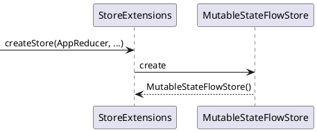
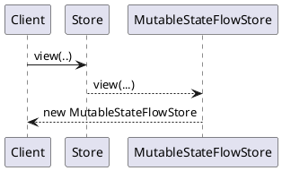
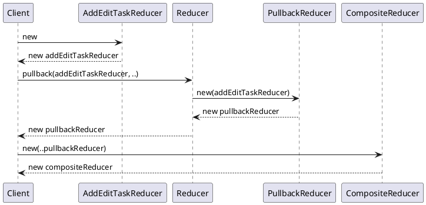

Introduction of Kompose Source code

[toc]


<image src="kompose.excalidraw.png">

# 1.0 Init

## 1.1 CreateStore Flow

### 1.1.2 Create App Store



### 1.1.3 Create Local Store




## 1.2 Create AppReducer Flow

For example, AddEditTaskReducer



# 2.0 Send Flow
## 2.1 Send Action

Take StatisticsAction as an example

```plantuml
StatisticsViewModel -> AppStoreManager: get statisticsStore
AppStoreManager -> AppStore: view()
AppStore --> AppStore: new StatisticsStore
StatisticsStore --> StatisticsStore: mapToLocalState
note left: mapToLocalState turn AppState \nto LocalState
StatisticsStore --> StatisticsViewModel:  return store

StatisticsViewModel -> StatisticsStore: send
note right: send StatisticsAction.GetTasksAction
StatisticsStore --> StatisticsStore: mapToGlobalAction
note left: mapToGlobalAction turn LocalAtion \nto AppAction

StatisticsStore -> AppStore: sendFn(AppAction)


AppStore  -> CompositeReducer: reduce
CompositeReducer -> PullbackReducer: reduce
PullbackReducer --> PullbackReducer: mapToLocalAction
note left: mapToLocalAction turn AppAction \nto LocalAtion
PullbackReducer --> PullbackReducer: mapToLocalState
note left: mapToLocalState turn AppState \nto LocalSate

PullbackReducer -> StatisticsReducer: reduce()
note left: reduce return a localResult\n includes StatisticsUiState & StatisticsAction

PullbackReducer --> PullbackReducer: mapToGlobalState
note right: mapToGlobalState turn LocalSate \nto AppState

PullbackReducer -> EffectExtensions: map

PullbackReducer --> CompositeReducer: ReduceResult

CompositeReducer --> AppStore: ReduceResult
AppStore --> AppStore: update state

AppStore -> StatisticsEffect: run
StatisticsEffect -> PullbackReducer: mapToGlobalAction
note right: mapToGlobalAction trun localAction to AppAction
AppStore -> StatisticsStore:

```
# 3.0 The Detail of Creating Store 

## 3.1 Create Global Store

```kotlin
companion object {
    // create Global App  Store
    fun <State, Action : Any> create(
        initialState: State,
        reducer: Reducer<State, Action>, // Global reducer
        subscription: Subscription<State, Action>,
        exceptionHandler: ExceptionHandler,
        storeScopeProvider: StoreScopeProvider,
        dispatcherProvider: DispatcherProvider,
    ): Store<State, Action> {
        val storeScope = storeScopeProvider.getStoreScope()
        val state = MutableStateFlow(initialState)
        val noEffect = NoEffect

        lateinit var send: (List<Action>) -> Unit
        send = { actions ->
            storeScope.launch(context = dispatcherProvider.main) {
                val result: ReduceResult<State, Action> = actions.fold(ReduceResult(state.value, noEffect)) { accResult, action ->
                    try {
                        val (nextState, nextEffect) = reducer.reduce(accResult.state, action)
                        return@fold ReduceResult(nextState, accResult.effect mergeWith nextEffect)
                    } catch (e: Throwable) {
                        ReduceResult(accResult.state, exceptionHandler.handleReduceException(e))
                    }
                }

                state.value = result.state

                try {
                    result.effect.run()
                        .onEach { action ->
                            send(listOf(action))
                        }
                        .launchIn(storeScope)
                } catch (e: Throwable) {
                    exceptionHandler.handleEffectException(e)
                }
            }
        }

        try {
            subscription
                .subscribe(state)
                .onEach { action ->
                    send(listOf(action))
                }
                .launchIn(storeScope)
        } catch (e: Throwable) {
            runBlocking {
                exceptionHandler.handleSubscriptionException(e)
            }
        }
        return MutableStateFlowStore(state, send)
    }
}

```

When the client want to create a global Store(App Store), it need to invoke the companion function that is create.

The send function is the core of MutableStateFlowStore, and it will as a parameter of MutableStateFlowStore.


## 3.2 Create Local Store

When we want to ceate the local store, we need to invoke the view function or the optionalView function of the global store.

```kotlin
override fun <ViewState, ViewAction : Any> view(
    mapToLocalState: (State) -> ViewState,
    mapToGlobalAction: (ViewAction) -> Action?,
): Store<ViewState, ViewAction> = MutableStateFlowStore(
    state = state.map {
        resultState = mapToLocalState(it)
    }.distinctUntilChanged(),

    sendFn = { actions ->
        val globalActions = actions.mapNotNull(mapToGlobalAction)
        sendFn(globalActions) // sendFn is the GlobalStore's send function
    },
)

override fun <ViewState : Any, ViewAction : Any> optionalView(
    mapToLocalState: (State) -> ViewState?,
    mapToGlobalAction: (ViewAction) -> Action?,
): Store<ViewState, ViewAction> = MutableStateFlowStore(
    state = state.mapNotNull { mapToLocalState(it) }.distinctUntilChanged(),
    sendFn = { actions ->
        val globalActions = actions.mapNotNull(mapToGlobalAction)
        sendFn(globalActions)
    },
)
```

When the client invokes the view function of the global store, it need to invoke mapToLocalState function that map the global state to local state.

The mapToGlobalAction function will not immediately  be inovked, it will be invoke when the client send a action。


When the client invoke the send function of local store, 

```kotlin
override fun send(actions: List<Action>) {
    println("MutableStateFlowStore send: $actions")
    if (actions.isEmpty()) return

    sendFn(actions)
}
```
The sendFn has been invoked, this means the below code has been run.

```kotlin
sendFn = { actions ->
    val globalActions = actions.mapNotNull(mapToGlobalAction)
    sendFn(globalActions) // sendFn is the GlobalStore's send function
}
```
**When it invoke mapToGlobalAction function that mapp the local action to global actions. and run the sendFn function. The sendFn is the send function of Global Store. So the local store send a action eventually call the global store send function.**


