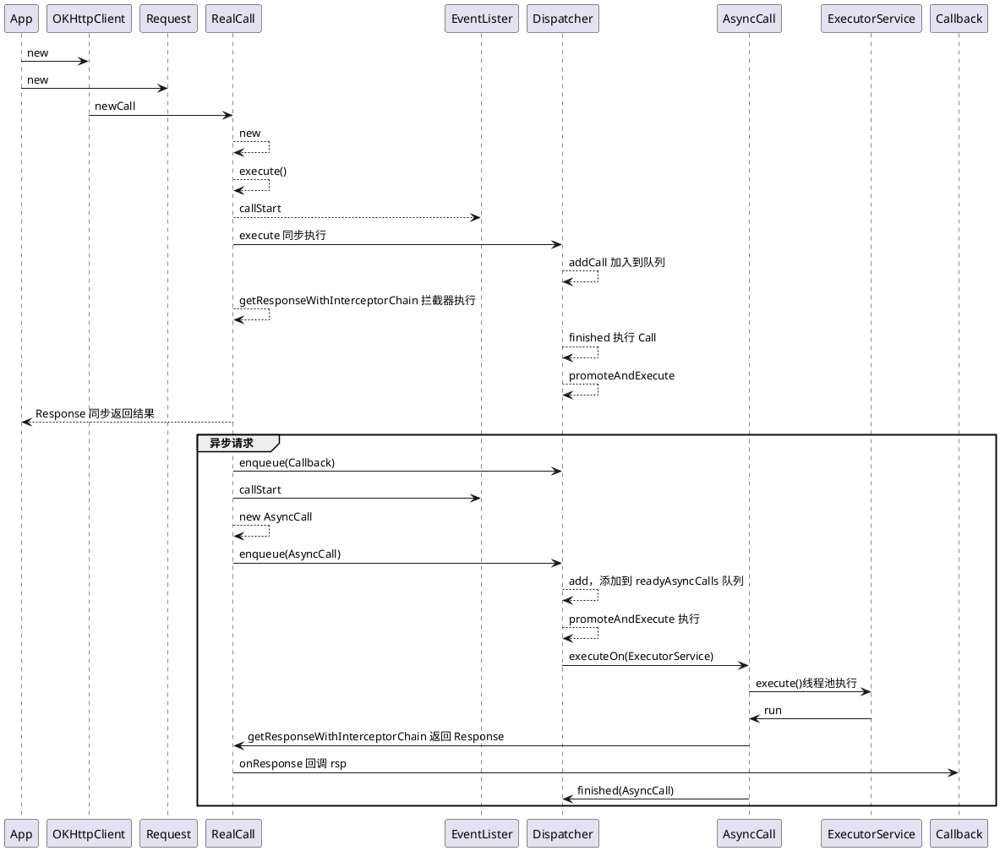
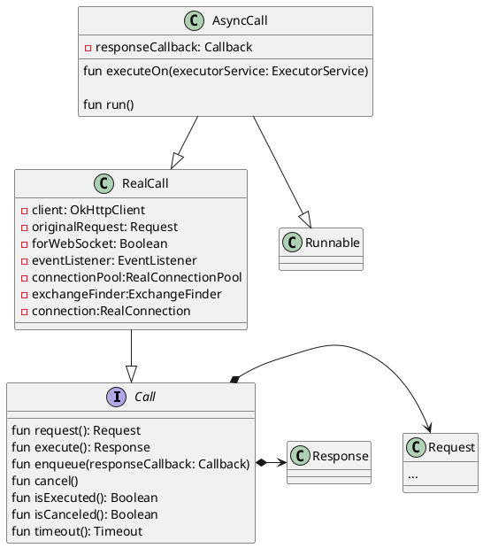

[toc]

## 1. 如何包装一个 Call

- **1.包装 request**
将 request 所需的参数用一个 Request 类包住

- **2.如何处理回调**
在 rsp 数据回来之后，调用回调


- **3.分发 Call**
 Call 是一个 Runnable,通过线程池之执行 run 方法，并在这个方法里面进行网络请求，请求回来后，通过 callback 将数据返回去

 - **4.如何同步处理数据**
 底层的网络请求通过 okio 实现，是同步方式的，故可以同步请求网络。但是这样会阻塞发起请求的线程，在 Android 中使用，不能在主线程使用，不然会阻塞主线程

 - **5.连接池**


## 2. 请求的过程



## 3. 主要类的关系




## 4.拦截器


```kotlin
// RealCall.kt
internal fun getResponseWithInterceptorChain(): Response {
    // Build a full stack of interceptors.
    val interceptors = mutableListOf<Interceptor>()
    interceptors += client.interceptors
    interceptors += RetryAndFollowUpInterceptor(client)
    interceptors += BridgeInterceptor(client.cookieJar)
    interceptors += CacheInterceptor(client.cache)
    interceptors += ConnectInterceptor
    if (!forWebSocket) {
      interceptors += client.networkInterceptors
    }
    interceptors += CallServerInterceptor(forWebSocket)

    val chain = RealInterceptorChain(
        call = this,
        interceptors = interceptors,
        index = 0,
        exchange = null,
        request = originalRequest,
        connectTimeoutMillis = client.connectTimeoutMillis,
        readTimeoutMillis = client.readTimeoutMillis,
        writeTimeoutMillis = client.writeTimeoutMillis
    )

    var calledNoMoreExchanges = false
    try {
      val response = chain.proceed(originalRequest)
       
       ...

      return response
    } catch (e: IOException) {
    
     ...
  }


```


## 5.连接池


