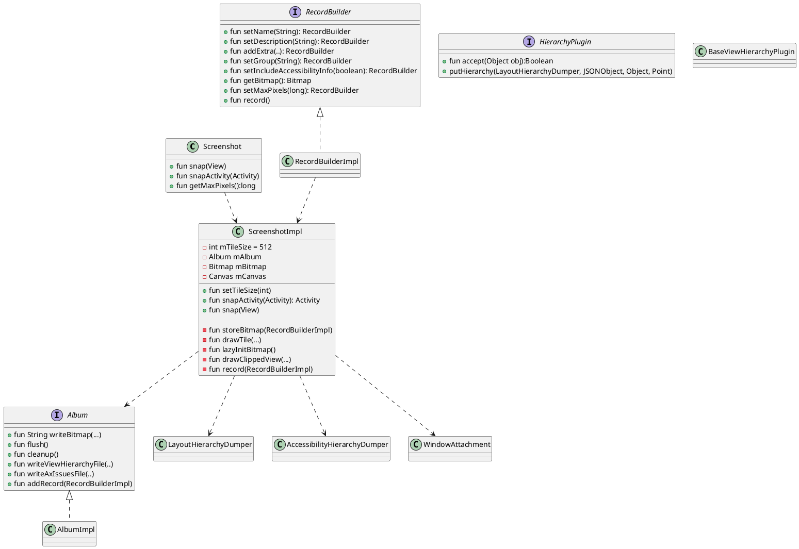
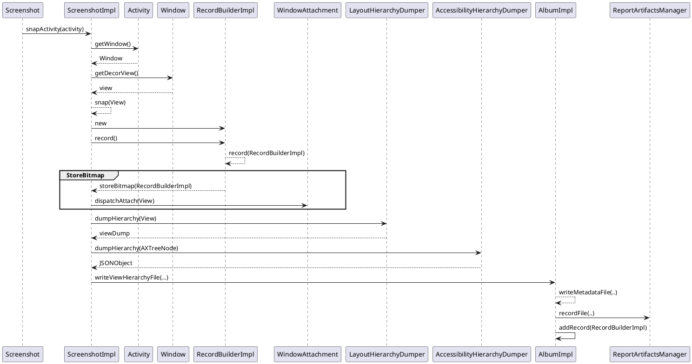
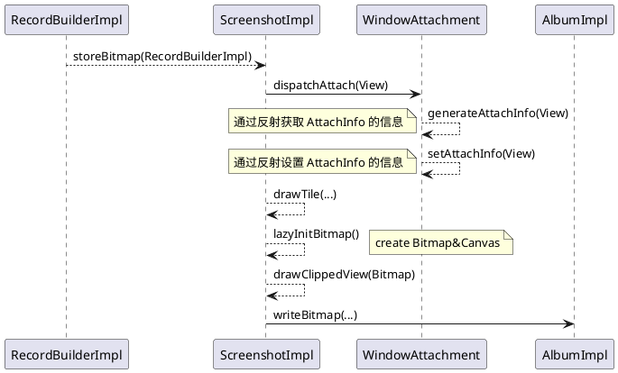

 [toc]

# 学前疑问
- 怎样调用 android Test

- 怎样切割一个图片

- 如果是按层级来切割，增加一个层级，但是图片内容没有变化，会不会检测出来
怎样验证是不是图片有了变化

# 问题
- 同样配置的模拟器，生成的截图大小不一样，导致配对 diff
- 

# 项目结构

<image src="excalidraw/screenshot-arch.excalidraw.png">

## Core

主要类关系




- `Screenshot` 是入口


## layout-hierarchy-common
Provides attribute details from a TextView

## layout-hierarchy-litho

litho 是 facebook 自己创建的一套声明是 UI 框架，layout-hierarchy-litho 是用例获取 litho 的 layout hierarchy

## plugin


# Record Flow



## StoreBitmap 的流程



## 切割图片

将一个截屏分割成小部分,节约在 verify 过程时的内存，同时加快 verify 速度。
这个流程在 ScreenshotImpl#storeBitmap 函数里面
例子
<image src="excalidraw/screenshot-1.excalidraw.png">

## 生成 dump.json
它的作用？

生成 dump.json 文件在 ScreenshotImpl#record 函数里面,它的结构与 Android Studio 的 Layout Inspector 生成的结构层次是一样的。

```json
	"viewHierarchy": {
		"class": "com.android.internal.policy.DecorView",
		"left": 0,
		"top": 0,
		"width": 1080,
		"height": 1920,
		"children": [{
				"class": "android.widget.LinearLayout",
				"left": 0,
				"top": 0,
				"width": 1080,
				"height": 1794,
				"children": [{
						"class": "android.view.ViewStub",
						"left": 0,
						"top": 0,
						"width": 0,
						"height": 0
					},
					{
						"class": "android.widget.FrameLayout",
						"left": 0,
						"top": 0,
						"width": 1080,
						"height": 1794,
						"children": [{
							"class": "androidx.appcompat.widget.FitWindowsLinearLayout",
							"left": 0,
							"top": 0,
							"width": 1080,
							"height": 1794,
							"children": [{
									"class": "androidx.appcompat.widget.ViewStubCompat",
									"left": 0,
									"top": 0,
									"width": 0,
									"height": 0
								},
								{
									"class": "androidx.appcompat.widget.ContentFrameLayout",
									"left": 0,
									"top": 0,
									"width": 1080,
									"height": 1794,
									"children": [{
										"class": "androidx.coordinatorlayout.widget.CoordinatorLayout",
										"left": 0,
										"top": 0,
										"width": 1080,
										"height": 1794,
										"children": [{
												"class": "com.google.android.material.appbar.AppBarLayout",
												"left": 0,
												"top": 63,
												"width": 1080,
												"height": 147,
												"children": [{
													"class": "androidx.appcompat.widget.Toolbar",
													"left": 0,
													"top": 63,
													"width": 1080,
													"height": 147,
													"children": [{
															"class": "androidx.appcompat.widget.AppCompatTextView",
															"left": 42,
															"top": 101,
															"width": 882,
															"height": 71
														},
														{
															"class": "androidx.appcompat.widget.ActionMenuView",
															"left": 975,
															"top": 63,
															"width": 105,
															"height": 147,
															"children": [{
																"class": "androidx.appcompat.widget.ActionMenuPresenter.OverflowMenuButton",
																"left": 975,
																"top": 73,
																"width": 105,
																"height": 126
															}]
														}
													]
												}]
											},
											{
												"class": "android.widget.LinearLayout",
												"left": 0,
												"top": 210,
												"width": 1080,
												"height": 1584,
												"children": [{
													"class": "androidx.appcompat.widget.AppCompatTextView",
													"left": 0,
													"top": 210,
													"width": 1080,
													"height": 1584
												}]
											},
											{
												"class": "com.google.android.material.floatingactionbutton.FloatingActionButton",
												"left": 891,
												"top": 1605,
												"width": 147,
												"height": 147
											}
										]
									}]
								}
							]
						}]
					}
				]
			},
			{
				"class": "android.view.View",
				"left": 0,
				"top": 1794,
				"width": 1080,
				"height": 126
			},
			{
				"class": "android.view.View",
				"left": 0,
				"top": 0,
				"width": 1080,
				"height": 63
			}
		]
	},

```


# Verify

Verify 的流程也是会先触发 Android Test, 生成一份新的截图，目录在 `sdcard/screenshots/xxx.test/` 目录下， 然后通过调用 python 去与原有截图进行配对。

<image src="image/screenshot_imag_2.png">

VerifyScreenshotTestTask 最终会调用 ScreenshotTask 的 pullScreenshots 函数, 在这个函数里面会传入对应的参数，调用 pull_screenshots.python 文件


判断是否同一张截图的函数在  recorder.py  文件中

```python
def _is_image_same(self, file1, file2, failure_file):
    with Image.open(file1) as im1, Image.open(file2) as im2:
        diff_image = ImageChops.difference(im1, im2) // 配对
        try:
            diff = diff_image.getbbox()
            if diff is None:
                return True
            else:
                if failure_file:
                    diff_list = list(diff) if diff else []
                    draw = ImageDraw.Draw(im2)
                    draw.rectangle(diff_list, outline=(255, 0, 0))
                    im2.save(failure_file)
                return False
        finally:
            diff_image.close()
```


# 可参考代码

- ScreenshotImpl#runCallableOnUiThread

```java
  private <T> T runCallableOnUiThread(final Callable<T> callable) {
    final T[] ret = (T[]) new Object[1];
    final Exception[] e = new Exception[1];
    final Object lock = new Object();
    Handler handler = new Handler(Looper.getMainLooper());

    synchronized (lock) {
      handler.post(
          new Runnable() {
            @Override
            public void run() {
              try {
                ret[0] = callable.call();
              } catch (Exception ee) {
                e[0] = ee;
              }
              synchronized (lock) {
                lock.notifyAll();
              }
            }
          });

      try {
        lock.wait();
      } catch (InterruptedException ee) {
        throw new RuntimeException(ee);
      }
    }

    if (e[0] != null) {
      throw new RuntimeException(e[0]);
    }
    return ret[0];
  }

```