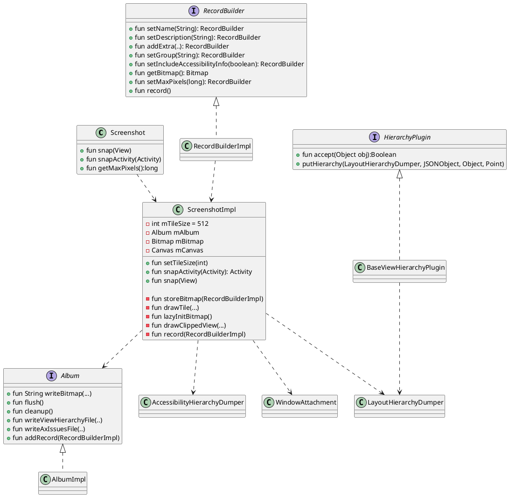
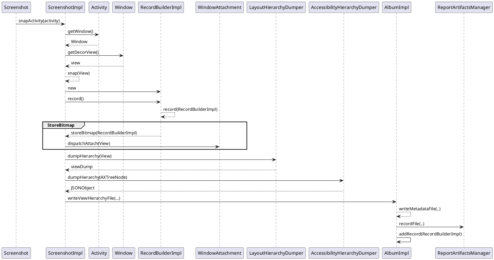
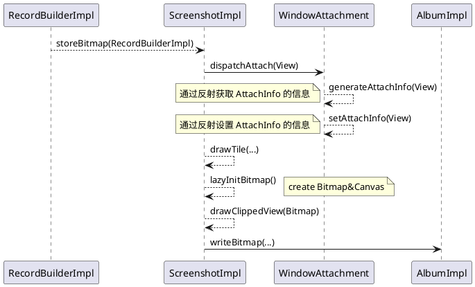

 [toc]

# 1.学前疑问
- 怎样调用 android Test

- 怎样切割一个图片

- 如果是按层级来切割，增加一个层级，但是图片内容没有变化，会不会检测出来
怎样验证是不是图片有了变化

# 2.项目结构

<image src="excalidraw/screenshot-arch.excalidraw.png">

## 2.1 Core

**主要类关系**



- `Screenshot`是入口
- `AlbumImpl` 的主要功能是截屏、保存图片的
- `LayoutHierarchyDumper` 是 Dumps layout hierarchy 的信息，然后将这些信息转化成一个 JSON 对象。
- `ScreenshotImpl` 是 Core 的主要类，它负责将 Core 中的各个部分功能组合起来。

## 2.2 layout-hierarchy-common
Provides attribute details from a TextView

## 2.3 layout-hierarchy-litho

litho 是 facebook 自己创建的一套声明是 UI 框架，layout-hierarchy-litho 是用例获取 litho 的 layout hierarchy

## 2.4 Plugin
Plugin 包含两部分，一部分是作为 gradle plugin 对外作为 task 使用，另外一部分是 python 代码，作为复制截图和校验截图使用。

### 2.4.1 task 部分

<image src="image/screenshot_img_3.png">

在 ScreenshotsPlugin 中可以接收一些自定义的参数，包括

```
open class ScreenshotsPluginExtension {
  /** The directory to store recorded screenshots in */
  var recordDir = "screenshots"
  /** Whether to have the plugin dependency automatically add the core dependency */
  var addDeps = true
  /** Whether to store screenshots in device specific folders */
  var multipleDevices = false
  /** The python executable to use */
  var pythonExecutable = "python"
  /** The directory to compare screenshots from in verify only mode */
  var referenceDir: String? = null
  /** The directory to save failed screenshots */
  var failureDir: String? = null
  /** Whether to tar the screenshots in an archive file to transfer */
  var bundleResults = false

  var testRunId: String = UUID.randomUUID().toString()
}
```

这些参数根据自己的需要在项目的 gradle 文件中配置,例如

```
screenshots {
  multipleDevices true
  pythonExecutable 'python3'
  failureDir = "$projectDir/build/reports/screenshotFailshots"
}
```
最终会通过 PullScreenshotsTask 去启动一个 python 进程，并将参数传递到 python 进程中。


```
import com.android.build.gradle.api.ApkVariantOutput
import com.android.build.gradle.api.TestVariant
import java.io.File
import org.gradle.api.Project
import org.gradle.api.tasks.Input
import org.gradle.api.tasks.TaskAction

open class PullScreenshotsTask : ScreenshotTask() {
  companion object {
    fun taskName(variant: TestVariant) = "pull${variant.name.capitalize()}Screenshots"

    fun getReportDir(project: Project, variant: TestVariant): File =
        File(project.buildDir, "screenshots" + variant.name.capitalize())
  }

  private lateinit var apkPath: File

  @Input protected var verify = false

  @Input protected var record = false

  @Input protected var bundleResults = false

  @Input protected lateinit var testRunId: String

  init {
    description = "Pull screenshots from your device"
    group = ScreenshotsPlugin.GROUP
  }

  override fun init(variant: TestVariant, extension: ScreenshotsPluginExtension) {
    super.init(variant, extension)
    val output =
        variant.outputs.find { it is ApkVariantOutput } as? ApkVariantOutput
            ?: throw IllegalArgumentException("Can't find APK output")
    val packageTask =
        variant.packageApplicationProvider.orNull
            ?: throw IllegalArgumentException("Can't find package application provider")

    apkPath = File(packageTask.outputDirectory.asFile.get(), output.outputFileName)
    bundleResults = extension.bundleResults
    testRunId = extension.testRunId
  }

  @TaskAction
  fun pullScreenshots() {
    val codeSource = ScreenshotsPlugin::class.java.protectionDomain.codeSource
    val jarFile = File(codeSource.location.toURI().path)
    val isVerifyOnly = verify && extension.referenceDir != null

    val outputDir =
        if (isVerifyOnly) {
          File(extension.referenceDir)
        } else {
          getReportDir(project, variant)
        }

    assert(if (isVerifyOnly) outputDir.exists() else !outputDir.exists())

    project.exec {
      it.executable = extension.pythonExecutable
      it.environment("PYTHONPATH", jarFile)

      it.args =
          mutableListOf(
                  "-m",
                  "android_screenshot_tests.pull_screenshots",
                  "--apk",
                  apkPath.absolutePath,
                  "--test-run-id",
                  testRunId,
                  "--temp-dir",
                  outputDir.absolutePath)
              .apply {
                if (verify) {
                  add("--verify")
                } else if (record) {
                  add("--record")
                }

                if (verify || record) {
                  add(extension.recordDir)
                }

                if (verify && extension.failureDir != null) {
                  add("--failure-dir")
                  add("${extension.failureDir}")
                }

                if (extension.multipleDevices) {
                  add("--multiple-devices")
                  add("${extension.multipleDevices}")
                }

                if (isVerifyOnly) {
                  add("--no-pull")
                }

                if (bundleResults) {
                  add("--bundle-results")
                }
              }

      println(it.args)
    }
  }
}
```
以下这段有 ChatGPT 分析出来的结果

*这些导入语句导入了 ApkVariantOutput、TestVariant、File、Project、Input 和 TaskAction 类。其中 ApkVariantOutput 和 TestVariant 类来自 Android Gradle 插件，用于表示 Android 应用程序或测试的变体。File 类用于表示文件路径。Project 类表示当前 Gradle 项目。Input 和 TaskAction 注解用于标识输入属性和任务操作方法。*

*接下来定义了一个名为 PullScreenshotsTask 的类，该类继承了 ScreenshotTask 类。这个类实现了一个 Companion 对象，包含了两个静态方法 taskName 和 getReportDir。taskName 方法用于返回任务名称，getReportDir 方法用于返回一个包含测试结果的目录路径。*

*然后，类中定义了一些属性，例如 apkPath、verify、record、bundleResults 和 testRunId。这些属性都是带有 Input 注解的公共属性，表示它们是任务的输入属性。apkPath 属性表示 APK 文件的路径。verify 属性表示是否启用了验证模式。record 属性表示是否启用了记录模式。bundleResults 属性表示是否将测试结果打包。testRunId 属性表示测试运行的 ID。*

*接下来定义了一个构造函数和一个 init 方法，用于初始化任务。这个 init 方法接受两个参数，一个是 variant，表示测试变体；另一个是 extension，表示截图插件的配置。*

*最后，定义了一个名为 pullScreenshots 的 TaskAction 方法，该方法使用 project.exec() 方法来启动一个 Python 进程，并传递一些参数。该方法首先获取 ScreenshotsPlugin 类的代码路径和 JAR 文件路径，然后根据传递的参数构建一个命令行，并将其传递给 project.exec() 方法。其中，executable 属性设置为 Python 解释器的路径，environment 方法设置了 PYTHONPATH 环境变量，用于指定 Python 模块的路径，args 属性设置为一个包含了要执行的命令行和参数的列表。*

*该方法使用 println() 函数将 args 列表打印到控制台。最后，该任务的描述和分组属性也在构造函数中设置。*

### 2.4.2 python 部分

```plantuml
pull_screenshots --> pull_screenshots: main(..)
pull_screenshots --> pull_screenshots: setup_paths()
note right: set up android sdk path

pull_screenshots -> DeviceNameCalculator:new
pull_screenshots --> pull_screenshots:pull_screenshots(..)

pull_screenshots --> pull_screenshots:copy_assets(..) ①
note right: 从设备的 /sdcard/screenshots/... \n路径中复制文件出来

pull_screenshots --> pull_screenshots: pull_filtered(...)
note right: 从设备的路径中复制图片,metadata.json 等文件

pull_screenshots --> pull_screenshots:_validate_metadata(..)
pull_screenshots --> pull_screenshots: generate_html()

pull_screenshots -> Recorder: new
pull_screenshots -> Recorder:verify()/record()

Recorder --> Recorder:_record()
Recorder --> Recorder:_get_metadata_json()
Recorder --> Recorder:_copy() ②
Recorder --> Recorder:_is_image_same()
note right: 判断两张截图是否一致

pull_screenshots --> pull_screenshots:print summy

```

- device_name_calculator.py 获取设备的一些信息


① 复制的文件包括：default.css， default.js，background.png，background_dark.png
② 主要功能是将多个分割后的截图合成为一张完整的截图


## 整体流程

<image src="excalidraw/screenshot-flow.excalidraw.png">


# Record Flow




## StoreBitmap 的流程



## 切割图片
切割的图片，metadata.json 等文件都在设备的 /sdcard/screenshot/.. 的路径下。
将一个截屏分割成小部分,节约在 verify 过程时的内存，同时加快 verify 速度。
这个流程在 ScreenshotImpl#storeBitmap 函数里面
例子
<image src="excalidraw/screenshot-1.excalidraw.png">

## 生成 dump.json
dump.json 在生成的 report 中使用

<image src="image/screenshot_img_4.png">

生成 dump.json 文件在 ScreenshotImpl#record 函数里面,它的结构与 Android Studio 的 Layout Inspector 生成的结构层次是一样的。

```json
	"viewHierarchy": {
		"class": "com.android.internal.policy.DecorView",
		"left": 0,
		"top": 0,
		"width": 1080,
		"height": 1920,
		"children": [{
				"class": "android.widget.LinearLayout",
				"left": 0,
				"top": 0,
				"width": 1080,
				"height": 1794,
				"children": [{
						"class": "android.view.ViewStub",
						"left": 0,
						"top": 0,
						"width": 0,
						"height": 0
					},
					{
						"class": "android.widget.FrameLayout",
						"left": 0,
						"top": 0,
						"width": 1080,
						"height": 1794,
						"children": [{
							"class": "androidx.appcompat.widget.FitWindowsLinearLayout",
							"left": 0,
							"top": 0,
							"width": 1080,
							"height": 1794,
							"children": [{
									"class": "androidx.appcompat.widget.ViewStubCompat",
									"left": 0,
									"top": 0,
									"width": 0,
									"height": 0
								},
								{
									"class": "androidx.appcompat.widget.ContentFrameLayout",
									"left": 0,
									"top": 0,
									"width": 1080,
									"height": 1794,
									"children": [{
										"class": "androidx.coordinatorlayout.widget.CoordinatorLayout",
										"left": 0,
										"top": 0,
										"width": 1080,
										"height": 1794,
										"children": [{
												"class": "com.google.android.material.appbar.AppBarLayout",
												"left": 0,
												"top": 63,
												"width": 1080,
												"height": 147,
												"children": [{
													"class": "androidx.appcompat.widget.Toolbar",
													"left": 0,
													"top": 63,
													"width": 1080,
													"height": 147,
													"children": [{
															"class": "androidx.appcompat.widget.AppCompatTextView",
															"left": 42,
															"top": 101,
															"width": 882,
															"height": 71
														},
														{
															"class": "androidx.appcompat.widget.ActionMenuView",
															"left": 975,
															"top": 63,
															"width": 105,
															"height": 147,
															"children": [{
																"class": "androidx.appcompat.widget.ActionMenuPresenter.OverflowMenuButton",
																"left": 975,
																"top": 73,
																"width": 105,
																"height": 126
															}]
														}
													]
												}]
											},
											{
												"class": "android.widget.LinearLayout",
												"left": 0,
												"top": 210,
												"width": 1080,
												"height": 1584,
												"children": [{
													"class": "androidx.appcompat.widget.AppCompatTextView",
													"left": 0,
													"top": 210,
													"width": 1080,
													"height": 1584
												}]
											},
											{
												"class": "com.google.android.material.floatingactionbutton.FloatingActionButton",
												"left": 891,
												"top": 1605,
												"width": 147,
												"height": 147
											}
										]
									}]
								}
							]
						}]
					}
				]
			},
			{
				"class": "android.view.View",
				"left": 0,
				"top": 1794,
				"width": 1080,
				"height": 126
			},
			{
				"class": "android.view.View",
				"left": 0,
				"top": 0,
				"width": 1080,
				"height": 63
			}
		]
	},

```


# Verify

Verify 的流程也是会先触发 Android Test, 生成一份新的截图，目录在 `sdcard/screenshots/xxx.test/` 目录下， 然后通过调用 python 去与原有截图进行配对。

<image src="image/screenshot_imag_2.png">

VerifyScreenshotTestTask 最终会调用 ScreenshotTask 的 pullScreenshots 函数, 在这个函数里面会传入对应的参数，调用 pull_screenshots.python 文件


判断是否同一张截图的函数在  recorder.py  文件中

```python
def _is_image_same(self, file1, file2, failure_file):
    with Image.open(file1) as im1, Image.open(file2) as im2:
        diff_image = ImageChops.difference(im1, im2) // 配对
        try:
            diff = diff_image.getbbox()
            if diff is None:
                return True
            else:
                if failure_file:
                    diff_list = list(diff) if diff else []
                    draw = ImageDraw.Draw(im2)
                    draw.rectangle(diff_list, outline=(255, 0, 0))
                    im2.save(failure_file)
                return False
        finally:
            diff_image.close()
```


# 可参考代码

- ScreenshotImpl#runCallableOnUiThread

```java
  private <T> T runCallableOnUiThread(final Callable<T> callable) {
    final T[] ret = (T[]) new Object[1];
    final Exception[] e = new Exception[1];
    final Object lock = new Object();
    Handler handler = new Handler(Looper.getMainLooper());

    synchronized (lock) {
      handler.post(
          new Runnable() {
            @Override
            public void run() {
              try {
                ret[0] = callable.call();
              } catch (Exception ee) {
                e[0] = ee;
              }
              synchronized (lock) {
                lock.notifyAll();
              }
            }
          });

      try {
        lock.wait();
      } catch (InterruptedException ee) {
        throw new RuntimeException(ee);
      }
    }

    if (e[0] != null) {
      throw new RuntimeException(e[0]);
    }
    return ret[0];
  }

```

- 定义 gradle 参数传递到 task 
- 在 python 中获取 android emulator 的信息 device_name_calculator.py
